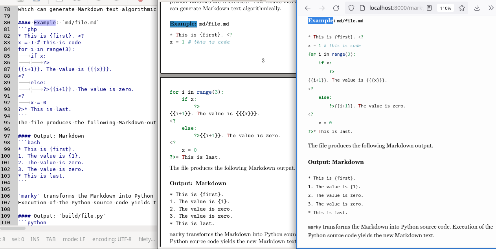
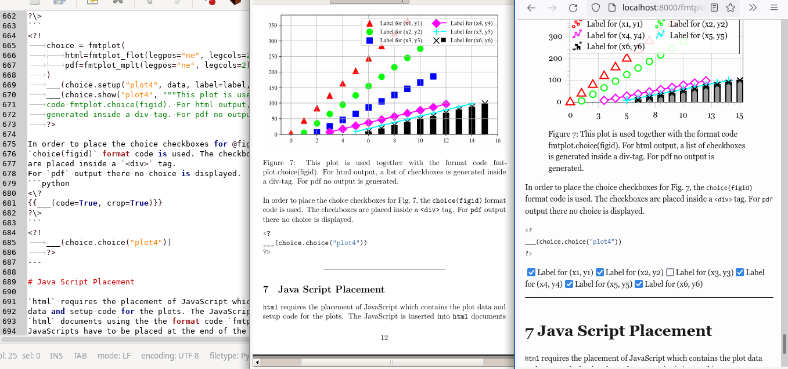

> **`marky` Dynamic Markdown**-- `marky` Markdown Text (*Left*) is rendered
> into PDF (*Middle*) and HTML (*Right*) by just calling `make scan; make all`.



> [**`fmtplot`**](fmtplot.md) Plot Generation for `pdf` and `html` -- `marky` Markdown Text (*Left*) is rendered in PDF (*Middle*) and HTML (*Right*)


> **Abstract** -- `marky` is a preprocessor with an easy and intuitive
> syntax for execution of embedded <span style='color:blue;'>pyhon</span> code during rendering
> `html` and `pdf` documents from Markdown text.
> This document is created using `marky`, version *0.9*.
> For more information please refer to the
> [`marky` repository](https://github.com/lehmann7/marky).

---

# `marky` Dynamic Markdown

`marky` is a Markdown preprocessor which transforms a Markdown document
using python. `marky` implements three statements with extremely easy
and intuitive syntax, which are embedded directly in the Markdown text:

1. `<?...?>`: Python code block.
2. `{{...}}`: `f`-string output into Markdown.
3. `___()`: Function for output into Markdown.

Using `<?...?>` and `{{...}}` python code and `f`-string output
are embedded directly inside the Markdown text.

#### Example 1: Inline Formatted Ouput 

```php
<?
x = 123.45
LEG = lambda v, w: "lesser" if v < w else "equal or greater"
?>
```
```markdown
This is an example with a value x={{x:.3f}},
which is {{LEG(x, 100)}} than 100.
```
#### Run and Output 
```markdown
This is an example with a value x=123.450,
which is equal or greater than 100.
```

Using the `___()` function text is generated from python
algorithms and dynamically inserted into the resulting Markdown.

#### Example 2: Dynamic Text from Code 
```php
<?
for i in range(3):
	___(f"{i+1}. `i = {i}`", "abcdefghij"[0:(i+1)*3])
?>
```
#### Run and Output 
```markdown
1. `i = 0` abc
2. `i = 1` abcdef
3. `i = 2` abcdefghi

```

Python code, which is embedded in the Markdown text
follows the Python indentation standard. Markdown
text is integrated into the program flow when being
inserted in python statements accordingly.

#### Example 3: Text in Condition 
```php
This is the first line.
<?
if False:
	?>This Line is **not** shown.<?
else:
	?>This Line is shown.<?
?>
This is the last line.
```
#### Run and Output 
```markdown
This is the first line.
This Line is shown.
This is the last line.
```

#### Example 4: Text in Program Flow 
```php
<?
for i in range(3):
	?>{{i+1}}. `i = {{i}}` in this iteration.
<?
?>
```
#### Run and Output 
```markdown
1. `i = 0` in this iteration.
2. `i = 1` in this iteration.
3. `i = 2` in this iteration.

```

## A First `marky` Example

`marky` combines python expressions with Markdown, for dynamic creation
of text. In the following, two in-depth examples of `marky` are presented.

#### Example 1: `marky` Syntax 

```php
<?
x = 123
y = 45
def abc_fun(v, a, b, c):
	return a if v < 100 else b if v == 100 else c
LEG = lambda v: abc_fun(v, "lesser", "equal", "greater")
?>
```
```markdown
This is an example with a value x={{x}}, which is
{{LEG(x)}} than 100. There is another value y={{y}},
which is {{LEG(y)}} than 100. Both values together
are x+y={{x+y}}.
```
#### Run and Output 
```markdown
This is an example with a value x=123, which is
greater than 100. There is another value y=45,
which is lesser than 100. Both values together
are x+y=168.
```

The following example contains meta data in the front matter
and  can be rendered into `pdf` and `html` by just calling
`make pdf/file` or `make html/file`.

#### Example 2: `md/file.md` 
```php
---
title: An Example
---
<?
def cap_first(i):
	return " ".join([i[0].upper() + i[1:] for i in i.split()])
for i in ["very", "not so"]:
	?>
**{{cap_first(i)}} Section**

To day is a {{i}} very nice day.
The sun is shining {{i}} bright and
the birds are singing {{i}} loud and
fly {{i}} high in the {{i}} blue sky.
	<?
?>
```
#### Output `build/file.md` 
```markdown
---
title: An Example
---

**Very Section**

To day is a very very nice day.
The sun is shining very bright and
the birds are singing very loud and
fly very high in the very blue sky.
	
**Not So Section**

To day is a not so very nice day.
The sun is shining not so bright and
the birds are singing not so loud and
fly not so high in the not so blue sky.
	
```

## How does `marky` work internally?

`marky` uses an extremely simple mechanism for generating a python programm
from the Markdown text. Using the `<?...?>` and `{{...}}` statement,
Python code is embedded into the Markdown text and translated into a series
of calls to the `___()` function using `f`-strings as arguments, where
python variables are referenced. This results into a python program
which can generate Markdown text algorithmically.

#### Example: `md/file.md` 
```php
* This is {first}. <?
x = 1 # this is code
for i in range(3):
	if x:
		?>
{{i+1}}. The value is {{{x}}}.
<?
	else:
		?>{{i+1}}. The value is zero.
<?
	x = 0
?>* This is last.
```
The file produces the following Markdown output.

#### Output: Markdown 
```bash
* This is {first}. 
1. The value is {1}.
2. The value is zero.
3. The value is zero.
* This is last.
```

`marky` transforms the Markdown into Python source code.
Execution of the Python source code yields the new Markdown text.

#### Output: `build/file.py` 
```python
___(rf"""* This is {{first}}. """, ___);
x = 1 # this is code
for i in range(3):
	if x:
		___(rf"""
{i+1}. The value is {{{x}}}.
""", ___);
	else:
		___(rf"""{i+1}. The value is zero.
""", ___);
	x = 0
___(rf"""* This is last.
""", ___);
```

# Quick Start

## `marky` Dependencies

`marky` depends on `pandoc` and `pyyaml`. `pandoc` is used for rendering
the Markdown into `html` and `pdf`. `marky` uses
[pandoc](https://www.pandoc.org/) for rendering `html` and `pdf`.
`pandoc>=2.10` releases can be found
[here](https://github.com/jgm/pandoc/releases).
The other packages can be installed with `pip`.

```bash
pip install pandoc-fignos
pip install pandoc-eqnos
pip install pandoc-secnos
pip install pandoc-tablenos
pip install pandoc-xnos
pip install pyyaml
```

## `marky` Workflow

Workflow for creating `html` or `pdf` using `marky` by
invocation of `make scan` and `make all`.

*make*|1. *write*  |  |2. *build*          |  |3. *render*
------|------------|--|--------------------|--|----------------
`pdf` |            |  |`build/file.html.md`|->|`html/file.html`
`-`   |`md/file.md`|->|                    |  |
`hfml`|            |  |`build/file.pdf.md` |->|`pdf/file.pdf`

1. **write**: user writes a Markdown text file and places it in `md/*.md`
directory with the extension `.md`.
2. **build**: `marky` transforms the files in `md/*.md` into regular Markdown text
and places the transformed files in `build/`.
3. **render**: the regular Markdown text in the files `build/*.md` is rendered into
`html` and `pdf` using `pandoc`.

The three steps are implemented in a Makefile.

## Download and Initialize

`marky` is supplied as a single-file script which automatically
sets up the project structure containing all scripts
required for processing and rendering Markdown.

For example, download `marky` from github.
```bash
git clone https://lehmann7.github.com/marky.git
cd marky
```

After download, the `marky` environment is initialized using `marky`.
```bash
./marky.py --init
# mkdir build/
# mkdir data
# mkdir md/
# WRITE Makefile
# WRITE pandoc-run
# WRITE md/marky.md
# WRITE .gitignore
# USAGE
make help
```

## `marky` Environment

During initialization, `marky` creates directories and files.
After initialization, the following structure is auto-generated
in the project directory. `marky` shows the project structure
when invoking `make tree`.
```bash
PROJECT TREE
##############
<working_dir>
|- marky.py            - marky executable
|- Makefile        (*) - marky Makefile
|- pandoc-run      (*) - pandoc wrapper
|- md/             (*) - user Markdown dir
|  |- *.md             - user Markdown text
|- data/           (*) - user data dir
|  |- *.*                user data files
|- build/          (*) - build Markdown dir
|  |- *.py         (*) - marky Python code
|  |- *.make       (*) - Makefile rules
|  |- *.html.md    (*) - Markdown for html format
|  |- *.pdf.md     (*) - Markdown for pdf format
|- html/*.html     (*) - rendered html dir
|- pdf/*.pdf       (*) - rendered pdf dir

(*) directories/files are auto-generated using
   `./marky.py --init; make scan; make all´


```

The script `pandoc-run` can be adjusted in case specific
`pandoc` options are required for rendering the `html` and `pdf` documents.

## Document Rendering

By invoking `make all` all files `md/*.md` are transformed
into corresponding `html/*.html` and `pdf/*.pdf` files. By
invoking `make httpd` a python web server is started in `html/`.

All user-generated Markdown content goes into `md/*` user-generated
data files go into `data/*`.

**ATTENTION:** The files in the directories `build/*` are
**auto-generated**. All user files have to be placed inside the
directory `md/*`. Invoking `make clean` will **delete all files**
in `html/`, `build/` and `pdf/`.

## Integrated Documentation

`marky` has an integrated environment. Using `make help` displays
a short info about the `marky` dependencies, make targets and
examples.
```bash
marky DEPENDENCIES
####################
* pandoc >= 2.10
* pip install pandoc-fignos
* pip install pandoc-eqnos
* pip install pandoc-secnos
* pip install pandoc-tablenos
* pip install pandoc-xnos
* pip install pyyaml

ATTENTION
###########
All files in `build/*.md` and `html/*.html` are auto-generated!
User files `*.md` have to be placed in `md/*.md`!
`make clean` deletes all files in `build/`, `html/` and `pdf/`.

marky UTILS
#############
* make help            - show this *Help Message*
* make tree            - show the *Project Tree*
* make httpd           - run python -m httpd.server in `html/`
* make clean           - delete: `build/*`, `html/*`, `pdf/*`
* make quiet [...]     - build with `./marky --quiet [...]`
* make scan            - build make deps: `build/*.make`
* make list            - list all scanned files and targets

marky BUILD ALL
#################
* make build           -> `build/*.{html,pdf}.md`
* make tex             -> `build/*.tex`
* make html            -> `html/*.html`
* make pdf             -> `pdf/*.pdf`
* make all             -> `html/*.html`, `pdf/*.pdf`

marky BUILD FILE
##################
* make build/file      -> `build/file.{html,pdf}.md`
* make build/file.tex  -> `build/file.tex`
* make html/file       -> `html/file.html`
* make pdf/file        -> `pdf/pdf.html`

EXAMPLE
#########
1. run `make scan; make html/file.html httpd`:
   * generate `build/file.make`
   * transform `md/file.md` -> `html/file.html`
   * start a python httpd server in `html`
2. run `make scan; make pdf/file.pdf`
   * generate `build/file.make`
   * transform `md/file.md` -> `pdf/file.pdf`


```

# `marky` Features

In order to quick start a new Markdown project, just link the
`marky.py` executable in the project dir or clone the git as
described above, and initialize the environment using `--init`.
```bash
mkdir my_project
cd my_project
ln -s ~/marky/marky.py .
# ... or git clone ...
./marky.py --init
```

Now `marky` is ready for operation. Place a new file in `md/file.md`
and run the following commands.
```bash
touch md/file.md
make scan
# WRITE build/file.make
```

`marky` discovers the new document when invoking `make scan`.
`marky` also renders `html` and `pdf` using make targets.
```bash
make html/file
make pdf/file
```

## Meta Data in Front Matter

If document starts with `---`, yaml is used to parse
the front matter block delimited by `---`.
All meta data keys will be exposed into the python scope as a local
variable, unless the variable already exists.

#### Example 
```markdown
---
title: "`marky` Documentation "
author: ...
date: 2022-01-01
---
The title of this document is {{title}}.
```
#### Output 
```markdown
---
title: "`marky` Documentation "
author: ...
date: 2022-01-01
---
The title of this document is `marky` Documentation .
```

## Inline Formatted Output

Python local variables and variables from meta data in front matter
can be accessed diretly from the markdown text.
The `{{...}}` statement uses syntax similar to python `f`-strings for
formatted output of variables and results of expressions into Markdown
text. The `marky` operator `{{<expression>[:<format>]}}` uses the
syntax of [`f`-strings](https://docs.python.org/3/reference/lexical_analysis.html#f-strings).

#### Example 1 
```bash
Title of this document is {{title}} and font size is {{fontsize}}.
`x` is {{x}} and {{",".join([str(i) for i in range(x-10,x)])}}.
```
#### Output 
> Title of this document is `marky` Documentation  and font size is 11pt.
> `x` is 0 and -10,-9,-8,-7,-6,-5,-4,-3,-2,-1.

#### Example 2 

```python
x = int(1)
y = float(2.3)
z = 0
a = [1, 2, 3]
b = (4, 5)
```
```markdown
This is a paragraph and x is {{x:03d}} and y is {{y:.2f}}.
Other content is: a = {{a}}, b = {{b}}.
```
#### Output 
> This is a paragraph and x is 001 and y is 2.30.
> Other content is: a = [1, 2, 3], b = (4, 5).

## Embedding Python Code

Python code blocks are embedded into Markdown using `<?...?>` and `{{...}}`.
All code blocks span one large scope sharing functions and local
variables. Meta data is imported from Markdown front matter as local
variables in the python scope. The `import` statement can be used in
python code in order to access installed python packages as usual.

### Visible Code

Using `<?!...?>` code is executed and stored.
The text of the last `<?!...?>` block can be
accessed and placed via `{{___(code=True)}}`.

#### Example 
```python
<?!
x = 42 # visible code
print("Hello console!")
?>
{{___(code=True)}}
```

#### Run and Output 

```python
x = 42 # visible code
print("Hello console!")
```

**ATTENTION:** Using the `print()` function the text will be printed
to the console and **not** inside the resulting Markdown text.

### Hidden Code

Using `<?...?>` code is executed but not shown in Markdown.

#### Example 
```python
<?
x = 41 # hidden code
___(f"Output to Markdown. x = {x}!")
?>
```
#### Run and Output 
```python
Output to Markdown. x = 41!

```

**ATTENTION:** Using the `___()` function the text will be printed
inside the resulting Markdown text **and not** on the console.

## The `___()` Function

Using the `print()` statement the text will be printed to the console.
When using the `___()` statement new Markdown text is
inserted dynamically into the document during preprocessing.

#### Example: Line Break 
```python
<?
x = 40 # hidden code
___("Output in ", ___)
___("single line! ", ___)
___(f"x = {x}")
?>
```
#### Run and Output 
```bash
Output in single line! x = 40

```

#### Example: Shift, Crop, Return 
```python
<?
result = ___("""
   * text is cropped and shifted
         * shift and crop
            * can be combined
          * returning the result
""", shift="########", crop=True, ret=True)
___(result)
?>
```
#### Run and Output 
```bash
########* text is cropped and shifted
########      * shift and crop
########         * can be combined
########       * returning the result

```

## Algorithmic Table Example

@tbl:algt is generated using the following python clode block.


```python
n = 5
table = ""
dec = ["*%s*", "**%s**", "~~%s~~", "`%s`",
       r"$\times^%s$", "$\infty_%s$"]
table += "|".join("X"*n) + "\n" + "|".join("-"*n) + "\n"
for i in range(n):
	fill = [chr(ord("A")+(2*i+3*k)%26) for k in range(i+1)]
	fill = [dec[(l+i)%len(dec)]%k for l, k in enumerate(fill)]
	text = list("0")*n
	text[(n>>1)-(i>>1):(n>>1)+(i>>1)] = fill
	table += "|".join(text) + "\n"
```

X|X|X|X|X
-|-|-|-|-
0|0|*A*|0|0|0
0|0|**C**|~~F~~|0|0|0
0|~~E~~|`H`|$\times^K$|0|0
0|`G`|$\times^J$|$\infty_M$|*P*|0|0
$\times^I$|$\infty_L$|*O*|**R**|~~U~~|0


Table: Table is generated using code and the `___()` statement. {#tbl:algt}

## Format Link Extension

When writing multiple documents, often documents are referenced
between each other using links. In order to refer to external
`html` and `pdf` documents the Markdown link statement is used.
```md
[Link Caption](path/to/file.html)
[Link Caption](path/to/file.pdf)
```
One link statement cannot be used for rendering `html` and `pdf`
with consistent paths. Using the `marky` format link
 `.???` file extension results in consistent links for `html` and
`pdf` documents.

#### Example 
```md
[Link to this Document](marky.???)
```
#### Output 
> [Link to this Document](marky.html)

## Format Codes

Often when writing markdown for `html` and `pdf` documents, the
output needs to be tweaked accordingly.
`marky` supports format specific tweaking by injecting
raw `html` or `tex` code into Markdown using format codes.

In order to inject format specific code the `fmtcode` class is used.
The `fmtcode` class manages injection of `html` and `tex` code
depending on the output format.

**ATTENTION:** `tex` packages have to be included for `pdf` as well as
JavaScript and style sheets for `html` using the meta data fields
`header-includes--pdf` and `header-includes--html` respectively.

#### Example: `fmtcode` 

```python
F = fmtcode(html="H<sup>T</sup><sub>M</sub>L", pdf=r"\LaTeX")
```
```markdown
Invocation of format code results in: {{F()}}.
```
#### Output 
> Invocation of format code results in: H<sup>T</sup><sub>M</sub>L.

#### Example: Color 

```python
C = lambda color: fmtcode(
	html="<span style='color:%s;'>{0}</span>" % color,
	pdf=r"\textcolor{{%s}}{{{0}}}" % color
)
B = C("blue")
R = C("red")
```
```markdown
Text with {{B("blue")}} and {{R("RED")}}.
```
#### Output 
> Text with <span style='color:blue;'>blue</span> and <span style='color:red;'>RED</span>.


#### Example: Classes 

```python
class color:
	def __init__(self, color):
		self.color = color
	def upper(self, x):
		return self.text(x.upper())
	def lower(self, x):
		return self.text(x.lower())

class html(color):
	def text(self, x):
		return f"<span style='color:{self.color};'>{x}</span>"

class pdf(color):
	def text(self, x):
		return rf"\textcolor{{{self.color}}}{{{x}}}"

CC = lambda x: fmtcode(html=html(x), pdf=pdf(x))
BB = CC("blue")
RR = CC("red")
```
```markdown
Text with {{BB.upper("blue")}} and {{RR.lower("RED")}}.
```
#### Output 
> Text with <span style='color:blue;'>BLUE</span> and <span style='color:red;'>red</span>.

## Markdown Include

The `marky` include statement `___(file)` For inclusion of text from
other files can be used to include text into `html` and `pdf` documents.
```python
<?
___(file="include.md", __marky__=False, raw=False, aux=False)
?>
```

`___(file)` supports following options.
* `__marky__`: controls whether the include file is processed as `marky`
script (`True`) or as a `marky` module (`False`, default).
* `raw`: controls whether the include file is included as-is (`True`)
or processed via `marky` (`False`, default).
* `aux`: disables processing of the file if `True`, (default: `False`).

When script mode is activated (`__marky__=True`) then the *module code*
as well as the *script code* are executed. However, if module mode is
activated  (`__marky__=False`), only the *module code* is processed.

```php
---
title: Test
---
<?
# marky module code
?>
`marky` module output
<?
if __marky__:
	# marky script code
	?>`marky` script output<?
?>
```

# Meta Data in Front Matter

Meta data is annotated in the front matter of a Markdown text document.
The front matter must start in the first line with `---` and precedes all
other text being fenced by `---`. The meta data is in `yaml` format.
The `yaml` block is parsed using `python-pyyaml`. All meta
data is imported into the preprocessed document.

## Pandoc Front Matter

#### Example 
```yaml
---
title: My Document
date: 2022-01-01
author: ...
link-citations: true
bibliography: data/marky.bib
header-includes: >
   \hypersetup{colorlinks=false,
   allbordercolors={0 0 0},
   pdfborderstyle={/S/U/W 1}}
xnos-cleveref: true
xnos-capitalise: true
fontsize: 11pt
---
```
The meta data fields
[`title`, `date`, `author`](https://pandoc.org/MANUAL.html#metadata-variables),
[`link-citations`](https://pandoc.org/MANUAL.html#other-relevant-metadata-fields),
[`bibliography`](https://pandoc.org/MANUAL.html#citation-rendering) and
[`header-includes`](https://pandoc.org/MANUAL.html#variables-set-automatically)
are processed by `pandoc` during document rendering. `fontsize` adjusts the
font size in [`html`](https://pandoc.org/MANUAL.html#variables-for-html)
and [`pdf`](https://pandoc.org/MANUAL.html#variables-for-latex) documents.
The `xnos-cleveref` and `xnos-capitalise`
fields are used by the [`pandoc-xnos`](https://github.com/tomduck/pandoc-xnos)
extensions for referencing
[figures](https://github.com/tomduck/pandoc-fignos#customization),
[tables](https://github.com/tomduck/pandoc-tablenos#customization),
[sections](https://github.com/tomduck/pandoc-secnos#customization) and
[equations](https://github.com/tomduck/pandoc-eqnos#customization).

## `marky` Format Fields

#### Example: `md/file.md` 
```yaml
---
header-includes--pdf: >
  \hypersetup{
  colorlinks=false,
  allbordercolors={0 0 0},
  pdfborderstyle={/S/U/W 1}}
header-includes--html: >
  <style>* { box-sizing: border-box; }</style>
---
```

The pandoc `header-includes` field is used for `pdf` and `html` documents,
therefore it must contain corresponding tex and `html` code.

The field `header-includes` ending with `--pdf` or `--html`
specifies corresponding options for the generation of `pdf` and `html`
documents. During make, `marky` scans all meta data fields, and
fields which end with `--pdf` and `--html` are selected and forwarded
to `pandoc` based on the format to be rendered.

After build `make build/file` the meta data field `header-includes`
is present in the files `build/file.html.md` and`build/file.pdf.md`
accordingly.

#### Example: `build/file.html.md` 
```yaml
---
header-includes: >
  <style>* { box-sizing: border-box; }</style>
---
```
#### Example: `build/file.pdf.md` 
```yaml
---
header-includes: >
  \hypersetup{
  colorlinks=false,
  allbordercolors={0 0 0},
  pdfborderstyle={/S/U/W 1}}
---
```

# Scientific Writing in Markdown

[Markdown](https://pandoc.org/MANUAL.html#pandocs-markdown) is a markup
language for technical writing, with emphasis on readability. Markdown
can be rendered in many formats including `html` and `pdf` by using
[`pandoc`](https://pandoc.org/) for example.

Using various Markdown extensions of `pandoc` a sufficient structure for
writing scientific documents is reflected using Markdown syntax.
`marky` by default uses the following `pandoc` Markdown extensions.
* parsing extensions
	* [all_symbols_escapable](https://pandoc.org/MANUAL.html#extension-all_symbols_escapable)
	* [intraword_underscores](https://pandoc.org/MANUAL.html#extension-intraword_underscores)
	* [escaped_line_breaks](https://pandoc.org/MANUAL.html#extension-escaped_line_breaks)
	* [space_in_atx_header](https://pandoc.org/MANUAL.html#extension-space_in_atx_header)
	* [lists_without_preceding_blankline](https://pandoc.org/MANUAL.html#extension-lists_without_preceding_blankline)
* styling extensions
	* [inline_code_attributes](https://pandoc.org/MANUAL.html#extension-inline_code_attributes)
	* [strikeout](https://pandoc.org/MANUAL.html#extension-strikeout)
* structuring extensions
	* [yaml_metadata_block](https://pandoc.org/MANUAL.html#extension-yaml_metadata_block)
	* [pipe_tables](https://pandoc.org/MANUAL.html#extension-pipe_tables)
	* [line_blocks](https://pandoc.org/MANUAL.html#extension-line_blocks)
	* [implicit_figures](https://pandoc.org/MANUAL.html#extension-implicit_figures)
	* [abbreviations](https://pandoc.org/MANUAL.html#extension-abbreviations)
	* [inline_notes](https://pandoc.org/MANUAL.html#extension-inline_notes)
* code injection
	* [raw_html](https://pandoc.org/MANUAL.html#extension-raw_html)
	* [raw_tex](https://pandoc.org/MANUAL.html#extension-raw_tex)

`pandoc` supports
[equations](https://pandoc.org/MANUAL.html#extension-tex_math_dollars)
rendered inline and single-line in tex-style using `$...$` and `$$...$$`,
[bibliography](https://pandoc.org/MANUAL.html#citations)
using the `--citeproc` option,
[section numbering](https://pandoc.org/MANUAL.html#extension-header_attributes)
using the `--number-sections` option and
[table of contents](https://pandoc.org/MANUAL.html#option--toc)
using the `--table-of-contents` option.

`pandoc` supports [`xnos`](https://github.com/tomduck/pandoc-xnos) filters
for referencing document content like
[figures](https://github.com/tomduck/pandoc-fignos#usage),
[equations](https://github.com/tomduck/pandoc-eqnos#usage),
[tables](https://github.com/tomduck/pandoc-tablenos#usage),
[sections](https://github.com/tomduck/pandoc-secnos#usage)
by using the `--filter pandoc-xnos` option.
`xnos` integrates clever references, which means "Fig.", "Sec.", "Eq."
and "Tab." are added automatically to the corresponding element.
If the prefix is to be omitted, the reference is written as
`\!@ref:label`.

#### Example 
```md
## Referenced Section {#sec:label}

This is a reference to @sec:label.

{#fig:label}

This is a reference to @fig:label.

A  |B  |C  |D
---|---|---|---
000|111|444|555
222|333|666|777

Table: This is the caption {#tbl:label}

This is a reference to @tbl:label.

$$\mbox{e}^{\mbox{i}\pi}+1=0$${#eq:label}

This is a reference to @eq:label.

This is a citation [@Muller1993].
```

The file `marky.bib` is specified in the meta data in the front
matter of the Markdown text.

## Referenced Section {#sec:label}

This is a reference to @sec:label.

{#fig:label}

This is a reference to @fig:label.

A  |B  |C  |D
---|---|---|---
000|111|444|555
222|333|666|777

Table: This is the caption. {#tbl:label}

This is a reference to @tbl:label.

$$\mbox{e}^{i\pi}+1=0$${#eq:label}

This is a reference to @eq:label.

This is a citation [@Muller1993].

---

*Thanks for reading, please try* `marky`.

---

