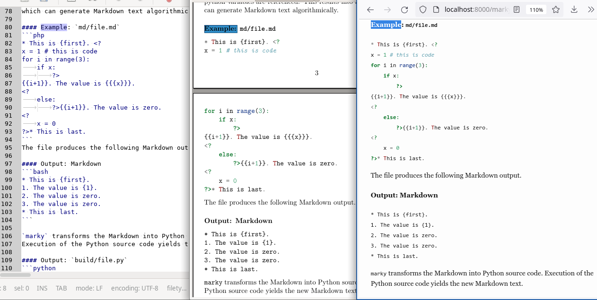
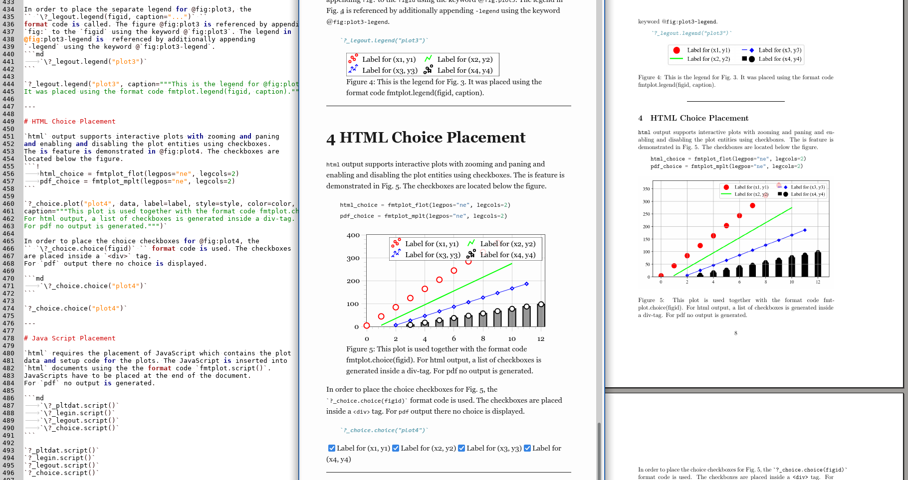

> **`marky` Preprocessor**-- `marky` Markdown Text (*Left*) is rendered
> into PDF (*Middle*) and HTML (*Right*) by just calling `make scan; make all`.



> [**`fmtplot` Extension**](fmtplot.md)-- *Left*: `marky` Markdown Text, *Middle*: Rendered HTML, *Right:* Rendered PDF


> **Abstract**-- `fmtplot` is a format code, which produces interactive
> plots for `html` using [`flot`](https://www.flotcharts.org) and static
> plots for `pdf` using [`matplotlib`](https://www.matplotlib.org/).
> Plots are generated using a `marky` format code with a class
> `fmtplot` which implements plot and code generation for both
> cases. The plots which are generated using `fmtplot` can be referenced
> using `pandoc-fignos`.

---

# Prerequirements

In order to the `fmtplot` with `html` output, JavaScript libraries
have to be downloaded using.

```bash
	cd data
	./get_fmtplotjs
```

The script download the following files:
```text
	jquery.canvaswrapper.js
	jquery.colorhelpers.js
	jquery.event.drag.js
	jquery.flot.browser.js
	jquery.flot.drawSeries.js
	jquery.flot.hover.js
	jquery.flot.image.js
	jquery.flot.js
	jquery.flot.legend.js
	jquery.flot.navigate.js
	jquery.flot.resize.js
	jquery.flot.saturated.js
	jquery.flot.selection.js
	jquery.flot.symbol.js
	jquery.flot.touch.js
	jquery.flot.touchNavigate.js
	jquery.flot.uiConstants.js
	jquery.js
	jquery.mousewheel.js
```

---

# Plot Generation

Plots are prepared by calling the class `fmtplot` together with
for the classes `fmtplot_flot` for `html` and `fmtplot_mplt` for `pdf`.
The format code has the following arguments.

```python
pltdat = fmtplot(
	html=fmtplot_flot(aspect=(16, 9)),
	pdf=fmtplot_mplt(figdir="data", figsize=(16, 9),
		figdpi=200, fontsize="11pt")
)
```


`aspect` specifies the aspect of a full-width plot for `html` output.
for `pdf` output `figdir` specifies the directory for figure output
`build/<figdir>/`, `fisize` is the size of the figure in `cm` and
`figdpi` and `fontsize` specify DPI number and the font size in `pt`.

In order to init @fig:plot1 for output, the format code

> `fmtplot.setup(figid, data, label, style, color)`

is called with the corresponding arguments.

```python
	___(pltdat.setup("plot1", data=data, label=label,
		style=style, color=color))
```

**Figure Identifier**

`figid` is the identifier of the figure, used for internal referencing
and referencing inside the document. For `pdf` documents the `figid`
also is used for the image filename `build/<figdir>/<figid>.png`.

**Plot Data**

Plot `data` is specified in two sequences containing `x` and `y` values
of point coordinates.
```python
import numpy as np
x1 = np.array(range(10)) + 0
x2 = np.array(range(10)) + 1
x3 = np.array(range(10)) + 2
x4 = np.array(range(10)) + 3
x5 = np.array(range(10)) + 5
x6 = np.array(range(10)) + 6
y1 = 40*np.array(range(10)) + 4
y2 = 30*np.array(range(10)) + 5
y3 = 20*np.array(range(10)) + 6
y4 = 10*np.array(range(10)) + 7
y5 = 10*np.array(range(10)) + 8
y6 = 10*np.array(range(10)) + 9
data=[
	(x1, y1),
	(x2, y2),
	(x3, y3),
	(x4, y4),
	(x5, y5),
	(x6, y6)
]
```


**Plot Labels**

For each data sequence `(x, y)` the label is specified in a list.
A sequence with the label `None` does not appear in the legend and
in the `html` choices.
```python
label=[
	"Label for (x1, y1)",
	"Label for (x2, y2)",
	"Label for (x3, y3)",
	"Label for (x4, y4)",
	"Label for (x5, y5)",
	"Label for (x6, y6)"
]
```


**Plot Style**

For each data sequence `(x, y)` the style is specified in a list.
The style for one sequence is a tuple where the first element
is the `styleid` identifier string and the other elements are arguments
`argN` for the `styleid`s in the order of the identifiers in the string.

* `("<styleid>", <arg1>)`
* `("<styleid><styleid>", <arg1>, <arg2>)`

```python
style=[
	( "^", 11),
	( "o", 11),
	( "s", 11),
	("DL", 11, 2),
	("+L", 11, 2),
	("xB", 11, 0.5)
]
```


The styles can be combined `Lo`, `^B`, `DLB` in order to annotate
lines and bars with points.
There are as many arguments as chars in the `<styleid>` string.
The following markers `^osD+x` can be used for points in `<styleid>`.
Ths is a subset of the
[`matplotlib` markers](https://matplotlib.org/stable/api/markers_api.html).
which is supported by `flot`. `lines` and `bars` are specified using
`B` and `L`. @tbl:styleid summarizes the style specification.

`<styleid>`|shape (symbol)   |argumet
:---------:|:---------------:|--------
`o`        |points (circle)  |point size in `pt`
`s`        |points (square)  |
`D`        |points (diamond) |
`^`        |points (triangle)|
`x`        |points (cross)   |
`+`        |points (plus)    |
`L`        |lines            |line width in `pt`
`B`        |bars             |relative bar width

Table: List of style identifier strings `<styleid>` and corresponding
arguments. The bar width is specified relative to the minimum distance
between neighbouring `x` points in the data sequence. {#tbl:styleid}

**Plot Color**

For each data sequence `(x, y)` the color for lines and points is
specified in a list.
```python
color=[
	"#ff0000",
	"#00ff00",
	"#0000ff",
	"#ff00ff",
	"#00ffff",
	"#000000"
]
```


**Plot Output in Document**

The format code
`show(figid, caption="...")` places @fig:plot1 in the
document using the settings decribed above. Additionally the argument
`caption="..."` is used for setting the figure caption. The figure
@fig:plot1 is referenced by appending `fig:` to the `figid` using
the keyword @`fig:plot1`.

```python
___(pltdat.setup("plot1", data, label=label, style=style, color=color))
___(pltdat.show("plot1", """This figure is generated using the format code
fmtplot.plot(...) with the arguments data, label, style, color
described above. The figure caption is set using the argument caption.
"""))
```
<div class="flot-plot" id="flot-plot1-dummy">
</div>
<div id="fig:plot1" class="fignos">
<figure>
<div class="flot-16-9">
<div class="flot-plot" id="flot-plot1">
</div>
</div>
<figcaption>
<p><span>Figure !@fig:plot1{nolink=True}:</span> This figure is generated using the format code
	fmtplot.plot(...) with the arguments data, label, style, color
	described above. The figure caption is set using the argument caption.
	</p>

</figcaption>
</figure>
</div>


---

# Plot Legend

By default `fmtplot` hides the legend. The legend can be placed
outside of the plot in a separate canvas/image or inside the plot.
In order to configure the legend the arguments `legpos` and
`legcols` of the format code constructor are used.
`legcols` specifies the number of columns in the legend and
`legpos` specifies the legend position using the following values.
* `None`: do not show legend
* `"out"`: show legend in separate image using `fmtplot.legend(figid)`
* `"nw"`: show legend in upper left corner
* `"ne"`: show legend in upper right corner
* `"sw"`: show legend in lower left corner
* `"se"`: show legend in lower right corner

**Legend In Plot**

A legend in figures is specified using one of the keywords
`nw`, `ne`, `sw` or `se` for `legpos`. In @fig:plot2, the legendis
placed in the upper right corner using `nw`.
```python
legin = fmtplot(
	html=fmtplot_flot(legpos="nw", legcols=2),
	pdf=fmtplot_mplt(legpos="nw", legcols=2)
)
___(legin.setup("plot2", data, label=label, style=style, color=color))
___(legin.show("plot2", """This plot is generated with legend inside
the plot using legpos as one of nw, ne, sw, se and with 2 columns
using legcols=2."""))
```
<div class="flot-plot" id="flot-plot2-dummy">
</div>
<div id="fig:plot2" class="fignos">
<figure>
<div class="flot-16-9">
<div class="flot-plot" id="flot-plot2">
</div>
</div>
<figcaption>
<p><span>Figure !@fig:plot2{nolink=True}:</span> This plot is generated with legend inside
	the plot using legpos as one of nw, ne, sw, se and with 2 columns
	using legcols=2.</p>

</figcaption>
</figure>
</div>


**Separate Legend**

A legend in a separate image is specified using the keyword `out`.
@fig:plot3 has a separate legend given in @fig:plot3-legend.
```python
legout = fmtplot(
	html=fmtplot_flot(legpos="out", legcols=2),
	pdf=fmtplot_mplt(legpos="out", legcols=2)
)
___(legout.setup("plot3", data, label=label, style=style, color=color))
___(legout.show("plot3", """This plot is generated with separate legend
using legpos=out and with 2 columns using legcols=2."""))
```
<div class="flot-plot" id="flot-plot3-dummy">
</div>
<div id="fig:plot3" class="fignos">
<figure>
<div class="flot-16-9">
<div class="flot-plot" id="flot-plot3">
</div>
</div>
<figcaption>
<p><span>Figure !@fig:plot3{nolink=True}:</span> This plot is generated with separate legend
	using legpos=out and with 2 columns using legcols=2.</p>

</figcaption>
</figure>
</div>


**Placement of Separate Legend**

In order to place the separate legend for @fig:plot3, the
`legend(figid, caption="...")`
format code is called. The figure @fig:plot3 is referenced by appending
`fig:` to the `figid` using the keyword @`fig:plot3`. The legend in
@fig:plot3-legend is  referenced by additionally appending
`-legend` using the keyword @`fig:plot3-legend`.
```python
___(legout.legend("plot3", caption="""This is the legend for @fig:plot3.
It was placed using the format code fmtplot.legend(figid, caption)."""))
```
<div id="fig:plot3-legend" class="fignos">
<figure>
<div class="flot-legend" id="flot-plot3-legend"></div>
<figcaption>
<span>Figure !@fig:plot3-legend{nolink=True}:</span> This is the legend for @fig:plot3.
	It was placed using the format code fmtplot.legend(figid, caption).
</figcaption>
</figure>
</div>


---

# Plot Example

```python
ex = fmtplot(
	html=fmtplot_flot(legpos="out", legcols=2),
	pdf=fmtplot_mplt(legpos="out", legcols=2)
)
___(ex.setup(
	"plotex",
	[
		(x1, y1), (x2, y2),
		(x3, y3), (x4, y4)
	],
	label=[
		"Label for (x1, y1)",
		"Label for (x2, y2)",
		"Label for (x3, y3)",
		None
	],
	style=[
		("o", 11),
		("L", 2),
		("LD", 1, 5),
		("Bo", 0.5, 10)
	],
	color=[
		"#ff0000",
		"#00ff00",
		"#0000ff",
		"#000000",
	]
))
```
<div class="flot-plot" id="flot-plotex-dummy">
</div>


 ```python
___(ex.show("plotex", """This plot is generated."""))
```
<div id="fig:plotex" class="fignos">
<figure>
<div class="flot-16-9">
<div class="flot-plot" id="flot-plotex">
</div>
</div>
<figcaption>
<p><span>Figure !@fig:plotex{nolink=True}:</span> This plot is generated.</p>

</figcaption>
</figure>
</div>


```python
___(ex.legend("plotex", caption="""This is the legend for @fig:plotex."""))
```
<div id="fig:plotex-legend" class="fignos">
<figure>
<div class="flot-legend" id="flot-plotex-legend"></div>
<figcaption>
<span>Figure !@fig:plotex-legend{nolink=True}:</span> This is the legend for @fig:plotex.
</figcaption>
</figure>
</div>


---

# HTML Choice Placement

`html` output supports interactive plots with zooming and paning
and enabling and disabling the plot entities using checkboxes.
The is feature is demonstrated in @fig:plot4. The checkboxes are
located below the figure.
```python
choice = fmtplot(
	html=fmtplot_flot(legpos="ne", legcols=2),
	pdf=fmtplot_mplt(legpos="ne", legcols=2)
)
___(choice.setup("plot4", data, label=label, style=style, color=color))
___(choice.show("plot4", """This plot is used together with the format
code fmtplot.choice(figid). For html output, a list of checkboxes is
generated inside a div-tag. For pdf no output is generated."""))
```
<div class="flot-plot" id="flot-plot4-dummy">
</div>
<div id="fig:plot4" class="fignos">
<figure>
<div class="flot-16-9">
<div class="flot-plot" id="flot-plot4">
</div>
</div>
<figcaption>
<p><span>Figure !@fig:plot4{nolink=True}:</span> This plot is used together with the format
	code fmtplot.choice(figid). For html output, a list of checkboxes is
	generated inside a div-tag. For pdf no output is generated.</p>

</figcaption>
</figure>
</div>


In order to place the choice checkboxes for @fig:plot4, the
`choice(figid)` format code is used. The checkboxes
are placed inside a `<div>` tag.
For `pdf` output there no choice is displayed.
```python
___(choice.choice("plot4"))
```
<div class="flot-choice" id="flot-plot4-choice"></div>

---

# Java Script Placement

`html` requires the placement of JavaScript which contains the plot
data and setup code for the plots. The JavaScript is inserted into
`html` documents using the the format code `fmtplot.script()`.
JavaScripts have to be placed at the end of the document.
For `pdf` no output is generated.

```python
___(pltdat.script())
___(ex.script())
___(legin.script())
___(legout.script())
___(choice.script())
```

<script>flot_init("flot-plot1", [{data:[[0.000000e+00,4.000000e+00],[1.000000e+00,4.400000e+01],[2.000000e+00,8.400000e+01],[3.000000e+00,1.240000e+02],[4.000000e+00,1.640000e+02],[5.000000e+00,2.040000e+02],[6.000000e+00,2.440000e+02],[7.000000e+00,2.840000e+02],[8.000000e+00,3.240000e+02],[9.000000e+00,3.640000e+02]],points:{show:true,radius:5.500000e+00,symbol:'triangle'},label:'Label for (x1, y1)',color:'#ff0000',},{data:[[1.000000e+00,5.000000e+00],[2.000000e+00,3.500000e+01],[3.000000e+00,6.500000e+01],[4.000000e+00,9.500000e+01],[5.000000e+00,1.250000e+02],[6.000000e+00,1.550000e+02],[7.000000e+00,1.850000e+02],[8.000000e+00,2.150000e+02],[9.000000e+00,2.450000e+02],[1.000000e+01,2.750000e+02]],points:{show:true,radius:5.500000e+00,symbol:'circle'},label:'Label for (x2, y2)',color:'#00ff00',},{data:[[2.000000e+00,6.000000e+00],[3.000000e+00,2.600000e+01],[4.000000e+00,4.600000e+01],[5.000000e+00,6.600000e+01],[6.000000e+00,8.600000e+01],[7.000000e+00,1.060000e+02],[8.000000e+00,1.260000e+02],[9.000000e+00,1.460000e+02],[1.000000e+01,1.660000e+02],[1.100000e+01,1.860000e+02]],points:{show:true,radius:5.500000e+00,symbol:'square'},label:'Label for (x3, y3)',color:'#0000ff',},{data:[[3.000000e+00,7.000000e+00],[4.000000e+00,1.700000e+01],[5.000000e+00,2.700000e+01],[6.000000e+00,3.700000e+01],[7.000000e+00,4.700000e+01],[8.000000e+00,5.700000e+01],[9.000000e+00,6.700000e+01],[1.000000e+01,7.700000e+01],[1.100000e+01,8.700000e+01],[1.200000e+01,9.700000e+01]],points:{show:true,radius:5.500000e+00,symbol:'diamond'},lines:{show:true,lineWidth:2},label:'Label for (x4, y4)',color:'#ff00ff',},{data:[[5.000000e+00,8.000000e+00],[6.000000e+00,1.800000e+01],[7.000000e+00,2.800000e+01],[8.000000e+00,3.800000e+01],[9.000000e+00,4.800000e+01],[1.000000e+01,5.800000e+01],[1.100000e+01,6.800000e+01],[1.200000e+01,7.800000e+01],[1.300000e+01,8.800000e+01],[1.400000e+01,9.800000e+01]],points:{show:true,radius:5.500000e+00,symbol:'plus'},lines:{show:true,lineWidth:2},label:'Label for (x5, y5)',color:'#00ffff',},{data:[[6.000000e+00,9.000000e+00],[7.000000e+00,1.900000e+01],[8.000000e+00,2.900000e+01],[9.000000e+00,3.900000e+01],[1.000000e+01,4.900000e+01],[1.100000e+01,5.900000e+01],[1.200000e+01,6.900000e+01],[1.300000e+01,7.900000e+01],[1.400000e+01,8.900000e+01],[1.500000e+01,9.900000e+01]],points:{show:true,radius:5.500000e+00,symbol:'cross'},bars:{show:true,barWidth:0.5,align:'center'},label:'Label for (x6, y6)',color:'#000000',},], null, 1, null);
</script>

<script>flot_init("flot-plotex", [{data:[[0.000000e+00,4.000000e+00],[1.000000e+00,4.400000e+01],[2.000000e+00,8.400000e+01],[3.000000e+00,1.240000e+02],[4.000000e+00,1.640000e+02],[5.000000e+00,2.040000e+02],[6.000000e+00,2.440000e+02],[7.000000e+00,2.840000e+02],[8.000000e+00,3.240000e+02],[9.000000e+00,3.640000e+02]],points:{show:true,radius:5.500000e+00,symbol:'circle'},label:'Label for (x1, y1)',color:'#ff0000',},{data:[[1.000000e+00,5.000000e+00],[2.000000e+00,3.500000e+01],[3.000000e+00,6.500000e+01],[4.000000e+00,9.500000e+01],[5.000000e+00,1.250000e+02],[6.000000e+00,1.550000e+02],[7.000000e+00,1.850000e+02],[8.000000e+00,2.150000e+02],[9.000000e+00,2.450000e+02],[1.000000e+01,2.750000e+02]],lines:{show:true,lineWidth:2},label:'Label for (x2, y2)',color:'#00ff00',},{data:[[2.000000e+00,6.000000e+00],[3.000000e+00,2.600000e+01],[4.000000e+00,4.600000e+01],[5.000000e+00,6.600000e+01],[6.000000e+00,8.600000e+01],[7.000000e+00,1.060000e+02],[8.000000e+00,1.260000e+02],[9.000000e+00,1.460000e+02],[1.000000e+01,1.660000e+02],[1.100000e+01,1.860000e+02]],lines:{show:true,lineWidth:1},points:{show:true,radius:2.500000e+00,symbol:'diamond'},label:'Label for (x3, y3)',color:'#0000ff',},{data:[[3.000000e+00,7.000000e+00],[4.000000e+00,1.700000e+01],[5.000000e+00,2.700000e+01],[6.000000e+00,3.700000e+01],[7.000000e+00,4.700000e+01],[8.000000e+00,5.700000e+01],[9.000000e+00,6.700000e+01],[1.000000e+01,7.700000e+01],[1.100000e+01,8.700000e+01],[1.200000e+01,9.700000e+01]],bars:{show:true,barWidth:0.5,align:'center'},points:{show:true,radius:5.000000e+00,symbol:'circle'},label:null,color:'#000000',},], 'out', 2, null);
</script>

<script>flot_init("flot-plot2", [{data:[[0.000000e+00,4.000000e+00],[1.000000e+00,4.400000e+01],[2.000000e+00,8.400000e+01],[3.000000e+00,1.240000e+02],[4.000000e+00,1.640000e+02],[5.000000e+00,2.040000e+02],[6.000000e+00,2.440000e+02],[7.000000e+00,2.840000e+02],[8.000000e+00,3.240000e+02],[9.000000e+00,3.640000e+02]],points:{show:true,radius:5.500000e+00,symbol:'triangle'},label:'Label for (x1, y1)',color:'#ff0000',},{data:[[1.000000e+00,5.000000e+00],[2.000000e+00,3.500000e+01],[3.000000e+00,6.500000e+01],[4.000000e+00,9.500000e+01],[5.000000e+00,1.250000e+02],[6.000000e+00,1.550000e+02],[7.000000e+00,1.850000e+02],[8.000000e+00,2.150000e+02],[9.000000e+00,2.450000e+02],[1.000000e+01,2.750000e+02]],points:{show:true,radius:5.500000e+00,symbol:'circle'},label:'Label for (x2, y2)',color:'#00ff00',},{data:[[2.000000e+00,6.000000e+00],[3.000000e+00,2.600000e+01],[4.000000e+00,4.600000e+01],[5.000000e+00,6.600000e+01],[6.000000e+00,8.600000e+01],[7.000000e+00,1.060000e+02],[8.000000e+00,1.260000e+02],[9.000000e+00,1.460000e+02],[1.000000e+01,1.660000e+02],[1.100000e+01,1.860000e+02]],points:{show:true,radius:5.500000e+00,symbol:'square'},label:'Label for (x3, y3)',color:'#0000ff',},{data:[[3.000000e+00,7.000000e+00],[4.000000e+00,1.700000e+01],[5.000000e+00,2.700000e+01],[6.000000e+00,3.700000e+01],[7.000000e+00,4.700000e+01],[8.000000e+00,5.700000e+01],[9.000000e+00,6.700000e+01],[1.000000e+01,7.700000e+01],[1.100000e+01,8.700000e+01],[1.200000e+01,9.700000e+01]],points:{show:true,radius:5.500000e+00,symbol:'diamond'},lines:{show:true,lineWidth:2},label:'Label for (x4, y4)',color:'#ff00ff',},{data:[[5.000000e+00,8.000000e+00],[6.000000e+00,1.800000e+01],[7.000000e+00,2.800000e+01],[8.000000e+00,3.800000e+01],[9.000000e+00,4.800000e+01],[1.000000e+01,5.800000e+01],[1.100000e+01,6.800000e+01],[1.200000e+01,7.800000e+01],[1.300000e+01,8.800000e+01],[1.400000e+01,9.800000e+01]],points:{show:true,radius:5.500000e+00,symbol:'plus'},lines:{show:true,lineWidth:2},label:'Label for (x5, y5)',color:'#00ffff',},{data:[[6.000000e+00,9.000000e+00],[7.000000e+00,1.900000e+01],[8.000000e+00,2.900000e+01],[9.000000e+00,3.900000e+01],[1.000000e+01,4.900000e+01],[1.100000e+01,5.900000e+01],[1.200000e+01,6.900000e+01],[1.300000e+01,7.900000e+01],[1.400000e+01,8.900000e+01],[1.500000e+01,9.900000e+01]],points:{show:true,radius:5.500000e+00,symbol:'cross'},bars:{show:true,barWidth:0.5,align:'center'},label:'Label for (x6, y6)',color:'#000000',},], 'nw', 2, null);
</script>

<script>flot_init("flot-plot3", [{data:[[0.000000e+00,4.000000e+00],[1.000000e+00,4.400000e+01],[2.000000e+00,8.400000e+01],[3.000000e+00,1.240000e+02],[4.000000e+00,1.640000e+02],[5.000000e+00,2.040000e+02],[6.000000e+00,2.440000e+02],[7.000000e+00,2.840000e+02],[8.000000e+00,3.240000e+02],[9.000000e+00,3.640000e+02]],points:{show:true,radius:5.500000e+00,symbol:'triangle'},label:'Label for (x1, y1)',color:'#ff0000',},{data:[[1.000000e+00,5.000000e+00],[2.000000e+00,3.500000e+01],[3.000000e+00,6.500000e+01],[4.000000e+00,9.500000e+01],[5.000000e+00,1.250000e+02],[6.000000e+00,1.550000e+02],[7.000000e+00,1.850000e+02],[8.000000e+00,2.150000e+02],[9.000000e+00,2.450000e+02],[1.000000e+01,2.750000e+02]],points:{show:true,radius:5.500000e+00,symbol:'circle'},label:'Label for (x2, y2)',color:'#00ff00',},{data:[[2.000000e+00,6.000000e+00],[3.000000e+00,2.600000e+01],[4.000000e+00,4.600000e+01],[5.000000e+00,6.600000e+01],[6.000000e+00,8.600000e+01],[7.000000e+00,1.060000e+02],[8.000000e+00,1.260000e+02],[9.000000e+00,1.460000e+02],[1.000000e+01,1.660000e+02],[1.100000e+01,1.860000e+02]],points:{show:true,radius:5.500000e+00,symbol:'square'},label:'Label for (x3, y3)',color:'#0000ff',},{data:[[3.000000e+00,7.000000e+00],[4.000000e+00,1.700000e+01],[5.000000e+00,2.700000e+01],[6.000000e+00,3.700000e+01],[7.000000e+00,4.700000e+01],[8.000000e+00,5.700000e+01],[9.000000e+00,6.700000e+01],[1.000000e+01,7.700000e+01],[1.100000e+01,8.700000e+01],[1.200000e+01,9.700000e+01]],points:{show:true,radius:5.500000e+00,symbol:'diamond'},lines:{show:true,lineWidth:2},label:'Label for (x4, y4)',color:'#ff00ff',},{data:[[5.000000e+00,8.000000e+00],[6.000000e+00,1.800000e+01],[7.000000e+00,2.800000e+01],[8.000000e+00,3.800000e+01],[9.000000e+00,4.800000e+01],[1.000000e+01,5.800000e+01],[1.100000e+01,6.800000e+01],[1.200000e+01,7.800000e+01],[1.300000e+01,8.800000e+01],[1.400000e+01,9.800000e+01]],points:{show:true,radius:5.500000e+00,symbol:'plus'},lines:{show:true,lineWidth:2},label:'Label for (x5, y5)',color:'#00ffff',},{data:[[6.000000e+00,9.000000e+00],[7.000000e+00,1.900000e+01],[8.000000e+00,2.900000e+01],[9.000000e+00,3.900000e+01],[1.000000e+01,4.900000e+01],[1.100000e+01,5.900000e+01],[1.200000e+01,6.900000e+01],[1.300000e+01,7.900000e+01],[1.400000e+01,8.900000e+01],[1.500000e+01,9.900000e+01]],points:{show:true,radius:5.500000e+00,symbol:'cross'},bars:{show:true,barWidth:0.5,align:'center'},label:'Label for (x6, y6)',color:'#000000',},], 'out', 2, null);
</script>

<script>flot_init("flot-plot4", [{data:[[0.000000e+00,4.000000e+00],[1.000000e+00,4.400000e+01],[2.000000e+00,8.400000e+01],[3.000000e+00,1.240000e+02],[4.000000e+00,1.640000e+02],[5.000000e+00,2.040000e+02],[6.000000e+00,2.440000e+02],[7.000000e+00,2.840000e+02],[8.000000e+00,3.240000e+02],[9.000000e+00,3.640000e+02]],points:{show:true,radius:5.500000e+00,symbol:'triangle'},label:'Label for (x1, y1)',color:'#ff0000',},{data:[[1.000000e+00,5.000000e+00],[2.000000e+00,3.500000e+01],[3.000000e+00,6.500000e+01],[4.000000e+00,9.500000e+01],[5.000000e+00,1.250000e+02],[6.000000e+00,1.550000e+02],[7.000000e+00,1.850000e+02],[8.000000e+00,2.150000e+02],[9.000000e+00,2.450000e+02],[1.000000e+01,2.750000e+02]],points:{show:true,radius:5.500000e+00,symbol:'circle'},label:'Label for (x2, y2)',color:'#00ff00',},{data:[[2.000000e+00,6.000000e+00],[3.000000e+00,2.600000e+01],[4.000000e+00,4.600000e+01],[5.000000e+00,6.600000e+01],[6.000000e+00,8.600000e+01],[7.000000e+00,1.060000e+02],[8.000000e+00,1.260000e+02],[9.000000e+00,1.460000e+02],[1.000000e+01,1.660000e+02],[1.100000e+01,1.860000e+02]],points:{show:true,radius:5.500000e+00,symbol:'square'},label:'Label for (x3, y3)',color:'#0000ff',},{data:[[3.000000e+00,7.000000e+00],[4.000000e+00,1.700000e+01],[5.000000e+00,2.700000e+01],[6.000000e+00,3.700000e+01],[7.000000e+00,4.700000e+01],[8.000000e+00,5.700000e+01],[9.000000e+00,6.700000e+01],[1.000000e+01,7.700000e+01],[1.100000e+01,8.700000e+01],[1.200000e+01,9.700000e+01]],points:{show:true,radius:5.500000e+00,symbol:'diamond'},lines:{show:true,lineWidth:2},label:'Label for (x4, y4)',color:'#ff00ff',},{data:[[5.000000e+00,8.000000e+00],[6.000000e+00,1.800000e+01],[7.000000e+00,2.800000e+01],[8.000000e+00,3.800000e+01],[9.000000e+00,4.800000e+01],[1.000000e+01,5.800000e+01],[1.100000e+01,6.800000e+01],[1.200000e+01,7.800000e+01],[1.300000e+01,8.800000e+01],[1.400000e+01,9.800000e+01]],points:{show:true,radius:5.500000e+00,symbol:'plus'},lines:{show:true,lineWidth:2},label:'Label for (x5, y5)',color:'#00ffff',},{data:[[6.000000e+00,9.000000e+00],[7.000000e+00,1.900000e+01],[8.000000e+00,2.900000e+01],[9.000000e+00,3.900000e+01],[1.000000e+01,4.900000e+01],[1.100000e+01,5.900000e+01],[1.200000e+01,6.900000e+01],[1.300000e+01,7.900000e+01],[1.400000e+01,8.900000e+01],[1.500000e+01,9.900000e+01]],points:{show:true,radius:5.500000e+00,symbol:'cross'},bars:{show:true,barWidth:0.5,align:'center'},label:'Label for (x6, y6)',color:'#000000',},], 'ne', 2, null);
</script>


---

*Thanks for reading, please try* `fmtplot`.

---
