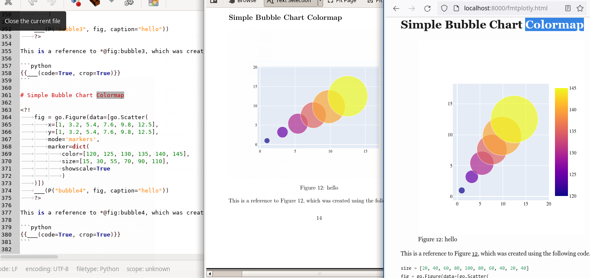

> **`marky` Dynamic Markdown**-- `marky` Markdown Text (*Left*) is rendered
> into PDF (*Middle*) and HTML (*Right*) by just calling `make scan; make all`.



> [**`fmtplotly`**](fmtplotly.md) Plot Generation for `pdf` and `html` using `plotly` -- `marky` Markdown Text (*Left*) is rendered in PDF (*Middle*) and HTML (*Right*)


> [**`fmtplot`**](fmtplot.md) Plot Generation for `pdf` and `html` using `flot` and `matplotlib` -- `marky` Markdown Text (*Left*) is rendered in PDF (*Middle*) and HTML (*Right*)


**Abstract**-- ...

---

# Intro

plotly is a charting and plotting library.

# Install

```bash
pip install plotly
```

```python
import plotly as py
import plotly.subplots as sp
import plotly.graph_objs as go
import plotly.figure_factory as ff
import plotly.express as px
```


# Documentation

* https://plotly.com/python/
* https://plotly.com/python/figure-structure/
* https://plotly.com/python/basic-charts/
* https://plotly.com/python/creating-and-updating-figures/
* https://plotly.github.io/plotly.py-docs/
* https://plotly.com/python/configuration-options/

# Plot Example

```python
P = fmtplotly()
```


```python
fig = sp.make_subplots(rows=1, cols=1, print_grid=True)
fig.add_scatter(x=[1, 2, 3, 4, 5], y=[5, 1, 4, 2, 3],
	mode='markers', marker=dict(size=3), row=1, col=1)
```


```python
___(P("figid", fig, caption="Put the figure caption text here ..."))
```
{#fig:figid}

<div id='fmtplotly:figid'> <div id="e9f87e9d-992e-4988-9764-f6d7e1411513" class="plotly-graph-div" style="height:100%; width:100%;"></div> </div>
<script>(function(figure){ figure.replaceChild(document.getElementById('fmtplotly:figid'), figure.firstElementChild); })(document.getElementById('fig:figid').firstElementChild);</script>
<script type="text/javascript">                                    window.PLOTLYENV=window.PLOTLYENV || {};                                    if (document.getElementById("e9f87e9d-992e-4988-9764-f6d7e1411513")) {                    Plotly.newPlot(                        "e9f87e9d-992e-4988-9764-f6d7e1411513",                        [{"marker":{"size":3},"mode":"markers","x":[1,2,3,4,5],"y":[5,1,4,2,3],"type":"scatter","xaxis":"x","yaxis":"y"}],                        {"template":{"data":{"bar":[{"error_x":{"color":"#2a3f5f"},"error_y":{"color":"#2a3f5f"},"marker":{"line":{"color":"#E5ECF6","width":0.5},"pattern":{"fillmode":"overlay","size":10,"solidity":0.2}},"type":"bar"}],"barpolar":[{"marker":{"line":{"color":"#E5ECF6","width":0.5},"pattern":{"fillmode":"overlay","size":10,"solidity":0.2}},"type":"barpolar"}],"carpet":[{"aaxis":{"endlinecolor":"#2a3f5f","gridcolor":"white","linecolor":"white","minorgridcolor":"white","startlinecolor":"#2a3f5f"},"baxis":{"endlinecolor":"#2a3f5f","gridcolor":"white","linecolor":"white","minorgridcolor":"white","startlinecolor":"#2a3f5f"},"type":"carpet"}],"choropleth":[{"colorbar":{"outlinewidth":0,"ticks":""},"type":"choropleth"}],"contour":[{"colorbar":{"outlinewidth":0,"ticks":""},"colorscale":[[0.0,"#0d0887"],[0.1111111111111111,"#46039f"],[0.2222222222222222,"#7201a8"],[0.3333333333333333,"#9c179e"],[0.4444444444444444,"#bd3786"],[0.5555555555555556,"#d8576b"],[0.6666666666666666,"#ed7953"],[0.7777777777777778,"#fb9f3a"],[0.8888888888888888,"#fdca26"],[1.0,"#f0f921"]],"type":"contour"}],"contourcarpet":[{"colorbar":{"outlinewidth":0,"ticks":""},"type":"contourcarpet"}],"heatmap":[{"colorbar":{"outlinewidth":0,"ticks":""},"colorscale":[[0.0,"#0d0887"],[0.1111111111111111,"#46039f"],[0.2222222222222222,"#7201a8"],[0.3333333333333333,"#9c179e"],[0.4444444444444444,"#bd3786"],[0.5555555555555556,"#d8576b"],[0.6666666666666666,"#ed7953"],[0.7777777777777778,"#fb9f3a"],[0.8888888888888888,"#fdca26"],[1.0,"#f0f921"]],"type":"heatmap"}],"heatmapgl":[{"colorbar":{"outlinewidth":0,"ticks":""},"colorscale":[[0.0,"#0d0887"],[0.1111111111111111,"#46039f"],[0.2222222222222222,"#7201a8"],[0.3333333333333333,"#9c179e"],[0.4444444444444444,"#bd3786"],[0.5555555555555556,"#d8576b"],[0.6666666666666666,"#ed7953"],[0.7777777777777778,"#fb9f3a"],[0.8888888888888888,"#fdca26"],[1.0,"#f0f921"]],"type":"heatmapgl"}],"histogram":[{"marker":{"pattern":{"fillmode":"overlay","size":10,"solidity":0.2}},"type":"histogram"}],"histogram2d":[{"colorbar":{"outlinewidth":0,"ticks":""},"colorscale":[[0.0,"#0d0887"],[0.1111111111111111,"#46039f"],[0.2222222222222222,"#7201a8"],[0.3333333333333333,"#9c179e"],[0.4444444444444444,"#bd3786"],[0.5555555555555556,"#d8576b"],[0.6666666666666666,"#ed7953"],[0.7777777777777778,"#fb9f3a"],[0.8888888888888888,"#fdca26"],[1.0,"#f0f921"]],"type":"histogram2d"}],"histogram2dcontour":[{"colorbar":{"outlinewidth":0,"ticks":""},"colorscale":[[0.0,"#0d0887"],[0.1111111111111111,"#46039f"],[0.2222222222222222,"#7201a8"],[0.3333333333333333,"#9c179e"],[0.4444444444444444,"#bd3786"],[0.5555555555555556,"#d8576b"],[0.6666666666666666,"#ed7953"],[0.7777777777777778,"#fb9f3a"],[0.8888888888888888,"#fdca26"],[1.0,"#f0f921"]],"type":"histogram2dcontour"}],"mesh3d":[{"colorbar":{"outlinewidth":0,"ticks":""},"type":"mesh3d"}],"parcoords":[{"line":{"colorbar":{"outlinewidth":0,"ticks":""}},"type":"parcoords"}],"pie":[{"automargin":true,"type":"pie"}],"scatter":[{"marker":{"colorbar":{"outlinewidth":0,"ticks":""}},"type":"scatter"}],"scatter3d":[{"line":{"colorbar":{"outlinewidth":0,"ticks":""}},"marker":{"colorbar":{"outlinewidth":0,"ticks":""}},"type":"scatter3d"}],"scattercarpet":[{"marker":{"colorbar":{"outlinewidth":0,"ticks":""}},"type":"scattercarpet"}],"scattergeo":[{"marker":{"colorbar":{"outlinewidth":0,"ticks":""}},"type":"scattergeo"}],"scattergl":[{"marker":{"colorbar":{"outlinewidth":0,"ticks":""}},"type":"scattergl"}],"scattermapbox":[{"marker":{"colorbar":{"outlinewidth":0,"ticks":""}},"type":"scattermapbox"}],"scatterpolar":[{"marker":{"colorbar":{"outlinewidth":0,"ticks":""}},"type":"scatterpolar"}],"scatterpolargl":[{"marker":{"colorbar":{"outlinewidth":0,"ticks":""}},"type":"scatterpolargl"}],"scatterternary":[{"marker":{"colorbar":{"outlinewidth":0,"ticks":""}},"type":"scatterternary"}],"surface":[{"colorbar":{"outlinewidth":0,"ticks":""},"colorscale":[[0.0,"#0d0887"],[0.1111111111111111,"#46039f"],[0.2222222222222222,"#7201a8"],[0.3333333333333333,"#9c179e"],[0.4444444444444444,"#bd3786"],[0.5555555555555556,"#d8576b"],[0.6666666666666666,"#ed7953"],[0.7777777777777778,"#fb9f3a"],[0.8888888888888888,"#fdca26"],[1.0,"#f0f921"]],"type":"surface"}],"table":[{"cells":{"fill":{"color":"#EBF0F8"},"line":{"color":"white"}},"header":{"fill":{"color":"#C8D4E3"},"line":{"color":"white"}},"type":"table"}]},"layout":{"annotationdefaults":{"arrowcolor":"#2a3f5f","arrowhead":0,"arrowwidth":1},"autotypenumbers":"strict","coloraxis":{"colorbar":{"outlinewidth":0,"ticks":""}},"colorscale":{"diverging":[[0,"#8e0152"],[0.1,"#c51b7d"],[0.2,"#de77ae"],[0.3,"#f1b6da"],[0.4,"#fde0ef"],[0.5,"#f7f7f7"],[0.6,"#e6f5d0"],[0.7,"#b8e186"],[0.8,"#7fbc41"],[0.9,"#4d9221"],[1,"#276419"]],"sequential":[[0.0,"#0d0887"],[0.1111111111111111,"#46039f"],[0.2222222222222222,"#7201a8"],[0.3333333333333333,"#9c179e"],[0.4444444444444444,"#bd3786"],[0.5555555555555556,"#d8576b"],[0.6666666666666666,"#ed7953"],[0.7777777777777778,"#fb9f3a"],[0.8888888888888888,"#fdca26"],[1.0,"#f0f921"]],"sequentialminus":[[0.0,"#0d0887"],[0.1111111111111111,"#46039f"],[0.2222222222222222,"#7201a8"],[0.3333333333333333,"#9c179e"],[0.4444444444444444,"#bd3786"],[0.5555555555555556,"#d8576b"],[0.6666666666666666,"#ed7953"],[0.7777777777777778,"#fb9f3a"],[0.8888888888888888,"#fdca26"],[1.0,"#f0f921"]]},"colorway":["#636efa","#EF553B","#00cc96","#ab63fa","#FFA15A","#19d3f3","#FF6692","#B6E880","#FF97FF","#FECB52"],"font":{"color":"#2a3f5f"},"geo":{"bgcolor":"white","lakecolor":"white","landcolor":"#E5ECF6","showlakes":true,"showland":true,"subunitcolor":"white"},"hoverlabel":{"align":"left"},"hovermode":"closest","mapbox":{"style":"light"},"paper_bgcolor":"white","plot_bgcolor":"#E5ECF6","polar":{"angularaxis":{"gridcolor":"white","linecolor":"white","ticks":""},"bgcolor":"#E5ECF6","radialaxis":{"gridcolor":"white","linecolor":"white","ticks":""}},"scene":{"xaxis":{"backgroundcolor":"#E5ECF6","gridcolor":"white","gridwidth":2,"linecolor":"white","showbackground":true,"ticks":"","zerolinecolor":"white"},"yaxis":{"backgroundcolor":"#E5ECF6","gridcolor":"white","gridwidth":2,"linecolor":"white","showbackground":true,"ticks":"","zerolinecolor":"white"},"zaxis":{"backgroundcolor":"#E5ECF6","gridcolor":"white","gridwidth":2,"linecolor":"white","showbackground":true,"ticks":"","zerolinecolor":"white"}},"shapedefaults":{"line":{"color":"#2a3f5f"}},"ternary":{"aaxis":{"gridcolor":"white","linecolor":"white","ticks":""},"baxis":{"gridcolor":"white","linecolor":"white","ticks":""},"bgcolor":"#E5ECF6","caxis":{"gridcolor":"white","linecolor":"white","ticks":""}},"title":{"x":0.05},"xaxis":{"automargin":true,"gridcolor":"white","linecolor":"white","ticks":"","title":{"standoff":15},"zerolinecolor":"white","zerolinewidth":2},"yaxis":{"automargin":true,"gridcolor":"white","linecolor":"white","ticks":"","title":{"standoff":15},"zerolinecolor":"white","zerolinewidth":2}}},"xaxis":{"anchor":"y","domain":[0.0,1.0]},"yaxis":{"anchor":"x","domain":[0.0,1.0]},"font":{"family":"Times, Arial","size":11,"color":"black"}},                        {"responsive": true}                    )                };                            </script>


# Subplots Example

{#fig:plotgrid}

<div id='fmtplotly:plotgrid'> <div id="8b0bd641-ddd1-4746-8dfb-3e984849e639" class="plotly-graph-div" style="height:500px; width:100%;"></div> </div>
<script>(function(figure){ figure.replaceChild(document.getElementById('fmtplotly:plotgrid'), figure.firstElementChild); })(document.getElementById('fig:plotgrid').firstElementChild);</script>
<script type="text/javascript">                                    window.PLOTLYENV=window.PLOTLYENV || {};                                    if (document.getElementById("8b0bd641-ddd1-4746-8dfb-3e984849e639")) {                    Plotly.newPlot(                        "8b0bd641-ddd1-4746-8dfb-3e984849e639",                        [{"histnorm":"probability density","x":[0.737156810867412,0.6882897939018262,0.2611190342465618,0.31805873836624665,0.6236790935526697,0.29649962464616575,0.6661162491438858,0.907769569595973,0.5872608880007916,0.5019469764437241,0.4416069705560143,0.022816807984756604,0.38326913545669306,0.35365327639857214,0.6595134016355373,0.9615571099016281,0.9566513231937667,0.5134263063795701,0.3633248260816626,0.041606358948214184,0.2363150567678436,0.6170343764615167,0.9000965195377657,0.4714313824746209,0.31304634484628824,0.6582605023831757,0.8548099263539223,0.791194064134195,0.01791099488894421,0.5819897564517447,0.6578668503253493,0.9812739535319195,0.8144962127806007,0.17042169993566925,0.20567829243549118,0.034223127051685176,0.7635725345677473,0.4743422364988835,0.4484835926865265,0.19900564788306874,0.20424429289230006,0.5768766354873732,0.5552568495947238,0.17264672753856303,0.906969598979361,0.5783423401892449,0.08058746341604484,0.4322682454684026,0.48235711444596174,0.19045478499799362,0.5515735953808981,0.20811569501172822,0.5601717632573316,0.6534622050093039,0.13803860594229522,0.9824244338962212,0.40709505720659456,0.5851693939736173,0.6613449692379675,0.7316309721694976,0.3828170614477857,0.3349898690495291,0.018173350830523183,0.5400535337830735,0.10987043735896385,0.3258888193425078,0.2914494662352476,0.8963727198077639,0.03521076808988288,0.029190237859800128,0.9647664464822024,0.8129130264849354,0.8354435232852043,0.22279000917286018,0.22126601588071015,0.8810894649722161,0.35113268868829284,0.07768450935397198,0.04850167000671324,0.7861120298162824,0.0017999740244107887,0.8843532230914287,0.8728173393738579,0.3815411634779359,0.20990505103315937,0.5997517846554135,0.21337968950924213,0.2502376068025901,0.2900799444127109,0.020495077018081065,0.5714382776642891,0.2821504386976572,0.17910630314720433,0.5246430629021297,0.11122397950655982,0.007911564939582894,0.21156338036261457,0.6204914602203672,0.3907877625208007,0.3760822934924577],"type":"histogram","xaxis":"x","yaxis":"y"},{"marker":{"size":3},"mode":"markers","x":[0.737156810867412,0.6882897939018262,0.2611190342465618,0.31805873836624665,0.6236790935526697,0.29649962464616575,0.6661162491438858,0.907769569595973,0.5872608880007916,0.5019469764437241,0.4416069705560143,0.022816807984756604,0.38326913545669306,0.35365327639857214,0.6595134016355373,0.9615571099016281,0.9566513231937667,0.5134263063795701,0.3633248260816626,0.041606358948214184,0.2363150567678436,0.6170343764615167,0.9000965195377657,0.4714313824746209,0.31304634484628824,0.6582605023831757,0.8548099263539223,0.791194064134195,0.01791099488894421,0.5819897564517447,0.6578668503253493,0.9812739535319195,0.8144962127806007,0.17042169993566925,0.20567829243549118,0.034223127051685176,0.7635725345677473,0.4743422364988835,0.4484835926865265,0.19900564788306874,0.20424429289230006,0.5768766354873732,0.5552568495947238,0.17264672753856303,0.906969598979361,0.5783423401892449,0.08058746341604484,0.4322682454684026,0.48235711444596174,0.19045478499799362,0.5515735953808981,0.20811569501172822,0.5601717632573316,0.6534622050093039,0.13803860594229522,0.9824244338962212,0.40709505720659456,0.5851693939736173,0.6613449692379675,0.7316309721694976,0.3828170614477857,0.3349898690495291,0.018173350830523183,0.5400535337830735,0.10987043735896385,0.3258888193425078,0.2914494662352476,0.8963727198077639,0.03521076808988288,0.029190237859800128,0.9647664464822024,0.8129130264849354,0.8354435232852043,0.22279000917286018,0.22126601588071015,0.8810894649722161,0.35113268868829284,0.07768450935397198,0.04850167000671324,0.7861120298162824,0.0017999740244107887,0.8843532230914287,0.8728173393738579,0.3815411634779359,0.20990505103315937,0.5997517846554135,0.21337968950924213,0.2502376068025901,0.2900799444127109,0.020495077018081065,0.5714382776642891,0.2821504386976572,0.17910630314720433,0.5246430629021297,0.11122397950655982,0.007911564939582894,0.21156338036261457,0.6204914602203672,0.3907877625208007,0.3760822934924577],"y":[0.17062379201339695,0.8221268834602101,0.3500168666985375,0.08777097556627711,0.3111750109540684,0.04871581782064638,0.0890864416854904,0.26494218622405796,0.3075567722449596,0.8604763385358588,0.9473421832172467,0.24801026615044275,0.3772830496901731,0.8780676904390863,0.6207632785380224,0.8173412454813532,0.27524277453169665,0.6805524299626304,0.4250398333137221,0.2217113417336395,0.06795630015963428,0.13729451387465408,0.794803726179286,0.05800200764811847,0.5027258453931984,0.8453420473995832,0.14820516926120542,0.6971202609299533,0.10681534806884185,0.8084405777151424,0.8112561676565918,0.5482015145440133,0.7911259239157119,0.9522968070635713,0.5713747218730396,0.8120305830272899,0.7210107150153472,0.23629555734372953,0.28376898180694055,0.9987089665669818,0.1938040087440177,0.8377759081639083,0.6007249602358158,0.9313948159966194,0.8790857956050798,0.5576286005631668,0.31737272286322826,0.8537943560529135,0.32021113064171725,0.94085556101793,0.5036787858513391,0.12071883974663722,0.5782776866288687,0.14624708355649807,0.032903744198155116,0.5804909857361732,0.8643091313339699,0.42697288489083884,0.907984802901042,0.44540117153365,0.27766724895424033,0.8125912325215777,0.6474074568636828,0.5766170294134201,0.044203610329924814,0.3774557150259952,0.6624161374193139,0.4334652094888154,0.9325564208983705,0.01999360297219155,0.7542793626111187,0.9283987476786932,0.7224562271809678,0.19166093575740106,0.006459517656045688,0.03786518672207562,0.4852284857238812,0.3558743918064352,0.9247584673890051,0.870281343643073,0.16222164327338928,0.561690361037006,0.06884953980562947,0.538400401678195,0.4051193710598753,0.7523334302108253,0.8608351683409806,0.42488597228202074,0.5418890899158977,0.19113219918426305,0.5841611365630746,0.26853047088448334,0.7423014885645622,0.35260027238897484,0.37243555624475966,0.5772070395994913,0.48193213760245734,0.9621441427853439,0.1024334219276184,0.6139072301739383],"type":"scatter","xaxis":"x2","yaxis":"y2"},{"marker":{"size":3},"mode":"markers","x":[0.17062379201339695,0.8221268834602101,0.3500168666985375,0.08777097556627711,0.3111750109540684,0.04871581782064638,0.0890864416854904,0.26494218622405796,0.3075567722449596,0.8604763385358588,0.9473421832172467,0.24801026615044275,0.3772830496901731,0.8780676904390863,0.6207632785380224,0.8173412454813532,0.27524277453169665,0.6805524299626304,0.4250398333137221,0.2217113417336395,0.06795630015963428,0.13729451387465408,0.794803726179286,0.05800200764811847,0.5027258453931984,0.8453420473995832,0.14820516926120542,0.6971202609299533,0.10681534806884185,0.8084405777151424,0.8112561676565918,0.5482015145440133,0.7911259239157119,0.9522968070635713,0.5713747218730396,0.8120305830272899,0.7210107150153472,0.23629555734372953,0.28376898180694055,0.9987089665669818,0.1938040087440177,0.8377759081639083,0.6007249602358158,0.9313948159966194,0.8790857956050798,0.5576286005631668,0.31737272286322826,0.8537943560529135,0.32021113064171725,0.94085556101793,0.5036787858513391,0.12071883974663722,0.5782776866288687,0.14624708355649807,0.032903744198155116,0.5804909857361732,0.8643091313339699,0.42697288489083884,0.907984802901042,0.44540117153365,0.27766724895424033,0.8125912325215777,0.6474074568636828,0.5766170294134201,0.044203610329924814,0.3774557150259952,0.6624161374193139,0.4334652094888154,0.9325564208983705,0.01999360297219155,0.7542793626111187,0.9283987476786932,0.7224562271809678,0.19166093575740106,0.006459517656045688,0.03786518672207562,0.4852284857238812,0.3558743918064352,0.9247584673890051,0.870281343643073,0.16222164327338928,0.561690361037006,0.06884953980562947,0.538400401678195,0.4051193710598753,0.7523334302108253,0.8608351683409806,0.42488597228202074,0.5418890899158977,0.19113219918426305,0.5841611365630746,0.26853047088448334,0.7423014885645622,0.35260027238897484,0.37243555624475966,0.5772070395994913,0.48193213760245734,0.9621441427853439,0.1024334219276184,0.6139072301739383],"y":[0.737156810867412,0.6882897939018262,0.2611190342465618,0.31805873836624665,0.6236790935526697,0.29649962464616575,0.6661162491438858,0.907769569595973,0.5872608880007916,0.5019469764437241,0.4416069705560143,0.022816807984756604,0.38326913545669306,0.35365327639857214,0.6595134016355373,0.9615571099016281,0.9566513231937667,0.5134263063795701,0.3633248260816626,0.041606358948214184,0.2363150567678436,0.6170343764615167,0.9000965195377657,0.4714313824746209,0.31304634484628824,0.6582605023831757,0.8548099263539223,0.791194064134195,0.01791099488894421,0.5819897564517447,0.6578668503253493,0.9812739535319195,0.8144962127806007,0.17042169993566925,0.20567829243549118,0.034223127051685176,0.7635725345677473,0.4743422364988835,0.4484835926865265,0.19900564788306874,0.20424429289230006,0.5768766354873732,0.5552568495947238,0.17264672753856303,0.906969598979361,0.5783423401892449,0.08058746341604484,0.4322682454684026,0.48235711444596174,0.19045478499799362,0.5515735953808981,0.20811569501172822,0.5601717632573316,0.6534622050093039,0.13803860594229522,0.9824244338962212,0.40709505720659456,0.5851693939736173,0.6613449692379675,0.7316309721694976,0.3828170614477857,0.3349898690495291,0.018173350830523183,0.5400535337830735,0.10987043735896385,0.3258888193425078,0.2914494662352476,0.8963727198077639,0.03521076808988288,0.029190237859800128,0.9647664464822024,0.8129130264849354,0.8354435232852043,0.22279000917286018,0.22126601588071015,0.8810894649722161,0.35113268868829284,0.07768450935397198,0.04850167000671324,0.7861120298162824,0.0017999740244107887,0.8843532230914287,0.8728173393738579,0.3815411634779359,0.20990505103315937,0.5997517846554135,0.21337968950924213,0.2502376068025901,0.2900799444127109,0.020495077018081065,0.5714382776642891,0.2821504386976572,0.17910630314720433,0.5246430629021297,0.11122397950655982,0.007911564939582894,0.21156338036261457,0.6204914602203672,0.3907877625208007,0.3760822934924577],"type":"scatter","xaxis":"x3","yaxis":"y3"},{"histnorm":"probability density","x":[0.17062379201339695,0.8221268834602101,0.3500168666985375,0.08777097556627711,0.3111750109540684,0.04871581782064638,0.0890864416854904,0.26494218622405796,0.3075567722449596,0.8604763385358588,0.9473421832172467,0.24801026615044275,0.3772830496901731,0.8780676904390863,0.6207632785380224,0.8173412454813532,0.27524277453169665,0.6805524299626304,0.4250398333137221,0.2217113417336395,0.06795630015963428,0.13729451387465408,0.794803726179286,0.05800200764811847,0.5027258453931984,0.8453420473995832,0.14820516926120542,0.6971202609299533,0.10681534806884185,0.8084405777151424,0.8112561676565918,0.5482015145440133,0.7911259239157119,0.9522968070635713,0.5713747218730396,0.8120305830272899,0.7210107150153472,0.23629555734372953,0.28376898180694055,0.9987089665669818,0.1938040087440177,0.8377759081639083,0.6007249602358158,0.9313948159966194,0.8790857956050798,0.5576286005631668,0.31737272286322826,0.8537943560529135,0.32021113064171725,0.94085556101793,0.5036787858513391,0.12071883974663722,0.5782776866288687,0.14624708355649807,0.032903744198155116,0.5804909857361732,0.8643091313339699,0.42697288489083884,0.907984802901042,0.44540117153365,0.27766724895424033,0.8125912325215777,0.6474074568636828,0.5766170294134201,0.044203610329924814,0.3774557150259952,0.6624161374193139,0.4334652094888154,0.9325564208983705,0.01999360297219155,0.7542793626111187,0.9283987476786932,0.7224562271809678,0.19166093575740106,0.006459517656045688,0.03786518672207562,0.4852284857238812,0.3558743918064352,0.9247584673890051,0.870281343643073,0.16222164327338928,0.561690361037006,0.06884953980562947,0.538400401678195,0.4051193710598753,0.7523334302108253,0.8608351683409806,0.42488597228202074,0.5418890899158977,0.19113219918426305,0.5841611365630746,0.26853047088448334,0.7423014885645622,0.35260027238897484,0.37243555624475966,0.5772070395994913,0.48193213760245734,0.9621441427853439,0.1024334219276184,0.6139072301739383],"type":"histogram","xaxis":"x4","yaxis":"y4"}],                        {"template":{"data":{"bar":[{"error_x":{"color":"#2a3f5f"},"error_y":{"color":"#2a3f5f"},"marker":{"line":{"color":"#E5ECF6","width":0.5},"pattern":{"fillmode":"overlay","size":10,"solidity":0.2}},"type":"bar"}],"barpolar":[{"marker":{"line":{"color":"#E5ECF6","width":0.5},"pattern":{"fillmode":"overlay","size":10,"solidity":0.2}},"type":"barpolar"}],"carpet":[{"aaxis":{"endlinecolor":"#2a3f5f","gridcolor":"white","linecolor":"white","minorgridcolor":"white","startlinecolor":"#2a3f5f"},"baxis":{"endlinecolor":"#2a3f5f","gridcolor":"white","linecolor":"white","minorgridcolor":"white","startlinecolor":"#2a3f5f"},"type":"carpet"}],"choropleth":[{"colorbar":{"outlinewidth":0,"ticks":""},"type":"choropleth"}],"contour":[{"colorbar":{"outlinewidth":0,"ticks":""},"colorscale":[[0.0,"#0d0887"],[0.1111111111111111,"#46039f"],[0.2222222222222222,"#7201a8"],[0.3333333333333333,"#9c179e"],[0.4444444444444444,"#bd3786"],[0.5555555555555556,"#d8576b"],[0.6666666666666666,"#ed7953"],[0.7777777777777778,"#fb9f3a"],[0.8888888888888888,"#fdca26"],[1.0,"#f0f921"]],"type":"contour"}],"contourcarpet":[{"colorbar":{"outlinewidth":0,"ticks":""},"type":"contourcarpet"}],"heatmap":[{"colorbar":{"outlinewidth":0,"ticks":""},"colorscale":[[0.0,"#0d0887"],[0.1111111111111111,"#46039f"],[0.2222222222222222,"#7201a8"],[0.3333333333333333,"#9c179e"],[0.4444444444444444,"#bd3786"],[0.5555555555555556,"#d8576b"],[0.6666666666666666,"#ed7953"],[0.7777777777777778,"#fb9f3a"],[0.8888888888888888,"#fdca26"],[1.0,"#f0f921"]],"type":"heatmap"}],"heatmapgl":[{"colorbar":{"outlinewidth":0,"ticks":""},"colorscale":[[0.0,"#0d0887"],[0.1111111111111111,"#46039f"],[0.2222222222222222,"#7201a8"],[0.3333333333333333,"#9c179e"],[0.4444444444444444,"#bd3786"],[0.5555555555555556,"#d8576b"],[0.6666666666666666,"#ed7953"],[0.7777777777777778,"#fb9f3a"],[0.8888888888888888,"#fdca26"],[1.0,"#f0f921"]],"type":"heatmapgl"}],"histogram":[{"marker":{"pattern":{"fillmode":"overlay","size":10,"solidity":0.2}},"type":"histogram"}],"histogram2d":[{"colorbar":{"outlinewidth":0,"ticks":""},"colorscale":[[0.0,"#0d0887"],[0.1111111111111111,"#46039f"],[0.2222222222222222,"#7201a8"],[0.3333333333333333,"#9c179e"],[0.4444444444444444,"#bd3786"],[0.5555555555555556,"#d8576b"],[0.6666666666666666,"#ed7953"],[0.7777777777777778,"#fb9f3a"],[0.8888888888888888,"#fdca26"],[1.0,"#f0f921"]],"type":"histogram2d"}],"histogram2dcontour":[{"colorbar":{"outlinewidth":0,"ticks":""},"colorscale":[[0.0,"#0d0887"],[0.1111111111111111,"#46039f"],[0.2222222222222222,"#7201a8"],[0.3333333333333333,"#9c179e"],[0.4444444444444444,"#bd3786"],[0.5555555555555556,"#d8576b"],[0.6666666666666666,"#ed7953"],[0.7777777777777778,"#fb9f3a"],[0.8888888888888888,"#fdca26"],[1.0,"#f0f921"]],"type":"histogram2dcontour"}],"mesh3d":[{"colorbar":{"outlinewidth":0,"ticks":""},"type":"mesh3d"}],"parcoords":[{"line":{"colorbar":{"outlinewidth":0,"ticks":""}},"type":"parcoords"}],"pie":[{"automargin":true,"type":"pie"}],"scatter":[{"marker":{"colorbar":{"outlinewidth":0,"ticks":""}},"type":"scatter"}],"scatter3d":[{"line":{"colorbar":{"outlinewidth":0,"ticks":""}},"marker":{"colorbar":{"outlinewidth":0,"ticks":""}},"type":"scatter3d"}],"scattercarpet":[{"marker":{"colorbar":{"outlinewidth":0,"ticks":""}},"type":"scattercarpet"}],"scattergeo":[{"marker":{"colorbar":{"outlinewidth":0,"ticks":""}},"type":"scattergeo"}],"scattergl":[{"marker":{"colorbar":{"outlinewidth":0,"ticks":""}},"type":"scattergl"}],"scattermapbox":[{"marker":{"colorbar":{"outlinewidth":0,"ticks":""}},"type":"scattermapbox"}],"scatterpolar":[{"marker":{"colorbar":{"outlinewidth":0,"ticks":""}},"type":"scatterpolar"}],"scatterpolargl":[{"marker":{"colorbar":{"outlinewidth":0,"ticks":""}},"type":"scatterpolargl"}],"scatterternary":[{"marker":{"colorbar":{"outlinewidth":0,"ticks":""}},"type":"scatterternary"}],"surface":[{"colorbar":{"outlinewidth":0,"ticks":""},"colorscale":[[0.0,"#0d0887"],[0.1111111111111111,"#46039f"],[0.2222222222222222,"#7201a8"],[0.3333333333333333,"#9c179e"],[0.4444444444444444,"#bd3786"],[0.5555555555555556,"#d8576b"],[0.6666666666666666,"#ed7953"],[0.7777777777777778,"#fb9f3a"],[0.8888888888888888,"#fdca26"],[1.0,"#f0f921"]],"type":"surface"}],"table":[{"cells":{"fill":{"color":"#EBF0F8"},"line":{"color":"white"}},"header":{"fill":{"color":"#C8D4E3"},"line":{"color":"white"}},"type":"table"}]},"layout":{"annotationdefaults":{"arrowcolor":"#2a3f5f","arrowhead":0,"arrowwidth":1},"autotypenumbers":"strict","coloraxis":{"colorbar":{"outlinewidth":0,"ticks":""}},"colorscale":{"diverging":[[0,"#8e0152"],[0.1,"#c51b7d"],[0.2,"#de77ae"],[0.3,"#f1b6da"],[0.4,"#fde0ef"],[0.5,"#f7f7f7"],[0.6,"#e6f5d0"],[0.7,"#b8e186"],[0.8,"#7fbc41"],[0.9,"#4d9221"],[1,"#276419"]],"sequential":[[0.0,"#0d0887"],[0.1111111111111111,"#46039f"],[0.2222222222222222,"#7201a8"],[0.3333333333333333,"#9c179e"],[0.4444444444444444,"#bd3786"],[0.5555555555555556,"#d8576b"],[0.6666666666666666,"#ed7953"],[0.7777777777777778,"#fb9f3a"],[0.8888888888888888,"#fdca26"],[1.0,"#f0f921"]],"sequentialminus":[[0.0,"#0d0887"],[0.1111111111111111,"#46039f"],[0.2222222222222222,"#7201a8"],[0.3333333333333333,"#9c179e"],[0.4444444444444444,"#bd3786"],[0.5555555555555556,"#d8576b"],[0.6666666666666666,"#ed7953"],[0.7777777777777778,"#fb9f3a"],[0.8888888888888888,"#fdca26"],[1.0,"#f0f921"]]},"colorway":["#636efa","#EF553B","#00cc96","#ab63fa","#FFA15A","#19d3f3","#FF6692","#B6E880","#FF97FF","#FECB52"],"font":{"color":"#2a3f5f"},"geo":{"bgcolor":"white","lakecolor":"white","landcolor":"#E5ECF6","showlakes":true,"showland":true,"subunitcolor":"white"},"hoverlabel":{"align":"left"},"hovermode":"closest","mapbox":{"style":"light"},"paper_bgcolor":"white","plot_bgcolor":"#E5ECF6","polar":{"angularaxis":{"gridcolor":"white","linecolor":"white","ticks":""},"bgcolor":"#E5ECF6","radialaxis":{"gridcolor":"white","linecolor":"white","ticks":""}},"scene":{"xaxis":{"backgroundcolor":"#E5ECF6","gridcolor":"white","gridwidth":2,"linecolor":"white","showbackground":true,"ticks":"","zerolinecolor":"white"},"yaxis":{"backgroundcolor":"#E5ECF6","gridcolor":"white","gridwidth":2,"linecolor":"white","showbackground":true,"ticks":"","zerolinecolor":"white"},"zaxis":{"backgroundcolor":"#E5ECF6","gridcolor":"white","gridwidth":2,"linecolor":"white","showbackground":true,"ticks":"","zerolinecolor":"white"}},"shapedefaults":{"line":{"color":"#2a3f5f"}},"ternary":{"aaxis":{"gridcolor":"white","linecolor":"white","ticks":""},"baxis":{"gridcolor":"white","linecolor":"white","ticks":""},"bgcolor":"#E5ECF6","caxis":{"gridcolor":"white","linecolor":"white","ticks":""}},"title":{"x":0.05},"xaxis":{"automargin":true,"gridcolor":"white","linecolor":"white","ticks":"","title":{"standoff":15},"zerolinecolor":"white","zerolinewidth":2},"yaxis":{"automargin":true,"gridcolor":"white","linecolor":"white","ticks":"","title":{"standoff":15},"zerolinecolor":"white","zerolinewidth":2}}},"xaxis":{"anchor":"y","domain":[0.0,0.475]},"yaxis":{"anchor":"x","domain":[0.525,1.0],"title":{"text":"A"}},"xaxis2":{"anchor":"y2","domain":[0.525,1.0]},"yaxis2":{"anchor":"x2","domain":[0.525,1.0]},"xaxis3":{"anchor":"y3","domain":[0.0,0.475],"title":{"text":"A"}},"yaxis3":{"anchor":"x3","domain":[0.0,0.475],"title":{"text":"B"}},"xaxis4":{"anchor":"y4","domain":[0.525,1.0],"title":{"text":"B"}},"yaxis4":{"anchor":"x4","domain":[0.0,0.475]},"title":{"text":"Random Data Plot"},"font":{"family":"Times, Arial","size":11,"color":"black"},"height":500},                        {"responsive": true}                    )                };                            </script>


This is a reference to *@fig:plotgrid, which was created using the following code.

```python
import numpy as np
import pandas as pd

tickers = ["A", "B"]
n = len(tickers)

prices = []
for ticker in tickers:
	prices.append(np.random.rand(100))
df = pd.DataFrame( prices ).transpose()
df.columns = tickers
df.head()

fig = sp.make_subplots(rows=n, cols=n, print_grid=True,
	horizontal_spacing= 0.05, vertical_spacing= 0.05)
coords = [(i,j) for i in range(1, n+1) for j in range(1, n+1)]

for m, (i, j) in enumerate(coords, start=1):
	row_ticker = df.columns[i - 1]
	col_ticker = df.columns[j - 1]
	if i == j:
		x = df[row_ticker]
		x_grid = np.linspace(x.min(), x.max(), 100)
		elem = fig.add_histogram(x=x, histnorm='probability density', row=i, col=j)
	else:
		elem = fig.add_scatter(x=df[row_ticker], y=df[col_ticker], mode='markers', marker=dict(size=3), row=i, col=j)
	if i == n:
		fig['layout']['xaxis'+str(m)].update(title=col_ticker)
	if j == 1:
		fig['layout']['yaxis'+str(m)].update(title=row_ticker)

fig.update_layout(title='Random Data Plot')
___(P("plotgrid", fig, caption="hello", height=P.width))
```

# Quiver Example

{#fig:quiver}

<div id='fmtplotly:quiver'> <div id="11af169b-ea0a-447e-ba3c-a430431d25be" class="plotly-graph-div" style="height:100%; width:100%;"></div> </div>
<script>(function(figure){ figure.replaceChild(document.getElementById('fmtplotly:quiver'), figure.firstElementChild); })(document.getElementById('fig:quiver').firstElementChild);</script>
<script type="text/javascript">                                    window.PLOTLYENV=window.PLOTLYENV || {};                                    if (document.getElementById("11af169b-ea0a-447e-ba3c-a430431d25be")) {                    Plotly.newPlot(                        "11af169b-ea0a-447e-ba3c-a430431d25be",                        [{"mode":"lines","x":[0.0,0.0,null,0.2,0.2,null,0.4,0.4,null,0.6000000000000001,0.6000000000000001,null,0.8,0.8,null,1.0,1.0,null,1.2000000000000002,1.2000000000000002,null,1.4000000000000001,1.4000000000000001,null,1.6,1.6,null,1.8,1.8,null,0.0,0.020000000000000004,null,0.2,0.21960133155682485,null,0.4,0.4184212198800577,null,0.6000000000000001,0.6165067122981936,null,0.8,0.8139341341869434,null,1.0,1.0108060461173627,null,1.2000000000000002,1.2072471550895336,null,1.4000000000000001,1.403399342858005,null,1.6,1.5994160095539742,null,1.8,1.7954559581061382,null,0.0,0.04000000000000001,null,0.2,0.23920266311364968,null,0.4,0.43684243976011544,null,0.6000000000000001,0.6330134245963872,null,0.8,0.8278682683738867,null,1.0,1.0216120922347256,null,1.2000000000000002,1.214494310179067,null,1.4000000000000001,1.4067986857160097,null,1.6,1.5988320191079486,null,1.8,1.7909119162122766,null,0.0,0.06000000000000001,null,0.2,0.25880399467047455,null,0.4,0.4552636596401731,null,0.6000000000000001,0.6495201368945808,null,0.8,0.8418024025608299,null,1.0,1.0324181383520883,null,1.2000000000000002,1.2217414652686005,null,1.4000000000000001,1.4101980285740146,null,1.6,1.5982480286619227,null,1.8,1.7863678743184148,null,0.0,0.08000000000000002,null,0.2,0.27840532622729935,null,0.4,0.47368487952023086,null,0.6000000000000001,0.6660268491927743,null,0.8,0.8557365367477733,null,1.0,1.0432241844694512,null,1.2000000000000002,1.228988620358134,null,1.4000000000000001,1.4135973714320194,null,1.6,1.597664038215897,null,1.8,1.781823832424553,null,0.0,0.1,null,0.2,0.29800665778412416,null,0.4,0.49210609940028854,null,0.6000000000000001,0.6825335614909679,null,0.8,0.8696706709347166,null,1.0,1.0540302305868139,null,1.2000000000000002,1.2362357754476676,null,1.4000000000000001,1.4169967142900242,null,1.6,1.5970800477698712,null,1.8,1.7772797905306914,null,0.0,0.12000000000000002,null,0.2,0.317607989340949,null,0.4,0.5105273192803462,null,0.6000000000000001,0.6990402737891614,null,0.8,0.88360480512166,null,1.0,1.0648362767041768,null,1.2000000000000002,1.243482930537201,null,1.4000000000000001,1.420396057148029,null,1.6,1.5964960573238454,null,1.8,1.7727357486368296,null,0.0,0.14,null,0.2,0.3372093208977739,null,0.4,0.528948539160404,null,0.6000000000000001,0.7155469860873551,null,0.8,0.8975389393086032,null,1.0,1.0756423228215395,null,1.2000000000000002,1.2507300856267345,null,1.4000000000000001,1.4237954000060338,null,1.6,1.5959120668778197,null,1.8,1.7681917067429678,null,0.0,0.16000000000000003,null,0.2,0.3568106524545987,null,0.4,0.5473697590404617,null,0.6000000000000001,0.7320536983855486,null,0.8,0.9114730734955465,null,1.0,1.0864483689389024,null,1.2000000000000002,1.257977240716268,null,1.4000000000000001,1.4271947428640386,null,1.6,1.5953280764317939,null,1.8,1.7636476648491062,null,0.0,0.18000000000000002,null,0.2,0.3764119840114235,null,0.4,0.5657909789205193,null,0.6000000000000001,0.7485604106837422,null,0.8,0.9254072076824899,null,1.0,1.097254415056265,null,1.2000000000000002,1.2652243958058014,null,1.4000000000000001,1.4305940857220434,null,1.6,1.594744085985768,null,1.8,1.7591036229552444,null,0.0,0.0,0.0,null,0.2,0.2,0.2,null,0.4,0.4,0.4,null,0.6000000000000001,0.6000000000000001,0.6000000000000001,null,0.8,0.8,0.8,null,1.0,1.0,1.0,null,1.2000000000000002,1.2000000000000002,1.2000000000000002,null,1.4000000000000001,1.4000000000000001,1.4000000000000001,null,1.6,1.6,1.6,null,1.8,1.8,1.8,null,0.014361844275284552,0.020000000000000004,0.014361844275284552,null,0.2144832570483246,0.21960133155682485,0.2136678700924093,null,0.4140272680674085,0.4184212198800577,0.4124290010604079,null,0.613012056174249,0.6165067122981936,0.6106946269781092,null,0.81147809466334,0.8139341341869434,0.80853389186704,null,1.0094865377394255,1.0108060461173627,1.006032937417485,null,1.2071167824923417,1.2072471550895336,1.20329146879113,null,1.4044633035855938,1.403399342858005,1.4004187796909031,null,1.601631886849657,1.5994160095539742,1.5975293951659353,null,1.7987354119347414,1.7954559581061382,1.7947385058592575,null,0.028723688550569105,0.04000000000000001,0.028723688550569105,null,0.22896651409664923,0.23920266311364968,0.22733574018481864,null,0.4280545361348171,0.43684243976011544,0.4248580021208159,null,0.6260241123484981,0.6330134245963872,0.6213892539562181,null,0.8229561893266799,0.8278682683738867,0.81706778373408,null,1.0189730754788515,1.0216120922347256,1.01206587483497,null,1.2142335649846834,1.214494310179067,1.20658293758226,null,1.4089266071711875,1.4067986857160097,1.4008375593818059,null,1.6032637736993143,1.5988320191079486,1.5950587903318707,null,1.7974708238694828,1.7909119162122766,1.789477011718515,null,0.04308553282585366,0.06000000000000001,0.04308553282585366,null,0.24344977114497385,0.25880399467047455,0.24100361027722797,null,0.4420818042022256,0.4552636596401731,0.4372870031812238,null,0.639036168522747,0.6495201368945808,0.6320838809343272,null,0.8344342839900197,0.8418024025608299,0.8256016756011199,null,1.028459613218277,1.0324181383520883,1.018098812252455,null,1.2213503474770249,1.2217414652686005,1.20987440637339,null,1.413389910756781,1.4101980285740146,1.4012563390727089,null,1.6048956605489713,1.5982480286619227,1.5925881854978061,null,1.7962062358042241,1.7863678743184148,1.7842155175777725,null,0.05744737710113821,0.08000000000000002,0.05744737710113821,null,0.25793302819329844,0.27840532622729935,0.25467148036963727,null,0.45610907226963415,0.47368487952023086,0.44971600424163183,null,0.6520482246969961,0.6660268491927743,0.6427785079124362,null,0.8459123786533597,0.8557365367477733,0.8341355674681599,null,1.0379461509577028,1.0432241844694512,1.0241317496699403,null,1.2284671299693666,1.228988620358134,1.21316587516452,null,1.4178532143423748,1.4135973714320194,1.4016751187636118,null,1.6065275473986285,1.597664038215897,1.5901175806637415,null,1.7949416477389655,1.781823832424553,1.77895402343703,null,0.07180922137642276,0.1,0.07180922137642276,null,0.27241628524162304,0.29800665778412416,0.26833935046204654,null,0.47013634033704266,0.49210609940028854,0.4621450053020397,null,0.665060280871245,0.6825335614909679,0.6534731348905453,null,0.8573904733166996,0.8696706709347166,0.8426694593351998,null,1.0474326886971286,1.0540302305868139,1.0301646870874253,null,1.2355839124617083,1.2362357754476676,1.21645734395565,null,1.4223165179279684,1.4169967142900242,1.4020938984545148,null,1.6081594342482854,1.5970800477698712,1.5876469758296767,null,1.7936770596737068,1.7772797905306914,1.7736925292962875,null,0.08617106565170732,0.12000000000000002,0.08617106565170732,null,0.2868995422899477,0.317607989340949,0.2820072205544559,null,0.48416360840445116,0.5105273192803462,0.4745740063624477,null,0.6780723370454941,0.6990402737891614,0.6641677618686543,null,0.8688685679800395,0.88360480512166,0.8512033512022398,null,1.0569192264365543,1.0648362767041768,1.0361976245049103,null,1.2427006949540498,1.243482930537201,1.21974881274678,null,1.426779821513562,1.420396057148029,1.4025126781454176,null,1.6097913210979424,1.5964960573238454,1.585176370995612,null,1.7924124716084482,1.7727357486368296,1.768431035155545,null,0.10053290992699185,0.14,0.10053290992699185,null,0.3013827993382723,0.3372093208977739,0.2956750906468652,null,0.4981908764718597,0.528948539160404,0.48700300742285557,null,0.6910843932197431,0.7155469860873551,0.6748623888467634,null,0.8803466626433794,0.8975389393086032,0.8597372430692797,null,1.0664057641759799,1.0756423228215395,1.0422305619223953,null,1.2498174774463913,1.2507300856267345,1.22304028153791,null,1.4312431250991557,1.4237954000060338,1.4029314578363206,null,1.6114232079475996,1.5959120668778197,1.5827057661615473,null,1.7911478835431895,1.7681917067429678,1.7631695410148025,null,0.11489475420227642,0.16000000000000003,0.11489475420227642,null,0.31586605638659687,0.3568106524545987,0.3093429607392745,null,0.5122181445392683,0.5473697590404617,0.4994320084832636,null,0.7040964493939921,0.7320536983855486,0.6855570158248724,null,0.8918247573067193,0.9114730734955465,0.8682711349363196,null,1.0758923019154056,1.0864483689389024,1.0482634993398805,null,1.256934259938733,1.257977240716268,1.2263317503290398,null,1.4357064286847494,1.4271947428640386,1.4033502375272235,null,1.6130550947972566,1.5953280764317939,1.5802351613274828,null,1.7898832954779311,1.7636476648491062,1.75790804687406,null,0.12925659847756096,0.18000000000000002,0.12925659847756096,null,0.33034931343492147,0.3764119840114235,0.3230108308316838,null,0.5262454126066768,0.5657909789205193,0.5118610095436715,null,0.7171085055682411,0.7485604106837422,0.6962516428029815,null,0.9033028519700592,0.9254072076824899,0.8768050268033596,null,1.0853788396548314,1.097254415056265,1.0542964367573655,null,1.2640510424310745,1.2652243958058014,1.2296232191201697,null,1.440169732270343,1.4305940857220434,1.4037690172181263,null,1.6146869816469136,1.594744085985768,1.577764556493418,null,1.7886187074126723,1.7591036229552444,1.7526465527333175,null],"y":[0.0,0.0,null,0.0,0.0,null,0.0,0.0,null,0.0,0.0,null,0.0,0.0,null,0.0,0.0,null,0.0,0.0,null,0.0,0.0,null,0.0,0.0,null,0.0,0.0,null,0.2,0.2,null,0.2,0.20397338661590123,null,0.2,0.20778836684617302,null,0.2,0.21129284946790072,null,0.2,0.21434712181799048,null,0.2,0.21682941969615793,null,0.2,0.21864078171934453,null,0.2,0.21970899459976923,null,0.2,0.2199914720608301,null,0.2,0.21947695261756392,null,0.4,0.4,null,0.4,0.40794677323180245,null,0.4,0.41557673369234605,null,0.4,0.42258569893580145,null,0.4,0.42869424363598096,null,0.4,0.43365883939231586,null,0.4,0.43728156343868907,null,0.4,0.43941798919953845,null,0.4,0.4399829441216602,null,0.4,0.43895390523512784,null,0.6000000000000001,0.6000000000000001,null,0.6000000000000001,0.6119201598477038,null,0.6000000000000001,0.6233651005385191,null,0.6000000000000001,0.6338785484037022,null,0.6000000000000001,0.6430413654539715,null,0.6000000000000001,0.6504882590884739,null,0.6000000000000001,0.6559223451580337,null,0.6000000000000001,0.6591269837993077,null,0.6000000000000001,0.6599744161824904,null,0.6000000000000001,0.6584308578526918,null,0.8,0.8,null,0.8,0.8158935464636049,null,0.8,0.8311534673846921,null,0.8,0.8451713978716029,null,0.8,0.8573884872719619,null,0.8,0.8673176787846317,null,0.8,0.8745631268773781,null,0.8,0.8788359783990769,null,0.8,0.8799658882433204,null,0.8,0.8779078104702557,null,1.0,1.0,null,1.0,1.019866933079506,null,1.0,1.0389418342308652,null,1.0,1.0564642473395036,null,1.0,1.0717356090899524,null,1.0,1.0841470984807897,null,1.0,1.0932039085967227,null,1.0,1.0985449729988461,null,1.0,1.0999573603041506,null,1.0,1.0973847630878195,null,1.2000000000000002,1.2000000000000002,null,1.2000000000000002,1.2238403196954075,null,1.2000000000000002,1.2467302010770382,null,1.2000000000000002,1.2677570968074043,null,1.2000000000000002,1.286082730907943,null,1.2000000000000002,1.3009765181769477,null,1.2000000000000002,1.3118446903160674,null,1.2000000000000002,1.3182539675986154,null,1.2000000000000002,1.3199488323649808,null,1.2000000000000002,1.3168617157053837,null,1.4000000000000001,1.4000000000000001,null,1.4000000000000001,1.4278137063113088,null,1.4000000000000001,1.4545185679232113,null,1.4000000000000001,1.479049946275305,null,1.4000000000000001,1.5004298527259334,null,1.4000000000000001,1.5178059378731057,null,1.4000000000000001,1.5304854720354117,null,1.4000000000000001,1.5379629621983846,null,1.4000000000000001,1.5399403044258109,null,1.4000000000000001,1.5363386683229474,null,1.6,1.6,null,1.6,1.6317870929272098,null,1.6,1.6623069347693842,null,1.6,1.6903427957432058,null,1.6,1.7147769745439239,null,1.6,1.7346353575692635,null,1.6,1.7491262537547563,null,1.6,1.7576719567981538,null,1.6,1.759931776486641,null,1.6,1.7558156209405114,null,1.8,1.8,null,1.8,1.835760479543111,null,1.8,1.870095301615557,null,1.8,1.9016356452111065,null,1.8,1.929124096361914,null,1.8,1.9514647772654214,null,1.8,1.9677670354741008,null,1.8,1.9773809513979228,null,1.8,1.979923248547471,null,1.8,1.9752925735580753,null,0.0,0.0,0.0,null,0.0,0.0,0.0,null,0.0,0.0,0.0,null,0.0,0.0,0.0,null,0.0,0.0,0.0,null,0.0,0.0,0.0,null,0.0,0.0,0.0,null,0.0,0.0,0.0,null,0.0,0.0,0.0,null,0.0,0.0,0.0,null,0.197947879140046,0.2,0.20205212085995403,null,0.20084204292262192,0.20397338661590123,0.20486447305968541,null,0.20370263711109302,0.20778836684617302,0.2074828940692596,null,0.2064156188422919,0.21129284946790072,0.20980299570593014,null,0.2088728300959046,0.21434712181799048,0.21173228283894707,null,0.2109763096134281,0.21682941969615793,0.2131938408785346,null,0.2126421983044122,0.21864078171934453,0.21412940211786755,null,0.21380408244376312,0.21970899459976923,0.21450166868266785,null,0.21441564137738237,0.2199914720608301,0.21429579947975202,null,0.21445249418047238,0.21947695261756392,0.2135200018645825,null,0.395895758280092,0.4,0.40410424171990805,null,0.40168408584524384,0.40794677323180245,0.40972894611937083,null,0.40740527422218603,0.41557673369234605,0.4149657881385192,null,0.4128312376845838,0.42258569893580145,0.4196059914118603,null,0.4177456601918092,0.42869424363598096,0.42346456567789414,null,0.4219526192268562,0.43365883939231586,0.4263876817570692,null,0.4252843966088244,0.43728156343868907,0.4282588042357351,null,0.42760816488752623,0.43941798919953845,0.4290033373653357,null,0.42883128275476473,0.4399829441216602,0.42859159895950405,null,0.42890498836094476,0.43895390523512784,0.42704000372916506,null,0.593843637420138,0.6000000000000001,0.6061563625798622,null,0.6025261287678658,0.6119201598477038,0.6145934191790563,null,0.6111079113332791,0.6233651005385191,0.6224486822077788,null,0.6192468565268757,0.6338785484037022,0.6294089871177904,null,0.6266184902877139,0.6430413654539715,0.6351968485168412,null,0.6329289288402843,0.6504882590884739,0.6395815226356039,null,0.6379265949132367,0.6559223451580337,0.6423882063536027,null,0.6414122473312894,0.6591269837993077,0.6435050060480035,null,0.6432469241321472,0.6599744161824904,0.6428873984392561,null,0.6433574825414172,0.6584308578526918,0.6405600055937476,null,0.791791516560184,0.8,0.8082084834398161,null,0.8033681716904877,0.8158935464636049,0.8194578922387417,null,0.8148105484443721,0.8311534673846921,0.8299315762770384,null,0.8256624753691676,0.8451713978716029,0.8392119828237206,null,0.8354913203836184,0.8573884872719619,0.8469291313557883,null,0.8439052384537123,0.8673176787846317,0.8527753635141384,null,0.8505687932176488,0.8745631268773781,0.8565176084714702,null,0.8552163297750525,0.8788359783990769,0.8580066747306714,null,0.8576625655095295,0.8799658882433204,0.8571831979190081,null,0.8578099767218895,0.8779078104702557,0.85408000745833,null,0.98973939570023,1.0,1.0102606042997702,null,1.0042102146131096,1.019866933079506,1.024322365298427,null,1.018513185555465,1.0389418342308652,1.037414470346298,null,1.0320780942114594,1.0564642473395036,1.0490149785296508,null,1.044364150479523,1.0717356090899524,1.0586614141947353,null,1.0548815480671405,1.0841470984807897,1.065969204392673,null,1.0632109915220609,1.0932039085967227,1.0706470105893378,null,1.0690204122188156,1.0985449729988461,1.0725083434133393,null,1.072078206886912,1.0999573603041506,1.0714789973987602,null,1.0722624709023618,1.0973847630878195,1.0676000093229125,null,1.187687274840276,1.2000000000000002,1.2123127251597243,null,1.2050522575357316,1.2238403196954075,1.2291868383581126,null,1.2222158226665583,1.2467302010770382,1.2448973644155577,null,1.2384937130537514,1.2677570968074043,1.2588179742355807,null,1.2532369805754278,1.286082730907943,1.2703936970336827,null,1.2658578576805686,1.3009765181769477,1.2791630452712077,null,1.2758531898264733,1.3118446903160674,1.2847764127072054,null,1.2828244946625789,1.3182539675986154,1.287010012096007,null,1.2864938482642945,1.3199488323649808,1.2857747968785123,null,1.2867149650828344,1.3168617157053837,1.2811200111874952,null,1.385635153980322,1.4000000000000001,1.4143648460196783,null,1.4058943004583535,1.4278137063113088,1.4340513114177982,null,1.425918459777651,1.4545185679232113,1.4523802584848173,null,1.4449093318960433,1.479049946275305,1.468620969941511,null,1.4621098106713322,1.5004298527259334,1.4821259798726296,null,1.4768341672939966,1.5178059378731057,1.4923568861497425,null,1.4884953881308853,1.5304854720354117,1.498905814825073,null,1.496628577106342,1.5379629621983846,1.501511680778675,null,1.5009094896416766,1.5399403044258109,1.5000705963582643,null,1.5011674592633066,1.5363386683229474,1.4946400130520776,null,1.583583033120368,1.6,1.6164169668796322,null,1.6067363433809754,1.6317870929272098,1.6389157844774833,null,1.6296210968887441,1.6623069347693842,1.6598631525540768,null,1.6513249507383352,1.6903427957432058,1.6784239656474411,null,1.6709826407672368,1.7147769745439239,1.6938582627115766,null,1.6878104769074247,1.7346353575692635,1.7055507270282768,null,1.7011375864352976,1.7491262537547563,1.7130352169429404,null,1.710432659550105,1.7576719567981538,1.7160133494613428,null,1.715325131019059,1.759931776486641,1.7143663958380162,null,1.715619953443779,1.7558156209405114,1.70816001491666,null,1.781530912260414,1.8,1.8184690877395862,null,1.8075783863035972,1.835760479543111,1.843780257537169,null,1.833323733999837,1.870095301615557,1.8673460466233363,null,1.857740569580627,1.9016356452111065,1.888226961353371,null,1.8798554708631412,1.929124096361914,1.9055905455505235,null,1.8987867865208528,1.9514647772654214,1.9187445679068116,null,1.9137797847397096,1.9677670354741008,1.9271646190608078,null,1.924236741993868,1.9773809513979228,1.9305150181440105,null,1.9297407723964413,1.979923248547471,1.9286621953177683,null,1.9300724476242515,1.9752925735580753,1.9216800167812427,null],"type":"scatter"}],                        {"hovermode":"closest","template":{"data":{"bar":[{"error_x":{"color":"#2a3f5f"},"error_y":{"color":"#2a3f5f"},"marker":{"line":{"color":"#E5ECF6","width":0.5},"pattern":{"fillmode":"overlay","size":10,"solidity":0.2}},"type":"bar"}],"barpolar":[{"marker":{"line":{"color":"#E5ECF6","width":0.5},"pattern":{"fillmode":"overlay","size":10,"solidity":0.2}},"type":"barpolar"}],"carpet":[{"aaxis":{"endlinecolor":"#2a3f5f","gridcolor":"white","linecolor":"white","minorgridcolor":"white","startlinecolor":"#2a3f5f"},"baxis":{"endlinecolor":"#2a3f5f","gridcolor":"white","linecolor":"white","minorgridcolor":"white","startlinecolor":"#2a3f5f"},"type":"carpet"}],"choropleth":[{"colorbar":{"outlinewidth":0,"ticks":""},"type":"choropleth"}],"contour":[{"colorbar":{"outlinewidth":0,"ticks":""},"colorscale":[[0.0,"#0d0887"],[0.1111111111111111,"#46039f"],[0.2222222222222222,"#7201a8"],[0.3333333333333333,"#9c179e"],[0.4444444444444444,"#bd3786"],[0.5555555555555556,"#d8576b"],[0.6666666666666666,"#ed7953"],[0.7777777777777778,"#fb9f3a"],[0.8888888888888888,"#fdca26"],[1.0,"#f0f921"]],"type":"contour"}],"contourcarpet":[{"colorbar":{"outlinewidth":0,"ticks":""},"type":"contourcarpet"}],"heatmap":[{"colorbar":{"outlinewidth":0,"ticks":""},"colorscale":[[0.0,"#0d0887"],[0.1111111111111111,"#46039f"],[0.2222222222222222,"#7201a8"],[0.3333333333333333,"#9c179e"],[0.4444444444444444,"#bd3786"],[0.5555555555555556,"#d8576b"],[0.6666666666666666,"#ed7953"],[0.7777777777777778,"#fb9f3a"],[0.8888888888888888,"#fdca26"],[1.0,"#f0f921"]],"type":"heatmap"}],"heatmapgl":[{"colorbar":{"outlinewidth":0,"ticks":""},"colorscale":[[0.0,"#0d0887"],[0.1111111111111111,"#46039f"],[0.2222222222222222,"#7201a8"],[0.3333333333333333,"#9c179e"],[0.4444444444444444,"#bd3786"],[0.5555555555555556,"#d8576b"],[0.6666666666666666,"#ed7953"],[0.7777777777777778,"#fb9f3a"],[0.8888888888888888,"#fdca26"],[1.0,"#f0f921"]],"type":"heatmapgl"}],"histogram":[{"marker":{"pattern":{"fillmode":"overlay","size":10,"solidity":0.2}},"type":"histogram"}],"histogram2d":[{"colorbar":{"outlinewidth":0,"ticks":""},"colorscale":[[0.0,"#0d0887"],[0.1111111111111111,"#46039f"],[0.2222222222222222,"#7201a8"],[0.3333333333333333,"#9c179e"],[0.4444444444444444,"#bd3786"],[0.5555555555555556,"#d8576b"],[0.6666666666666666,"#ed7953"],[0.7777777777777778,"#fb9f3a"],[0.8888888888888888,"#fdca26"],[1.0,"#f0f921"]],"type":"histogram2d"}],"histogram2dcontour":[{"colorbar":{"outlinewidth":0,"ticks":""},"colorscale":[[0.0,"#0d0887"],[0.1111111111111111,"#46039f"],[0.2222222222222222,"#7201a8"],[0.3333333333333333,"#9c179e"],[0.4444444444444444,"#bd3786"],[0.5555555555555556,"#d8576b"],[0.6666666666666666,"#ed7953"],[0.7777777777777778,"#fb9f3a"],[0.8888888888888888,"#fdca26"],[1.0,"#f0f921"]],"type":"histogram2dcontour"}],"mesh3d":[{"colorbar":{"outlinewidth":0,"ticks":""},"type":"mesh3d"}],"parcoords":[{"line":{"colorbar":{"outlinewidth":0,"ticks":""}},"type":"parcoords"}],"pie":[{"automargin":true,"type":"pie"}],"scatter":[{"marker":{"colorbar":{"outlinewidth":0,"ticks":""}},"type":"scatter"}],"scatter3d":[{"line":{"colorbar":{"outlinewidth":0,"ticks":""}},"marker":{"colorbar":{"outlinewidth":0,"ticks":""}},"type":"scatter3d"}],"scattercarpet":[{"marker":{"colorbar":{"outlinewidth":0,"ticks":""}},"type":"scattercarpet"}],"scattergeo":[{"marker":{"colorbar":{"outlinewidth":0,"ticks":""}},"type":"scattergeo"}],"scattergl":[{"marker":{"colorbar":{"outlinewidth":0,"ticks":""}},"type":"scattergl"}],"scattermapbox":[{"marker":{"colorbar":{"outlinewidth":0,"ticks":""}},"type":"scattermapbox"}],"scatterpolar":[{"marker":{"colorbar":{"outlinewidth":0,"ticks":""}},"type":"scatterpolar"}],"scatterpolargl":[{"marker":{"colorbar":{"outlinewidth":0,"ticks":""}},"type":"scatterpolargl"}],"scatterternary":[{"marker":{"colorbar":{"outlinewidth":0,"ticks":""}},"type":"scatterternary"}],"surface":[{"colorbar":{"outlinewidth":0,"ticks":""},"colorscale":[[0.0,"#0d0887"],[0.1111111111111111,"#46039f"],[0.2222222222222222,"#7201a8"],[0.3333333333333333,"#9c179e"],[0.4444444444444444,"#bd3786"],[0.5555555555555556,"#d8576b"],[0.6666666666666666,"#ed7953"],[0.7777777777777778,"#fb9f3a"],[0.8888888888888888,"#fdca26"],[1.0,"#f0f921"]],"type":"surface"}],"table":[{"cells":{"fill":{"color":"#EBF0F8"},"line":{"color":"white"}},"header":{"fill":{"color":"#C8D4E3"},"line":{"color":"white"}},"type":"table"}]},"layout":{"annotationdefaults":{"arrowcolor":"#2a3f5f","arrowhead":0,"arrowwidth":1},"autotypenumbers":"strict","coloraxis":{"colorbar":{"outlinewidth":0,"ticks":""}},"colorscale":{"diverging":[[0,"#8e0152"],[0.1,"#c51b7d"],[0.2,"#de77ae"],[0.3,"#f1b6da"],[0.4,"#fde0ef"],[0.5,"#f7f7f7"],[0.6,"#e6f5d0"],[0.7,"#b8e186"],[0.8,"#7fbc41"],[0.9,"#4d9221"],[1,"#276419"]],"sequential":[[0.0,"#0d0887"],[0.1111111111111111,"#46039f"],[0.2222222222222222,"#7201a8"],[0.3333333333333333,"#9c179e"],[0.4444444444444444,"#bd3786"],[0.5555555555555556,"#d8576b"],[0.6666666666666666,"#ed7953"],[0.7777777777777778,"#fb9f3a"],[0.8888888888888888,"#fdca26"],[1.0,"#f0f921"]],"sequentialminus":[[0.0,"#0d0887"],[0.1111111111111111,"#46039f"],[0.2222222222222222,"#7201a8"],[0.3333333333333333,"#9c179e"],[0.4444444444444444,"#bd3786"],[0.5555555555555556,"#d8576b"],[0.6666666666666666,"#ed7953"],[0.7777777777777778,"#fb9f3a"],[0.8888888888888888,"#fdca26"],[1.0,"#f0f921"]]},"colorway":["#636efa","#EF553B","#00cc96","#ab63fa","#FFA15A","#19d3f3","#FF6692","#B6E880","#FF97FF","#FECB52"],"font":{"color":"#2a3f5f"},"geo":{"bgcolor":"white","lakecolor":"white","landcolor":"#E5ECF6","showlakes":true,"showland":true,"subunitcolor":"white"},"hoverlabel":{"align":"left"},"hovermode":"closest","mapbox":{"style":"light"},"paper_bgcolor":"white","plot_bgcolor":"#E5ECF6","polar":{"angularaxis":{"gridcolor":"white","linecolor":"white","ticks":""},"bgcolor":"#E5ECF6","radialaxis":{"gridcolor":"white","linecolor":"white","ticks":""}},"scene":{"xaxis":{"backgroundcolor":"#E5ECF6","gridcolor":"white","gridwidth":2,"linecolor":"white","showbackground":true,"ticks":"","zerolinecolor":"white"},"yaxis":{"backgroundcolor":"#E5ECF6","gridcolor":"white","gridwidth":2,"linecolor":"white","showbackground":true,"ticks":"","zerolinecolor":"white"},"zaxis":{"backgroundcolor":"#E5ECF6","gridcolor":"white","gridwidth":2,"linecolor":"white","showbackground":true,"ticks":"","zerolinecolor":"white"}},"shapedefaults":{"line":{"color":"#2a3f5f"}},"ternary":{"aaxis":{"gridcolor":"white","linecolor":"white","ticks":""},"baxis":{"gridcolor":"white","linecolor":"white","ticks":""},"bgcolor":"#E5ECF6","caxis":{"gridcolor":"white","linecolor":"white","ticks":""}},"title":{"x":0.05},"xaxis":{"automargin":true,"gridcolor":"white","linecolor":"white","ticks":"","title":{"standoff":15},"zerolinecolor":"white","zerolinewidth":2},"yaxis":{"automargin":true,"gridcolor":"white","linecolor":"white","ticks":"","title":{"standoff":15},"zerolinecolor":"white","zerolinewidth":2}}},"title":{"text":"Random Data Plot"},"font":{"family":"Times, Arial","size":11,"color":"black"}},                        {"responsive": true}                    )                };                            </script>


This is a reference to *@fig:quiver, which was created using the following code.

```python
x1,y1 = np.meshgrid(np.arange(0, 2, .2), np.arange(0, 2, .2))
u1 = np.cos(x1)*y1
v1 = np.sin(x1)*y1
fig = ff.create_quiver(x1, y1, u1, v1)
fig.update_layout(title='Random Data Plot')
___(P("quiver", fig, caption="hello"))
```

# Bar and Line Example

{#fig:barandline}

<div id='fmtplotly:barandline'> <div id="4c7df4cf-a81a-42e7-83f6-46674f2a49e8" class="plotly-graph-div" style="height:100%; width:100%;"></div> </div>
<script>(function(figure){ figure.replaceChild(document.getElementById('fmtplotly:barandline'), figure.firstElementChild); })(document.getElementById('fig:barandline').firstElementChild);</script>
<script type="text/javascript">                                    window.PLOTLYENV=window.PLOTLYENV || {};                                    if (document.getElementById("4c7df4cf-a81a-42e7-83f6-46674f2a49e8")) {                    Plotly.newPlot(                        "4c7df4cf-a81a-42e7-83f6-46674f2a49e8",                        [{"mode":"lines","y":[4,2,1],"type":"scatter","xaxis":"x","yaxis":"y"},{"y":[2,1,3],"type":"bar","xaxis":"x2","yaxis":"y2"}],                        {"template":{"data":{"bar":[{"error_x":{"color":"#2a3f5f"},"error_y":{"color":"#2a3f5f"},"marker":{"line":{"color":"#E5ECF6","width":0.5},"pattern":{"fillmode":"overlay","size":10,"solidity":0.2}},"type":"bar"}],"barpolar":[{"marker":{"line":{"color":"#E5ECF6","width":0.5},"pattern":{"fillmode":"overlay","size":10,"solidity":0.2}},"type":"barpolar"}],"carpet":[{"aaxis":{"endlinecolor":"#2a3f5f","gridcolor":"white","linecolor":"white","minorgridcolor":"white","startlinecolor":"#2a3f5f"},"baxis":{"endlinecolor":"#2a3f5f","gridcolor":"white","linecolor":"white","minorgridcolor":"white","startlinecolor":"#2a3f5f"},"type":"carpet"}],"choropleth":[{"colorbar":{"outlinewidth":0,"ticks":""},"type":"choropleth"}],"contour":[{"colorbar":{"outlinewidth":0,"ticks":""},"colorscale":[[0.0,"#0d0887"],[0.1111111111111111,"#46039f"],[0.2222222222222222,"#7201a8"],[0.3333333333333333,"#9c179e"],[0.4444444444444444,"#bd3786"],[0.5555555555555556,"#d8576b"],[0.6666666666666666,"#ed7953"],[0.7777777777777778,"#fb9f3a"],[0.8888888888888888,"#fdca26"],[1.0,"#f0f921"]],"type":"contour"}],"contourcarpet":[{"colorbar":{"outlinewidth":0,"ticks":""},"type":"contourcarpet"}],"heatmap":[{"colorbar":{"outlinewidth":0,"ticks":""},"colorscale":[[0.0,"#0d0887"],[0.1111111111111111,"#46039f"],[0.2222222222222222,"#7201a8"],[0.3333333333333333,"#9c179e"],[0.4444444444444444,"#bd3786"],[0.5555555555555556,"#d8576b"],[0.6666666666666666,"#ed7953"],[0.7777777777777778,"#fb9f3a"],[0.8888888888888888,"#fdca26"],[1.0,"#f0f921"]],"type":"heatmap"}],"heatmapgl":[{"colorbar":{"outlinewidth":0,"ticks":""},"colorscale":[[0.0,"#0d0887"],[0.1111111111111111,"#46039f"],[0.2222222222222222,"#7201a8"],[0.3333333333333333,"#9c179e"],[0.4444444444444444,"#bd3786"],[0.5555555555555556,"#d8576b"],[0.6666666666666666,"#ed7953"],[0.7777777777777778,"#fb9f3a"],[0.8888888888888888,"#fdca26"],[1.0,"#f0f921"]],"type":"heatmapgl"}],"histogram":[{"marker":{"pattern":{"fillmode":"overlay","size":10,"solidity":0.2}},"type":"histogram"}],"histogram2d":[{"colorbar":{"outlinewidth":0,"ticks":""},"colorscale":[[0.0,"#0d0887"],[0.1111111111111111,"#46039f"],[0.2222222222222222,"#7201a8"],[0.3333333333333333,"#9c179e"],[0.4444444444444444,"#bd3786"],[0.5555555555555556,"#d8576b"],[0.6666666666666666,"#ed7953"],[0.7777777777777778,"#fb9f3a"],[0.8888888888888888,"#fdca26"],[1.0,"#f0f921"]],"type":"histogram2d"}],"histogram2dcontour":[{"colorbar":{"outlinewidth":0,"ticks":""},"colorscale":[[0.0,"#0d0887"],[0.1111111111111111,"#46039f"],[0.2222222222222222,"#7201a8"],[0.3333333333333333,"#9c179e"],[0.4444444444444444,"#bd3786"],[0.5555555555555556,"#d8576b"],[0.6666666666666666,"#ed7953"],[0.7777777777777778,"#fb9f3a"],[0.8888888888888888,"#fdca26"],[1.0,"#f0f921"]],"type":"histogram2dcontour"}],"mesh3d":[{"colorbar":{"outlinewidth":0,"ticks":""},"type":"mesh3d"}],"parcoords":[{"line":{"colorbar":{"outlinewidth":0,"ticks":""}},"type":"parcoords"}],"pie":[{"automargin":true,"type":"pie"}],"scatter":[{"marker":{"colorbar":{"outlinewidth":0,"ticks":""}},"type":"scatter"}],"scatter3d":[{"line":{"colorbar":{"outlinewidth":0,"ticks":""}},"marker":{"colorbar":{"outlinewidth":0,"ticks":""}},"type":"scatter3d"}],"scattercarpet":[{"marker":{"colorbar":{"outlinewidth":0,"ticks":""}},"type":"scattercarpet"}],"scattergeo":[{"marker":{"colorbar":{"outlinewidth":0,"ticks":""}},"type":"scattergeo"}],"scattergl":[{"marker":{"colorbar":{"outlinewidth":0,"ticks":""}},"type":"scattergl"}],"scattermapbox":[{"marker":{"colorbar":{"outlinewidth":0,"ticks":""}},"type":"scattermapbox"}],"scatterpolar":[{"marker":{"colorbar":{"outlinewidth":0,"ticks":""}},"type":"scatterpolar"}],"scatterpolargl":[{"marker":{"colorbar":{"outlinewidth":0,"ticks":""}},"type":"scatterpolargl"}],"scatterternary":[{"marker":{"colorbar":{"outlinewidth":0,"ticks":""}},"type":"scatterternary"}],"surface":[{"colorbar":{"outlinewidth":0,"ticks":""},"colorscale":[[0.0,"#0d0887"],[0.1111111111111111,"#46039f"],[0.2222222222222222,"#7201a8"],[0.3333333333333333,"#9c179e"],[0.4444444444444444,"#bd3786"],[0.5555555555555556,"#d8576b"],[0.6666666666666666,"#ed7953"],[0.7777777777777778,"#fb9f3a"],[0.8888888888888888,"#fdca26"],[1.0,"#f0f921"]],"type":"surface"}],"table":[{"cells":{"fill":{"color":"#EBF0F8"},"line":{"color":"white"}},"header":{"fill":{"color":"#C8D4E3"},"line":{"color":"white"}},"type":"table"}]},"layout":{"annotationdefaults":{"arrowcolor":"#2a3f5f","arrowhead":0,"arrowwidth":1},"autotypenumbers":"strict","coloraxis":{"colorbar":{"outlinewidth":0,"ticks":""}},"colorscale":{"diverging":[[0,"#8e0152"],[0.1,"#c51b7d"],[0.2,"#de77ae"],[0.3,"#f1b6da"],[0.4,"#fde0ef"],[0.5,"#f7f7f7"],[0.6,"#e6f5d0"],[0.7,"#b8e186"],[0.8,"#7fbc41"],[0.9,"#4d9221"],[1,"#276419"]],"sequential":[[0.0,"#0d0887"],[0.1111111111111111,"#46039f"],[0.2222222222222222,"#7201a8"],[0.3333333333333333,"#9c179e"],[0.4444444444444444,"#bd3786"],[0.5555555555555556,"#d8576b"],[0.6666666666666666,"#ed7953"],[0.7777777777777778,"#fb9f3a"],[0.8888888888888888,"#fdca26"],[1.0,"#f0f921"]],"sequentialminus":[[0.0,"#0d0887"],[0.1111111111111111,"#46039f"],[0.2222222222222222,"#7201a8"],[0.3333333333333333,"#9c179e"],[0.4444444444444444,"#bd3786"],[0.5555555555555556,"#d8576b"],[0.6666666666666666,"#ed7953"],[0.7777777777777778,"#fb9f3a"],[0.8888888888888888,"#fdca26"],[1.0,"#f0f921"]]},"colorway":["#636efa","#EF553B","#00cc96","#ab63fa","#FFA15A","#19d3f3","#FF6692","#B6E880","#FF97FF","#FECB52"],"font":{"color":"#2a3f5f"},"geo":{"bgcolor":"white","lakecolor":"white","landcolor":"#E5ECF6","showlakes":true,"showland":true,"subunitcolor":"white"},"hoverlabel":{"align":"left"},"hovermode":"closest","mapbox":{"style":"light"},"paper_bgcolor":"white","plot_bgcolor":"#E5ECF6","polar":{"angularaxis":{"gridcolor":"white","linecolor":"white","ticks":""},"bgcolor":"#E5ECF6","radialaxis":{"gridcolor":"white","linecolor":"white","ticks":""}},"scene":{"xaxis":{"backgroundcolor":"#E5ECF6","gridcolor":"white","gridwidth":2,"linecolor":"white","showbackground":true,"ticks":"","zerolinecolor":"white"},"yaxis":{"backgroundcolor":"#E5ECF6","gridcolor":"white","gridwidth":2,"linecolor":"white","showbackground":true,"ticks":"","zerolinecolor":"white"},"zaxis":{"backgroundcolor":"#E5ECF6","gridcolor":"white","gridwidth":2,"linecolor":"white","showbackground":true,"ticks":"","zerolinecolor":"white"}},"shapedefaults":{"line":{"color":"#2a3f5f"}},"ternary":{"aaxis":{"gridcolor":"white","linecolor":"white","ticks":""},"baxis":{"gridcolor":"white","linecolor":"white","ticks":""},"bgcolor":"#E5ECF6","caxis":{"gridcolor":"white","linecolor":"white","ticks":""}},"title":{"x":0.05},"xaxis":{"automargin":true,"gridcolor":"white","linecolor":"white","ticks":"","title":{"standoff":15},"zerolinecolor":"white","zerolinewidth":2},"yaxis":{"automargin":true,"gridcolor":"white","linecolor":"white","ticks":"","title":{"standoff":15},"zerolinecolor":"white","zerolinewidth":2}}},"xaxis":{"anchor":"y","domain":[0.0,0.45]},"yaxis":{"anchor":"x","domain":[0.0,1.0]},"xaxis2":{"anchor":"y2","domain":[0.55,1.0]},"yaxis2":{"anchor":"x2","domain":[0.0,1.0]},"title":{"text":"Random Data Plot"},"font":{"family":"Times, Arial","size":11,"color":"black"}},                        {"responsive": true}                    )                };                            </script>


This is a reference to *@fig:barandline, which was created using the following code.

```python
fig = sp.make_subplots(rows=1, cols=2)
fig.add_trace(go.Scatter(y=[4, 2, 1], mode="lines"), row=1, col=1)
fig.add_trace(go.Bar(y=[2, 1, 3]), row=1, col=2)
fig.update_layout(title='Random Data Plot')
___(P("barandline", fig, caption="hello"))
```

# Plotly Express Data Iris

{#fig:iris}

<div id='fmtplotly:iris'> <div id="4a7f88c6-f785-4934-a8e5-406aacdcefae" class="plotly-graph-div" style="height:100%; width:100%;"></div> </div>
<script>(function(figure){ figure.replaceChild(document.getElementById('fmtplotly:iris'), figure.firstElementChild); })(document.getElementById('fig:iris').firstElementChild);</script>
<script type="text/javascript">                                    window.PLOTLYENV=window.PLOTLYENV || {};                                    if (document.getElementById("4a7f88c6-f785-4934-a8e5-406aacdcefae")) {                    Plotly.newPlot(                        "4a7f88c6-f785-4934-a8e5-406aacdcefae",                        [{"hovertemplate":"species=setosa<br>sepal_width=%{x}<br>sepal_length=%{y}<extra></extra>","legendgroup":"setosa","marker":{"color":"#636efa","symbol":"circle"},"mode":"markers","name":"setosa","orientation":"v","showlegend":true,"x":[3.5,3.0,3.2,3.1,3.6,3.9,3.4,3.4,2.9,3.1,3.7,3.4,3.0,3.0,4.0,4.4,3.9,3.5,3.8,3.8,3.4,3.7,3.6,3.3,3.4,3.0,3.4,3.5,3.4,3.2,3.1,3.4,4.1,4.2,3.1,3.2,3.5,3.1,3.0,3.4,3.5,2.3,3.2,3.5,3.8,3.0,3.8,3.2,3.7,3.3],"xaxis":"x","y":[5.1,4.9,4.7,4.6,5.0,5.4,4.6,5.0,4.4,4.9,5.4,4.8,4.8,4.3,5.8,5.7,5.4,5.1,5.7,5.1,5.4,5.1,4.6,5.1,4.8,5.0,5.0,5.2,5.2,4.7,4.8,5.4,5.2,5.5,4.9,5.0,5.5,4.9,4.4,5.1,5.0,4.5,4.4,5.0,5.1,4.8,5.1,4.6,5.3,5.0],"yaxis":"y","type":"scatter"},{"hovertemplate":"species=versicolor<br>sepal_width=%{x}<br>sepal_length=%{y}<extra></extra>","legendgroup":"versicolor","marker":{"color":"#EF553B","symbol":"circle"},"mode":"markers","name":"versicolor","orientation":"v","showlegend":true,"x":[3.2,3.2,3.1,2.3,2.8,2.8,3.3,2.4,2.9,2.7,2.0,3.0,2.2,2.9,2.9,3.1,3.0,2.7,2.2,2.5,3.2,2.8,2.5,2.8,2.9,3.0,2.8,3.0,2.9,2.6,2.4,2.4,2.7,2.7,3.0,3.4,3.1,2.3,3.0,2.5,2.6,3.0,2.6,2.3,2.7,3.0,2.9,2.9,2.5,2.8],"xaxis":"x","y":[7.0,6.4,6.9,5.5,6.5,5.7,6.3,4.9,6.6,5.2,5.0,5.9,6.0,6.1,5.6,6.7,5.6,5.8,6.2,5.6,5.9,6.1,6.3,6.1,6.4,6.6,6.8,6.7,6.0,5.7,5.5,5.5,5.8,6.0,5.4,6.0,6.7,6.3,5.6,5.5,5.5,6.1,5.8,5.0,5.6,5.7,5.7,6.2,5.1,5.7],"yaxis":"y","type":"scatter"},{"hovertemplate":"species=virginica<br>sepal_width=%{x}<br>sepal_length=%{y}<extra></extra>","legendgroup":"virginica","marker":{"color":"#00cc96","symbol":"circle"},"mode":"markers","name":"virginica","orientation":"v","showlegend":true,"x":[3.3,2.7,3.0,2.9,3.0,3.0,2.5,2.9,2.5,3.6,3.2,2.7,3.0,2.5,2.8,3.2,3.0,3.8,2.6,2.2,3.2,2.8,2.8,2.7,3.3,3.2,2.8,3.0,2.8,3.0,2.8,3.8,2.8,2.8,2.6,3.0,3.4,3.1,3.0,3.1,3.1,3.1,2.7,3.2,3.3,3.0,2.5,3.0,3.4,3.0],"xaxis":"x","y":[6.3,5.8,7.1,6.3,6.5,7.6,4.9,7.3,6.7,7.2,6.5,6.4,6.8,5.7,5.8,6.4,6.5,7.7,7.7,6.0,6.9,5.6,7.7,6.3,6.7,7.2,6.2,6.1,6.4,7.2,7.4,7.9,6.4,6.3,6.1,7.7,6.3,6.4,6.0,6.9,6.7,6.9,5.8,6.8,6.7,6.7,6.3,6.5,6.2,5.9],"yaxis":"y","type":"scatter"},{"line":{"color":"gray"},"mode":"lines","showlegend":false,"x":[2,4],"y":[4,8],"type":"scatter"}],                        {"template":{"data":{"bar":[{"error_x":{"color":"#2a3f5f"},"error_y":{"color":"#2a3f5f"},"marker":{"line":{"color":"#E5ECF6","width":0.5},"pattern":{"fillmode":"overlay","size":10,"solidity":0.2}},"type":"bar"}],"barpolar":[{"marker":{"line":{"color":"#E5ECF6","width":0.5},"pattern":{"fillmode":"overlay","size":10,"solidity":0.2}},"type":"barpolar"}],"carpet":[{"aaxis":{"endlinecolor":"#2a3f5f","gridcolor":"white","linecolor":"white","minorgridcolor":"white","startlinecolor":"#2a3f5f"},"baxis":{"endlinecolor":"#2a3f5f","gridcolor":"white","linecolor":"white","minorgridcolor":"white","startlinecolor":"#2a3f5f"},"type":"carpet"}],"choropleth":[{"colorbar":{"outlinewidth":0,"ticks":""},"type":"choropleth"}],"contour":[{"colorbar":{"outlinewidth":0,"ticks":""},"colorscale":[[0.0,"#0d0887"],[0.1111111111111111,"#46039f"],[0.2222222222222222,"#7201a8"],[0.3333333333333333,"#9c179e"],[0.4444444444444444,"#bd3786"],[0.5555555555555556,"#d8576b"],[0.6666666666666666,"#ed7953"],[0.7777777777777778,"#fb9f3a"],[0.8888888888888888,"#fdca26"],[1.0,"#f0f921"]],"type":"contour"}],"contourcarpet":[{"colorbar":{"outlinewidth":0,"ticks":""},"type":"contourcarpet"}],"heatmap":[{"colorbar":{"outlinewidth":0,"ticks":""},"colorscale":[[0.0,"#0d0887"],[0.1111111111111111,"#46039f"],[0.2222222222222222,"#7201a8"],[0.3333333333333333,"#9c179e"],[0.4444444444444444,"#bd3786"],[0.5555555555555556,"#d8576b"],[0.6666666666666666,"#ed7953"],[0.7777777777777778,"#fb9f3a"],[0.8888888888888888,"#fdca26"],[1.0,"#f0f921"]],"type":"heatmap"}],"heatmapgl":[{"colorbar":{"outlinewidth":0,"ticks":""},"colorscale":[[0.0,"#0d0887"],[0.1111111111111111,"#46039f"],[0.2222222222222222,"#7201a8"],[0.3333333333333333,"#9c179e"],[0.4444444444444444,"#bd3786"],[0.5555555555555556,"#d8576b"],[0.6666666666666666,"#ed7953"],[0.7777777777777778,"#fb9f3a"],[0.8888888888888888,"#fdca26"],[1.0,"#f0f921"]],"type":"heatmapgl"}],"histogram":[{"marker":{"pattern":{"fillmode":"overlay","size":10,"solidity":0.2}},"type":"histogram"}],"histogram2d":[{"colorbar":{"outlinewidth":0,"ticks":""},"colorscale":[[0.0,"#0d0887"],[0.1111111111111111,"#46039f"],[0.2222222222222222,"#7201a8"],[0.3333333333333333,"#9c179e"],[0.4444444444444444,"#bd3786"],[0.5555555555555556,"#d8576b"],[0.6666666666666666,"#ed7953"],[0.7777777777777778,"#fb9f3a"],[0.8888888888888888,"#fdca26"],[1.0,"#f0f921"]],"type":"histogram2d"}],"histogram2dcontour":[{"colorbar":{"outlinewidth":0,"ticks":""},"colorscale":[[0.0,"#0d0887"],[0.1111111111111111,"#46039f"],[0.2222222222222222,"#7201a8"],[0.3333333333333333,"#9c179e"],[0.4444444444444444,"#bd3786"],[0.5555555555555556,"#d8576b"],[0.6666666666666666,"#ed7953"],[0.7777777777777778,"#fb9f3a"],[0.8888888888888888,"#fdca26"],[1.0,"#f0f921"]],"type":"histogram2dcontour"}],"mesh3d":[{"colorbar":{"outlinewidth":0,"ticks":""},"type":"mesh3d"}],"parcoords":[{"line":{"colorbar":{"outlinewidth":0,"ticks":""}},"type":"parcoords"}],"pie":[{"automargin":true,"type":"pie"}],"scatter":[{"marker":{"colorbar":{"outlinewidth":0,"ticks":""}},"type":"scatter"}],"scatter3d":[{"line":{"colorbar":{"outlinewidth":0,"ticks":""}},"marker":{"colorbar":{"outlinewidth":0,"ticks":""}},"type":"scatter3d"}],"scattercarpet":[{"marker":{"colorbar":{"outlinewidth":0,"ticks":""}},"type":"scattercarpet"}],"scattergeo":[{"marker":{"colorbar":{"outlinewidth":0,"ticks":""}},"type":"scattergeo"}],"scattergl":[{"marker":{"colorbar":{"outlinewidth":0,"ticks":""}},"type":"scattergl"}],"scattermapbox":[{"marker":{"colorbar":{"outlinewidth":0,"ticks":""}},"type":"scattermapbox"}],"scatterpolar":[{"marker":{"colorbar":{"outlinewidth":0,"ticks":""}},"type":"scatterpolar"}],"scatterpolargl":[{"marker":{"colorbar":{"outlinewidth":0,"ticks":""}},"type":"scatterpolargl"}],"scatterternary":[{"marker":{"colorbar":{"outlinewidth":0,"ticks":""}},"type":"scatterternary"}],"surface":[{"colorbar":{"outlinewidth":0,"ticks":""},"colorscale":[[0.0,"#0d0887"],[0.1111111111111111,"#46039f"],[0.2222222222222222,"#7201a8"],[0.3333333333333333,"#9c179e"],[0.4444444444444444,"#bd3786"],[0.5555555555555556,"#d8576b"],[0.6666666666666666,"#ed7953"],[0.7777777777777778,"#fb9f3a"],[0.8888888888888888,"#fdca26"],[1.0,"#f0f921"]],"type":"surface"}],"table":[{"cells":{"fill":{"color":"#EBF0F8"},"line":{"color":"white"}},"header":{"fill":{"color":"#C8D4E3"},"line":{"color":"white"}},"type":"table"}]},"layout":{"annotationdefaults":{"arrowcolor":"#2a3f5f","arrowhead":0,"arrowwidth":1},"autotypenumbers":"strict","coloraxis":{"colorbar":{"outlinewidth":0,"ticks":""}},"colorscale":{"diverging":[[0,"#8e0152"],[0.1,"#c51b7d"],[0.2,"#de77ae"],[0.3,"#f1b6da"],[0.4,"#fde0ef"],[0.5,"#f7f7f7"],[0.6,"#e6f5d0"],[0.7,"#b8e186"],[0.8,"#7fbc41"],[0.9,"#4d9221"],[1,"#276419"]],"sequential":[[0.0,"#0d0887"],[0.1111111111111111,"#46039f"],[0.2222222222222222,"#7201a8"],[0.3333333333333333,"#9c179e"],[0.4444444444444444,"#bd3786"],[0.5555555555555556,"#d8576b"],[0.6666666666666666,"#ed7953"],[0.7777777777777778,"#fb9f3a"],[0.8888888888888888,"#fdca26"],[1.0,"#f0f921"]],"sequentialminus":[[0.0,"#0d0887"],[0.1111111111111111,"#46039f"],[0.2222222222222222,"#7201a8"],[0.3333333333333333,"#9c179e"],[0.4444444444444444,"#bd3786"],[0.5555555555555556,"#d8576b"],[0.6666666666666666,"#ed7953"],[0.7777777777777778,"#fb9f3a"],[0.8888888888888888,"#fdca26"],[1.0,"#f0f921"]]},"colorway":["#636efa","#EF553B","#00cc96","#ab63fa","#FFA15A","#19d3f3","#FF6692","#B6E880","#FF97FF","#FECB52"],"font":{"color":"#2a3f5f"},"geo":{"bgcolor":"white","lakecolor":"white","landcolor":"#E5ECF6","showlakes":true,"showland":true,"subunitcolor":"white"},"hoverlabel":{"align":"left"},"hovermode":"closest","mapbox":{"style":"light"},"paper_bgcolor":"white","plot_bgcolor":"#E5ECF6","polar":{"angularaxis":{"gridcolor":"white","linecolor":"white","ticks":""},"bgcolor":"#E5ECF6","radialaxis":{"gridcolor":"white","linecolor":"white","ticks":""}},"scene":{"xaxis":{"backgroundcolor":"#E5ECF6","gridcolor":"white","gridwidth":2,"linecolor":"white","showbackground":true,"ticks":"","zerolinecolor":"white"},"yaxis":{"backgroundcolor":"#E5ECF6","gridcolor":"white","gridwidth":2,"linecolor":"white","showbackground":true,"ticks":"","zerolinecolor":"white"},"zaxis":{"backgroundcolor":"#E5ECF6","gridcolor":"white","gridwidth":2,"linecolor":"white","showbackground":true,"ticks":"","zerolinecolor":"white"}},"shapedefaults":{"line":{"color":"#2a3f5f"}},"ternary":{"aaxis":{"gridcolor":"white","linecolor":"white","ticks":""},"baxis":{"gridcolor":"white","linecolor":"white","ticks":""},"bgcolor":"#E5ECF6","caxis":{"gridcolor":"white","linecolor":"white","ticks":""}},"title":{"x":0.05},"xaxis":{"automargin":true,"gridcolor":"white","linecolor":"white","ticks":"","title":{"standoff":15},"zerolinecolor":"white","zerolinewidth":2},"yaxis":{"automargin":true,"gridcolor":"white","linecolor":"white","ticks":"","title":{"standoff":15},"zerolinecolor":"white","zerolinewidth":2}}},"xaxis":{"anchor":"y","domain":[0.0,1.0],"title":{"text":"sepal_width"}},"yaxis":{"anchor":"x","domain":[0.0,1.0],"title":{"text":"sepal_length"}},"legend":{"title":{"text":"species"},"tracegroupgap":0},"title":{"text":"Using The add_trace() method With A Plotly Express Figure"},"font":{"family":"Times, Arial","size":11,"color":"black"}},                        {"responsive": true}                    )                };                            </script>


This is a reference to *@fig:iris, which was created using the following code.

```python
df = px.data.iris()
fig = px.scatter(df, x="sepal_width", y="sepal_length", color="species",
				 title="Using The add_trace() method With A Plotly Express Figure")
fig.add_trace(
	go.Scatter(
		x=[2, 4],
		y=[4, 8],
		mode="lines",
		line=go.scatter.Line(color="gray"),
		showlegend=False)
)
___(P("iris", fig, caption="hello"))
```

# Subplots with Reference Line

{#fig:refline}

<div id='fmtplotly:refline'> <div id="5e508358-c543-45e2-ab4b-cd31a6056126" class="plotly-graph-div" style="height:100%; width:100%;"></div> </div>
<script>(function(figure){ figure.replaceChild(document.getElementById('fmtplotly:refline'), figure.firstElementChild); })(document.getElementById('fig:refline').firstElementChild);</script>
<script type="text/javascript">                                    window.PLOTLYENV=window.PLOTLYENV || {};                                    if (document.getElementById("5e508358-c543-45e2-ab4b-cd31a6056126")) {                    Plotly.newPlot(                        "5e508358-c543-45e2-ab4b-cd31a6056126",                        [{"hovertemplate":"species=setosa<br>sepal_width=%{x}<br>sepal_length=%{y}<extra></extra>","legendgroup":"setosa","marker":{"color":"#636efa","symbol":"circle"},"mode":"markers","name":"setosa","orientation":"v","showlegend":true,"x":[3.5,3.0,3.2,3.1,3.6,3.9,3.4,3.4,2.9,3.1,3.7,3.4,3.0,3.0,4.0,4.4,3.9,3.5,3.8,3.8,3.4,3.7,3.6,3.3,3.4,3.0,3.4,3.5,3.4,3.2,3.1,3.4,4.1,4.2,3.1,3.2,3.5,3.1,3.0,3.4,3.5,2.3,3.2,3.5,3.8,3.0,3.8,3.2,3.7,3.3],"xaxis":"x","y":[5.1,4.9,4.7,4.6,5.0,5.4,4.6,5.0,4.4,4.9,5.4,4.8,4.8,4.3,5.8,5.7,5.4,5.1,5.7,5.1,5.4,5.1,4.6,5.1,4.8,5.0,5.0,5.2,5.2,4.7,4.8,5.4,5.2,5.5,4.9,5.0,5.5,4.9,4.4,5.1,5.0,4.5,4.4,5.0,5.1,4.8,5.1,4.6,5.3,5.0],"yaxis":"y","type":"scatter"},{"hovertemplate":"species=versicolor<br>sepal_width=%{x}<br>sepal_length=%{y}<extra></extra>","legendgroup":"versicolor","marker":{"color":"#EF553B","symbol":"circle"},"mode":"markers","name":"versicolor","orientation":"v","showlegend":true,"x":[3.2,3.2,3.1,2.3,2.8,2.8,3.3,2.4,2.9,2.7,2.0,3.0,2.2,2.9,2.9,3.1,3.0,2.7,2.2,2.5,3.2,2.8,2.5,2.8,2.9,3.0,2.8,3.0,2.9,2.6,2.4,2.4,2.7,2.7,3.0,3.4,3.1,2.3,3.0,2.5,2.6,3.0,2.6,2.3,2.7,3.0,2.9,2.9,2.5,2.8],"xaxis":"x2","y":[7.0,6.4,6.9,5.5,6.5,5.7,6.3,4.9,6.6,5.2,5.0,5.9,6.0,6.1,5.6,6.7,5.6,5.8,6.2,5.6,5.9,6.1,6.3,6.1,6.4,6.6,6.8,6.7,6.0,5.7,5.5,5.5,5.8,6.0,5.4,6.0,6.7,6.3,5.6,5.5,5.5,6.1,5.8,5.0,5.6,5.7,5.7,6.2,5.1,5.7],"yaxis":"y2","type":"scatter"},{"hovertemplate":"species=virginica<br>sepal_width=%{x}<br>sepal_length=%{y}<extra></extra>","legendgroup":"virginica","marker":{"color":"#00cc96","symbol":"circle"},"mode":"markers","name":"virginica","orientation":"v","showlegend":true,"x":[3.3,2.7,3.0,2.9,3.0,3.0,2.5,2.9,2.5,3.6,3.2,2.7,3.0,2.5,2.8,3.2,3.0,3.8,2.6,2.2,3.2,2.8,2.8,2.7,3.3,3.2,2.8,3.0,2.8,3.0,2.8,3.8,2.8,2.8,2.6,3.0,3.4,3.1,3.0,3.1,3.1,3.1,2.7,3.2,3.3,3.0,2.5,3.0,3.4,3.0],"xaxis":"x3","y":[6.3,5.8,7.1,6.3,6.5,7.6,4.9,7.3,6.7,7.2,6.5,6.4,6.8,5.7,5.8,6.4,6.5,7.7,7.7,6.0,6.9,5.6,7.7,6.3,6.7,7.2,6.2,6.1,6.4,7.2,7.4,7.9,6.4,6.3,6.1,7.7,6.3,6.4,6.0,6.9,6.7,6.9,5.8,6.8,6.7,6.7,6.3,6.5,6.2,5.9],"yaxis":"y3","type":"scatter"},{"line":{"color":"gray"},"mode":"lines","showlegend":false,"x":[2,4],"y":[4,8],"type":"scatter","xaxis":"x","yaxis":"y"},{"line":{"color":"gray"},"mode":"lines","showlegend":false,"x":[2,4],"y":[4,8],"type":"scatter","xaxis":"x2","yaxis":"y2"},{"line":{"color":"gray"},"mode":"lines","showlegend":false,"x":[2,4],"y":[4,8],"type":"scatter","xaxis":"x3","yaxis":"y3"}],                        {"template":{"data":{"bar":[{"error_x":{"color":"#2a3f5f"},"error_y":{"color":"#2a3f5f"},"marker":{"line":{"color":"#E5ECF6","width":0.5},"pattern":{"fillmode":"overlay","size":10,"solidity":0.2}},"type":"bar"}],"barpolar":[{"marker":{"line":{"color":"#E5ECF6","width":0.5},"pattern":{"fillmode":"overlay","size":10,"solidity":0.2}},"type":"barpolar"}],"carpet":[{"aaxis":{"endlinecolor":"#2a3f5f","gridcolor":"white","linecolor":"white","minorgridcolor":"white","startlinecolor":"#2a3f5f"},"baxis":{"endlinecolor":"#2a3f5f","gridcolor":"white","linecolor":"white","minorgridcolor":"white","startlinecolor":"#2a3f5f"},"type":"carpet"}],"choropleth":[{"colorbar":{"outlinewidth":0,"ticks":""},"type":"choropleth"}],"contour":[{"colorbar":{"outlinewidth":0,"ticks":""},"colorscale":[[0.0,"#0d0887"],[0.1111111111111111,"#46039f"],[0.2222222222222222,"#7201a8"],[0.3333333333333333,"#9c179e"],[0.4444444444444444,"#bd3786"],[0.5555555555555556,"#d8576b"],[0.6666666666666666,"#ed7953"],[0.7777777777777778,"#fb9f3a"],[0.8888888888888888,"#fdca26"],[1.0,"#f0f921"]],"type":"contour"}],"contourcarpet":[{"colorbar":{"outlinewidth":0,"ticks":""},"type":"contourcarpet"}],"heatmap":[{"colorbar":{"outlinewidth":0,"ticks":""},"colorscale":[[0.0,"#0d0887"],[0.1111111111111111,"#46039f"],[0.2222222222222222,"#7201a8"],[0.3333333333333333,"#9c179e"],[0.4444444444444444,"#bd3786"],[0.5555555555555556,"#d8576b"],[0.6666666666666666,"#ed7953"],[0.7777777777777778,"#fb9f3a"],[0.8888888888888888,"#fdca26"],[1.0,"#f0f921"]],"type":"heatmap"}],"heatmapgl":[{"colorbar":{"outlinewidth":0,"ticks":""},"colorscale":[[0.0,"#0d0887"],[0.1111111111111111,"#46039f"],[0.2222222222222222,"#7201a8"],[0.3333333333333333,"#9c179e"],[0.4444444444444444,"#bd3786"],[0.5555555555555556,"#d8576b"],[0.6666666666666666,"#ed7953"],[0.7777777777777778,"#fb9f3a"],[0.8888888888888888,"#fdca26"],[1.0,"#f0f921"]],"type":"heatmapgl"}],"histogram":[{"marker":{"pattern":{"fillmode":"overlay","size":10,"solidity":0.2}},"type":"histogram"}],"histogram2d":[{"colorbar":{"outlinewidth":0,"ticks":""},"colorscale":[[0.0,"#0d0887"],[0.1111111111111111,"#46039f"],[0.2222222222222222,"#7201a8"],[0.3333333333333333,"#9c179e"],[0.4444444444444444,"#bd3786"],[0.5555555555555556,"#d8576b"],[0.6666666666666666,"#ed7953"],[0.7777777777777778,"#fb9f3a"],[0.8888888888888888,"#fdca26"],[1.0,"#f0f921"]],"type":"histogram2d"}],"histogram2dcontour":[{"colorbar":{"outlinewidth":0,"ticks":""},"colorscale":[[0.0,"#0d0887"],[0.1111111111111111,"#46039f"],[0.2222222222222222,"#7201a8"],[0.3333333333333333,"#9c179e"],[0.4444444444444444,"#bd3786"],[0.5555555555555556,"#d8576b"],[0.6666666666666666,"#ed7953"],[0.7777777777777778,"#fb9f3a"],[0.8888888888888888,"#fdca26"],[1.0,"#f0f921"]],"type":"histogram2dcontour"}],"mesh3d":[{"colorbar":{"outlinewidth":0,"ticks":""},"type":"mesh3d"}],"parcoords":[{"line":{"colorbar":{"outlinewidth":0,"ticks":""}},"type":"parcoords"}],"pie":[{"automargin":true,"type":"pie"}],"scatter":[{"marker":{"colorbar":{"outlinewidth":0,"ticks":""}},"type":"scatter"}],"scatter3d":[{"line":{"colorbar":{"outlinewidth":0,"ticks":""}},"marker":{"colorbar":{"outlinewidth":0,"ticks":""}},"type":"scatter3d"}],"scattercarpet":[{"marker":{"colorbar":{"outlinewidth":0,"ticks":""}},"type":"scattercarpet"}],"scattergeo":[{"marker":{"colorbar":{"outlinewidth":0,"ticks":""}},"type":"scattergeo"}],"scattergl":[{"marker":{"colorbar":{"outlinewidth":0,"ticks":""}},"type":"scattergl"}],"scattermapbox":[{"marker":{"colorbar":{"outlinewidth":0,"ticks":""}},"type":"scattermapbox"}],"scatterpolar":[{"marker":{"colorbar":{"outlinewidth":0,"ticks":""}},"type":"scatterpolar"}],"scatterpolargl":[{"marker":{"colorbar":{"outlinewidth":0,"ticks":""}},"type":"scatterpolargl"}],"scatterternary":[{"marker":{"colorbar":{"outlinewidth":0,"ticks":""}},"type":"scatterternary"}],"surface":[{"colorbar":{"outlinewidth":0,"ticks":""},"colorscale":[[0.0,"#0d0887"],[0.1111111111111111,"#46039f"],[0.2222222222222222,"#7201a8"],[0.3333333333333333,"#9c179e"],[0.4444444444444444,"#bd3786"],[0.5555555555555556,"#d8576b"],[0.6666666666666666,"#ed7953"],[0.7777777777777778,"#fb9f3a"],[0.8888888888888888,"#fdca26"],[1.0,"#f0f921"]],"type":"surface"}],"table":[{"cells":{"fill":{"color":"#EBF0F8"},"line":{"color":"white"}},"header":{"fill":{"color":"#C8D4E3"},"line":{"color":"white"}},"type":"table"}]},"layout":{"annotationdefaults":{"arrowcolor":"#2a3f5f","arrowhead":0,"arrowwidth":1},"autotypenumbers":"strict","coloraxis":{"colorbar":{"outlinewidth":0,"ticks":""}},"colorscale":{"diverging":[[0,"#8e0152"],[0.1,"#c51b7d"],[0.2,"#de77ae"],[0.3,"#f1b6da"],[0.4,"#fde0ef"],[0.5,"#f7f7f7"],[0.6,"#e6f5d0"],[0.7,"#b8e186"],[0.8,"#7fbc41"],[0.9,"#4d9221"],[1,"#276419"]],"sequential":[[0.0,"#0d0887"],[0.1111111111111111,"#46039f"],[0.2222222222222222,"#7201a8"],[0.3333333333333333,"#9c179e"],[0.4444444444444444,"#bd3786"],[0.5555555555555556,"#d8576b"],[0.6666666666666666,"#ed7953"],[0.7777777777777778,"#fb9f3a"],[0.8888888888888888,"#fdca26"],[1.0,"#f0f921"]],"sequentialminus":[[0.0,"#0d0887"],[0.1111111111111111,"#46039f"],[0.2222222222222222,"#7201a8"],[0.3333333333333333,"#9c179e"],[0.4444444444444444,"#bd3786"],[0.5555555555555556,"#d8576b"],[0.6666666666666666,"#ed7953"],[0.7777777777777778,"#fb9f3a"],[0.8888888888888888,"#fdca26"],[1.0,"#f0f921"]]},"colorway":["#636efa","#EF553B","#00cc96","#ab63fa","#FFA15A","#19d3f3","#FF6692","#B6E880","#FF97FF","#FECB52"],"font":{"color":"#2a3f5f"},"geo":{"bgcolor":"white","lakecolor":"white","landcolor":"#E5ECF6","showlakes":true,"showland":true,"subunitcolor":"white"},"hoverlabel":{"align":"left"},"hovermode":"closest","mapbox":{"style":"light"},"paper_bgcolor":"white","plot_bgcolor":"#E5ECF6","polar":{"angularaxis":{"gridcolor":"white","linecolor":"white","ticks":""},"bgcolor":"#E5ECF6","radialaxis":{"gridcolor":"white","linecolor":"white","ticks":""}},"scene":{"xaxis":{"backgroundcolor":"#E5ECF6","gridcolor":"white","gridwidth":2,"linecolor":"white","showbackground":true,"ticks":"","zerolinecolor":"white"},"yaxis":{"backgroundcolor":"#E5ECF6","gridcolor":"white","gridwidth":2,"linecolor":"white","showbackground":true,"ticks":"","zerolinecolor":"white"},"zaxis":{"backgroundcolor":"#E5ECF6","gridcolor":"white","gridwidth":2,"linecolor":"white","showbackground":true,"ticks":"","zerolinecolor":"white"}},"shapedefaults":{"line":{"color":"#2a3f5f"}},"ternary":{"aaxis":{"gridcolor":"white","linecolor":"white","ticks":""},"baxis":{"gridcolor":"white","linecolor":"white","ticks":""},"bgcolor":"#E5ECF6","caxis":{"gridcolor":"white","linecolor":"white","ticks":""}},"title":{"x":0.05},"xaxis":{"automargin":true,"gridcolor":"white","linecolor":"white","ticks":"","title":{"standoff":15},"zerolinecolor":"white","zerolinewidth":2},"yaxis":{"automargin":true,"gridcolor":"white","linecolor":"white","ticks":"","title":{"standoff":15},"zerolinecolor":"white","zerolinewidth":2}}},"xaxis":{"anchor":"y","domain":[0.0,0.31999999999999995],"title":{"text":"sepal_width"}},"yaxis":{"anchor":"x","domain":[0.0,1.0],"title":{"text":"sepal_length"}},"xaxis2":{"anchor":"y2","domain":[0.33999999999999997,0.6599999999999999],"matches":"x","title":{"text":"sepal_width"}},"yaxis2":{"anchor":"x2","domain":[0.0,1.0],"matches":"y","showticklabels":false},"xaxis3":{"anchor":"y3","domain":[0.6799999999999999,0.9999999999999999],"matches":"x","title":{"text":"sepal_width"}},"yaxis3":{"anchor":"x3","domain":[0.0,1.0],"matches":"y","showticklabels":false},"annotations":[{"font":{},"showarrow":false,"text":"species=setosa","x":0.15999999999999998,"xanchor":"center","xref":"paper","y":1.0,"yanchor":"bottom","yref":"paper"},{"font":{},"showarrow":false,"text":"species=versicolor","x":0.49999999999999994,"xanchor":"center","xref":"paper","y":1.0,"yanchor":"bottom","yref":"paper"},{"font":{},"showarrow":false,"text":"species=virginica","x":0.8399999999999999,"xanchor":"center","xref":"paper","y":1.0,"yanchor":"bottom","yref":"paper"}],"legend":{"title":{"text":"species"},"tracegroupgap":0},"title":{"text":"Adding Traces To Subplots Witin A Plotly Express Figure"},"font":{"family":"Times, Arial","size":11,"color":"black"}},                        {"responsive": true}                    )                };                            </script>


# Bars and Points Example

{#fig:barpoint}

<div id='fmtplotly:barpoint'> <div id="7061e5f4-0b0b-4a79-9fdd-272346bdec55" class="plotly-graph-div" style="height:100%; width:100%;"></div> </div>
<script>(function(figure){ figure.replaceChild(document.getElementById('fmtplotly:barpoint'), figure.firstElementChild); })(document.getElementById('fig:barpoint').firstElementChild);</script>
<script type="text/javascript">                                    window.PLOTLYENV=window.PLOTLYENV || {};                                    if (document.getElementById("7061e5f4-0b0b-4a79-9fdd-272346bdec55")) {                    Plotly.newPlot(                        "7061e5f4-0b0b-4a79-9fdd-272346bdec55",                        [{"marker":{"color":"LightSeaGreen","size":20},"mode":"markers","name":"a","y":[4,2,3.5],"type":"scatter","xaxis":"x","yaxis":"y"},{"marker":{"color":"MediumPurple"},"name":"b","y":[2,1,3],"type":"bar","xaxis":"x","yaxis":"y"},{"marker":{"color":"MediumPurple","size":20},"mode":"markers","name":"c","y":[2,3.5,4],"type":"scatter","xaxis":"x2","yaxis":"y2"},{"marker":{"color":"LightSeaGreen"},"name":"d","y":[1,3,2],"type":"bar","xaxis":"x2","yaxis":"y2"}],                        {"template":{"data":{"bar":[{"error_x":{"color":"#2a3f5f"},"error_y":{"color":"#2a3f5f"},"marker":{"line":{"color":"#E5ECF6","width":0.5},"pattern":{"fillmode":"overlay","size":10,"solidity":0.2}},"type":"bar"}],"barpolar":[{"marker":{"line":{"color":"#E5ECF6","width":0.5},"pattern":{"fillmode":"overlay","size":10,"solidity":0.2}},"type":"barpolar"}],"carpet":[{"aaxis":{"endlinecolor":"#2a3f5f","gridcolor":"white","linecolor":"white","minorgridcolor":"white","startlinecolor":"#2a3f5f"},"baxis":{"endlinecolor":"#2a3f5f","gridcolor":"white","linecolor":"white","minorgridcolor":"white","startlinecolor":"#2a3f5f"},"type":"carpet"}],"choropleth":[{"colorbar":{"outlinewidth":0,"ticks":""},"type":"choropleth"}],"contour":[{"colorbar":{"outlinewidth":0,"ticks":""},"colorscale":[[0.0,"#0d0887"],[0.1111111111111111,"#46039f"],[0.2222222222222222,"#7201a8"],[0.3333333333333333,"#9c179e"],[0.4444444444444444,"#bd3786"],[0.5555555555555556,"#d8576b"],[0.6666666666666666,"#ed7953"],[0.7777777777777778,"#fb9f3a"],[0.8888888888888888,"#fdca26"],[1.0,"#f0f921"]],"type":"contour"}],"contourcarpet":[{"colorbar":{"outlinewidth":0,"ticks":""},"type":"contourcarpet"}],"heatmap":[{"colorbar":{"outlinewidth":0,"ticks":""},"colorscale":[[0.0,"#0d0887"],[0.1111111111111111,"#46039f"],[0.2222222222222222,"#7201a8"],[0.3333333333333333,"#9c179e"],[0.4444444444444444,"#bd3786"],[0.5555555555555556,"#d8576b"],[0.6666666666666666,"#ed7953"],[0.7777777777777778,"#fb9f3a"],[0.8888888888888888,"#fdca26"],[1.0,"#f0f921"]],"type":"heatmap"}],"heatmapgl":[{"colorbar":{"outlinewidth":0,"ticks":""},"colorscale":[[0.0,"#0d0887"],[0.1111111111111111,"#46039f"],[0.2222222222222222,"#7201a8"],[0.3333333333333333,"#9c179e"],[0.4444444444444444,"#bd3786"],[0.5555555555555556,"#d8576b"],[0.6666666666666666,"#ed7953"],[0.7777777777777778,"#fb9f3a"],[0.8888888888888888,"#fdca26"],[1.0,"#f0f921"]],"type":"heatmapgl"}],"histogram":[{"marker":{"pattern":{"fillmode":"overlay","size":10,"solidity":0.2}},"type":"histogram"}],"histogram2d":[{"colorbar":{"outlinewidth":0,"ticks":""},"colorscale":[[0.0,"#0d0887"],[0.1111111111111111,"#46039f"],[0.2222222222222222,"#7201a8"],[0.3333333333333333,"#9c179e"],[0.4444444444444444,"#bd3786"],[0.5555555555555556,"#d8576b"],[0.6666666666666666,"#ed7953"],[0.7777777777777778,"#fb9f3a"],[0.8888888888888888,"#fdca26"],[1.0,"#f0f921"]],"type":"histogram2d"}],"histogram2dcontour":[{"colorbar":{"outlinewidth":0,"ticks":""},"colorscale":[[0.0,"#0d0887"],[0.1111111111111111,"#46039f"],[0.2222222222222222,"#7201a8"],[0.3333333333333333,"#9c179e"],[0.4444444444444444,"#bd3786"],[0.5555555555555556,"#d8576b"],[0.6666666666666666,"#ed7953"],[0.7777777777777778,"#fb9f3a"],[0.8888888888888888,"#fdca26"],[1.0,"#f0f921"]],"type":"histogram2dcontour"}],"mesh3d":[{"colorbar":{"outlinewidth":0,"ticks":""},"type":"mesh3d"}],"parcoords":[{"line":{"colorbar":{"outlinewidth":0,"ticks":""}},"type":"parcoords"}],"pie":[{"automargin":true,"type":"pie"}],"scatter":[{"marker":{"colorbar":{"outlinewidth":0,"ticks":""}},"type":"scatter"}],"scatter3d":[{"line":{"colorbar":{"outlinewidth":0,"ticks":""}},"marker":{"colorbar":{"outlinewidth":0,"ticks":""}},"type":"scatter3d"}],"scattercarpet":[{"marker":{"colorbar":{"outlinewidth":0,"ticks":""}},"type":"scattercarpet"}],"scattergeo":[{"marker":{"colorbar":{"outlinewidth":0,"ticks":""}},"type":"scattergeo"}],"scattergl":[{"marker":{"colorbar":{"outlinewidth":0,"ticks":""}},"type":"scattergl"}],"scattermapbox":[{"marker":{"colorbar":{"outlinewidth":0,"ticks":""}},"type":"scattermapbox"}],"scatterpolar":[{"marker":{"colorbar":{"outlinewidth":0,"ticks":""}},"type":"scatterpolar"}],"scatterpolargl":[{"marker":{"colorbar":{"outlinewidth":0,"ticks":""}},"type":"scatterpolargl"}],"scatterternary":[{"marker":{"colorbar":{"outlinewidth":0,"ticks":""}},"type":"scatterternary"}],"surface":[{"colorbar":{"outlinewidth":0,"ticks":""},"colorscale":[[0.0,"#0d0887"],[0.1111111111111111,"#46039f"],[0.2222222222222222,"#7201a8"],[0.3333333333333333,"#9c179e"],[0.4444444444444444,"#bd3786"],[0.5555555555555556,"#d8576b"],[0.6666666666666666,"#ed7953"],[0.7777777777777778,"#fb9f3a"],[0.8888888888888888,"#fdca26"],[1.0,"#f0f921"]],"type":"surface"}],"table":[{"cells":{"fill":{"color":"#EBF0F8"},"line":{"color":"white"}},"header":{"fill":{"color":"#C8D4E3"},"line":{"color":"white"}},"type":"table"}]},"layout":{"annotationdefaults":{"arrowcolor":"#2a3f5f","arrowhead":0,"arrowwidth":1},"autotypenumbers":"strict","coloraxis":{"colorbar":{"outlinewidth":0,"ticks":""}},"colorscale":{"diverging":[[0,"#8e0152"],[0.1,"#c51b7d"],[0.2,"#de77ae"],[0.3,"#f1b6da"],[0.4,"#fde0ef"],[0.5,"#f7f7f7"],[0.6,"#e6f5d0"],[0.7,"#b8e186"],[0.8,"#7fbc41"],[0.9,"#4d9221"],[1,"#276419"]],"sequential":[[0.0,"#0d0887"],[0.1111111111111111,"#46039f"],[0.2222222222222222,"#7201a8"],[0.3333333333333333,"#9c179e"],[0.4444444444444444,"#bd3786"],[0.5555555555555556,"#d8576b"],[0.6666666666666666,"#ed7953"],[0.7777777777777778,"#fb9f3a"],[0.8888888888888888,"#fdca26"],[1.0,"#f0f921"]],"sequentialminus":[[0.0,"#0d0887"],[0.1111111111111111,"#46039f"],[0.2222222222222222,"#7201a8"],[0.3333333333333333,"#9c179e"],[0.4444444444444444,"#bd3786"],[0.5555555555555556,"#d8576b"],[0.6666666666666666,"#ed7953"],[0.7777777777777778,"#fb9f3a"],[0.8888888888888888,"#fdca26"],[1.0,"#f0f921"]]},"colorway":["#636efa","#EF553B","#00cc96","#ab63fa","#FFA15A","#19d3f3","#FF6692","#B6E880","#FF97FF","#FECB52"],"font":{"color":"#2a3f5f"},"geo":{"bgcolor":"white","lakecolor":"white","landcolor":"#E5ECF6","showlakes":true,"showland":true,"subunitcolor":"white"},"hoverlabel":{"align":"left"},"hovermode":"closest","mapbox":{"style":"light"},"paper_bgcolor":"white","plot_bgcolor":"#E5ECF6","polar":{"angularaxis":{"gridcolor":"white","linecolor":"white","ticks":""},"bgcolor":"#E5ECF6","radialaxis":{"gridcolor":"white","linecolor":"white","ticks":""}},"scene":{"xaxis":{"backgroundcolor":"#E5ECF6","gridcolor":"white","gridwidth":2,"linecolor":"white","showbackground":true,"ticks":"","zerolinecolor":"white"},"yaxis":{"backgroundcolor":"#E5ECF6","gridcolor":"white","gridwidth":2,"linecolor":"white","showbackground":true,"ticks":"","zerolinecolor":"white"},"zaxis":{"backgroundcolor":"#E5ECF6","gridcolor":"white","gridwidth":2,"linecolor":"white","showbackground":true,"ticks":"","zerolinecolor":"white"}},"shapedefaults":{"line":{"color":"#2a3f5f"}},"ternary":{"aaxis":{"gridcolor":"white","linecolor":"white","ticks":""},"baxis":{"gridcolor":"white","linecolor":"white","ticks":""},"bgcolor":"#E5ECF6","caxis":{"gridcolor":"white","linecolor":"white","ticks":""}},"title":{"x":0.05},"xaxis":{"automargin":true,"gridcolor":"white","linecolor":"white","ticks":"","title":{"standoff":15},"zerolinecolor":"white","zerolinewidth":2},"yaxis":{"automargin":true,"gridcolor":"white","linecolor":"white","ticks":"","title":{"standoff":15},"zerolinecolor":"white","zerolinewidth":2}}},"xaxis":{"anchor":"y","domain":[0.0,0.45]},"yaxis":{"anchor":"x","domain":[0.0,1.0]},"xaxis2":{"anchor":"y2","domain":[0.55,1.0]},"yaxis2":{"anchor":"x2","domain":[0.0,1.0]},"font":{"family":"Times, Arial","size":11,"color":"black"}},                        {"responsive": true}                    )                };                            </script>


This is a reference to *@fig:barpoint, which was created using the following code.

```python
df = px.data.iris()
fig = px.scatter(df, x="sepal_width", y="sepal_length", color="species", facet_col="species",
				 title="Adding Traces To Subplots Witin A Plotly Express Figure")
reference_line = go.Scatter(x=[2, 4],
							y=[4, 8],
							mode="lines",
							line=go.scatter.Line(color="gray"),
							showlegend=False)
fig.add_trace(reference_line, row=1, col=1)
fig.add_trace(reference_line, row=1, col=2)
fig.add_trace(reference_line, row=1, col=3)
___(P("refline", fig, caption="hello"))
```

# Update Traces of Scatter Plots

{#fig:scattertrace}

<div id='fmtplotly:scattertrace'> <div id="632cc8a7-c24f-479e-9578-c1307e982b70" class="plotly-graph-div" style="height:100%; width:100%;"></div> </div>
<script>(function(figure){ figure.replaceChild(document.getElementById('fmtplotly:scattertrace'), figure.firstElementChild); })(document.getElementById('fig:scattertrace').firstElementChild);</script>
<script type="text/javascript">                                    window.PLOTLYENV=window.PLOTLYENV || {};                                    if (document.getElementById("632cc8a7-c24f-479e-9578-c1307e982b70")) {                    Plotly.newPlot(                        "632cc8a7-c24f-479e-9578-c1307e982b70",                        [{"hovertemplate":"species=setosa<br>sepal_width=%{x}<br>sepal_length=%{y}<extra></extra>","legendgroup":"setosa","marker":{"color":"#636efa","symbol":"square"},"mode":"markers","name":"setosa","orientation":"v","showlegend":true,"x":[3.5,3.0,3.2,3.1,3.6,3.9,3.4,3.4,2.9,3.1,3.7,3.4,3.0,3.0,4.0,4.4,3.9,3.5,3.8,3.8,3.4,3.7,3.6,3.3,3.4,3.0,3.4,3.5,3.4,3.2,3.1,3.4,4.1,4.2,3.1,3.2,3.5,3.1,3.0,3.4,3.5,2.3,3.2,3.5,3.8,3.0,3.8,3.2,3.7,3.3],"xaxis":"x","y":[5.1,4.9,4.7,4.6,5.0,5.4,4.6,5.0,4.4,4.9,5.4,4.8,4.8,4.3,5.8,5.7,5.4,5.1,5.7,5.1,5.4,5.1,4.6,5.1,4.8,5.0,5.0,5.2,5.2,4.7,4.8,5.4,5.2,5.5,4.9,5.0,5.5,4.9,4.4,5.1,5.0,4.5,4.4,5.0,5.1,4.8,5.1,4.6,5.3,5.0],"yaxis":"y","type":"scatter"},{"hovertemplate":"species=versicolor<br>sepal_width=%{x}<br>sepal_length=%{y}<extra></extra>","legendgroup":"versicolor","marker":{"color":"#EF553B","symbol":"circle"},"mode":"markers","name":"versicolor","orientation":"v","showlegend":true,"x":[3.2,3.2,3.1,2.3,2.8,2.8,3.3,2.4,2.9,2.7,2.0,3.0,2.2,2.9,2.9,3.1,3.0,2.7,2.2,2.5,3.2,2.8,2.5,2.8,2.9,3.0,2.8,3.0,2.9,2.6,2.4,2.4,2.7,2.7,3.0,3.4,3.1,2.3,3.0,2.5,2.6,3.0,2.6,2.3,2.7,3.0,2.9,2.9,2.5,2.8],"xaxis":"x","y":[7.0,6.4,6.9,5.5,6.5,5.7,6.3,4.9,6.6,5.2,5.0,5.9,6.0,6.1,5.6,6.7,5.6,5.8,6.2,5.6,5.9,6.1,6.3,6.1,6.4,6.6,6.8,6.7,6.0,5.7,5.5,5.5,5.8,6.0,5.4,6.0,6.7,6.3,5.6,5.5,5.5,6.1,5.8,5.0,5.6,5.7,5.7,6.2,5.1,5.7],"yaxis":"y","type":"scatter"},{"hovertemplate":"species=virginica<br>sepal_width=%{x}<br>sepal_length=%{y}<extra></extra>","legendgroup":"virginica","marker":{"color":"#00cc96","symbol":"circle"},"mode":"markers","name":"virginica","orientation":"v","showlegend":true,"x":[3.3,2.7,3.0,2.9,3.0,3.0,2.5,2.9,2.5,3.6,3.2,2.7,3.0,2.5,2.8,3.2,3.0,3.8,2.6,2.2,3.2,2.8,2.8,2.7,3.3,3.2,2.8,3.0,2.8,3.0,2.8,3.8,2.8,2.8,2.6,3.0,3.4,3.1,3.0,3.1,3.1,3.1,2.7,3.2,3.3,3.0,2.5,3.0,3.4,3.0],"xaxis":"x","y":[6.3,5.8,7.1,6.3,6.5,7.6,4.9,7.3,6.7,7.2,6.5,6.4,6.8,5.7,5.8,6.4,6.5,7.7,7.7,6.0,6.9,5.6,7.7,6.3,6.7,7.2,6.2,6.1,6.4,7.2,7.4,7.9,6.4,6.3,6.1,7.7,6.3,6.4,6.0,6.9,6.7,6.9,5.8,6.8,6.7,6.7,6.3,6.5,6.2,5.9],"yaxis":"y","type":"scatter"}],                        {"template":{"data":{"bar":[{"error_x":{"color":"#2a3f5f"},"error_y":{"color":"#2a3f5f"},"marker":{"line":{"color":"#E5ECF6","width":0.5},"pattern":{"fillmode":"overlay","size":10,"solidity":0.2}},"type":"bar"}],"barpolar":[{"marker":{"line":{"color":"#E5ECF6","width":0.5},"pattern":{"fillmode":"overlay","size":10,"solidity":0.2}},"type":"barpolar"}],"carpet":[{"aaxis":{"endlinecolor":"#2a3f5f","gridcolor":"white","linecolor":"white","minorgridcolor":"white","startlinecolor":"#2a3f5f"},"baxis":{"endlinecolor":"#2a3f5f","gridcolor":"white","linecolor":"white","minorgridcolor":"white","startlinecolor":"#2a3f5f"},"type":"carpet"}],"choropleth":[{"colorbar":{"outlinewidth":0,"ticks":""},"type":"choropleth"}],"contour":[{"colorbar":{"outlinewidth":0,"ticks":""},"colorscale":[[0.0,"#0d0887"],[0.1111111111111111,"#46039f"],[0.2222222222222222,"#7201a8"],[0.3333333333333333,"#9c179e"],[0.4444444444444444,"#bd3786"],[0.5555555555555556,"#d8576b"],[0.6666666666666666,"#ed7953"],[0.7777777777777778,"#fb9f3a"],[0.8888888888888888,"#fdca26"],[1.0,"#f0f921"]],"type":"contour"}],"contourcarpet":[{"colorbar":{"outlinewidth":0,"ticks":""},"type":"contourcarpet"}],"heatmap":[{"colorbar":{"outlinewidth":0,"ticks":""},"colorscale":[[0.0,"#0d0887"],[0.1111111111111111,"#46039f"],[0.2222222222222222,"#7201a8"],[0.3333333333333333,"#9c179e"],[0.4444444444444444,"#bd3786"],[0.5555555555555556,"#d8576b"],[0.6666666666666666,"#ed7953"],[0.7777777777777778,"#fb9f3a"],[0.8888888888888888,"#fdca26"],[1.0,"#f0f921"]],"type":"heatmap"}],"heatmapgl":[{"colorbar":{"outlinewidth":0,"ticks":""},"colorscale":[[0.0,"#0d0887"],[0.1111111111111111,"#46039f"],[0.2222222222222222,"#7201a8"],[0.3333333333333333,"#9c179e"],[0.4444444444444444,"#bd3786"],[0.5555555555555556,"#d8576b"],[0.6666666666666666,"#ed7953"],[0.7777777777777778,"#fb9f3a"],[0.8888888888888888,"#fdca26"],[1.0,"#f0f921"]],"type":"heatmapgl"}],"histogram":[{"marker":{"pattern":{"fillmode":"overlay","size":10,"solidity":0.2}},"type":"histogram"}],"histogram2d":[{"colorbar":{"outlinewidth":0,"ticks":""},"colorscale":[[0.0,"#0d0887"],[0.1111111111111111,"#46039f"],[0.2222222222222222,"#7201a8"],[0.3333333333333333,"#9c179e"],[0.4444444444444444,"#bd3786"],[0.5555555555555556,"#d8576b"],[0.6666666666666666,"#ed7953"],[0.7777777777777778,"#fb9f3a"],[0.8888888888888888,"#fdca26"],[1.0,"#f0f921"]],"type":"histogram2d"}],"histogram2dcontour":[{"colorbar":{"outlinewidth":0,"ticks":""},"colorscale":[[0.0,"#0d0887"],[0.1111111111111111,"#46039f"],[0.2222222222222222,"#7201a8"],[0.3333333333333333,"#9c179e"],[0.4444444444444444,"#bd3786"],[0.5555555555555556,"#d8576b"],[0.6666666666666666,"#ed7953"],[0.7777777777777778,"#fb9f3a"],[0.8888888888888888,"#fdca26"],[1.0,"#f0f921"]],"type":"histogram2dcontour"}],"mesh3d":[{"colorbar":{"outlinewidth":0,"ticks":""},"type":"mesh3d"}],"parcoords":[{"line":{"colorbar":{"outlinewidth":0,"ticks":""}},"type":"parcoords"}],"pie":[{"automargin":true,"type":"pie"}],"scatter":[{"marker":{"colorbar":{"outlinewidth":0,"ticks":""}},"type":"scatter"}],"scatter3d":[{"line":{"colorbar":{"outlinewidth":0,"ticks":""}},"marker":{"colorbar":{"outlinewidth":0,"ticks":""}},"type":"scatter3d"}],"scattercarpet":[{"marker":{"colorbar":{"outlinewidth":0,"ticks":""}},"type":"scattercarpet"}],"scattergeo":[{"marker":{"colorbar":{"outlinewidth":0,"ticks":""}},"type":"scattergeo"}],"scattergl":[{"marker":{"colorbar":{"outlinewidth":0,"ticks":""}},"type":"scattergl"}],"scattermapbox":[{"marker":{"colorbar":{"outlinewidth":0,"ticks":""}},"type":"scattermapbox"}],"scatterpolar":[{"marker":{"colorbar":{"outlinewidth":0,"ticks":""}},"type":"scatterpolar"}],"scatterpolargl":[{"marker":{"colorbar":{"outlinewidth":0,"ticks":""}},"type":"scatterpolargl"}],"scatterternary":[{"marker":{"colorbar":{"outlinewidth":0,"ticks":""}},"type":"scatterternary"}],"surface":[{"colorbar":{"outlinewidth":0,"ticks":""},"colorscale":[[0.0,"#0d0887"],[0.1111111111111111,"#46039f"],[0.2222222222222222,"#7201a8"],[0.3333333333333333,"#9c179e"],[0.4444444444444444,"#bd3786"],[0.5555555555555556,"#d8576b"],[0.6666666666666666,"#ed7953"],[0.7777777777777778,"#fb9f3a"],[0.8888888888888888,"#fdca26"],[1.0,"#f0f921"]],"type":"surface"}],"table":[{"cells":{"fill":{"color":"#EBF0F8"},"line":{"color":"white"}},"header":{"fill":{"color":"#C8D4E3"},"line":{"color":"white"}},"type":"table"}]},"layout":{"annotationdefaults":{"arrowcolor":"#2a3f5f","arrowhead":0,"arrowwidth":1},"autotypenumbers":"strict","coloraxis":{"colorbar":{"outlinewidth":0,"ticks":""}},"colorscale":{"diverging":[[0,"#8e0152"],[0.1,"#c51b7d"],[0.2,"#de77ae"],[0.3,"#f1b6da"],[0.4,"#fde0ef"],[0.5,"#f7f7f7"],[0.6,"#e6f5d0"],[0.7,"#b8e186"],[0.8,"#7fbc41"],[0.9,"#4d9221"],[1,"#276419"]],"sequential":[[0.0,"#0d0887"],[0.1111111111111111,"#46039f"],[0.2222222222222222,"#7201a8"],[0.3333333333333333,"#9c179e"],[0.4444444444444444,"#bd3786"],[0.5555555555555556,"#d8576b"],[0.6666666666666666,"#ed7953"],[0.7777777777777778,"#fb9f3a"],[0.8888888888888888,"#fdca26"],[1.0,"#f0f921"]],"sequentialminus":[[0.0,"#0d0887"],[0.1111111111111111,"#46039f"],[0.2222222222222222,"#7201a8"],[0.3333333333333333,"#9c179e"],[0.4444444444444444,"#bd3786"],[0.5555555555555556,"#d8576b"],[0.6666666666666666,"#ed7953"],[0.7777777777777778,"#fb9f3a"],[0.8888888888888888,"#fdca26"],[1.0,"#f0f921"]]},"colorway":["#636efa","#EF553B","#00cc96","#ab63fa","#FFA15A","#19d3f3","#FF6692","#B6E880","#FF97FF","#FECB52"],"font":{"color":"#2a3f5f"},"geo":{"bgcolor":"white","lakecolor":"white","landcolor":"#E5ECF6","showlakes":true,"showland":true,"subunitcolor":"white"},"hoverlabel":{"align":"left"},"hovermode":"closest","mapbox":{"style":"light"},"paper_bgcolor":"white","plot_bgcolor":"#E5ECF6","polar":{"angularaxis":{"gridcolor":"white","linecolor":"white","ticks":""},"bgcolor":"#E5ECF6","radialaxis":{"gridcolor":"white","linecolor":"white","ticks":""}},"scene":{"xaxis":{"backgroundcolor":"#E5ECF6","gridcolor":"white","gridwidth":2,"linecolor":"white","showbackground":true,"ticks":"","zerolinecolor":"white"},"yaxis":{"backgroundcolor":"#E5ECF6","gridcolor":"white","gridwidth":2,"linecolor":"white","showbackground":true,"ticks":"","zerolinecolor":"white"},"zaxis":{"backgroundcolor":"#E5ECF6","gridcolor":"white","gridwidth":2,"linecolor":"white","showbackground":true,"ticks":"","zerolinecolor":"white"}},"shapedefaults":{"line":{"color":"#2a3f5f"}},"ternary":{"aaxis":{"gridcolor":"white","linecolor":"white","ticks":""},"baxis":{"gridcolor":"white","linecolor":"white","ticks":""},"bgcolor":"#E5ECF6","caxis":{"gridcolor":"white","linecolor":"white","ticks":""}},"title":{"x":0.05},"xaxis":{"automargin":true,"gridcolor":"white","linecolor":"white","ticks":"","title":{"standoff":15},"zerolinecolor":"white","zerolinewidth":2},"yaxis":{"automargin":true,"gridcolor":"white","linecolor":"white","ticks":"","title":{"standoff":15},"zerolinecolor":"white","zerolinewidth":2}}},"xaxis":{"anchor":"y","domain":[0.0,1.0],"title":{"text":"sepal_width"}},"yaxis":{"anchor":"x","domain":[0.0,1.0],"title":{"text":"sepal_length"}},"legend":{"title":{"text":"species"},"tracegroupgap":0},"title":{"text":"Conditionally Updating Traces In A Plotly Express Figure With for_each_trace()"},"font":{"family":"Times, Arial","size":11,"color":"black"}},                        {"responsive": true}                    )                };                            </script>


This is a reference to *@fig:scattertrace, which was created using the following code.

```python
fig = sp.make_subplots(rows=1, cols=2)
fig.add_scatter(y=[4, 2, 3.5], mode="markers",
				marker=dict(size=20, color="LightSeaGreen"),
				name="a", row=1, col=1)
fig.add_bar(y=[2, 1, 3],
			marker=dict(color="MediumPurple"),
			name="b", row=1, col=1)
fig.add_scatter(y=[2, 3.5, 4], mode="markers",
				marker=dict(size=20, color="MediumPurple"),
				name="c", row=1, col=2)
fig.add_bar(y=[1, 3, 2],
			marker=dict(color="LightSeaGreen"),
			name="d", row=1, col=2)
___(P("barpoint", fig, caption="hello"))
```

# Simple Bubble Chart

{#fig:bubble1}

<div id='fmtplotly:bubble1'> <div id="52979730-7198-421c-9a97-c558457fbec8" class="plotly-graph-div" style="height:100%; width:100%;"></div> </div>
<script>(function(figure){ figure.replaceChild(document.getElementById('fmtplotly:bubble1'), figure.firstElementChild); })(document.getElementById('fig:bubble1').firstElementChild);</script>
<script type="text/javascript">                                    window.PLOTLYENV=window.PLOTLYENV || {};                                    if (document.getElementById("52979730-7198-421c-9a97-c558457fbec8")) {                    Plotly.newPlot(                        "52979730-7198-421c-9a97-c558457fbec8",                        [{"marker":{"size":[40,60,80,100]},"mode":"markers","x":[1,2,3,4],"y":[10,11,12,13],"type":"scatter"}],                        {"template":{"data":{"bar":[{"error_x":{"color":"#2a3f5f"},"error_y":{"color":"#2a3f5f"},"marker":{"line":{"color":"#E5ECF6","width":0.5},"pattern":{"fillmode":"overlay","size":10,"solidity":0.2}},"type":"bar"}],"barpolar":[{"marker":{"line":{"color":"#E5ECF6","width":0.5},"pattern":{"fillmode":"overlay","size":10,"solidity":0.2}},"type":"barpolar"}],"carpet":[{"aaxis":{"endlinecolor":"#2a3f5f","gridcolor":"white","linecolor":"white","minorgridcolor":"white","startlinecolor":"#2a3f5f"},"baxis":{"endlinecolor":"#2a3f5f","gridcolor":"white","linecolor":"white","minorgridcolor":"white","startlinecolor":"#2a3f5f"},"type":"carpet"}],"choropleth":[{"colorbar":{"outlinewidth":0,"ticks":""},"type":"choropleth"}],"contour":[{"colorbar":{"outlinewidth":0,"ticks":""},"colorscale":[[0.0,"#0d0887"],[0.1111111111111111,"#46039f"],[0.2222222222222222,"#7201a8"],[0.3333333333333333,"#9c179e"],[0.4444444444444444,"#bd3786"],[0.5555555555555556,"#d8576b"],[0.6666666666666666,"#ed7953"],[0.7777777777777778,"#fb9f3a"],[0.8888888888888888,"#fdca26"],[1.0,"#f0f921"]],"type":"contour"}],"contourcarpet":[{"colorbar":{"outlinewidth":0,"ticks":""},"type":"contourcarpet"}],"heatmap":[{"colorbar":{"outlinewidth":0,"ticks":""},"colorscale":[[0.0,"#0d0887"],[0.1111111111111111,"#46039f"],[0.2222222222222222,"#7201a8"],[0.3333333333333333,"#9c179e"],[0.4444444444444444,"#bd3786"],[0.5555555555555556,"#d8576b"],[0.6666666666666666,"#ed7953"],[0.7777777777777778,"#fb9f3a"],[0.8888888888888888,"#fdca26"],[1.0,"#f0f921"]],"type":"heatmap"}],"heatmapgl":[{"colorbar":{"outlinewidth":0,"ticks":""},"colorscale":[[0.0,"#0d0887"],[0.1111111111111111,"#46039f"],[0.2222222222222222,"#7201a8"],[0.3333333333333333,"#9c179e"],[0.4444444444444444,"#bd3786"],[0.5555555555555556,"#d8576b"],[0.6666666666666666,"#ed7953"],[0.7777777777777778,"#fb9f3a"],[0.8888888888888888,"#fdca26"],[1.0,"#f0f921"]],"type":"heatmapgl"}],"histogram":[{"marker":{"pattern":{"fillmode":"overlay","size":10,"solidity":0.2}},"type":"histogram"}],"histogram2d":[{"colorbar":{"outlinewidth":0,"ticks":""},"colorscale":[[0.0,"#0d0887"],[0.1111111111111111,"#46039f"],[0.2222222222222222,"#7201a8"],[0.3333333333333333,"#9c179e"],[0.4444444444444444,"#bd3786"],[0.5555555555555556,"#d8576b"],[0.6666666666666666,"#ed7953"],[0.7777777777777778,"#fb9f3a"],[0.8888888888888888,"#fdca26"],[1.0,"#f0f921"]],"type":"histogram2d"}],"histogram2dcontour":[{"colorbar":{"outlinewidth":0,"ticks":""},"colorscale":[[0.0,"#0d0887"],[0.1111111111111111,"#46039f"],[0.2222222222222222,"#7201a8"],[0.3333333333333333,"#9c179e"],[0.4444444444444444,"#bd3786"],[0.5555555555555556,"#d8576b"],[0.6666666666666666,"#ed7953"],[0.7777777777777778,"#fb9f3a"],[0.8888888888888888,"#fdca26"],[1.0,"#f0f921"]],"type":"histogram2dcontour"}],"mesh3d":[{"colorbar":{"outlinewidth":0,"ticks":""},"type":"mesh3d"}],"parcoords":[{"line":{"colorbar":{"outlinewidth":0,"ticks":""}},"type":"parcoords"}],"pie":[{"automargin":true,"type":"pie"}],"scatter":[{"marker":{"colorbar":{"outlinewidth":0,"ticks":""}},"type":"scatter"}],"scatter3d":[{"line":{"colorbar":{"outlinewidth":0,"ticks":""}},"marker":{"colorbar":{"outlinewidth":0,"ticks":""}},"type":"scatter3d"}],"scattercarpet":[{"marker":{"colorbar":{"outlinewidth":0,"ticks":""}},"type":"scattercarpet"}],"scattergeo":[{"marker":{"colorbar":{"outlinewidth":0,"ticks":""}},"type":"scattergeo"}],"scattergl":[{"marker":{"colorbar":{"outlinewidth":0,"ticks":""}},"type":"scattergl"}],"scattermapbox":[{"marker":{"colorbar":{"outlinewidth":0,"ticks":""}},"type":"scattermapbox"}],"scatterpolar":[{"marker":{"colorbar":{"outlinewidth":0,"ticks":""}},"type":"scatterpolar"}],"scatterpolargl":[{"marker":{"colorbar":{"outlinewidth":0,"ticks":""}},"type":"scatterpolargl"}],"scatterternary":[{"marker":{"colorbar":{"outlinewidth":0,"ticks":""}},"type":"scatterternary"}],"surface":[{"colorbar":{"outlinewidth":0,"ticks":""},"colorscale":[[0.0,"#0d0887"],[0.1111111111111111,"#46039f"],[0.2222222222222222,"#7201a8"],[0.3333333333333333,"#9c179e"],[0.4444444444444444,"#bd3786"],[0.5555555555555556,"#d8576b"],[0.6666666666666666,"#ed7953"],[0.7777777777777778,"#fb9f3a"],[0.8888888888888888,"#fdca26"],[1.0,"#f0f921"]],"type":"surface"}],"table":[{"cells":{"fill":{"color":"#EBF0F8"},"line":{"color":"white"}},"header":{"fill":{"color":"#C8D4E3"},"line":{"color":"white"}},"type":"table"}]},"layout":{"annotationdefaults":{"arrowcolor":"#2a3f5f","arrowhead":0,"arrowwidth":1},"autotypenumbers":"strict","coloraxis":{"colorbar":{"outlinewidth":0,"ticks":""}},"colorscale":{"diverging":[[0,"#8e0152"],[0.1,"#c51b7d"],[0.2,"#de77ae"],[0.3,"#f1b6da"],[0.4,"#fde0ef"],[0.5,"#f7f7f7"],[0.6,"#e6f5d0"],[0.7,"#b8e186"],[0.8,"#7fbc41"],[0.9,"#4d9221"],[1,"#276419"]],"sequential":[[0.0,"#0d0887"],[0.1111111111111111,"#46039f"],[0.2222222222222222,"#7201a8"],[0.3333333333333333,"#9c179e"],[0.4444444444444444,"#bd3786"],[0.5555555555555556,"#d8576b"],[0.6666666666666666,"#ed7953"],[0.7777777777777778,"#fb9f3a"],[0.8888888888888888,"#fdca26"],[1.0,"#f0f921"]],"sequentialminus":[[0.0,"#0d0887"],[0.1111111111111111,"#46039f"],[0.2222222222222222,"#7201a8"],[0.3333333333333333,"#9c179e"],[0.4444444444444444,"#bd3786"],[0.5555555555555556,"#d8576b"],[0.6666666666666666,"#ed7953"],[0.7777777777777778,"#fb9f3a"],[0.8888888888888888,"#fdca26"],[1.0,"#f0f921"]]},"colorway":["#636efa","#EF553B","#00cc96","#ab63fa","#FFA15A","#19d3f3","#FF6692","#B6E880","#FF97FF","#FECB52"],"font":{"color":"#2a3f5f"},"geo":{"bgcolor":"white","lakecolor":"white","landcolor":"#E5ECF6","showlakes":true,"showland":true,"subunitcolor":"white"},"hoverlabel":{"align":"left"},"hovermode":"closest","mapbox":{"style":"light"},"paper_bgcolor":"white","plot_bgcolor":"#E5ECF6","polar":{"angularaxis":{"gridcolor":"white","linecolor":"white","ticks":""},"bgcolor":"#E5ECF6","radialaxis":{"gridcolor":"white","linecolor":"white","ticks":""}},"scene":{"xaxis":{"backgroundcolor":"#E5ECF6","gridcolor":"white","gridwidth":2,"linecolor":"white","showbackground":true,"ticks":"","zerolinecolor":"white"},"yaxis":{"backgroundcolor":"#E5ECF6","gridcolor":"white","gridwidth":2,"linecolor":"white","showbackground":true,"ticks":"","zerolinecolor":"white"},"zaxis":{"backgroundcolor":"#E5ECF6","gridcolor":"white","gridwidth":2,"linecolor":"white","showbackground":true,"ticks":"","zerolinecolor":"white"}},"shapedefaults":{"line":{"color":"#2a3f5f"}},"ternary":{"aaxis":{"gridcolor":"white","linecolor":"white","ticks":""},"baxis":{"gridcolor":"white","linecolor":"white","ticks":""},"bgcolor":"#E5ECF6","caxis":{"gridcolor":"white","linecolor":"white","ticks":""}},"title":{"x":0.05},"xaxis":{"automargin":true,"gridcolor":"white","linecolor":"white","ticks":"","title":{"standoff":15},"zerolinecolor":"white","zerolinewidth":2},"yaxis":{"automargin":true,"gridcolor":"white","linecolor":"white","ticks":"","title":{"standoff":15},"zerolinecolor":"white","zerolinewidth":2}}},"font":{"family":"Times, Arial","size":11,"color":"black"}},                        {"responsive": true}                    )                };                            </script>


This is a reference to *@fig:bubble1, which was created using the following code.

```python
df = px.data.iris()
fig = px.scatter(df, x="sepal_width", y="sepal_length", color="species",
				 title="Conditionally Updating Traces In A Plotly Express Figure With for_each_trace()")
fig.for_each_trace(
	lambda trace: trace.update(marker_symbol="square") if trace.name == "setosa" else (),
)
___(P("scattertrace", fig, caption="hello"))
```

# Simple Bubble Chart Colored

{#fig:bubble2}

<div id='fmtplotly:bubble2'> <div id="280a9fa7-c0d2-41f8-8b02-086b2e7d729d" class="plotly-graph-div" style="height:100%; width:100%;"></div> </div>
<script>(function(figure){ figure.replaceChild(document.getElementById('fmtplotly:bubble2'), figure.firstElementChild); })(document.getElementById('fig:bubble2').firstElementChild);</script>
<script type="text/javascript">                                    window.PLOTLYENV=window.PLOTLYENV || {};                                    if (document.getElementById("280a9fa7-c0d2-41f8-8b02-086b2e7d729d")) {                    Plotly.newPlot(                        "280a9fa7-c0d2-41f8-8b02-086b2e7d729d",                        [{"marker":{"color":["rgb(93, 164, 214)","rgb(255, 144, 14)","rgb(44, 160, 101)","rgb(255, 65, 54)"],"opacity":[1,0.8,0.6,0.4],"size":[40,60,80,100]},"mode":"markers","x":[1,2,3,4],"y":[10,11,12,13],"type":"scatter"}],                        {"template":{"data":{"bar":[{"error_x":{"color":"#2a3f5f"},"error_y":{"color":"#2a3f5f"},"marker":{"line":{"color":"#E5ECF6","width":0.5},"pattern":{"fillmode":"overlay","size":10,"solidity":0.2}},"type":"bar"}],"barpolar":[{"marker":{"line":{"color":"#E5ECF6","width":0.5},"pattern":{"fillmode":"overlay","size":10,"solidity":0.2}},"type":"barpolar"}],"carpet":[{"aaxis":{"endlinecolor":"#2a3f5f","gridcolor":"white","linecolor":"white","minorgridcolor":"white","startlinecolor":"#2a3f5f"},"baxis":{"endlinecolor":"#2a3f5f","gridcolor":"white","linecolor":"white","minorgridcolor":"white","startlinecolor":"#2a3f5f"},"type":"carpet"}],"choropleth":[{"colorbar":{"outlinewidth":0,"ticks":""},"type":"choropleth"}],"contour":[{"colorbar":{"outlinewidth":0,"ticks":""},"colorscale":[[0.0,"#0d0887"],[0.1111111111111111,"#46039f"],[0.2222222222222222,"#7201a8"],[0.3333333333333333,"#9c179e"],[0.4444444444444444,"#bd3786"],[0.5555555555555556,"#d8576b"],[0.6666666666666666,"#ed7953"],[0.7777777777777778,"#fb9f3a"],[0.8888888888888888,"#fdca26"],[1.0,"#f0f921"]],"type":"contour"}],"contourcarpet":[{"colorbar":{"outlinewidth":0,"ticks":""},"type":"contourcarpet"}],"heatmap":[{"colorbar":{"outlinewidth":0,"ticks":""},"colorscale":[[0.0,"#0d0887"],[0.1111111111111111,"#46039f"],[0.2222222222222222,"#7201a8"],[0.3333333333333333,"#9c179e"],[0.4444444444444444,"#bd3786"],[0.5555555555555556,"#d8576b"],[0.6666666666666666,"#ed7953"],[0.7777777777777778,"#fb9f3a"],[0.8888888888888888,"#fdca26"],[1.0,"#f0f921"]],"type":"heatmap"}],"heatmapgl":[{"colorbar":{"outlinewidth":0,"ticks":""},"colorscale":[[0.0,"#0d0887"],[0.1111111111111111,"#46039f"],[0.2222222222222222,"#7201a8"],[0.3333333333333333,"#9c179e"],[0.4444444444444444,"#bd3786"],[0.5555555555555556,"#d8576b"],[0.6666666666666666,"#ed7953"],[0.7777777777777778,"#fb9f3a"],[0.8888888888888888,"#fdca26"],[1.0,"#f0f921"]],"type":"heatmapgl"}],"histogram":[{"marker":{"pattern":{"fillmode":"overlay","size":10,"solidity":0.2}},"type":"histogram"}],"histogram2d":[{"colorbar":{"outlinewidth":0,"ticks":""},"colorscale":[[0.0,"#0d0887"],[0.1111111111111111,"#46039f"],[0.2222222222222222,"#7201a8"],[0.3333333333333333,"#9c179e"],[0.4444444444444444,"#bd3786"],[0.5555555555555556,"#d8576b"],[0.6666666666666666,"#ed7953"],[0.7777777777777778,"#fb9f3a"],[0.8888888888888888,"#fdca26"],[1.0,"#f0f921"]],"type":"histogram2d"}],"histogram2dcontour":[{"colorbar":{"outlinewidth":0,"ticks":""},"colorscale":[[0.0,"#0d0887"],[0.1111111111111111,"#46039f"],[0.2222222222222222,"#7201a8"],[0.3333333333333333,"#9c179e"],[0.4444444444444444,"#bd3786"],[0.5555555555555556,"#d8576b"],[0.6666666666666666,"#ed7953"],[0.7777777777777778,"#fb9f3a"],[0.8888888888888888,"#fdca26"],[1.0,"#f0f921"]],"type":"histogram2dcontour"}],"mesh3d":[{"colorbar":{"outlinewidth":0,"ticks":""},"type":"mesh3d"}],"parcoords":[{"line":{"colorbar":{"outlinewidth":0,"ticks":""}},"type":"parcoords"}],"pie":[{"automargin":true,"type":"pie"}],"scatter":[{"marker":{"colorbar":{"outlinewidth":0,"ticks":""}},"type":"scatter"}],"scatter3d":[{"line":{"colorbar":{"outlinewidth":0,"ticks":""}},"marker":{"colorbar":{"outlinewidth":0,"ticks":""}},"type":"scatter3d"}],"scattercarpet":[{"marker":{"colorbar":{"outlinewidth":0,"ticks":""}},"type":"scattercarpet"}],"scattergeo":[{"marker":{"colorbar":{"outlinewidth":0,"ticks":""}},"type":"scattergeo"}],"scattergl":[{"marker":{"colorbar":{"outlinewidth":0,"ticks":""}},"type":"scattergl"}],"scattermapbox":[{"marker":{"colorbar":{"outlinewidth":0,"ticks":""}},"type":"scattermapbox"}],"scatterpolar":[{"marker":{"colorbar":{"outlinewidth":0,"ticks":""}},"type":"scatterpolar"}],"scatterpolargl":[{"marker":{"colorbar":{"outlinewidth":0,"ticks":""}},"type":"scatterpolargl"}],"scatterternary":[{"marker":{"colorbar":{"outlinewidth":0,"ticks":""}},"type":"scatterternary"}],"surface":[{"colorbar":{"outlinewidth":0,"ticks":""},"colorscale":[[0.0,"#0d0887"],[0.1111111111111111,"#46039f"],[0.2222222222222222,"#7201a8"],[0.3333333333333333,"#9c179e"],[0.4444444444444444,"#bd3786"],[0.5555555555555556,"#d8576b"],[0.6666666666666666,"#ed7953"],[0.7777777777777778,"#fb9f3a"],[0.8888888888888888,"#fdca26"],[1.0,"#f0f921"]],"type":"surface"}],"table":[{"cells":{"fill":{"color":"#EBF0F8"},"line":{"color":"white"}},"header":{"fill":{"color":"#C8D4E3"},"line":{"color":"white"}},"type":"table"}]},"layout":{"annotationdefaults":{"arrowcolor":"#2a3f5f","arrowhead":0,"arrowwidth":1},"autotypenumbers":"strict","coloraxis":{"colorbar":{"outlinewidth":0,"ticks":""}},"colorscale":{"diverging":[[0,"#8e0152"],[0.1,"#c51b7d"],[0.2,"#de77ae"],[0.3,"#f1b6da"],[0.4,"#fde0ef"],[0.5,"#f7f7f7"],[0.6,"#e6f5d0"],[0.7,"#b8e186"],[0.8,"#7fbc41"],[0.9,"#4d9221"],[1,"#276419"]],"sequential":[[0.0,"#0d0887"],[0.1111111111111111,"#46039f"],[0.2222222222222222,"#7201a8"],[0.3333333333333333,"#9c179e"],[0.4444444444444444,"#bd3786"],[0.5555555555555556,"#d8576b"],[0.6666666666666666,"#ed7953"],[0.7777777777777778,"#fb9f3a"],[0.8888888888888888,"#fdca26"],[1.0,"#f0f921"]],"sequentialminus":[[0.0,"#0d0887"],[0.1111111111111111,"#46039f"],[0.2222222222222222,"#7201a8"],[0.3333333333333333,"#9c179e"],[0.4444444444444444,"#bd3786"],[0.5555555555555556,"#d8576b"],[0.6666666666666666,"#ed7953"],[0.7777777777777778,"#fb9f3a"],[0.8888888888888888,"#fdca26"],[1.0,"#f0f921"]]},"colorway":["#636efa","#EF553B","#00cc96","#ab63fa","#FFA15A","#19d3f3","#FF6692","#B6E880","#FF97FF","#FECB52"],"font":{"color":"#2a3f5f"},"geo":{"bgcolor":"white","lakecolor":"white","landcolor":"#E5ECF6","showlakes":true,"showland":true,"subunitcolor":"white"},"hoverlabel":{"align":"left"},"hovermode":"closest","mapbox":{"style":"light"},"paper_bgcolor":"white","plot_bgcolor":"#E5ECF6","polar":{"angularaxis":{"gridcolor":"white","linecolor":"white","ticks":""},"bgcolor":"#E5ECF6","radialaxis":{"gridcolor":"white","linecolor":"white","ticks":""}},"scene":{"xaxis":{"backgroundcolor":"#E5ECF6","gridcolor":"white","gridwidth":2,"linecolor":"white","showbackground":true,"ticks":"","zerolinecolor":"white"},"yaxis":{"backgroundcolor":"#E5ECF6","gridcolor":"white","gridwidth":2,"linecolor":"white","showbackground":true,"ticks":"","zerolinecolor":"white"},"zaxis":{"backgroundcolor":"#E5ECF6","gridcolor":"white","gridwidth":2,"linecolor":"white","showbackground":true,"ticks":"","zerolinecolor":"white"}},"shapedefaults":{"line":{"color":"#2a3f5f"}},"ternary":{"aaxis":{"gridcolor":"white","linecolor":"white","ticks":""},"baxis":{"gridcolor":"white","linecolor":"white","ticks":""},"bgcolor":"#E5ECF6","caxis":{"gridcolor":"white","linecolor":"white","ticks":""}},"title":{"x":0.05},"xaxis":{"automargin":true,"gridcolor":"white","linecolor":"white","ticks":"","title":{"standoff":15},"zerolinecolor":"white","zerolinewidth":2},"yaxis":{"automargin":true,"gridcolor":"white","linecolor":"white","ticks":"","title":{"standoff":15},"zerolinecolor":"white","zerolinewidth":2}}},"font":{"family":"Times, Arial","size":11,"color":"black"}},                        {"responsive": true}                    )                };                            </script>


This is a reference to *@fig:bubble2, which was created using the following code.

```python
fig = go.Figure(data=[go.Scatter(
	x=[1, 2, 3, 4], y=[10, 11, 12, 13],
	mode='markers',
	marker_size=[40, 60, 80, 100])
])
___(P("bubble1", fig, caption="hello"))
```

# Simple Bubble Chart Sized

{#fig:bubble3}

<div id='fmtplotly:bubble3'> <div id="e3a47d83-431b-4b46-95bd-ef6b1af1e890" class="plotly-graph-div" style="height:100%; width:100%;"></div> </div>
<script>(function(figure){ figure.replaceChild(document.getElementById('fmtplotly:bubble3'), figure.firstElementChild); })(document.getElementById('fig:bubble3').firstElementChild);</script>
<script type="text/javascript">                                    window.PLOTLYENV=window.PLOTLYENV || {};                                    if (document.getElementById("e3a47d83-431b-4b46-95bd-ef6b1af1e890")) {                    Plotly.newPlot(                        "e3a47d83-431b-4b46-95bd-ef6b1af1e890",                        [{"marker":{"size":[20,40,60,80,100,80,60,40,20,40],"sizemin":4,"sizemode":"area","sizeref":0.125},"mode":"markers","x":[1,2,3,4,5,6,7,8,9,10],"y":[11,12,10,11,12,11,12,13,12,11],"type":"scatter"}],                        {"template":{"data":{"bar":[{"error_x":{"color":"#2a3f5f"},"error_y":{"color":"#2a3f5f"},"marker":{"line":{"color":"#E5ECF6","width":0.5},"pattern":{"fillmode":"overlay","size":10,"solidity":0.2}},"type":"bar"}],"barpolar":[{"marker":{"line":{"color":"#E5ECF6","width":0.5},"pattern":{"fillmode":"overlay","size":10,"solidity":0.2}},"type":"barpolar"}],"carpet":[{"aaxis":{"endlinecolor":"#2a3f5f","gridcolor":"white","linecolor":"white","minorgridcolor":"white","startlinecolor":"#2a3f5f"},"baxis":{"endlinecolor":"#2a3f5f","gridcolor":"white","linecolor":"white","minorgridcolor":"white","startlinecolor":"#2a3f5f"},"type":"carpet"}],"choropleth":[{"colorbar":{"outlinewidth":0,"ticks":""},"type":"choropleth"}],"contour":[{"colorbar":{"outlinewidth":0,"ticks":""},"colorscale":[[0.0,"#0d0887"],[0.1111111111111111,"#46039f"],[0.2222222222222222,"#7201a8"],[0.3333333333333333,"#9c179e"],[0.4444444444444444,"#bd3786"],[0.5555555555555556,"#d8576b"],[0.6666666666666666,"#ed7953"],[0.7777777777777778,"#fb9f3a"],[0.8888888888888888,"#fdca26"],[1.0,"#f0f921"]],"type":"contour"}],"contourcarpet":[{"colorbar":{"outlinewidth":0,"ticks":""},"type":"contourcarpet"}],"heatmap":[{"colorbar":{"outlinewidth":0,"ticks":""},"colorscale":[[0.0,"#0d0887"],[0.1111111111111111,"#46039f"],[0.2222222222222222,"#7201a8"],[0.3333333333333333,"#9c179e"],[0.4444444444444444,"#bd3786"],[0.5555555555555556,"#d8576b"],[0.6666666666666666,"#ed7953"],[0.7777777777777778,"#fb9f3a"],[0.8888888888888888,"#fdca26"],[1.0,"#f0f921"]],"type":"heatmap"}],"heatmapgl":[{"colorbar":{"outlinewidth":0,"ticks":""},"colorscale":[[0.0,"#0d0887"],[0.1111111111111111,"#46039f"],[0.2222222222222222,"#7201a8"],[0.3333333333333333,"#9c179e"],[0.4444444444444444,"#bd3786"],[0.5555555555555556,"#d8576b"],[0.6666666666666666,"#ed7953"],[0.7777777777777778,"#fb9f3a"],[0.8888888888888888,"#fdca26"],[1.0,"#f0f921"]],"type":"heatmapgl"}],"histogram":[{"marker":{"pattern":{"fillmode":"overlay","size":10,"solidity":0.2}},"type":"histogram"}],"histogram2d":[{"colorbar":{"outlinewidth":0,"ticks":""},"colorscale":[[0.0,"#0d0887"],[0.1111111111111111,"#46039f"],[0.2222222222222222,"#7201a8"],[0.3333333333333333,"#9c179e"],[0.4444444444444444,"#bd3786"],[0.5555555555555556,"#d8576b"],[0.6666666666666666,"#ed7953"],[0.7777777777777778,"#fb9f3a"],[0.8888888888888888,"#fdca26"],[1.0,"#f0f921"]],"type":"histogram2d"}],"histogram2dcontour":[{"colorbar":{"outlinewidth":0,"ticks":""},"colorscale":[[0.0,"#0d0887"],[0.1111111111111111,"#46039f"],[0.2222222222222222,"#7201a8"],[0.3333333333333333,"#9c179e"],[0.4444444444444444,"#bd3786"],[0.5555555555555556,"#d8576b"],[0.6666666666666666,"#ed7953"],[0.7777777777777778,"#fb9f3a"],[0.8888888888888888,"#fdca26"],[1.0,"#f0f921"]],"type":"histogram2dcontour"}],"mesh3d":[{"colorbar":{"outlinewidth":0,"ticks":""},"type":"mesh3d"}],"parcoords":[{"line":{"colorbar":{"outlinewidth":0,"ticks":""}},"type":"parcoords"}],"pie":[{"automargin":true,"type":"pie"}],"scatter":[{"marker":{"colorbar":{"outlinewidth":0,"ticks":""}},"type":"scatter"}],"scatter3d":[{"line":{"colorbar":{"outlinewidth":0,"ticks":""}},"marker":{"colorbar":{"outlinewidth":0,"ticks":""}},"type":"scatter3d"}],"scattercarpet":[{"marker":{"colorbar":{"outlinewidth":0,"ticks":""}},"type":"scattercarpet"}],"scattergeo":[{"marker":{"colorbar":{"outlinewidth":0,"ticks":""}},"type":"scattergeo"}],"scattergl":[{"marker":{"colorbar":{"outlinewidth":0,"ticks":""}},"type":"scattergl"}],"scattermapbox":[{"marker":{"colorbar":{"outlinewidth":0,"ticks":""}},"type":"scattermapbox"}],"scatterpolar":[{"marker":{"colorbar":{"outlinewidth":0,"ticks":""}},"type":"scatterpolar"}],"scatterpolargl":[{"marker":{"colorbar":{"outlinewidth":0,"ticks":""}},"type":"scatterpolargl"}],"scatterternary":[{"marker":{"colorbar":{"outlinewidth":0,"ticks":""}},"type":"scatterternary"}],"surface":[{"colorbar":{"outlinewidth":0,"ticks":""},"colorscale":[[0.0,"#0d0887"],[0.1111111111111111,"#46039f"],[0.2222222222222222,"#7201a8"],[0.3333333333333333,"#9c179e"],[0.4444444444444444,"#bd3786"],[0.5555555555555556,"#d8576b"],[0.6666666666666666,"#ed7953"],[0.7777777777777778,"#fb9f3a"],[0.8888888888888888,"#fdca26"],[1.0,"#f0f921"]],"type":"surface"}],"table":[{"cells":{"fill":{"color":"#EBF0F8"},"line":{"color":"white"}},"header":{"fill":{"color":"#C8D4E3"},"line":{"color":"white"}},"type":"table"}]},"layout":{"annotationdefaults":{"arrowcolor":"#2a3f5f","arrowhead":0,"arrowwidth":1},"autotypenumbers":"strict","coloraxis":{"colorbar":{"outlinewidth":0,"ticks":""}},"colorscale":{"diverging":[[0,"#8e0152"],[0.1,"#c51b7d"],[0.2,"#de77ae"],[0.3,"#f1b6da"],[0.4,"#fde0ef"],[0.5,"#f7f7f7"],[0.6,"#e6f5d0"],[0.7,"#b8e186"],[0.8,"#7fbc41"],[0.9,"#4d9221"],[1,"#276419"]],"sequential":[[0.0,"#0d0887"],[0.1111111111111111,"#46039f"],[0.2222222222222222,"#7201a8"],[0.3333333333333333,"#9c179e"],[0.4444444444444444,"#bd3786"],[0.5555555555555556,"#d8576b"],[0.6666666666666666,"#ed7953"],[0.7777777777777778,"#fb9f3a"],[0.8888888888888888,"#fdca26"],[1.0,"#f0f921"]],"sequentialminus":[[0.0,"#0d0887"],[0.1111111111111111,"#46039f"],[0.2222222222222222,"#7201a8"],[0.3333333333333333,"#9c179e"],[0.4444444444444444,"#bd3786"],[0.5555555555555556,"#d8576b"],[0.6666666666666666,"#ed7953"],[0.7777777777777778,"#fb9f3a"],[0.8888888888888888,"#fdca26"],[1.0,"#f0f921"]]},"colorway":["#636efa","#EF553B","#00cc96","#ab63fa","#FFA15A","#19d3f3","#FF6692","#B6E880","#FF97FF","#FECB52"],"font":{"color":"#2a3f5f"},"geo":{"bgcolor":"white","lakecolor":"white","landcolor":"#E5ECF6","showlakes":true,"showland":true,"subunitcolor":"white"},"hoverlabel":{"align":"left"},"hovermode":"closest","mapbox":{"style":"light"},"paper_bgcolor":"white","plot_bgcolor":"#E5ECF6","polar":{"angularaxis":{"gridcolor":"white","linecolor":"white","ticks":""},"bgcolor":"#E5ECF6","radialaxis":{"gridcolor":"white","linecolor":"white","ticks":""}},"scene":{"xaxis":{"backgroundcolor":"#E5ECF6","gridcolor":"white","gridwidth":2,"linecolor":"white","showbackground":true,"ticks":"","zerolinecolor":"white"},"yaxis":{"backgroundcolor":"#E5ECF6","gridcolor":"white","gridwidth":2,"linecolor":"white","showbackground":true,"ticks":"","zerolinecolor":"white"},"zaxis":{"backgroundcolor":"#E5ECF6","gridcolor":"white","gridwidth":2,"linecolor":"white","showbackground":true,"ticks":"","zerolinecolor":"white"}},"shapedefaults":{"line":{"color":"#2a3f5f"}},"ternary":{"aaxis":{"gridcolor":"white","linecolor":"white","ticks":""},"baxis":{"gridcolor":"white","linecolor":"white","ticks":""},"bgcolor":"#E5ECF6","caxis":{"gridcolor":"white","linecolor":"white","ticks":""}},"title":{"x":0.05},"xaxis":{"automargin":true,"gridcolor":"white","linecolor":"white","ticks":"","title":{"standoff":15},"zerolinecolor":"white","zerolinewidth":2},"yaxis":{"automargin":true,"gridcolor":"white","linecolor":"white","ticks":"","title":{"standoff":15},"zerolinecolor":"white","zerolinewidth":2}}},"font":{"family":"Times, Arial","size":11,"color":"black"}},                        {"responsive": true}                    )                };                            </script>


This is a reference to *@fig:bubble3, which was created using the following code.

```python
fig = go.Figure(data=[go.Scatter(
	x=[1, 2, 3, 4], y=[10, 11, 12, 13],
	mode='markers',
	marker=dict(
		color=['rgb(93, 164, 214)', 'rgb(255, 144, 14)',
			   'rgb(44, 160, 101)', 'rgb(255, 65, 54)'],
		opacity=[1, 0.8, 0.6, 0.4],
		size=[40, 60, 80, 100],
	)
)])
___(P("bubble2", fig, caption="hello"))
```

# Simple Bubble Chart Colormap

{#fig:bubble4}

<div id='fmtplotly:bubble4'> <div id="50533587-a911-485e-ba81-c4614625588e" class="plotly-graph-div" style="height:100%; width:100%;"></div> </div>
<script>(function(figure){ figure.replaceChild(document.getElementById('fmtplotly:bubble4'), figure.firstElementChild); })(document.getElementById('fig:bubble4').firstElementChild);</script>
<script type="text/javascript">                                    window.PLOTLYENV=window.PLOTLYENV || {};                                    if (document.getElementById("50533587-a911-485e-ba81-c4614625588e")) {                    Plotly.newPlot(                        "50533587-a911-485e-ba81-c4614625588e",                        [{"marker":{"color":[120,125,130,135,140,145],"showscale":true,"size":[15,30,55,70,90,110]},"mode":"markers","x":[1,3.2,5.4,7.6,9.8,12.5],"y":[1,3.2,5.4,7.6,9.8,12.5],"type":"scatter"}],                        {"template":{"data":{"bar":[{"error_x":{"color":"#2a3f5f"},"error_y":{"color":"#2a3f5f"},"marker":{"line":{"color":"#E5ECF6","width":0.5},"pattern":{"fillmode":"overlay","size":10,"solidity":0.2}},"type":"bar"}],"barpolar":[{"marker":{"line":{"color":"#E5ECF6","width":0.5},"pattern":{"fillmode":"overlay","size":10,"solidity":0.2}},"type":"barpolar"}],"carpet":[{"aaxis":{"endlinecolor":"#2a3f5f","gridcolor":"white","linecolor":"white","minorgridcolor":"white","startlinecolor":"#2a3f5f"},"baxis":{"endlinecolor":"#2a3f5f","gridcolor":"white","linecolor":"white","minorgridcolor":"white","startlinecolor":"#2a3f5f"},"type":"carpet"}],"choropleth":[{"colorbar":{"outlinewidth":0,"ticks":""},"type":"choropleth"}],"contour":[{"colorbar":{"outlinewidth":0,"ticks":""},"colorscale":[[0.0,"#0d0887"],[0.1111111111111111,"#46039f"],[0.2222222222222222,"#7201a8"],[0.3333333333333333,"#9c179e"],[0.4444444444444444,"#bd3786"],[0.5555555555555556,"#d8576b"],[0.6666666666666666,"#ed7953"],[0.7777777777777778,"#fb9f3a"],[0.8888888888888888,"#fdca26"],[1.0,"#f0f921"]],"type":"contour"}],"contourcarpet":[{"colorbar":{"outlinewidth":0,"ticks":""},"type":"contourcarpet"}],"heatmap":[{"colorbar":{"outlinewidth":0,"ticks":""},"colorscale":[[0.0,"#0d0887"],[0.1111111111111111,"#46039f"],[0.2222222222222222,"#7201a8"],[0.3333333333333333,"#9c179e"],[0.4444444444444444,"#bd3786"],[0.5555555555555556,"#d8576b"],[0.6666666666666666,"#ed7953"],[0.7777777777777778,"#fb9f3a"],[0.8888888888888888,"#fdca26"],[1.0,"#f0f921"]],"type":"heatmap"}],"heatmapgl":[{"colorbar":{"outlinewidth":0,"ticks":""},"colorscale":[[0.0,"#0d0887"],[0.1111111111111111,"#46039f"],[0.2222222222222222,"#7201a8"],[0.3333333333333333,"#9c179e"],[0.4444444444444444,"#bd3786"],[0.5555555555555556,"#d8576b"],[0.6666666666666666,"#ed7953"],[0.7777777777777778,"#fb9f3a"],[0.8888888888888888,"#fdca26"],[1.0,"#f0f921"]],"type":"heatmapgl"}],"histogram":[{"marker":{"pattern":{"fillmode":"overlay","size":10,"solidity":0.2}},"type":"histogram"}],"histogram2d":[{"colorbar":{"outlinewidth":0,"ticks":""},"colorscale":[[0.0,"#0d0887"],[0.1111111111111111,"#46039f"],[0.2222222222222222,"#7201a8"],[0.3333333333333333,"#9c179e"],[0.4444444444444444,"#bd3786"],[0.5555555555555556,"#d8576b"],[0.6666666666666666,"#ed7953"],[0.7777777777777778,"#fb9f3a"],[0.8888888888888888,"#fdca26"],[1.0,"#f0f921"]],"type":"histogram2d"}],"histogram2dcontour":[{"colorbar":{"outlinewidth":0,"ticks":""},"colorscale":[[0.0,"#0d0887"],[0.1111111111111111,"#46039f"],[0.2222222222222222,"#7201a8"],[0.3333333333333333,"#9c179e"],[0.4444444444444444,"#bd3786"],[0.5555555555555556,"#d8576b"],[0.6666666666666666,"#ed7953"],[0.7777777777777778,"#fb9f3a"],[0.8888888888888888,"#fdca26"],[1.0,"#f0f921"]],"type":"histogram2dcontour"}],"mesh3d":[{"colorbar":{"outlinewidth":0,"ticks":""},"type":"mesh3d"}],"parcoords":[{"line":{"colorbar":{"outlinewidth":0,"ticks":""}},"type":"parcoords"}],"pie":[{"automargin":true,"type":"pie"}],"scatter":[{"marker":{"colorbar":{"outlinewidth":0,"ticks":""}},"type":"scatter"}],"scatter3d":[{"line":{"colorbar":{"outlinewidth":0,"ticks":""}},"marker":{"colorbar":{"outlinewidth":0,"ticks":""}},"type":"scatter3d"}],"scattercarpet":[{"marker":{"colorbar":{"outlinewidth":0,"ticks":""}},"type":"scattercarpet"}],"scattergeo":[{"marker":{"colorbar":{"outlinewidth":0,"ticks":""}},"type":"scattergeo"}],"scattergl":[{"marker":{"colorbar":{"outlinewidth":0,"ticks":""}},"type":"scattergl"}],"scattermapbox":[{"marker":{"colorbar":{"outlinewidth":0,"ticks":""}},"type":"scattermapbox"}],"scatterpolar":[{"marker":{"colorbar":{"outlinewidth":0,"ticks":""}},"type":"scatterpolar"}],"scatterpolargl":[{"marker":{"colorbar":{"outlinewidth":0,"ticks":""}},"type":"scatterpolargl"}],"scatterternary":[{"marker":{"colorbar":{"outlinewidth":0,"ticks":""}},"type":"scatterternary"}],"surface":[{"colorbar":{"outlinewidth":0,"ticks":""},"colorscale":[[0.0,"#0d0887"],[0.1111111111111111,"#46039f"],[0.2222222222222222,"#7201a8"],[0.3333333333333333,"#9c179e"],[0.4444444444444444,"#bd3786"],[0.5555555555555556,"#d8576b"],[0.6666666666666666,"#ed7953"],[0.7777777777777778,"#fb9f3a"],[0.8888888888888888,"#fdca26"],[1.0,"#f0f921"]],"type":"surface"}],"table":[{"cells":{"fill":{"color":"#EBF0F8"},"line":{"color":"white"}},"header":{"fill":{"color":"#C8D4E3"},"line":{"color":"white"}},"type":"table"}]},"layout":{"annotationdefaults":{"arrowcolor":"#2a3f5f","arrowhead":0,"arrowwidth":1},"autotypenumbers":"strict","coloraxis":{"colorbar":{"outlinewidth":0,"ticks":""}},"colorscale":{"diverging":[[0,"#8e0152"],[0.1,"#c51b7d"],[0.2,"#de77ae"],[0.3,"#f1b6da"],[0.4,"#fde0ef"],[0.5,"#f7f7f7"],[0.6,"#e6f5d0"],[0.7,"#b8e186"],[0.8,"#7fbc41"],[0.9,"#4d9221"],[1,"#276419"]],"sequential":[[0.0,"#0d0887"],[0.1111111111111111,"#46039f"],[0.2222222222222222,"#7201a8"],[0.3333333333333333,"#9c179e"],[0.4444444444444444,"#bd3786"],[0.5555555555555556,"#d8576b"],[0.6666666666666666,"#ed7953"],[0.7777777777777778,"#fb9f3a"],[0.8888888888888888,"#fdca26"],[1.0,"#f0f921"]],"sequentialminus":[[0.0,"#0d0887"],[0.1111111111111111,"#46039f"],[0.2222222222222222,"#7201a8"],[0.3333333333333333,"#9c179e"],[0.4444444444444444,"#bd3786"],[0.5555555555555556,"#d8576b"],[0.6666666666666666,"#ed7953"],[0.7777777777777778,"#fb9f3a"],[0.8888888888888888,"#fdca26"],[1.0,"#f0f921"]]},"colorway":["#636efa","#EF553B","#00cc96","#ab63fa","#FFA15A","#19d3f3","#FF6692","#B6E880","#FF97FF","#FECB52"],"font":{"color":"#2a3f5f"},"geo":{"bgcolor":"white","lakecolor":"white","landcolor":"#E5ECF6","showlakes":true,"showland":true,"subunitcolor":"white"},"hoverlabel":{"align":"left"},"hovermode":"closest","mapbox":{"style":"light"},"paper_bgcolor":"white","plot_bgcolor":"#E5ECF6","polar":{"angularaxis":{"gridcolor":"white","linecolor":"white","ticks":""},"bgcolor":"#E5ECF6","radialaxis":{"gridcolor":"white","linecolor":"white","ticks":""}},"scene":{"xaxis":{"backgroundcolor":"#E5ECF6","gridcolor":"white","gridwidth":2,"linecolor":"white","showbackground":true,"ticks":"","zerolinecolor":"white"},"yaxis":{"backgroundcolor":"#E5ECF6","gridcolor":"white","gridwidth":2,"linecolor":"white","showbackground":true,"ticks":"","zerolinecolor":"white"},"zaxis":{"backgroundcolor":"#E5ECF6","gridcolor":"white","gridwidth":2,"linecolor":"white","showbackground":true,"ticks":"","zerolinecolor":"white"}},"shapedefaults":{"line":{"color":"#2a3f5f"}},"ternary":{"aaxis":{"gridcolor":"white","linecolor":"white","ticks":""},"baxis":{"gridcolor":"white","linecolor":"white","ticks":""},"bgcolor":"#E5ECF6","caxis":{"gridcolor":"white","linecolor":"white","ticks":""}},"title":{"x":0.05},"xaxis":{"automargin":true,"gridcolor":"white","linecolor":"white","ticks":"","title":{"standoff":15},"zerolinecolor":"white","zerolinewidth":2},"yaxis":{"automargin":true,"gridcolor":"white","linecolor":"white","ticks":"","title":{"standoff":15},"zerolinecolor":"white","zerolinewidth":2}}},"font":{"family":"Times, Arial","size":11,"color":"black"}},                        {"responsive": true}                    )                };                            </script>


This is a reference to *@fig:bubble4, which was created using the following code.

```python
size = [20, 40, 60, 80, 100, 80, 60, 40, 20, 40]
fig = go.Figure(data=[go.Scatter(
	x=[1, 2, 3, 4, 5, 6, 7, 8, 9, 10],
	y=[11, 12, 10, 11, 12, 11, 12, 13, 12, 11],
	mode='markers',
	marker=dict(
		size=size,
		sizemode='area',
		sizeref=2.*max(size)/(40.**2),
		sizemin=4
	)
)])
___(P("bubble3", fig, caption="hello"))
```

# Sankey Plot

{#fig:sankey}

<div id='fmtplotly:sankey'> <div id="75a84b85-c3b0-41af-9210-0e6c2d8d1e85" class="plotly-graph-div" style="height:100%; width:100%;"></div> </div>
<script>(function(figure){ figure.replaceChild(document.getElementById('fmtplotly:sankey'), figure.firstElementChild); })(document.getElementById('fig:sankey').firstElementChild);</script>
<script type="text/javascript">                                    window.PLOTLYENV=window.PLOTLYENV || {};                                    if (document.getElementById("75a84b85-c3b0-41af-9210-0e6c2d8d1e85")) {                    Plotly.newPlot(                        "75a84b85-c3b0-41af-9210-0e6c2d8d1e85",                        [{"arrangement":"snap","link":{"source":[0,0,1,2,5,4,3,5],"target":[5,3,4,3,0,2,2,3],"value":[1,2,1,1,1,1,1,2]},"node":{"label":["A","B","C","D","E","F"],"pad":10,"x":[0.2,0.1,0.5,0.7,0.3,0.5],"y":[0.7,0.5,0.2,0.4,0.2,0.3]},"type":"sankey"}],                        {"template":{"data":{"bar":[{"error_x":{"color":"#2a3f5f"},"error_y":{"color":"#2a3f5f"},"marker":{"line":{"color":"#E5ECF6","width":0.5},"pattern":{"fillmode":"overlay","size":10,"solidity":0.2}},"type":"bar"}],"barpolar":[{"marker":{"line":{"color":"#E5ECF6","width":0.5},"pattern":{"fillmode":"overlay","size":10,"solidity":0.2}},"type":"barpolar"}],"carpet":[{"aaxis":{"endlinecolor":"#2a3f5f","gridcolor":"white","linecolor":"white","minorgridcolor":"white","startlinecolor":"#2a3f5f"},"baxis":{"endlinecolor":"#2a3f5f","gridcolor":"white","linecolor":"white","minorgridcolor":"white","startlinecolor":"#2a3f5f"},"type":"carpet"}],"choropleth":[{"colorbar":{"outlinewidth":0,"ticks":""},"type":"choropleth"}],"contour":[{"colorbar":{"outlinewidth":0,"ticks":""},"colorscale":[[0.0,"#0d0887"],[0.1111111111111111,"#46039f"],[0.2222222222222222,"#7201a8"],[0.3333333333333333,"#9c179e"],[0.4444444444444444,"#bd3786"],[0.5555555555555556,"#d8576b"],[0.6666666666666666,"#ed7953"],[0.7777777777777778,"#fb9f3a"],[0.8888888888888888,"#fdca26"],[1.0,"#f0f921"]],"type":"contour"}],"contourcarpet":[{"colorbar":{"outlinewidth":0,"ticks":""},"type":"contourcarpet"}],"heatmap":[{"colorbar":{"outlinewidth":0,"ticks":""},"colorscale":[[0.0,"#0d0887"],[0.1111111111111111,"#46039f"],[0.2222222222222222,"#7201a8"],[0.3333333333333333,"#9c179e"],[0.4444444444444444,"#bd3786"],[0.5555555555555556,"#d8576b"],[0.6666666666666666,"#ed7953"],[0.7777777777777778,"#fb9f3a"],[0.8888888888888888,"#fdca26"],[1.0,"#f0f921"]],"type":"heatmap"}],"heatmapgl":[{"colorbar":{"outlinewidth":0,"ticks":""},"colorscale":[[0.0,"#0d0887"],[0.1111111111111111,"#46039f"],[0.2222222222222222,"#7201a8"],[0.3333333333333333,"#9c179e"],[0.4444444444444444,"#bd3786"],[0.5555555555555556,"#d8576b"],[0.6666666666666666,"#ed7953"],[0.7777777777777778,"#fb9f3a"],[0.8888888888888888,"#fdca26"],[1.0,"#f0f921"]],"type":"heatmapgl"}],"histogram":[{"marker":{"pattern":{"fillmode":"overlay","size":10,"solidity":0.2}},"type":"histogram"}],"histogram2d":[{"colorbar":{"outlinewidth":0,"ticks":""},"colorscale":[[0.0,"#0d0887"],[0.1111111111111111,"#46039f"],[0.2222222222222222,"#7201a8"],[0.3333333333333333,"#9c179e"],[0.4444444444444444,"#bd3786"],[0.5555555555555556,"#d8576b"],[0.6666666666666666,"#ed7953"],[0.7777777777777778,"#fb9f3a"],[0.8888888888888888,"#fdca26"],[1.0,"#f0f921"]],"type":"histogram2d"}],"histogram2dcontour":[{"colorbar":{"outlinewidth":0,"ticks":""},"colorscale":[[0.0,"#0d0887"],[0.1111111111111111,"#46039f"],[0.2222222222222222,"#7201a8"],[0.3333333333333333,"#9c179e"],[0.4444444444444444,"#bd3786"],[0.5555555555555556,"#d8576b"],[0.6666666666666666,"#ed7953"],[0.7777777777777778,"#fb9f3a"],[0.8888888888888888,"#fdca26"],[1.0,"#f0f921"]],"type":"histogram2dcontour"}],"mesh3d":[{"colorbar":{"outlinewidth":0,"ticks":""},"type":"mesh3d"}],"parcoords":[{"line":{"colorbar":{"outlinewidth":0,"ticks":""}},"type":"parcoords"}],"pie":[{"automargin":true,"type":"pie"}],"scatter":[{"marker":{"colorbar":{"outlinewidth":0,"ticks":""}},"type":"scatter"}],"scatter3d":[{"line":{"colorbar":{"outlinewidth":0,"ticks":""}},"marker":{"colorbar":{"outlinewidth":0,"ticks":""}},"type":"scatter3d"}],"scattercarpet":[{"marker":{"colorbar":{"outlinewidth":0,"ticks":""}},"type":"scattercarpet"}],"scattergeo":[{"marker":{"colorbar":{"outlinewidth":0,"ticks":""}},"type":"scattergeo"}],"scattergl":[{"marker":{"colorbar":{"outlinewidth":0,"ticks":""}},"type":"scattergl"}],"scattermapbox":[{"marker":{"colorbar":{"outlinewidth":0,"ticks":""}},"type":"scattermapbox"}],"scatterpolar":[{"marker":{"colorbar":{"outlinewidth":0,"ticks":""}},"type":"scatterpolar"}],"scatterpolargl":[{"marker":{"colorbar":{"outlinewidth":0,"ticks":""}},"type":"scatterpolargl"}],"scatterternary":[{"marker":{"colorbar":{"outlinewidth":0,"ticks":""}},"type":"scatterternary"}],"surface":[{"colorbar":{"outlinewidth":0,"ticks":""},"colorscale":[[0.0,"#0d0887"],[0.1111111111111111,"#46039f"],[0.2222222222222222,"#7201a8"],[0.3333333333333333,"#9c179e"],[0.4444444444444444,"#bd3786"],[0.5555555555555556,"#d8576b"],[0.6666666666666666,"#ed7953"],[0.7777777777777778,"#fb9f3a"],[0.8888888888888888,"#fdca26"],[1.0,"#f0f921"]],"type":"surface"}],"table":[{"cells":{"fill":{"color":"#EBF0F8"},"line":{"color":"white"}},"header":{"fill":{"color":"#C8D4E3"},"line":{"color":"white"}},"type":"table"}]},"layout":{"annotationdefaults":{"arrowcolor":"#2a3f5f","arrowhead":0,"arrowwidth":1},"autotypenumbers":"strict","coloraxis":{"colorbar":{"outlinewidth":0,"ticks":""}},"colorscale":{"diverging":[[0,"#8e0152"],[0.1,"#c51b7d"],[0.2,"#de77ae"],[0.3,"#f1b6da"],[0.4,"#fde0ef"],[0.5,"#f7f7f7"],[0.6,"#e6f5d0"],[0.7,"#b8e186"],[0.8,"#7fbc41"],[0.9,"#4d9221"],[1,"#276419"]],"sequential":[[0.0,"#0d0887"],[0.1111111111111111,"#46039f"],[0.2222222222222222,"#7201a8"],[0.3333333333333333,"#9c179e"],[0.4444444444444444,"#bd3786"],[0.5555555555555556,"#d8576b"],[0.6666666666666666,"#ed7953"],[0.7777777777777778,"#fb9f3a"],[0.8888888888888888,"#fdca26"],[1.0,"#f0f921"]],"sequentialminus":[[0.0,"#0d0887"],[0.1111111111111111,"#46039f"],[0.2222222222222222,"#7201a8"],[0.3333333333333333,"#9c179e"],[0.4444444444444444,"#bd3786"],[0.5555555555555556,"#d8576b"],[0.6666666666666666,"#ed7953"],[0.7777777777777778,"#fb9f3a"],[0.8888888888888888,"#fdca26"],[1.0,"#f0f921"]]},"colorway":["#636efa","#EF553B","#00cc96","#ab63fa","#FFA15A","#19d3f3","#FF6692","#B6E880","#FF97FF","#FECB52"],"font":{"color":"#2a3f5f"},"geo":{"bgcolor":"white","lakecolor":"white","landcolor":"#E5ECF6","showlakes":true,"showland":true,"subunitcolor":"white"},"hoverlabel":{"align":"left"},"hovermode":"closest","mapbox":{"style":"light"},"paper_bgcolor":"white","plot_bgcolor":"#E5ECF6","polar":{"angularaxis":{"gridcolor":"white","linecolor":"white","ticks":""},"bgcolor":"#E5ECF6","radialaxis":{"gridcolor":"white","linecolor":"white","ticks":""}},"scene":{"xaxis":{"backgroundcolor":"#E5ECF6","gridcolor":"white","gridwidth":2,"linecolor":"white","showbackground":true,"ticks":"","zerolinecolor":"white"},"yaxis":{"backgroundcolor":"#E5ECF6","gridcolor":"white","gridwidth":2,"linecolor":"white","showbackground":true,"ticks":"","zerolinecolor":"white"},"zaxis":{"backgroundcolor":"#E5ECF6","gridcolor":"white","gridwidth":2,"linecolor":"white","showbackground":true,"ticks":"","zerolinecolor":"white"}},"shapedefaults":{"line":{"color":"#2a3f5f"}},"ternary":{"aaxis":{"gridcolor":"white","linecolor":"white","ticks":""},"baxis":{"gridcolor":"white","linecolor":"white","ticks":""},"bgcolor":"#E5ECF6","caxis":{"gridcolor":"white","linecolor":"white","ticks":""}},"title":{"x":0.05},"xaxis":{"automargin":true,"gridcolor":"white","linecolor":"white","ticks":"","title":{"standoff":15},"zerolinecolor":"white","zerolinewidth":2},"yaxis":{"automargin":true,"gridcolor":"white","linecolor":"white","ticks":"","title":{"standoff":15},"zerolinecolor":"white","zerolinewidth":2}}},"font":{"family":"Times, Arial","size":11,"color":"black"}},                        {"responsive": true}                    )                };                            </script>


This is a reference to *@fig:sankey, which was created using the following code.

```python
fig = go.Figure(data=[go.Scatter(
	x=[1, 3.2, 5.4, 7.6, 9.8, 12.5],
	y=[1, 3.2, 5.4, 7.6, 9.8, 12.5],
	mode='markers',
	marker=dict(
		color=[120, 125, 130, 135, 140, 145],
		size=[15, 30, 55, 70, 90, 110],
		showscale=True
		)
)])
___(P("bubble4", fig, caption="hello"))
```

# Pie Chart

{#fig:piechart}

<div id='fmtplotly:piechart'> <div id="69c58d5e-f5cf-4c12-98f0-48657d798e0a" class="plotly-graph-div" style="height:100%; width:100%;"></div> </div>
<script>(function(figure){ figure.replaceChild(document.getElementById('fmtplotly:piechart'), figure.firstElementChild); })(document.getElementById('fig:piechart').firstElementChild);</script>
<script type="text/javascript">                                    window.PLOTLYENV=window.PLOTLYENV || {};                                    if (document.getElementById("69c58d5e-f5cf-4c12-98f0-48657d798e0a")) {                    Plotly.newPlot(                        "69c58d5e-f5cf-4c12-98f0-48657d798e0a",                        [{"labels":["Oxygen","Hydrogen","Carbon_Dioxide","Nitrogen"],"values":[4500,2500,1053,500],"type":"pie"}],                        {"template":{"data":{"bar":[{"error_x":{"color":"#2a3f5f"},"error_y":{"color":"#2a3f5f"},"marker":{"line":{"color":"#E5ECF6","width":0.5},"pattern":{"fillmode":"overlay","size":10,"solidity":0.2}},"type":"bar"}],"barpolar":[{"marker":{"line":{"color":"#E5ECF6","width":0.5},"pattern":{"fillmode":"overlay","size":10,"solidity":0.2}},"type":"barpolar"}],"carpet":[{"aaxis":{"endlinecolor":"#2a3f5f","gridcolor":"white","linecolor":"white","minorgridcolor":"white","startlinecolor":"#2a3f5f"},"baxis":{"endlinecolor":"#2a3f5f","gridcolor":"white","linecolor":"white","minorgridcolor":"white","startlinecolor":"#2a3f5f"},"type":"carpet"}],"choropleth":[{"colorbar":{"outlinewidth":0,"ticks":""},"type":"choropleth"}],"contour":[{"colorbar":{"outlinewidth":0,"ticks":""},"colorscale":[[0.0,"#0d0887"],[0.1111111111111111,"#46039f"],[0.2222222222222222,"#7201a8"],[0.3333333333333333,"#9c179e"],[0.4444444444444444,"#bd3786"],[0.5555555555555556,"#d8576b"],[0.6666666666666666,"#ed7953"],[0.7777777777777778,"#fb9f3a"],[0.8888888888888888,"#fdca26"],[1.0,"#f0f921"]],"type":"contour"}],"contourcarpet":[{"colorbar":{"outlinewidth":0,"ticks":""},"type":"contourcarpet"}],"heatmap":[{"colorbar":{"outlinewidth":0,"ticks":""},"colorscale":[[0.0,"#0d0887"],[0.1111111111111111,"#46039f"],[0.2222222222222222,"#7201a8"],[0.3333333333333333,"#9c179e"],[0.4444444444444444,"#bd3786"],[0.5555555555555556,"#d8576b"],[0.6666666666666666,"#ed7953"],[0.7777777777777778,"#fb9f3a"],[0.8888888888888888,"#fdca26"],[1.0,"#f0f921"]],"type":"heatmap"}],"heatmapgl":[{"colorbar":{"outlinewidth":0,"ticks":""},"colorscale":[[0.0,"#0d0887"],[0.1111111111111111,"#46039f"],[0.2222222222222222,"#7201a8"],[0.3333333333333333,"#9c179e"],[0.4444444444444444,"#bd3786"],[0.5555555555555556,"#d8576b"],[0.6666666666666666,"#ed7953"],[0.7777777777777778,"#fb9f3a"],[0.8888888888888888,"#fdca26"],[1.0,"#f0f921"]],"type":"heatmapgl"}],"histogram":[{"marker":{"pattern":{"fillmode":"overlay","size":10,"solidity":0.2}},"type":"histogram"}],"histogram2d":[{"colorbar":{"outlinewidth":0,"ticks":""},"colorscale":[[0.0,"#0d0887"],[0.1111111111111111,"#46039f"],[0.2222222222222222,"#7201a8"],[0.3333333333333333,"#9c179e"],[0.4444444444444444,"#bd3786"],[0.5555555555555556,"#d8576b"],[0.6666666666666666,"#ed7953"],[0.7777777777777778,"#fb9f3a"],[0.8888888888888888,"#fdca26"],[1.0,"#f0f921"]],"type":"histogram2d"}],"histogram2dcontour":[{"colorbar":{"outlinewidth":0,"ticks":""},"colorscale":[[0.0,"#0d0887"],[0.1111111111111111,"#46039f"],[0.2222222222222222,"#7201a8"],[0.3333333333333333,"#9c179e"],[0.4444444444444444,"#bd3786"],[0.5555555555555556,"#d8576b"],[0.6666666666666666,"#ed7953"],[0.7777777777777778,"#fb9f3a"],[0.8888888888888888,"#fdca26"],[1.0,"#f0f921"]],"type":"histogram2dcontour"}],"mesh3d":[{"colorbar":{"outlinewidth":0,"ticks":""},"type":"mesh3d"}],"parcoords":[{"line":{"colorbar":{"outlinewidth":0,"ticks":""}},"type":"parcoords"}],"pie":[{"automargin":true,"type":"pie"}],"scatter":[{"marker":{"colorbar":{"outlinewidth":0,"ticks":""}},"type":"scatter"}],"scatter3d":[{"line":{"colorbar":{"outlinewidth":0,"ticks":""}},"marker":{"colorbar":{"outlinewidth":0,"ticks":""}},"type":"scatter3d"}],"scattercarpet":[{"marker":{"colorbar":{"outlinewidth":0,"ticks":""}},"type":"scattercarpet"}],"scattergeo":[{"marker":{"colorbar":{"outlinewidth":0,"ticks":""}},"type":"scattergeo"}],"scattergl":[{"marker":{"colorbar":{"outlinewidth":0,"ticks":""}},"type":"scattergl"}],"scattermapbox":[{"marker":{"colorbar":{"outlinewidth":0,"ticks":""}},"type":"scattermapbox"}],"scatterpolar":[{"marker":{"colorbar":{"outlinewidth":0,"ticks":""}},"type":"scatterpolar"}],"scatterpolargl":[{"marker":{"colorbar":{"outlinewidth":0,"ticks":""}},"type":"scatterpolargl"}],"scatterternary":[{"marker":{"colorbar":{"outlinewidth":0,"ticks":""}},"type":"scatterternary"}],"surface":[{"colorbar":{"outlinewidth":0,"ticks":""},"colorscale":[[0.0,"#0d0887"],[0.1111111111111111,"#46039f"],[0.2222222222222222,"#7201a8"],[0.3333333333333333,"#9c179e"],[0.4444444444444444,"#bd3786"],[0.5555555555555556,"#d8576b"],[0.6666666666666666,"#ed7953"],[0.7777777777777778,"#fb9f3a"],[0.8888888888888888,"#fdca26"],[1.0,"#f0f921"]],"type":"surface"}],"table":[{"cells":{"fill":{"color":"#EBF0F8"},"line":{"color":"white"}},"header":{"fill":{"color":"#C8D4E3"},"line":{"color":"white"}},"type":"table"}]},"layout":{"annotationdefaults":{"arrowcolor":"#2a3f5f","arrowhead":0,"arrowwidth":1},"autotypenumbers":"strict","coloraxis":{"colorbar":{"outlinewidth":0,"ticks":""}},"colorscale":{"diverging":[[0,"#8e0152"],[0.1,"#c51b7d"],[0.2,"#de77ae"],[0.3,"#f1b6da"],[0.4,"#fde0ef"],[0.5,"#f7f7f7"],[0.6,"#e6f5d0"],[0.7,"#b8e186"],[0.8,"#7fbc41"],[0.9,"#4d9221"],[1,"#276419"]],"sequential":[[0.0,"#0d0887"],[0.1111111111111111,"#46039f"],[0.2222222222222222,"#7201a8"],[0.3333333333333333,"#9c179e"],[0.4444444444444444,"#bd3786"],[0.5555555555555556,"#d8576b"],[0.6666666666666666,"#ed7953"],[0.7777777777777778,"#fb9f3a"],[0.8888888888888888,"#fdca26"],[1.0,"#f0f921"]],"sequentialminus":[[0.0,"#0d0887"],[0.1111111111111111,"#46039f"],[0.2222222222222222,"#7201a8"],[0.3333333333333333,"#9c179e"],[0.4444444444444444,"#bd3786"],[0.5555555555555556,"#d8576b"],[0.6666666666666666,"#ed7953"],[0.7777777777777778,"#fb9f3a"],[0.8888888888888888,"#fdca26"],[1.0,"#f0f921"]]},"colorway":["#636efa","#EF553B","#00cc96","#ab63fa","#FFA15A","#19d3f3","#FF6692","#B6E880","#FF97FF","#FECB52"],"font":{"color":"#2a3f5f"},"geo":{"bgcolor":"white","lakecolor":"white","landcolor":"#E5ECF6","showlakes":true,"showland":true,"subunitcolor":"white"},"hoverlabel":{"align":"left"},"hovermode":"closest","mapbox":{"style":"light"},"paper_bgcolor":"white","plot_bgcolor":"#E5ECF6","polar":{"angularaxis":{"gridcolor":"white","linecolor":"white","ticks":""},"bgcolor":"#E5ECF6","radialaxis":{"gridcolor":"white","linecolor":"white","ticks":""}},"scene":{"xaxis":{"backgroundcolor":"#E5ECF6","gridcolor":"white","gridwidth":2,"linecolor":"white","showbackground":true,"ticks":"","zerolinecolor":"white"},"yaxis":{"backgroundcolor":"#E5ECF6","gridcolor":"white","gridwidth":2,"linecolor":"white","showbackground":true,"ticks":"","zerolinecolor":"white"},"zaxis":{"backgroundcolor":"#E5ECF6","gridcolor":"white","gridwidth":2,"linecolor":"white","showbackground":true,"ticks":"","zerolinecolor":"white"}},"shapedefaults":{"line":{"color":"#2a3f5f"}},"ternary":{"aaxis":{"gridcolor":"white","linecolor":"white","ticks":""},"baxis":{"gridcolor":"white","linecolor":"white","ticks":""},"bgcolor":"#E5ECF6","caxis":{"gridcolor":"white","linecolor":"white","ticks":""}},"title":{"x":0.05},"xaxis":{"automargin":true,"gridcolor":"white","linecolor":"white","ticks":"","title":{"standoff":15},"zerolinecolor":"white","zerolinewidth":2},"yaxis":{"automargin":true,"gridcolor":"white","linecolor":"white","ticks":"","title":{"standoff":15},"zerolinecolor":"white","zerolinewidth":2}}},"font":{"family":"Times, Arial","size":11,"color":"black"}},                        {"responsive": true}                    )                };                            </script>


This is a reference to *@fig:piechart, which was created using the following code.

```python
labels = ['Oxygen','Hydrogen','Carbon_Dioxide','Nitrogen']
values = [4500, 2500, 1053, 500]
fig = go.Figure(data=[go.Pie(labels=labels, values=values)])
___(P("piechart", fig, caption="hello"))
```

# Pie Chart Text Orientation

{#fig:piecrot}

<div id='fmtplotly:piecrot'> <div id="4f4d6041-9bf1-4e74-8743-4088f2f8980b" class="plotly-graph-div" style="height:100%; width:100%;"></div> </div>
<script>(function(figure){ figure.replaceChild(document.getElementById('fmtplotly:piecrot'), figure.firstElementChild); })(document.getElementById('fig:piecrot').firstElementChild);</script>
<script type="text/javascript">                                    window.PLOTLYENV=window.PLOTLYENV || {};                                    if (document.getElementById("4f4d6041-9bf1-4e74-8743-4088f2f8980b")) {                    Plotly.newPlot(                        "4f4d6041-9bf1-4e74-8743-4088f2f8980b",                        [{"insidetextorientation":"radial","labels":["Oxygen","Hydrogen","Carbon_Dioxide","Nitrogen"],"textinfo":"label+percent","values":[4500,2500,1053,500],"type":"pie"}],                        {"template":{"data":{"bar":[{"error_x":{"color":"#2a3f5f"},"error_y":{"color":"#2a3f5f"},"marker":{"line":{"color":"#E5ECF6","width":0.5},"pattern":{"fillmode":"overlay","size":10,"solidity":0.2}},"type":"bar"}],"barpolar":[{"marker":{"line":{"color":"#E5ECF6","width":0.5},"pattern":{"fillmode":"overlay","size":10,"solidity":0.2}},"type":"barpolar"}],"carpet":[{"aaxis":{"endlinecolor":"#2a3f5f","gridcolor":"white","linecolor":"white","minorgridcolor":"white","startlinecolor":"#2a3f5f"},"baxis":{"endlinecolor":"#2a3f5f","gridcolor":"white","linecolor":"white","minorgridcolor":"white","startlinecolor":"#2a3f5f"},"type":"carpet"}],"choropleth":[{"colorbar":{"outlinewidth":0,"ticks":""},"type":"choropleth"}],"contour":[{"colorbar":{"outlinewidth":0,"ticks":""},"colorscale":[[0.0,"#0d0887"],[0.1111111111111111,"#46039f"],[0.2222222222222222,"#7201a8"],[0.3333333333333333,"#9c179e"],[0.4444444444444444,"#bd3786"],[0.5555555555555556,"#d8576b"],[0.6666666666666666,"#ed7953"],[0.7777777777777778,"#fb9f3a"],[0.8888888888888888,"#fdca26"],[1.0,"#f0f921"]],"type":"contour"}],"contourcarpet":[{"colorbar":{"outlinewidth":0,"ticks":""},"type":"contourcarpet"}],"heatmap":[{"colorbar":{"outlinewidth":0,"ticks":""},"colorscale":[[0.0,"#0d0887"],[0.1111111111111111,"#46039f"],[0.2222222222222222,"#7201a8"],[0.3333333333333333,"#9c179e"],[0.4444444444444444,"#bd3786"],[0.5555555555555556,"#d8576b"],[0.6666666666666666,"#ed7953"],[0.7777777777777778,"#fb9f3a"],[0.8888888888888888,"#fdca26"],[1.0,"#f0f921"]],"type":"heatmap"}],"heatmapgl":[{"colorbar":{"outlinewidth":0,"ticks":""},"colorscale":[[0.0,"#0d0887"],[0.1111111111111111,"#46039f"],[0.2222222222222222,"#7201a8"],[0.3333333333333333,"#9c179e"],[0.4444444444444444,"#bd3786"],[0.5555555555555556,"#d8576b"],[0.6666666666666666,"#ed7953"],[0.7777777777777778,"#fb9f3a"],[0.8888888888888888,"#fdca26"],[1.0,"#f0f921"]],"type":"heatmapgl"}],"histogram":[{"marker":{"pattern":{"fillmode":"overlay","size":10,"solidity":0.2}},"type":"histogram"}],"histogram2d":[{"colorbar":{"outlinewidth":0,"ticks":""},"colorscale":[[0.0,"#0d0887"],[0.1111111111111111,"#46039f"],[0.2222222222222222,"#7201a8"],[0.3333333333333333,"#9c179e"],[0.4444444444444444,"#bd3786"],[0.5555555555555556,"#d8576b"],[0.6666666666666666,"#ed7953"],[0.7777777777777778,"#fb9f3a"],[0.8888888888888888,"#fdca26"],[1.0,"#f0f921"]],"type":"histogram2d"}],"histogram2dcontour":[{"colorbar":{"outlinewidth":0,"ticks":""},"colorscale":[[0.0,"#0d0887"],[0.1111111111111111,"#46039f"],[0.2222222222222222,"#7201a8"],[0.3333333333333333,"#9c179e"],[0.4444444444444444,"#bd3786"],[0.5555555555555556,"#d8576b"],[0.6666666666666666,"#ed7953"],[0.7777777777777778,"#fb9f3a"],[0.8888888888888888,"#fdca26"],[1.0,"#f0f921"]],"type":"histogram2dcontour"}],"mesh3d":[{"colorbar":{"outlinewidth":0,"ticks":""},"type":"mesh3d"}],"parcoords":[{"line":{"colorbar":{"outlinewidth":0,"ticks":""}},"type":"parcoords"}],"pie":[{"automargin":true,"type":"pie"}],"scatter":[{"marker":{"colorbar":{"outlinewidth":0,"ticks":""}},"type":"scatter"}],"scatter3d":[{"line":{"colorbar":{"outlinewidth":0,"ticks":""}},"marker":{"colorbar":{"outlinewidth":0,"ticks":""}},"type":"scatter3d"}],"scattercarpet":[{"marker":{"colorbar":{"outlinewidth":0,"ticks":""}},"type":"scattercarpet"}],"scattergeo":[{"marker":{"colorbar":{"outlinewidth":0,"ticks":""}},"type":"scattergeo"}],"scattergl":[{"marker":{"colorbar":{"outlinewidth":0,"ticks":""}},"type":"scattergl"}],"scattermapbox":[{"marker":{"colorbar":{"outlinewidth":0,"ticks":""}},"type":"scattermapbox"}],"scatterpolar":[{"marker":{"colorbar":{"outlinewidth":0,"ticks":""}},"type":"scatterpolar"}],"scatterpolargl":[{"marker":{"colorbar":{"outlinewidth":0,"ticks":""}},"type":"scatterpolargl"}],"scatterternary":[{"marker":{"colorbar":{"outlinewidth":0,"ticks":""}},"type":"scatterternary"}],"surface":[{"colorbar":{"outlinewidth":0,"ticks":""},"colorscale":[[0.0,"#0d0887"],[0.1111111111111111,"#46039f"],[0.2222222222222222,"#7201a8"],[0.3333333333333333,"#9c179e"],[0.4444444444444444,"#bd3786"],[0.5555555555555556,"#d8576b"],[0.6666666666666666,"#ed7953"],[0.7777777777777778,"#fb9f3a"],[0.8888888888888888,"#fdca26"],[1.0,"#f0f921"]],"type":"surface"}],"table":[{"cells":{"fill":{"color":"#EBF0F8"},"line":{"color":"white"}},"header":{"fill":{"color":"#C8D4E3"},"line":{"color":"white"}},"type":"table"}]},"layout":{"annotationdefaults":{"arrowcolor":"#2a3f5f","arrowhead":0,"arrowwidth":1},"autotypenumbers":"strict","coloraxis":{"colorbar":{"outlinewidth":0,"ticks":""}},"colorscale":{"diverging":[[0,"#8e0152"],[0.1,"#c51b7d"],[0.2,"#de77ae"],[0.3,"#f1b6da"],[0.4,"#fde0ef"],[0.5,"#f7f7f7"],[0.6,"#e6f5d0"],[0.7,"#b8e186"],[0.8,"#7fbc41"],[0.9,"#4d9221"],[1,"#276419"]],"sequential":[[0.0,"#0d0887"],[0.1111111111111111,"#46039f"],[0.2222222222222222,"#7201a8"],[0.3333333333333333,"#9c179e"],[0.4444444444444444,"#bd3786"],[0.5555555555555556,"#d8576b"],[0.6666666666666666,"#ed7953"],[0.7777777777777778,"#fb9f3a"],[0.8888888888888888,"#fdca26"],[1.0,"#f0f921"]],"sequentialminus":[[0.0,"#0d0887"],[0.1111111111111111,"#46039f"],[0.2222222222222222,"#7201a8"],[0.3333333333333333,"#9c179e"],[0.4444444444444444,"#bd3786"],[0.5555555555555556,"#d8576b"],[0.6666666666666666,"#ed7953"],[0.7777777777777778,"#fb9f3a"],[0.8888888888888888,"#fdca26"],[1.0,"#f0f921"]]},"colorway":["#636efa","#EF553B","#00cc96","#ab63fa","#FFA15A","#19d3f3","#FF6692","#B6E880","#FF97FF","#FECB52"],"font":{"color":"#2a3f5f"},"geo":{"bgcolor":"white","lakecolor":"white","landcolor":"#E5ECF6","showlakes":true,"showland":true,"subunitcolor":"white"},"hoverlabel":{"align":"left"},"hovermode":"closest","mapbox":{"style":"light"},"paper_bgcolor":"white","plot_bgcolor":"#E5ECF6","polar":{"angularaxis":{"gridcolor":"white","linecolor":"white","ticks":""},"bgcolor":"#E5ECF6","radialaxis":{"gridcolor":"white","linecolor":"white","ticks":""}},"scene":{"xaxis":{"backgroundcolor":"#E5ECF6","gridcolor":"white","gridwidth":2,"linecolor":"white","showbackground":true,"ticks":"","zerolinecolor":"white"},"yaxis":{"backgroundcolor":"#E5ECF6","gridcolor":"white","gridwidth":2,"linecolor":"white","showbackground":true,"ticks":"","zerolinecolor":"white"},"zaxis":{"backgroundcolor":"#E5ECF6","gridcolor":"white","gridwidth":2,"linecolor":"white","showbackground":true,"ticks":"","zerolinecolor":"white"}},"shapedefaults":{"line":{"color":"#2a3f5f"}},"ternary":{"aaxis":{"gridcolor":"white","linecolor":"white","ticks":""},"baxis":{"gridcolor":"white","linecolor":"white","ticks":""},"bgcolor":"#E5ECF6","caxis":{"gridcolor":"white","linecolor":"white","ticks":""}},"title":{"x":0.05},"xaxis":{"automargin":true,"gridcolor":"white","linecolor":"white","ticks":"","title":{"standoff":15},"zerolinecolor":"white","zerolinewidth":2},"yaxis":{"automargin":true,"gridcolor":"white","linecolor":"white","ticks":"","title":{"standoff":15},"zerolinecolor":"white","zerolinewidth":2}}},"font":{"family":"Times, Arial","size":11,"color":"black"}},                        {"responsive": true}                    )                };                            </script>


This is a reference to *@fig:piecrot, which was created using the following code.

```python
labels = ['Oxygen','Hydrogen','Carbon_Dioxide','Nitrogen']
values = [4500, 2500, 1053, 500]
fig = go.Figure(data=[go.Pie(labels=labels, values=values, textinfo='label+percent',
							 insidetextorientation='radial'
							)])
___(P("piecrot", fig, caption="hello"))
```

# Pie Chart With Hole

{#fig:piehole}

<div id='fmtplotly:piehole'> <div id="2d6dd092-e46d-465a-b431-c6f1b30e1dbe" class="plotly-graph-div" style="height:100%; width:100%;"></div> </div>
<script>(function(figure){ figure.replaceChild(document.getElementById('fmtplotly:piehole'), figure.firstElementChild); })(document.getElementById('fig:piehole').firstElementChild);</script>
<script type="text/javascript">                                    window.PLOTLYENV=window.PLOTLYENV || {};                                    if (document.getElementById("2d6dd092-e46d-465a-b431-c6f1b30e1dbe")) {                    Plotly.newPlot(                        "2d6dd092-e46d-465a-b431-c6f1b30e1dbe",                        [{"hole":0.3,"labels":["Oxygen","Hydrogen","Carbon_Dioxide","Nitrogen"],"values":[4500,2500,1053,500],"type":"pie"}],                        {"template":{"data":{"bar":[{"error_x":{"color":"#2a3f5f"},"error_y":{"color":"#2a3f5f"},"marker":{"line":{"color":"#E5ECF6","width":0.5},"pattern":{"fillmode":"overlay","size":10,"solidity":0.2}},"type":"bar"}],"barpolar":[{"marker":{"line":{"color":"#E5ECF6","width":0.5},"pattern":{"fillmode":"overlay","size":10,"solidity":0.2}},"type":"barpolar"}],"carpet":[{"aaxis":{"endlinecolor":"#2a3f5f","gridcolor":"white","linecolor":"white","minorgridcolor":"white","startlinecolor":"#2a3f5f"},"baxis":{"endlinecolor":"#2a3f5f","gridcolor":"white","linecolor":"white","minorgridcolor":"white","startlinecolor":"#2a3f5f"},"type":"carpet"}],"choropleth":[{"colorbar":{"outlinewidth":0,"ticks":""},"type":"choropleth"}],"contour":[{"colorbar":{"outlinewidth":0,"ticks":""},"colorscale":[[0.0,"#0d0887"],[0.1111111111111111,"#46039f"],[0.2222222222222222,"#7201a8"],[0.3333333333333333,"#9c179e"],[0.4444444444444444,"#bd3786"],[0.5555555555555556,"#d8576b"],[0.6666666666666666,"#ed7953"],[0.7777777777777778,"#fb9f3a"],[0.8888888888888888,"#fdca26"],[1.0,"#f0f921"]],"type":"contour"}],"contourcarpet":[{"colorbar":{"outlinewidth":0,"ticks":""},"type":"contourcarpet"}],"heatmap":[{"colorbar":{"outlinewidth":0,"ticks":""},"colorscale":[[0.0,"#0d0887"],[0.1111111111111111,"#46039f"],[0.2222222222222222,"#7201a8"],[0.3333333333333333,"#9c179e"],[0.4444444444444444,"#bd3786"],[0.5555555555555556,"#d8576b"],[0.6666666666666666,"#ed7953"],[0.7777777777777778,"#fb9f3a"],[0.8888888888888888,"#fdca26"],[1.0,"#f0f921"]],"type":"heatmap"}],"heatmapgl":[{"colorbar":{"outlinewidth":0,"ticks":""},"colorscale":[[0.0,"#0d0887"],[0.1111111111111111,"#46039f"],[0.2222222222222222,"#7201a8"],[0.3333333333333333,"#9c179e"],[0.4444444444444444,"#bd3786"],[0.5555555555555556,"#d8576b"],[0.6666666666666666,"#ed7953"],[0.7777777777777778,"#fb9f3a"],[0.8888888888888888,"#fdca26"],[1.0,"#f0f921"]],"type":"heatmapgl"}],"histogram":[{"marker":{"pattern":{"fillmode":"overlay","size":10,"solidity":0.2}},"type":"histogram"}],"histogram2d":[{"colorbar":{"outlinewidth":0,"ticks":""},"colorscale":[[0.0,"#0d0887"],[0.1111111111111111,"#46039f"],[0.2222222222222222,"#7201a8"],[0.3333333333333333,"#9c179e"],[0.4444444444444444,"#bd3786"],[0.5555555555555556,"#d8576b"],[0.6666666666666666,"#ed7953"],[0.7777777777777778,"#fb9f3a"],[0.8888888888888888,"#fdca26"],[1.0,"#f0f921"]],"type":"histogram2d"}],"histogram2dcontour":[{"colorbar":{"outlinewidth":0,"ticks":""},"colorscale":[[0.0,"#0d0887"],[0.1111111111111111,"#46039f"],[0.2222222222222222,"#7201a8"],[0.3333333333333333,"#9c179e"],[0.4444444444444444,"#bd3786"],[0.5555555555555556,"#d8576b"],[0.6666666666666666,"#ed7953"],[0.7777777777777778,"#fb9f3a"],[0.8888888888888888,"#fdca26"],[1.0,"#f0f921"]],"type":"histogram2dcontour"}],"mesh3d":[{"colorbar":{"outlinewidth":0,"ticks":""},"type":"mesh3d"}],"parcoords":[{"line":{"colorbar":{"outlinewidth":0,"ticks":""}},"type":"parcoords"}],"pie":[{"automargin":true,"type":"pie"}],"scatter":[{"marker":{"colorbar":{"outlinewidth":0,"ticks":""}},"type":"scatter"}],"scatter3d":[{"line":{"colorbar":{"outlinewidth":0,"ticks":""}},"marker":{"colorbar":{"outlinewidth":0,"ticks":""}},"type":"scatter3d"}],"scattercarpet":[{"marker":{"colorbar":{"outlinewidth":0,"ticks":""}},"type":"scattercarpet"}],"scattergeo":[{"marker":{"colorbar":{"outlinewidth":0,"ticks":""}},"type":"scattergeo"}],"scattergl":[{"marker":{"colorbar":{"outlinewidth":0,"ticks":""}},"type":"scattergl"}],"scattermapbox":[{"marker":{"colorbar":{"outlinewidth":0,"ticks":""}},"type":"scattermapbox"}],"scatterpolar":[{"marker":{"colorbar":{"outlinewidth":0,"ticks":""}},"type":"scatterpolar"}],"scatterpolargl":[{"marker":{"colorbar":{"outlinewidth":0,"ticks":""}},"type":"scatterpolargl"}],"scatterternary":[{"marker":{"colorbar":{"outlinewidth":0,"ticks":""}},"type":"scatterternary"}],"surface":[{"colorbar":{"outlinewidth":0,"ticks":""},"colorscale":[[0.0,"#0d0887"],[0.1111111111111111,"#46039f"],[0.2222222222222222,"#7201a8"],[0.3333333333333333,"#9c179e"],[0.4444444444444444,"#bd3786"],[0.5555555555555556,"#d8576b"],[0.6666666666666666,"#ed7953"],[0.7777777777777778,"#fb9f3a"],[0.8888888888888888,"#fdca26"],[1.0,"#f0f921"]],"type":"surface"}],"table":[{"cells":{"fill":{"color":"#EBF0F8"},"line":{"color":"white"}},"header":{"fill":{"color":"#C8D4E3"},"line":{"color":"white"}},"type":"table"}]},"layout":{"annotationdefaults":{"arrowcolor":"#2a3f5f","arrowhead":0,"arrowwidth":1},"autotypenumbers":"strict","coloraxis":{"colorbar":{"outlinewidth":0,"ticks":""}},"colorscale":{"diverging":[[0,"#8e0152"],[0.1,"#c51b7d"],[0.2,"#de77ae"],[0.3,"#f1b6da"],[0.4,"#fde0ef"],[0.5,"#f7f7f7"],[0.6,"#e6f5d0"],[0.7,"#b8e186"],[0.8,"#7fbc41"],[0.9,"#4d9221"],[1,"#276419"]],"sequential":[[0.0,"#0d0887"],[0.1111111111111111,"#46039f"],[0.2222222222222222,"#7201a8"],[0.3333333333333333,"#9c179e"],[0.4444444444444444,"#bd3786"],[0.5555555555555556,"#d8576b"],[0.6666666666666666,"#ed7953"],[0.7777777777777778,"#fb9f3a"],[0.8888888888888888,"#fdca26"],[1.0,"#f0f921"]],"sequentialminus":[[0.0,"#0d0887"],[0.1111111111111111,"#46039f"],[0.2222222222222222,"#7201a8"],[0.3333333333333333,"#9c179e"],[0.4444444444444444,"#bd3786"],[0.5555555555555556,"#d8576b"],[0.6666666666666666,"#ed7953"],[0.7777777777777778,"#fb9f3a"],[0.8888888888888888,"#fdca26"],[1.0,"#f0f921"]]},"colorway":["#636efa","#EF553B","#00cc96","#ab63fa","#FFA15A","#19d3f3","#FF6692","#B6E880","#FF97FF","#FECB52"],"font":{"color":"#2a3f5f"},"geo":{"bgcolor":"white","lakecolor":"white","landcolor":"#E5ECF6","showlakes":true,"showland":true,"subunitcolor":"white"},"hoverlabel":{"align":"left"},"hovermode":"closest","mapbox":{"style":"light"},"paper_bgcolor":"white","plot_bgcolor":"#E5ECF6","polar":{"angularaxis":{"gridcolor":"white","linecolor":"white","ticks":""},"bgcolor":"#E5ECF6","radialaxis":{"gridcolor":"white","linecolor":"white","ticks":""}},"scene":{"xaxis":{"backgroundcolor":"#E5ECF6","gridcolor":"white","gridwidth":2,"linecolor":"white","showbackground":true,"ticks":"","zerolinecolor":"white"},"yaxis":{"backgroundcolor":"#E5ECF6","gridcolor":"white","gridwidth":2,"linecolor":"white","showbackground":true,"ticks":"","zerolinecolor":"white"},"zaxis":{"backgroundcolor":"#E5ECF6","gridcolor":"white","gridwidth":2,"linecolor":"white","showbackground":true,"ticks":"","zerolinecolor":"white"}},"shapedefaults":{"line":{"color":"#2a3f5f"}},"ternary":{"aaxis":{"gridcolor":"white","linecolor":"white","ticks":""},"baxis":{"gridcolor":"white","linecolor":"white","ticks":""},"bgcolor":"#E5ECF6","caxis":{"gridcolor":"white","linecolor":"white","ticks":""}},"title":{"x":0.05},"xaxis":{"automargin":true,"gridcolor":"white","linecolor":"white","ticks":"","title":{"standoff":15},"zerolinecolor":"white","zerolinewidth":2},"yaxis":{"automargin":true,"gridcolor":"white","linecolor":"white","ticks":"","title":{"standoff":15},"zerolinecolor":"white","zerolinewidth":2}}},"font":{"family":"Times, Arial","size":11,"color":"black"}},                        {"responsive": true}                    )                };                            </script>


This is a reference to *@fig:piehole, which was created using the following code.

```python
labels = ['Oxygen','Hydrogen','Carbon_Dioxide','Nitrogen']
values = [4500, 2500, 1053, 500]
fig = go.Figure(data=[go.Pie(labels=labels, values=values, hole=.3)])
___(P("piehole", fig, caption="hello"))
```

# Bar Plot and XTic Rotation

{#fig:barxrot}

<div id='fmtplotly:barxrot'> <div id="7d8e2256-5ff3-4acb-bef0-c67cba2620dc" class="plotly-graph-div" style="height:100%; width:100%;"></div> </div>
<script>(function(figure){ figure.replaceChild(document.getElementById('fmtplotly:barxrot'), figure.firstElementChild); })(document.getElementById('fig:barxrot').firstElementChild);</script>
<script type="text/javascript">                                    window.PLOTLYENV=window.PLOTLYENV || {};                                    if (document.getElementById("7d8e2256-5ff3-4acb-bef0-c67cba2620dc")) {                    Plotly.newPlot(                        "7d8e2256-5ff3-4acb-bef0-c67cba2620dc",                        [{"marker":{"color":"indianred"},"name":"Primary Product","x":["Jan","Feb","Mar","Apr","May","Jun","Jul","Aug","Sep","Oct","Nov","Dec"],"y":[20,14,25,16,18,22,19,15,12,16,14,17],"type":"bar"},{"marker":{"color":"lightsalmon"},"name":"Secondary Product","x":["Jan","Feb","Mar","Apr","May","Jun","Jul","Aug","Sep","Oct","Nov","Dec"],"y":[19,14,22,14,16,19,15,14,10,12,12,16],"type":"bar"}],                        {"template":{"data":{"bar":[{"error_x":{"color":"#2a3f5f"},"error_y":{"color":"#2a3f5f"},"marker":{"line":{"color":"#E5ECF6","width":0.5},"pattern":{"fillmode":"overlay","size":10,"solidity":0.2}},"type":"bar"}],"barpolar":[{"marker":{"line":{"color":"#E5ECF6","width":0.5},"pattern":{"fillmode":"overlay","size":10,"solidity":0.2}},"type":"barpolar"}],"carpet":[{"aaxis":{"endlinecolor":"#2a3f5f","gridcolor":"white","linecolor":"white","minorgridcolor":"white","startlinecolor":"#2a3f5f"},"baxis":{"endlinecolor":"#2a3f5f","gridcolor":"white","linecolor":"white","minorgridcolor":"white","startlinecolor":"#2a3f5f"},"type":"carpet"}],"choropleth":[{"colorbar":{"outlinewidth":0,"ticks":""},"type":"choropleth"}],"contour":[{"colorbar":{"outlinewidth":0,"ticks":""},"colorscale":[[0.0,"#0d0887"],[0.1111111111111111,"#46039f"],[0.2222222222222222,"#7201a8"],[0.3333333333333333,"#9c179e"],[0.4444444444444444,"#bd3786"],[0.5555555555555556,"#d8576b"],[0.6666666666666666,"#ed7953"],[0.7777777777777778,"#fb9f3a"],[0.8888888888888888,"#fdca26"],[1.0,"#f0f921"]],"type":"contour"}],"contourcarpet":[{"colorbar":{"outlinewidth":0,"ticks":""},"type":"contourcarpet"}],"heatmap":[{"colorbar":{"outlinewidth":0,"ticks":""},"colorscale":[[0.0,"#0d0887"],[0.1111111111111111,"#46039f"],[0.2222222222222222,"#7201a8"],[0.3333333333333333,"#9c179e"],[0.4444444444444444,"#bd3786"],[0.5555555555555556,"#d8576b"],[0.6666666666666666,"#ed7953"],[0.7777777777777778,"#fb9f3a"],[0.8888888888888888,"#fdca26"],[1.0,"#f0f921"]],"type":"heatmap"}],"heatmapgl":[{"colorbar":{"outlinewidth":0,"ticks":""},"colorscale":[[0.0,"#0d0887"],[0.1111111111111111,"#46039f"],[0.2222222222222222,"#7201a8"],[0.3333333333333333,"#9c179e"],[0.4444444444444444,"#bd3786"],[0.5555555555555556,"#d8576b"],[0.6666666666666666,"#ed7953"],[0.7777777777777778,"#fb9f3a"],[0.8888888888888888,"#fdca26"],[1.0,"#f0f921"]],"type":"heatmapgl"}],"histogram":[{"marker":{"pattern":{"fillmode":"overlay","size":10,"solidity":0.2}},"type":"histogram"}],"histogram2d":[{"colorbar":{"outlinewidth":0,"ticks":""},"colorscale":[[0.0,"#0d0887"],[0.1111111111111111,"#46039f"],[0.2222222222222222,"#7201a8"],[0.3333333333333333,"#9c179e"],[0.4444444444444444,"#bd3786"],[0.5555555555555556,"#d8576b"],[0.6666666666666666,"#ed7953"],[0.7777777777777778,"#fb9f3a"],[0.8888888888888888,"#fdca26"],[1.0,"#f0f921"]],"type":"histogram2d"}],"histogram2dcontour":[{"colorbar":{"outlinewidth":0,"ticks":""},"colorscale":[[0.0,"#0d0887"],[0.1111111111111111,"#46039f"],[0.2222222222222222,"#7201a8"],[0.3333333333333333,"#9c179e"],[0.4444444444444444,"#bd3786"],[0.5555555555555556,"#d8576b"],[0.6666666666666666,"#ed7953"],[0.7777777777777778,"#fb9f3a"],[0.8888888888888888,"#fdca26"],[1.0,"#f0f921"]],"type":"histogram2dcontour"}],"mesh3d":[{"colorbar":{"outlinewidth":0,"ticks":""},"type":"mesh3d"}],"parcoords":[{"line":{"colorbar":{"outlinewidth":0,"ticks":""}},"type":"parcoords"}],"pie":[{"automargin":true,"type":"pie"}],"scatter":[{"marker":{"colorbar":{"outlinewidth":0,"ticks":""}},"type":"scatter"}],"scatter3d":[{"line":{"colorbar":{"outlinewidth":0,"ticks":""}},"marker":{"colorbar":{"outlinewidth":0,"ticks":""}},"type":"scatter3d"}],"scattercarpet":[{"marker":{"colorbar":{"outlinewidth":0,"ticks":""}},"type":"scattercarpet"}],"scattergeo":[{"marker":{"colorbar":{"outlinewidth":0,"ticks":""}},"type":"scattergeo"}],"scattergl":[{"marker":{"colorbar":{"outlinewidth":0,"ticks":""}},"type":"scattergl"}],"scattermapbox":[{"marker":{"colorbar":{"outlinewidth":0,"ticks":""}},"type":"scattermapbox"}],"scatterpolar":[{"marker":{"colorbar":{"outlinewidth":0,"ticks":""}},"type":"scatterpolar"}],"scatterpolargl":[{"marker":{"colorbar":{"outlinewidth":0,"ticks":""}},"type":"scatterpolargl"}],"scatterternary":[{"marker":{"colorbar":{"outlinewidth":0,"ticks":""}},"type":"scatterternary"}],"surface":[{"colorbar":{"outlinewidth":0,"ticks":""},"colorscale":[[0.0,"#0d0887"],[0.1111111111111111,"#46039f"],[0.2222222222222222,"#7201a8"],[0.3333333333333333,"#9c179e"],[0.4444444444444444,"#bd3786"],[0.5555555555555556,"#d8576b"],[0.6666666666666666,"#ed7953"],[0.7777777777777778,"#fb9f3a"],[0.8888888888888888,"#fdca26"],[1.0,"#f0f921"]],"type":"surface"}],"table":[{"cells":{"fill":{"color":"#EBF0F8"},"line":{"color":"white"}},"header":{"fill":{"color":"#C8D4E3"},"line":{"color":"white"}},"type":"table"}]},"layout":{"annotationdefaults":{"arrowcolor":"#2a3f5f","arrowhead":0,"arrowwidth":1},"autotypenumbers":"strict","coloraxis":{"colorbar":{"outlinewidth":0,"ticks":""}},"colorscale":{"diverging":[[0,"#8e0152"],[0.1,"#c51b7d"],[0.2,"#de77ae"],[0.3,"#f1b6da"],[0.4,"#fde0ef"],[0.5,"#f7f7f7"],[0.6,"#e6f5d0"],[0.7,"#b8e186"],[0.8,"#7fbc41"],[0.9,"#4d9221"],[1,"#276419"]],"sequential":[[0.0,"#0d0887"],[0.1111111111111111,"#46039f"],[0.2222222222222222,"#7201a8"],[0.3333333333333333,"#9c179e"],[0.4444444444444444,"#bd3786"],[0.5555555555555556,"#d8576b"],[0.6666666666666666,"#ed7953"],[0.7777777777777778,"#fb9f3a"],[0.8888888888888888,"#fdca26"],[1.0,"#f0f921"]],"sequentialminus":[[0.0,"#0d0887"],[0.1111111111111111,"#46039f"],[0.2222222222222222,"#7201a8"],[0.3333333333333333,"#9c179e"],[0.4444444444444444,"#bd3786"],[0.5555555555555556,"#d8576b"],[0.6666666666666666,"#ed7953"],[0.7777777777777778,"#fb9f3a"],[0.8888888888888888,"#fdca26"],[1.0,"#f0f921"]]},"colorway":["#636efa","#EF553B","#00cc96","#ab63fa","#FFA15A","#19d3f3","#FF6692","#B6E880","#FF97FF","#FECB52"],"font":{"color":"#2a3f5f"},"geo":{"bgcolor":"white","lakecolor":"white","landcolor":"#E5ECF6","showlakes":true,"showland":true,"subunitcolor":"white"},"hoverlabel":{"align":"left"},"hovermode":"closest","mapbox":{"style":"light"},"paper_bgcolor":"white","plot_bgcolor":"#E5ECF6","polar":{"angularaxis":{"gridcolor":"white","linecolor":"white","ticks":""},"bgcolor":"#E5ECF6","radialaxis":{"gridcolor":"white","linecolor":"white","ticks":""}},"scene":{"xaxis":{"backgroundcolor":"#E5ECF6","gridcolor":"white","gridwidth":2,"linecolor":"white","showbackground":true,"ticks":"","zerolinecolor":"white"},"yaxis":{"backgroundcolor":"#E5ECF6","gridcolor":"white","gridwidth":2,"linecolor":"white","showbackground":true,"ticks":"","zerolinecolor":"white"},"zaxis":{"backgroundcolor":"#E5ECF6","gridcolor":"white","gridwidth":2,"linecolor":"white","showbackground":true,"ticks":"","zerolinecolor":"white"}},"shapedefaults":{"line":{"color":"#2a3f5f"}},"ternary":{"aaxis":{"gridcolor":"white","linecolor":"white","ticks":""},"baxis":{"gridcolor":"white","linecolor":"white","ticks":""},"bgcolor":"#E5ECF6","caxis":{"gridcolor":"white","linecolor":"white","ticks":""}},"title":{"x":0.05},"xaxis":{"automargin":true,"gridcolor":"white","linecolor":"white","ticks":"","title":{"standoff":15},"zerolinecolor":"white","zerolinewidth":2},"yaxis":{"automargin":true,"gridcolor":"white","linecolor":"white","ticks":"","title":{"standoff":15},"zerolinecolor":"white","zerolinewidth":2}}},"xaxis":{"tickangle":-45},"barmode":"group","font":{"family":"Times, Arial","size":11,"color":"black"}},                        {"responsive": true}                    )                };                            </script>


This is a reference to *@fig:barxrot, which was created using the following code.

```python
months = ['Jan', 'Feb', 'Mar', 'Apr', 'May', 'Jun',
		  'Jul', 'Aug', 'Sep', 'Oct', 'Nov', 'Dec']
fig = go.Figure()
fig.add_trace(go.Bar(
	x=months,
	y=[20, 14, 25, 16, 18, 22, 19, 15, 12, 16, 14, 17],
	name='Primary Product',
	marker_color='indianred'
))
fig.add_trace(go.Bar(
	x=months,
	y=[19, 14, 22, 14, 16, 19, 15, 14, 10, 12, 12, 16],
	name='Secondary Product',
	marker_color='lightsalmon'
))
# Here we modify the tickangle of the xaxis, resulting in rotated labels.
fig.update_layout(barmode='group', xaxis_tickangle=-45)
___(P("barxrot", fig, caption="hello"))
```

# Line Plot With Text

{#fig:linetext}

<div id='fmtplotly:linetext'> <div id="58649446-2bc1-4d2e-b3ee-0cd0cd9c197f" class="plotly-graph-div" style="height:100%; width:100%;"></div> </div>
<script>(function(figure){ figure.replaceChild(document.getElementById('fmtplotly:linetext'), figure.firstElementChild); })(document.getElementById('fig:linetext').firstElementChild);</script>
<script type="text/javascript">                                    window.PLOTLYENV=window.PLOTLYENV || {};                                    if (document.getElementById("58649446-2bc1-4d2e-b3ee-0cd0cd9c197f")) {                    Plotly.newPlot(                        "58649446-2bc1-4d2e-b3ee-0cd0cd9c197f",                        [{"hovertemplate":"country=Botswana<br>lifeExp=%{x}<br>gdpPercap=%{y}<br>year=%{text}<extra></extra>","legendgroup":"Botswana","line":{"color":"#636efa","dash":"solid"},"marker":{"symbol":"circle"},"mode":"lines+markers+text","name":"Botswana","orientation":"v","showlegend":true,"text":[1952.0,1957.0,1962.0,1967.0,1972.0,1977.0,1982.0,1987.0,1992.0,1997.0,2002.0,2007.0],"x":[47.622,49.618,51.52,53.298,56.024,59.319,61.484,63.622,62.745,52.556,46.63399999999999,50.728],"xaxis":"x","y":[851.2411407,918.2325349,983.6539764,1214.709294,2263.6111140000007,3214.857818,4551.14215,6205.88385,7954.111645,8647.142313,11003.60508,12569.85177],"yaxis":"y","type":"scatter","textposition":"bottom right"},{"hovertemplate":"country=Canada<br>lifeExp=%{x}<br>gdpPercap=%{y}<br>year=%{text}<extra></extra>","legendgroup":"Canada","line":{"color":"#EF553B","dash":"solid"},"marker":{"symbol":"circle"},"mode":"lines+markers+text","name":"Canada","orientation":"v","showlegend":true,"text":[1952.0,1957.0,1962.0,1967.0,1972.0,1977.0,1982.0,1987.0,1992.0,1997.0,2002.0,2007.0],"x":[68.75,69.96,71.3,72.13,72.88,74.21,75.76,76.86,77.95,78.61,79.77,80.653],"xaxis":"x","y":[11367.16112,12489.95006,13462.48555,16076.58803,18970.57086,22090.88306,22898.79214,26626.51503,26342.88426,28954.92589,33328.96507,36319.23501],"yaxis":"y","type":"scatter","textposition":"bottom right"}],                        {"template":{"data":{"bar":[{"error_x":{"color":"#2a3f5f"},"error_y":{"color":"#2a3f5f"},"marker":{"line":{"color":"#E5ECF6","width":0.5},"pattern":{"fillmode":"overlay","size":10,"solidity":0.2}},"type":"bar"}],"barpolar":[{"marker":{"line":{"color":"#E5ECF6","width":0.5},"pattern":{"fillmode":"overlay","size":10,"solidity":0.2}},"type":"barpolar"}],"carpet":[{"aaxis":{"endlinecolor":"#2a3f5f","gridcolor":"white","linecolor":"white","minorgridcolor":"white","startlinecolor":"#2a3f5f"},"baxis":{"endlinecolor":"#2a3f5f","gridcolor":"white","linecolor":"white","minorgridcolor":"white","startlinecolor":"#2a3f5f"},"type":"carpet"}],"choropleth":[{"colorbar":{"outlinewidth":0,"ticks":""},"type":"choropleth"}],"contour":[{"colorbar":{"outlinewidth":0,"ticks":""},"colorscale":[[0.0,"#0d0887"],[0.1111111111111111,"#46039f"],[0.2222222222222222,"#7201a8"],[0.3333333333333333,"#9c179e"],[0.4444444444444444,"#bd3786"],[0.5555555555555556,"#d8576b"],[0.6666666666666666,"#ed7953"],[0.7777777777777778,"#fb9f3a"],[0.8888888888888888,"#fdca26"],[1.0,"#f0f921"]],"type":"contour"}],"contourcarpet":[{"colorbar":{"outlinewidth":0,"ticks":""},"type":"contourcarpet"}],"heatmap":[{"colorbar":{"outlinewidth":0,"ticks":""},"colorscale":[[0.0,"#0d0887"],[0.1111111111111111,"#46039f"],[0.2222222222222222,"#7201a8"],[0.3333333333333333,"#9c179e"],[0.4444444444444444,"#bd3786"],[0.5555555555555556,"#d8576b"],[0.6666666666666666,"#ed7953"],[0.7777777777777778,"#fb9f3a"],[0.8888888888888888,"#fdca26"],[1.0,"#f0f921"]],"type":"heatmap"}],"heatmapgl":[{"colorbar":{"outlinewidth":0,"ticks":""},"colorscale":[[0.0,"#0d0887"],[0.1111111111111111,"#46039f"],[0.2222222222222222,"#7201a8"],[0.3333333333333333,"#9c179e"],[0.4444444444444444,"#bd3786"],[0.5555555555555556,"#d8576b"],[0.6666666666666666,"#ed7953"],[0.7777777777777778,"#fb9f3a"],[0.8888888888888888,"#fdca26"],[1.0,"#f0f921"]],"type":"heatmapgl"}],"histogram":[{"marker":{"pattern":{"fillmode":"overlay","size":10,"solidity":0.2}},"type":"histogram"}],"histogram2d":[{"colorbar":{"outlinewidth":0,"ticks":""},"colorscale":[[0.0,"#0d0887"],[0.1111111111111111,"#46039f"],[0.2222222222222222,"#7201a8"],[0.3333333333333333,"#9c179e"],[0.4444444444444444,"#bd3786"],[0.5555555555555556,"#d8576b"],[0.6666666666666666,"#ed7953"],[0.7777777777777778,"#fb9f3a"],[0.8888888888888888,"#fdca26"],[1.0,"#f0f921"]],"type":"histogram2d"}],"histogram2dcontour":[{"colorbar":{"outlinewidth":0,"ticks":""},"colorscale":[[0.0,"#0d0887"],[0.1111111111111111,"#46039f"],[0.2222222222222222,"#7201a8"],[0.3333333333333333,"#9c179e"],[0.4444444444444444,"#bd3786"],[0.5555555555555556,"#d8576b"],[0.6666666666666666,"#ed7953"],[0.7777777777777778,"#fb9f3a"],[0.8888888888888888,"#fdca26"],[1.0,"#f0f921"]],"type":"histogram2dcontour"}],"mesh3d":[{"colorbar":{"outlinewidth":0,"ticks":""},"type":"mesh3d"}],"parcoords":[{"line":{"colorbar":{"outlinewidth":0,"ticks":""}},"type":"parcoords"}],"pie":[{"automargin":true,"type":"pie"}],"scatter":[{"marker":{"colorbar":{"outlinewidth":0,"ticks":""}},"type":"scatter"}],"scatter3d":[{"line":{"colorbar":{"outlinewidth":0,"ticks":""}},"marker":{"colorbar":{"outlinewidth":0,"ticks":""}},"type":"scatter3d"}],"scattercarpet":[{"marker":{"colorbar":{"outlinewidth":0,"ticks":""}},"type":"scattercarpet"}],"scattergeo":[{"marker":{"colorbar":{"outlinewidth":0,"ticks":""}},"type":"scattergeo"}],"scattergl":[{"marker":{"colorbar":{"outlinewidth":0,"ticks":""}},"type":"scattergl"}],"scattermapbox":[{"marker":{"colorbar":{"outlinewidth":0,"ticks":""}},"type":"scattermapbox"}],"scatterpolar":[{"marker":{"colorbar":{"outlinewidth":0,"ticks":""}},"type":"scatterpolar"}],"scatterpolargl":[{"marker":{"colorbar":{"outlinewidth":0,"ticks":""}},"type":"scatterpolargl"}],"scatterternary":[{"marker":{"colorbar":{"outlinewidth":0,"ticks":""}},"type":"scatterternary"}],"surface":[{"colorbar":{"outlinewidth":0,"ticks":""},"colorscale":[[0.0,"#0d0887"],[0.1111111111111111,"#46039f"],[0.2222222222222222,"#7201a8"],[0.3333333333333333,"#9c179e"],[0.4444444444444444,"#bd3786"],[0.5555555555555556,"#d8576b"],[0.6666666666666666,"#ed7953"],[0.7777777777777778,"#fb9f3a"],[0.8888888888888888,"#fdca26"],[1.0,"#f0f921"]],"type":"surface"}],"table":[{"cells":{"fill":{"color":"#EBF0F8"},"line":{"color":"white"}},"header":{"fill":{"color":"#C8D4E3"},"line":{"color":"white"}},"type":"table"}]},"layout":{"annotationdefaults":{"arrowcolor":"#2a3f5f","arrowhead":0,"arrowwidth":1},"autotypenumbers":"strict","coloraxis":{"colorbar":{"outlinewidth":0,"ticks":""}},"colorscale":{"diverging":[[0,"#8e0152"],[0.1,"#c51b7d"],[0.2,"#de77ae"],[0.3,"#f1b6da"],[0.4,"#fde0ef"],[0.5,"#f7f7f7"],[0.6,"#e6f5d0"],[0.7,"#b8e186"],[0.8,"#7fbc41"],[0.9,"#4d9221"],[1,"#276419"]],"sequential":[[0.0,"#0d0887"],[0.1111111111111111,"#46039f"],[0.2222222222222222,"#7201a8"],[0.3333333333333333,"#9c179e"],[0.4444444444444444,"#bd3786"],[0.5555555555555556,"#d8576b"],[0.6666666666666666,"#ed7953"],[0.7777777777777778,"#fb9f3a"],[0.8888888888888888,"#fdca26"],[1.0,"#f0f921"]],"sequentialminus":[[0.0,"#0d0887"],[0.1111111111111111,"#46039f"],[0.2222222222222222,"#7201a8"],[0.3333333333333333,"#9c179e"],[0.4444444444444444,"#bd3786"],[0.5555555555555556,"#d8576b"],[0.6666666666666666,"#ed7953"],[0.7777777777777778,"#fb9f3a"],[0.8888888888888888,"#fdca26"],[1.0,"#f0f921"]]},"colorway":["#636efa","#EF553B","#00cc96","#ab63fa","#FFA15A","#19d3f3","#FF6692","#B6E880","#FF97FF","#FECB52"],"font":{"color":"#2a3f5f"},"geo":{"bgcolor":"white","lakecolor":"white","landcolor":"#E5ECF6","showlakes":true,"showland":true,"subunitcolor":"white"},"hoverlabel":{"align":"left"},"hovermode":"closest","mapbox":{"style":"light"},"paper_bgcolor":"white","plot_bgcolor":"#E5ECF6","polar":{"angularaxis":{"gridcolor":"white","linecolor":"white","ticks":""},"bgcolor":"#E5ECF6","radialaxis":{"gridcolor":"white","linecolor":"white","ticks":""}},"scene":{"xaxis":{"backgroundcolor":"#E5ECF6","gridcolor":"white","gridwidth":2,"linecolor":"white","showbackground":true,"ticks":"","zerolinecolor":"white"},"yaxis":{"backgroundcolor":"#E5ECF6","gridcolor":"white","gridwidth":2,"linecolor":"white","showbackground":true,"ticks":"","zerolinecolor":"white"},"zaxis":{"backgroundcolor":"#E5ECF6","gridcolor":"white","gridwidth":2,"linecolor":"white","showbackground":true,"ticks":"","zerolinecolor":"white"}},"shapedefaults":{"line":{"color":"#2a3f5f"}},"ternary":{"aaxis":{"gridcolor":"white","linecolor":"white","ticks":""},"baxis":{"gridcolor":"white","linecolor":"white","ticks":""},"bgcolor":"#E5ECF6","caxis":{"gridcolor":"white","linecolor":"white","ticks":""}},"title":{"x":0.05},"xaxis":{"automargin":true,"gridcolor":"white","linecolor":"white","ticks":"","title":{"standoff":15},"zerolinecolor":"white","zerolinewidth":2},"yaxis":{"automargin":true,"gridcolor":"white","linecolor":"white","ticks":"","title":{"standoff":15},"zerolinecolor":"white","zerolinewidth":2}}},"xaxis":{"anchor":"y","domain":[0.0,1.0],"title":{"text":"lifeExp"}},"yaxis":{"anchor":"x","domain":[0.0,1.0],"title":{"text":"gdpPercap"}},"legend":{"title":{"text":"country"},"tracegroupgap":0},"margin":{"t":60},"font":{"family":"Times, Arial","size":11,"color":"black"}},                        {"responsive": true}                    )                };                            </script>


This is a reference to *@fig:linetext, which was created using the following code.

```python
df = px.data.gapminder().query("country in ['Canada', 'Botswana']")
fig = px.line(df, x="lifeExp", y="gdpPercap", color="country", text="year")
fig.update_traces(textposition="bottom right")
___(P("linetext", fig, caption="hello"))
```

# Line Plot Minimal

{#fig:linemini}

<div id='fmtplotly:linemini'> <div id="5fb28e74-54fe-4928-9525-4dbb62554a0f" class="plotly-graph-div" style="height:200px; width:200px;"></div> </div>
<script>(function(figure){ figure.replaceChild(document.getElementById('fmtplotly:linemini'), figure.firstElementChild); })(document.getElementById('fig:linemini').firstElementChild);</script>
<script type="text/javascript">                                    window.PLOTLYENV=window.PLOTLYENV || {};                                    if (document.getElementById("5fb28e74-54fe-4928-9525-4dbb62554a0f")) {                    Plotly.newPlot(                        "5fb28e74-54fe-4928-9525-4dbb62554a0f",                        [{"hovertemplate":"company=GOOG<br>date=%{x}<br>value=%{y}<extra></extra>","legendgroup":"GOOG","line":{"color":"#636efa","dash":"solid"},"marker":{"symbol":"circle"},"mode":"lines","name":"GOOG","orientation":"v","showlegend":true,"x":["2018-01-01","2018-01-08","2018-01-15","2018-01-22","2018-01-29","2018-02-05","2018-02-12","2018-02-19","2018-02-26","2018-03-05","2018-03-12","2018-03-19","2018-03-26","2018-04-02","2018-04-09","2018-04-16","2018-04-23","2018-04-30","2018-05-07","2018-05-14","2018-05-21","2018-05-28","2018-06-04","2018-06-11","2018-06-18","2018-06-25","2018-07-02","2018-07-09","2018-07-16","2018-07-23","2018-07-30","2018-08-06","2018-08-13","2018-08-20","2018-08-27","2018-09-03","2018-09-10","2018-09-17","2018-09-24","2018-10-01","2018-10-08","2018-10-15","2018-10-22","2018-10-29","2018-11-05","2018-11-12","2018-11-19","2018-11-26","2018-12-03","2018-12-10","2018-12-17","2018-12-24","2018-12-31","2019-01-07","2019-01-14","2019-01-21","2019-01-28","2019-02-04","2019-02-11","2019-02-18","2019-02-25","2019-03-04","2019-03-11","2019-03-18","2019-03-25","2019-04-01","2019-04-08","2019-04-15","2019-04-22","2019-04-29","2019-05-06","2019-05-13","2019-05-20","2019-05-27","2019-06-03","2019-06-10","2019-06-17","2019-06-24","2019-07-01","2019-07-08","2019-07-15","2019-07-22","2019-07-29","2019-08-05","2019-08-12","2019-08-19","2019-08-26","2019-09-02","2019-09-09","2019-09-16","2019-09-23","2019-09-30","2019-10-07","2019-10-14","2019-10-21","2019-10-28","2019-11-04","2019-11-11","2019-11-18","2019-11-25","2019-12-02","2019-12-09","2019-12-16","2019-12-23","2019-12-30"],"xaxis":"x6","y":[1.0,1.018172278347936,1.032007866452698,1.066782783389724,1.0087731636550117,0.9415276737437316,0.99325918262539,1.0222821547641083,0.9788520214265992,1.0524482730908842,1.0303929312465263,0.926821104067592,0.9360932452590338,0.913638710861412,0.93380695379017,0.9734447261178653,0.9345146364100892,0.9509902470625956,0.9963982380519172,0.9674568868105002,0.9758943718805396,1.015668254641377,1.0169111849053498,1.0453898287179595,1.0483111519067918,1.0121753574512644,1.0344211867653972,1.0785588920381208,1.075011617811375,1.1236312044424703,1.1102129167272332,1.1228237368393843,1.0895729410299655,1.1074367837463466,1.1052048693141154,1.0567939333314087,1.0637798374890872,1.0579370795194665,1.0827776350267664,1.0500077089175164,1.007121903906116,0.9947651405743836,0.9720929301886708,0.959681788913054,0.9672663993407256,0.9630385756700248,0.9289168536315806,0.992923504040418,0.9404389054995582,0.945446952912676,0.8886892896888904,0.9408925313390586,0.9714034098401132,0.9591373489949891,0.9963982380519172,0.989802500200548,1.0077298024501202,0.9934950771344468,1.0103608540932627,1.0073850422758417,1.035165084150587,1.0363716889645844,1.0746032883264525,1.0936918990354445,1.064487521016258,1.095188886079836,1.1049145977684258,1.1216987538299403,1.1541874899828073,1.075456162061569,1.0562859304552756,1.0544986709579427,1.0283425342867192,1.001270175031893,0.9671666152648106,0.98468558802946,1.0178275181736574,0.980657443195294,1.0266368965939394,1.0387124690620373,1.025285100664745,1.1344366027859267,1.0832494231376286,1.0778240762422375,1.068379555417282,1.0445098208996275,1.0779056980467905,1.0931748145700046,1.12459294475006,1.115856106545024,1.1114649285805127,1.0968672799119472,1.10271900878617,1.129972884606169,1.1477913211905195,1.155602744537941,1.189742629754999,1.2110630442115171,1.1751993590303178,1.183927115646047,1.216279741365772,1.222820990588552,1.22441776261611,1.2265044859331442,1.213013658002661],"yaxis":"y6","type":"scatter"},{"hovertemplate":"company=AAPL<br>date=%{x}<br>value=%{y}<extra></extra>","legendgroup":"AAPL","line":{"color":"#EF553B","dash":"solid"},"marker":{"symbol":"circle"},"mode":"lines","name":"AAPL","orientation":"v","showlegend":true,"x":["2018-01-01","2018-01-08","2018-01-15","2018-01-22","2018-01-29","2018-02-05","2018-02-12","2018-02-19","2018-02-26","2018-03-05","2018-03-12","2018-03-19","2018-03-26","2018-04-02","2018-04-09","2018-04-16","2018-04-23","2018-04-30","2018-05-07","2018-05-14","2018-05-21","2018-05-28","2018-06-04","2018-06-11","2018-06-18","2018-06-25","2018-07-02","2018-07-09","2018-07-16","2018-07-23","2018-07-30","2018-08-06","2018-08-13","2018-08-20","2018-08-27","2018-09-03","2018-09-10","2018-09-17","2018-09-24","2018-10-01","2018-10-08","2018-10-15","2018-10-22","2018-10-29","2018-11-05","2018-11-12","2018-11-19","2018-11-26","2018-12-03","2018-12-10","2018-12-17","2018-12-24","2018-12-31","2019-01-07","2019-01-14","2019-01-21","2019-01-28","2019-02-04","2019-02-11","2019-02-18","2019-02-25","2019-03-04","2019-03-11","2019-03-18","2019-03-25","2019-04-01","2019-04-08","2019-04-15","2019-04-22","2019-04-29","2019-05-06","2019-05-13","2019-05-20","2019-05-27","2019-06-03","2019-06-10","2019-06-17","2019-06-24","2019-07-01","2019-07-08","2019-07-15","2019-07-22","2019-07-29","2019-08-05","2019-08-12","2019-08-19","2019-08-26","2019-09-02","2019-09-09","2019-09-16","2019-09-23","2019-09-30","2019-10-07","2019-10-14","2019-10-21","2019-10-28","2019-11-04","2019-11-11","2019-11-18","2019-11-25","2019-12-02","2019-12-09","2019-12-16","2019-12-23","2019-12-30"],"xaxis":"x5","y":[1.0,1.0119428342857142,1.0197714685714288,0.9800571142857144,0.9171428571428571,0.8937714514285715,0.9853142457142856,1.002857142857143,1.006914325714286,1.02845712,1.0172571657142857,0.9425142971428572,0.9587428514285714,0.9621714571428572,0.99845712,0.9469714342857144,0.9275428971428572,1.0504571542857144,1.07765712,1.06462856,1.0776000114285715,1.0870857428571428,1.0954285542857145,1.0790856914285714,1.0566857028571428,1.0577714342857143,1.0741142914285715,1.093314297142857,1.0939428685714283,1.0913142628571428,1.1885143142857142,1.1858857085714285,1.2433142971428572,1.235200022857143,1.3007428857142855,1.2645714457142856,1.279085691428571,1.2437714514285716,1.2899428857142856,1.2816571028571428,1.2692000057142856,1.253199988571429,1.236000017142857,1.1855999771428571,1.1684000057142856,1.1058857085714286,0.9845142457142856,1.0204571542857144,0.9628000285714284,0.9455999771428572,0.8613142628571429,0.8927428342857143,0.8471999714285714,0.8702285314285714,0.8961143257142857,0.9014856857142858,0.95154288,0.9737714514285716,0.97382856,0.9884000057142855,0.9998285771428572,0.9880571657142858,1.0635428285714286,1.0917143028571428,1.0854285542857145,1.1257142857142857,1.1363999714285713,1.1649142914285715,1.1674285885714286,1.21,1.126742817142857,1.08,1.02268572,1.00040004,1.0865713942857145,1.1013714571428572,1.135885708571429,1.130971417142857,1.167028548571429,1.1617143028571428,1.15765712,1.1870857428571429,1.1658285942857145,1.1485143142857142,1.18,1.1579428514285717,1.1928000285714286,1.218628542857143,1.25,1.2441714057142856,1.25040004,1.2971999714285716,1.3497714685714286,1.3509143085714286,1.409028582857143,1.4618286114285712,1.4865143714285716,1.5186286285714288,1.4958857085714288,1.5271428571428571,1.5469142342857145,1.57228568,1.5968000114285714,1.6559999314285714,1.6779999657142857],"yaxis":"y5","type":"scatter"},{"hovertemplate":"company=AMZN<br>date=%{x}<br>value=%{y}<extra></extra>","legendgroup":"AMZN","line":{"color":"#00cc96","dash":"solid"},"marker":{"symbol":"circle"},"mode":"lines","name":"AMZN","orientation":"v","showlegend":true,"x":["2018-01-01","2018-01-08","2018-01-15","2018-01-22","2018-01-29","2018-02-05","2018-02-12","2018-02-19","2018-02-26","2018-03-05","2018-03-12","2018-03-19","2018-03-26","2018-04-02","2018-04-09","2018-04-16","2018-04-23","2018-04-30","2018-05-07","2018-05-14","2018-05-21","2018-05-28","2018-06-04","2018-06-11","2018-06-18","2018-06-25","2018-07-02","2018-07-09","2018-07-16","2018-07-23","2018-07-30","2018-08-06","2018-08-13","2018-08-20","2018-08-27","2018-09-03","2018-09-10","2018-09-17","2018-09-24","2018-10-01","2018-10-08","2018-10-15","2018-10-22","2018-10-29","2018-11-05","2018-11-12","2018-11-19","2018-11-26","2018-12-03","2018-12-10","2018-12-17","2018-12-24","2018-12-31","2019-01-07","2019-01-14","2019-01-21","2019-01-28","2019-02-04","2019-02-11","2019-02-18","2019-02-25","2019-03-04","2019-03-11","2019-03-18","2019-03-25","2019-04-01","2019-04-08","2019-04-15","2019-04-22","2019-04-29","2019-05-06","2019-05-13","2019-05-20","2019-05-27","2019-06-03","2019-06-10","2019-06-17","2019-06-24","2019-07-01","2019-07-08","2019-07-15","2019-07-22","2019-07-29","2019-08-05","2019-08-12","2019-08-19","2019-08-26","2019-09-02","2019-09-09","2019-09-16","2019-09-23","2019-09-30","2019-10-07","2019-10-14","2019-10-21","2019-10-28","2019-11-04","2019-11-11","2019-11-18","2019-11-25","2019-12-02","2019-12-09","2019-12-16","2019-12-23","2019-12-30"],"xaxis":"x4","y":[1.0,1.0618806117055757,1.0532404284307677,1.1406756202628388,1.1633743377885228,1.0898676795580526,1.1786207619316666,1.2203654438831366,1.2205688381237838,1.284548542665418,1.2786826844946546,1.2167532101702832,1.1775224533715958,1.1432627388670606,1.16405781403187,1.242730666448932,1.2794473988384474,1.2862244591394254,1.3040906767647622,1.2808711585229775,1.3099809658381354,1.3355191588974509,1.3700554610940725,1.3960736368996989,1.3958296232020404,1.3829181608736414,1.391729163581091,1.4750394640760272,1.4755844971819587,1.4784890230752108,1.4833867718479574,1.5346502643964448,1.5313308069300795,1.5501814209506477,1.637494456642517,1.5881591374274802,1.6029011479217037,1.5580080272628667,1.6295946560652816,1.5373757268816928,1.4551718788522234,1.435174192909178,1.3365524179114776,1.3550368620941855,1.3931936419790223,1.2963616956201691,1.22204146042711,1.375083410656027,1.3254226411301075,1.295141330176286,1.1206615472526131,1.202483038516975,1.2817010232963573,1.334721869745653,1.3799892040777797,1.359137222458745,1.3230632475991762,1.2921391799289847,1.3081910371293215,1.3273996770823542,1.3600809993969647,1.3186455808291295,1.393136635454831,1.435776232539301,1.4487771761299302,1.4947687054188046,1.4994712046698764,1.5146280474808236,1.5869876346023932,1.596612214272432,1.537644171481961,1.5205753430783882,1.483378627942562,1.44415601504927,1.4677172714127285,1.521120475440709,1.5549896884611636,1.540613747734834,1.58070684404494,1.6361032717659916,1.5982882308164057,1.5808207570233568,1.4833460531345568,1.4706054102388,1.4583936118945735,1.4234505212166575,1.445148654606286,1.491701504811883,1.4964446227063888,1.4596872708598625,1.4037863302335007,1.4153391824933792,1.4090502488441077,1.4298696556551374,1.43297747571907,1.4574742658589632,1.452950830015895,1.4152089825177483,1.420277551536714,1.465089434095106,1.425061388144621,1.4326601685000062,1.4534552436648156,1.52122624451373,1.503360026888393],"yaxis":"y4","type":"scatter"},{"hovertemplate":"company=FB<br>date=%{x}<br>value=%{y}<extra></extra>","legendgroup":"FB","line":{"color":"#ab63fa","dash":"solid"},"marker":{"symbol":"circle"},"mode":"lines","name":"FB","orientation":"v","showlegend":true,"x":["2018-01-01","2018-01-08","2018-01-15","2018-01-22","2018-01-29","2018-02-05","2018-02-12","2018-02-19","2018-02-26","2018-03-05","2018-03-12","2018-03-19","2018-03-26","2018-04-02","2018-04-09","2018-04-16","2018-04-23","2018-04-30","2018-05-07","2018-05-14","2018-05-21","2018-05-28","2018-06-04","2018-06-11","2018-06-18","2018-06-25","2018-07-02","2018-07-09","2018-07-16","2018-07-23","2018-07-30","2018-08-06","2018-08-13","2018-08-20","2018-08-27","2018-09-03","2018-09-10","2018-09-17","2018-09-24","2018-10-01","2018-10-08","2018-10-15","2018-10-22","2018-10-29","2018-11-05","2018-11-12","2018-11-19","2018-11-26","2018-12-03","2018-12-10","2018-12-17","2018-12-24","2018-12-31","2019-01-07","2019-01-14","2019-01-21","2019-01-28","2019-02-04","2019-02-11","2019-02-18","2019-02-25","2019-03-04","2019-03-11","2019-03-18","2019-03-25","2019-04-01","2019-04-08","2019-04-15","2019-04-22","2019-04-29","2019-05-06","2019-05-13","2019-05-20","2019-05-27","2019-06-03","2019-06-10","2019-06-17","2019-06-24","2019-07-01","2019-07-08","2019-07-15","2019-07-22","2019-07-29","2019-08-05","2019-08-12","2019-08-19","2019-08-26","2019-09-02","2019-09-09","2019-09-16","2019-09-23","2019-09-30","2019-10-07","2019-10-14","2019-10-21","2019-10-28","2019-11-04","2019-11-11","2019-11-18","2019-11-25","2019-12-02","2019-12-09","2019-12-16","2019-12-23","2019-12-30"],"xaxis":"x3","y":[1.0,0.9599678310954936,0.9702434422185674,1.0168584099483515,1.0183569327795472,0.9425207136466456,0.949210571606832,0.9809472149548658,0.9452501435830832,0.9913298905647344,0.9905806264731936,0.8530371628674177,0.8551778853033591,0.8413165210173983,0.8804923666954552,0.8899116599439659,0.9290339332394776,0.9451966568307202,1.0007492587396545,0.9776825642702948,0.9896708164943808,1.038212463316699,1.0120417443283358,1.048166977313343,1.0796895826698554,1.039978596521961,1.0876638451914205,1.109553119307901,1.12357503483302,0.9359914015737306,0.951458353177682,0.9647310099631464,0.9301578668399936,0.934706922085943,0.940486970067317,0.8725715159998442,0.868718232741186,0.8719828084993478,0.8801712695690254,0.8420122930046896,0.822799036998693,0.8244581110690464,0.7780036945784202,0.8046561475625534,0.7758094853901156,0.7467486995959743,0.7050039698687512,0.7525287475773482,0.735456214007293,0.7709927394918039,0.668718185644586,0.712871248181817,0.7382927084305257,0.769601275795517,0.8029969932139043,0.7974845609584834,0.8868611275292119,0.8955311566861818,0.8696815348242483,0.8664168787877908,0.8685041144713691,0.907679960149426,0.8883060779778621,0.8795289843340972,0.8921059494105662,0.9404334779630672,0.9585228806468435,0.9541342963617566,1.024832747396326,1.0461332337340143,1.0079742571696786,0.9917045600737096,0.9690125351133252,0.9497992791073284,0.9277495340299856,0.9704575658402708,1.0229595550561554,1.0329140690527994,1.0511104505931883,1.0964409334832987,1.0616001853379655,1.0690393020378066,1.011613582715111,1.0053518863681492,0.9831415097733526,0.951297801938524,0.993684731270493,1.003425201923729,1.0018196199576253,1.0164837404393767,0.9478191079105452,0.9657478790768677,0.9857639608531776,0.9946481136318508,1.0055659243596704,1.03623221184162,1.0213539730900516,1.044153062537231,1.0640620851786324,1.0791543619217223,1.07599677037206,1.0388546682733315,1.104094173804843,1.113727585323171,1.0984746770626277],"yaxis":"y3","type":"scatter"},{"hovertemplate":"company=NFLX<br>date=%{x}<br>value=%{y}<extra></extra>","legendgroup":"NFLX","line":{"color":"#FFA15A","dash":"solid"},"marker":{"symbol":"circle"},"mode":"lines","name":"NFLX","orientation":"v","showlegend":true,"x":["2018-01-01","2018-01-08","2018-01-15","2018-01-22","2018-01-29","2018-02-05","2018-02-12","2018-02-19","2018-02-26","2018-03-05","2018-03-12","2018-03-19","2018-03-26","2018-04-02","2018-04-09","2018-04-16","2018-04-23","2018-04-30","2018-05-07","2018-05-14","2018-05-21","2018-05-28","2018-06-04","2018-06-11","2018-06-18","2018-06-25","2018-07-02","2018-07-09","2018-07-16","2018-07-23","2018-07-30","2018-08-06","2018-08-13","2018-08-20","2018-08-27","2018-09-03","2018-09-10","2018-09-17","2018-09-24","2018-10-01","2018-10-08","2018-10-15","2018-10-22","2018-10-29","2018-11-05","2018-11-12","2018-11-19","2018-11-26","2018-12-03","2018-12-10","2018-12-17","2018-12-24","2018-12-31","2019-01-07","2019-01-14","2019-01-21","2019-01-28","2019-02-04","2019-02-11","2019-02-18","2019-02-25","2019-03-04","2019-03-11","2019-03-18","2019-03-25","2019-04-01","2019-04-08","2019-04-15","2019-04-22","2019-04-29","2019-05-06","2019-05-13","2019-05-20","2019-05-27","2019-06-03","2019-06-10","2019-06-17","2019-06-24","2019-07-01","2019-07-08","2019-07-15","2019-07-22","2019-07-29","2019-08-05","2019-08-12","2019-08-19","2019-08-26","2019-09-02","2019-09-09","2019-09-16","2019-09-23","2019-09-30","2019-10-07","2019-10-14","2019-10-21","2019-10-28","2019-11-04","2019-11-11","2019-11-18","2019-11-25","2019-12-02","2019-12-09","2019-12-16","2019-12-23","2019-12-30"],"xaxis":"x2","y":[1.0,1.0535263142643383,1.0498595254569378,1.3076813155940448,1.273536771428717,1.188008929282134,1.3263487897912096,1.3616362026373592,1.4336396058469547,1.5783608462698024,1.5165008067883996,1.4331158380609592,1.406495542490225,1.375541688281783,1.484118227436587,1.5608837620628662,1.484642138086525,1.5243106261176576,1.5546453794312736,1.5437877293254985,1.6728891882258874,1.7140339274719294,1.7170817582484463,1.866660325094997,1.9576645850358447,1.864041067097456,1.94414015086099,1.884851557577705,1.7193674908479577,1.691556657660921,1.633839648701375,1.647078369277624,1.50854798541483,1.7087480282692504,1.7509404459512254,1.660459949034241,1.7360826197418304,1.720034255916133,1.7816562507344105,1.6731749018244944,1.617029334324746,1.5842183202957685,1.4278298007564696,1.4719748494696214,1.4451640257830367,1.3629695899097676,1.2325348866009125,1.3625886860662726,1.262631595251403,1.2707271281792676,1.1733415549944868,1.2194865512765718,1.4170674789973934,1.6076479259096166,1.6148387919701228,1.6098384682642397,1.6184103905326357,1.6551740498315624,1.699461814861141,1.7287488945009553,1.7016048311442251,1.6648411718452985,1.721319979015192,1.7191771103581814,1.6979855684083631,1.7405113638622944,1.6721748970861734,1.716034084574645,1.7850849901165535,1.8335634546034707,1.7193199695385504,1.6879375377890014,1.6876518241903944,1.6347444679569396,1.7185103405278743,1.6178389585732904,1.758226497494488,1.7492261453110591,1.8122290534732837,1.7774655512770718,1.5005476379697218,1.5990284823318142,1.518310297673454,1.471165225221077,1.4419733358261506,1.3878755896024673,1.398876103650743,1.381827735086725,1.400780927644628,1.2893470810670251,1.2528214711933554,1.299061872016242,1.347349808387309,1.3110147218673576,1.3182532521012131,1.3658269020946976,1.388494690497293,1.4049716271019663,1.4785466146353017,1.4984522906221185,1.4636411194904255,1.421496227879989,1.6043620457078422,1.567169808867808,1.5408828958311611],"yaxis":"y2","type":"scatter"},{"hovertemplate":"company=MSFT<br>date=%{x}<br>value=%{y}<extra></extra>","legendgroup":"MSFT","line":{"color":"#19d3f3","dash":"solid"},"marker":{"symbol":"circle"},"mode":"lines","name":"MSFT","orientation":"v","showlegend":true,"x":["2018-01-01","2018-01-08","2018-01-15","2018-01-22","2018-01-29","2018-02-05","2018-02-12","2018-02-19","2018-02-26","2018-03-05","2018-03-12","2018-03-19","2018-03-26","2018-04-02","2018-04-09","2018-04-16","2018-04-23","2018-04-30","2018-05-07","2018-05-14","2018-05-21","2018-05-28","2018-06-04","2018-06-11","2018-06-18","2018-06-25","2018-07-02","2018-07-09","2018-07-16","2018-07-23","2018-07-30","2018-08-06","2018-08-13","2018-08-20","2018-08-27","2018-09-03","2018-09-10","2018-09-17","2018-09-24","2018-10-01","2018-10-08","2018-10-15","2018-10-22","2018-10-29","2018-11-05","2018-11-12","2018-11-19","2018-11-26","2018-12-03","2018-12-10","2018-12-17","2018-12-24","2018-12-31","2019-01-07","2019-01-14","2019-01-21","2019-01-28","2019-02-04","2019-02-11","2019-02-18","2019-02-25","2019-03-04","2019-03-11","2019-03-18","2019-03-25","2019-04-01","2019-04-08","2019-04-15","2019-04-22","2019-04-29","2019-05-06","2019-05-13","2019-05-20","2019-05-27","2019-06-03","2019-06-10","2019-06-17","2019-06-24","2019-07-01","2019-07-08","2019-07-15","2019-07-22","2019-07-29","2019-08-05","2019-08-12","2019-08-19","2019-08-26","2019-09-02","2019-09-09","2019-09-16","2019-09-23","2019-09-30","2019-10-07","2019-10-14","2019-10-21","2019-10-28","2019-11-04","2019-11-11","2019-11-18","2019-11-25","2019-12-02","2019-12-09","2019-12-16","2019-12-23","2019-12-30"],"xaxis":"x","y":[1.0,1.015988161560536,1.0205238457756245,1.0665607876956391,1.040707528275144,0.9998865857832728,1.043202153459527,1.0665607876956391,1.0551082990110374,1.0946819232411402,1.072683930770293,0.9885474319413214,1.034924537137441,1.0231318851767346,1.0554484622871425,1.0772196149853812,1.0865177211357813,1.0790339249567087,1.1078352963411884,1.0926408755495889,1.1153191832334917,1.1428733270694336,1.1523981709400573,1.1353894401771305,1.1385644826269534,1.1181539716939797,1.147068848008417,1.1954869895569342,1.2050118447667115,1.2210000857013248,1.225082192423581,1.2359677687727004,1.2198661929954373,1.2291642991458374,1.2737271737447062,1.227009825898405,1.2855199050794894,1.2956117406596723,1.2968590589214408,1.2714592862805467,1.242431086462613,1.2321125018230523,1.2128358835959658,1.203764617218174,1.242431086462613,1.2279169808840689,1.1687265864899288,1.2573987581948347,1.1885701057133435,1.2022904705229511,1.1138451159123457,1.1383376428543452,1.1557999511101045,1.1656650489700635,1.2213402489774292,1.2152170945636216,1.1654382205366092,1.1982083638006946,1.2271232401151322,1.2583059131804986,1.275994970495635,1.2530899137523548,1.3143213671771998,1.3272479912178707,1.3373398267980536,1.3594511427723972,1.371470623166558,1.398911443499003,1.4728426811919109,1.4616168621926098,1.4415465939098175,1.45220551191279,1.4314547583296346,1.4024265471725468,1.489964746797488,1.5018708923489987,1.5531239130712344,1.518993128041884,1.5541444028995486,1.5750084006121237,1.5491551411916282,1.6026759586647925,1.5523300929282209,1.5615149549492018,1.5435990692006107,1.5125297196387406,1.5632157599905712,1.5772763674503605,1.5570926849508404,1.581131634400008,1.5617416132953483,1.5661638719545554,1.583852929269692,1.5581131747791548,1.5957590748212025,1.629663201504406,1.655062974145301,1.7005329130166025,1.6962239778608914,1.7165211652903694,1.720716595516122,1.7522394318575931,1.7848962516181823,1.8024719740906685,1.7881845268582712],"yaxis":"y","type":"scatter"}],                        {"template":{"data":{"bar":[{"error_x":{"color":"#2a3f5f"},"error_y":{"color":"#2a3f5f"},"marker":{"line":{"color":"#E5ECF6","width":0.5},"pattern":{"fillmode":"overlay","size":10,"solidity":0.2}},"type":"bar"}],"barpolar":[{"marker":{"line":{"color":"#E5ECF6","width":0.5},"pattern":{"fillmode":"overlay","size":10,"solidity":0.2}},"type":"barpolar"}],"carpet":[{"aaxis":{"endlinecolor":"#2a3f5f","gridcolor":"white","linecolor":"white","minorgridcolor":"white","startlinecolor":"#2a3f5f"},"baxis":{"endlinecolor":"#2a3f5f","gridcolor":"white","linecolor":"white","minorgridcolor":"white","startlinecolor":"#2a3f5f"},"type":"carpet"}],"choropleth":[{"colorbar":{"outlinewidth":0,"ticks":""},"type":"choropleth"}],"contour":[{"colorbar":{"outlinewidth":0,"ticks":""},"colorscale":[[0.0,"#0d0887"],[0.1111111111111111,"#46039f"],[0.2222222222222222,"#7201a8"],[0.3333333333333333,"#9c179e"],[0.4444444444444444,"#bd3786"],[0.5555555555555556,"#d8576b"],[0.6666666666666666,"#ed7953"],[0.7777777777777778,"#fb9f3a"],[0.8888888888888888,"#fdca26"],[1.0,"#f0f921"]],"type":"contour"}],"contourcarpet":[{"colorbar":{"outlinewidth":0,"ticks":""},"type":"contourcarpet"}],"heatmap":[{"colorbar":{"outlinewidth":0,"ticks":""},"colorscale":[[0.0,"#0d0887"],[0.1111111111111111,"#46039f"],[0.2222222222222222,"#7201a8"],[0.3333333333333333,"#9c179e"],[0.4444444444444444,"#bd3786"],[0.5555555555555556,"#d8576b"],[0.6666666666666666,"#ed7953"],[0.7777777777777778,"#fb9f3a"],[0.8888888888888888,"#fdca26"],[1.0,"#f0f921"]],"type":"heatmap"}],"heatmapgl":[{"colorbar":{"outlinewidth":0,"ticks":""},"colorscale":[[0.0,"#0d0887"],[0.1111111111111111,"#46039f"],[0.2222222222222222,"#7201a8"],[0.3333333333333333,"#9c179e"],[0.4444444444444444,"#bd3786"],[0.5555555555555556,"#d8576b"],[0.6666666666666666,"#ed7953"],[0.7777777777777778,"#fb9f3a"],[0.8888888888888888,"#fdca26"],[1.0,"#f0f921"]],"type":"heatmapgl"}],"histogram":[{"marker":{"pattern":{"fillmode":"overlay","size":10,"solidity":0.2}},"type":"histogram"}],"histogram2d":[{"colorbar":{"outlinewidth":0,"ticks":""},"colorscale":[[0.0,"#0d0887"],[0.1111111111111111,"#46039f"],[0.2222222222222222,"#7201a8"],[0.3333333333333333,"#9c179e"],[0.4444444444444444,"#bd3786"],[0.5555555555555556,"#d8576b"],[0.6666666666666666,"#ed7953"],[0.7777777777777778,"#fb9f3a"],[0.8888888888888888,"#fdca26"],[1.0,"#f0f921"]],"type":"histogram2d"}],"histogram2dcontour":[{"colorbar":{"outlinewidth":0,"ticks":""},"colorscale":[[0.0,"#0d0887"],[0.1111111111111111,"#46039f"],[0.2222222222222222,"#7201a8"],[0.3333333333333333,"#9c179e"],[0.4444444444444444,"#bd3786"],[0.5555555555555556,"#d8576b"],[0.6666666666666666,"#ed7953"],[0.7777777777777778,"#fb9f3a"],[0.8888888888888888,"#fdca26"],[1.0,"#f0f921"]],"type":"histogram2dcontour"}],"mesh3d":[{"colorbar":{"outlinewidth":0,"ticks":""},"type":"mesh3d"}],"parcoords":[{"line":{"colorbar":{"outlinewidth":0,"ticks":""}},"type":"parcoords"}],"pie":[{"automargin":true,"type":"pie"}],"scatter":[{"marker":{"colorbar":{"outlinewidth":0,"ticks":""}},"type":"scatter"}],"scatter3d":[{"line":{"colorbar":{"outlinewidth":0,"ticks":""}},"marker":{"colorbar":{"outlinewidth":0,"ticks":""}},"type":"scatter3d"}],"scattercarpet":[{"marker":{"colorbar":{"outlinewidth":0,"ticks":""}},"type":"scattercarpet"}],"scattergeo":[{"marker":{"colorbar":{"outlinewidth":0,"ticks":""}},"type":"scattergeo"}],"scattergl":[{"marker":{"colorbar":{"outlinewidth":0,"ticks":""}},"type":"scattergl"}],"scattermapbox":[{"marker":{"colorbar":{"outlinewidth":0,"ticks":""}},"type":"scattermapbox"}],"scatterpolar":[{"marker":{"colorbar":{"outlinewidth":0,"ticks":""}},"type":"scatterpolar"}],"scatterpolargl":[{"marker":{"colorbar":{"outlinewidth":0,"ticks":""}},"type":"scatterpolargl"}],"scatterternary":[{"marker":{"colorbar":{"outlinewidth":0,"ticks":""}},"type":"scatterternary"}],"surface":[{"colorbar":{"outlinewidth":0,"ticks":""},"colorscale":[[0.0,"#0d0887"],[0.1111111111111111,"#46039f"],[0.2222222222222222,"#7201a8"],[0.3333333333333333,"#9c179e"],[0.4444444444444444,"#bd3786"],[0.5555555555555556,"#d8576b"],[0.6666666666666666,"#ed7953"],[0.7777777777777778,"#fb9f3a"],[0.8888888888888888,"#fdca26"],[1.0,"#f0f921"]],"type":"surface"}],"table":[{"cells":{"fill":{"color":"#EBF0F8"},"line":{"color":"white"}},"header":{"fill":{"color":"#C8D4E3"},"line":{"color":"white"}},"type":"table"}]},"layout":{"annotationdefaults":{"arrowcolor":"#2a3f5f","arrowhead":0,"arrowwidth":1},"autotypenumbers":"strict","coloraxis":{"colorbar":{"outlinewidth":0,"ticks":""}},"colorscale":{"diverging":[[0,"#8e0152"],[0.1,"#c51b7d"],[0.2,"#de77ae"],[0.3,"#f1b6da"],[0.4,"#fde0ef"],[0.5,"#f7f7f7"],[0.6,"#e6f5d0"],[0.7,"#b8e186"],[0.8,"#7fbc41"],[0.9,"#4d9221"],[1,"#276419"]],"sequential":[[0.0,"#0d0887"],[0.1111111111111111,"#46039f"],[0.2222222222222222,"#7201a8"],[0.3333333333333333,"#9c179e"],[0.4444444444444444,"#bd3786"],[0.5555555555555556,"#d8576b"],[0.6666666666666666,"#ed7953"],[0.7777777777777778,"#fb9f3a"],[0.8888888888888888,"#fdca26"],[1.0,"#f0f921"]],"sequentialminus":[[0.0,"#0d0887"],[0.1111111111111111,"#46039f"],[0.2222222222222222,"#7201a8"],[0.3333333333333333,"#9c179e"],[0.4444444444444444,"#bd3786"],[0.5555555555555556,"#d8576b"],[0.6666666666666666,"#ed7953"],[0.7777777777777778,"#fb9f3a"],[0.8888888888888888,"#fdca26"],[1.0,"#f0f921"]]},"colorway":["#636efa","#EF553B","#00cc96","#ab63fa","#FFA15A","#19d3f3","#FF6692","#B6E880","#FF97FF","#FECB52"],"font":{"color":"#2a3f5f"},"geo":{"bgcolor":"white","lakecolor":"white","landcolor":"#E5ECF6","showlakes":true,"showland":true,"subunitcolor":"white"},"hoverlabel":{"align":"left"},"hovermode":"closest","mapbox":{"style":"light"},"paper_bgcolor":"white","plot_bgcolor":"#E5ECF6","polar":{"angularaxis":{"gridcolor":"white","linecolor":"white","ticks":""},"bgcolor":"#E5ECF6","radialaxis":{"gridcolor":"white","linecolor":"white","ticks":""}},"scene":{"xaxis":{"backgroundcolor":"#E5ECF6","gridcolor":"white","gridwidth":2,"linecolor":"white","showbackground":true,"ticks":"","zerolinecolor":"white"},"yaxis":{"backgroundcolor":"#E5ECF6","gridcolor":"white","gridwidth":2,"linecolor":"white","showbackground":true,"ticks":"","zerolinecolor":"white"},"zaxis":{"backgroundcolor":"#E5ECF6","gridcolor":"white","gridwidth":2,"linecolor":"white","showbackground":true,"ticks":"","zerolinecolor":"white"}},"shapedefaults":{"line":{"color":"#2a3f5f"}},"ternary":{"aaxis":{"gridcolor":"white","linecolor":"white","ticks":""},"baxis":{"gridcolor":"white","linecolor":"white","ticks":""},"bgcolor":"#E5ECF6","caxis":{"gridcolor":"white","linecolor":"white","ticks":""}},"title":{"x":0.05},"xaxis":{"automargin":true,"gridcolor":"white","linecolor":"white","ticks":"","title":{"standoff":15},"zerolinecolor":"white","zerolinewidth":2},"yaxis":{"automargin":true,"gridcolor":"white","linecolor":"white","ticks":"","title":{"standoff":15},"zerolinecolor":"white","zerolinewidth":2}}},"xaxis":{"anchor":"y","domain":[0.0,0.98],"title":{"text":"date"},"visible":false,"fixedrange":true},"yaxis":{"anchor":"x","domain":[0.0,0.15833333333333333],"title":{"text":"value"},"visible":false,"fixedrange":true},"xaxis2":{"anchor":"y2","domain":[0.0,0.98],"matches":"x","showticklabels":false,"visible":false,"fixedrange":true},"yaxis2":{"anchor":"x2","domain":[0.16833333333333333,0.32666666666666666],"matches":"y","title":{"text":"value"},"visible":false,"fixedrange":true},"xaxis3":{"anchor":"y3","domain":[0.0,0.98],"matches":"x","showticklabels":false,"visible":false,"fixedrange":true},"yaxis3":{"anchor":"x3","domain":[0.33666666666666667,0.495],"matches":"y","title":{"text":"value"},"visible":false,"fixedrange":true},"xaxis4":{"anchor":"y4","domain":[0.0,0.98],"matches":"x","showticklabels":false,"visible":false,"fixedrange":true},"yaxis4":{"anchor":"x4","domain":[0.505,0.6633333333333333],"matches":"y","title":{"text":"value"},"visible":false,"fixedrange":true},"xaxis5":{"anchor":"y5","domain":[0.0,0.98],"matches":"x","showticklabels":false,"visible":false,"fixedrange":true},"yaxis5":{"anchor":"x5","domain":[0.6733333333333333,0.8316666666666667],"matches":"y","title":{"text":"value"},"visible":false,"fixedrange":true},"xaxis6":{"anchor":"y6","domain":[0.0,0.98],"matches":"x","showticklabels":false,"visible":false,"fixedrange":true},"yaxis6":{"anchor":"x6","domain":[0.8416666666666667,1.0],"matches":"y","title":{"text":"value"},"visible":false,"fixedrange":true},"annotations":[],"legend":{"title":{"text":"company"},"tracegroupgap":0},"margin":{"t":10,"l":10,"b":10,"r":10},"height":200,"width":200,"showlegend":false,"plot_bgcolor":"white","font":{"family":"Times, Arial","size":11,"color":"black"}},                        {"responsive": true}                    )                };                            </script>


This is a reference to *@fig:linemini, which was created using the following code.

```python
df = px.data.stocks(indexed=True)
fig = px.line(df, facet_row="company", facet_row_spacing=0.01, height=200, width=200)
fig.update_xaxes(visible=False, fixedrange=True)
fig.update_yaxes(visible=False, fixedrange=True)
fig.update_layout(annotations=[], overwrite=True)
fig.update_layout(
	showlegend=False,
	plot_bgcolor="white",
	margin=dict(t=10,l=10,b=10,r=10)
)
___(P("linemini", fig, caption="hello"))
```

# Line Plot Numpy Expression

{#fig:linenp}

<div id='fmtplotly:linenp'> <div id="c0c5b9ff-d341-4567-93b2-c5894dc5c0b2" class="plotly-graph-div" style="height:100%; width:100%;"></div> </div>
<script>(function(figure){ figure.replaceChild(document.getElementById('fmtplotly:linenp'), figure.firstElementChild); })(document.getElementById('fig:linenp').firstElementChild);</script>
<script type="text/javascript">                                    window.PLOTLYENV=window.PLOTLYENV || {};                                    if (document.getElementById("c0c5b9ff-d341-4567-93b2-c5894dc5c0b2")) {                    Plotly.newPlot(                        "c0c5b9ff-d341-4567-93b2-c5894dc5c0b2",                        [{"x":[0,1,2,3,4,5,6,7,8,9],"y":[0,1,4,9,16,25,36,49,64,81],"type":"scatter"}],                        {"template":{"data":{"bar":[{"error_x":{"color":"#2a3f5f"},"error_y":{"color":"#2a3f5f"},"marker":{"line":{"color":"#E5ECF6","width":0.5},"pattern":{"fillmode":"overlay","size":10,"solidity":0.2}},"type":"bar"}],"barpolar":[{"marker":{"line":{"color":"#E5ECF6","width":0.5},"pattern":{"fillmode":"overlay","size":10,"solidity":0.2}},"type":"barpolar"}],"carpet":[{"aaxis":{"endlinecolor":"#2a3f5f","gridcolor":"white","linecolor":"white","minorgridcolor":"white","startlinecolor":"#2a3f5f"},"baxis":{"endlinecolor":"#2a3f5f","gridcolor":"white","linecolor":"white","minorgridcolor":"white","startlinecolor":"#2a3f5f"},"type":"carpet"}],"choropleth":[{"colorbar":{"outlinewidth":0,"ticks":""},"type":"choropleth"}],"contour":[{"colorbar":{"outlinewidth":0,"ticks":""},"colorscale":[[0.0,"#0d0887"],[0.1111111111111111,"#46039f"],[0.2222222222222222,"#7201a8"],[0.3333333333333333,"#9c179e"],[0.4444444444444444,"#bd3786"],[0.5555555555555556,"#d8576b"],[0.6666666666666666,"#ed7953"],[0.7777777777777778,"#fb9f3a"],[0.8888888888888888,"#fdca26"],[1.0,"#f0f921"]],"type":"contour"}],"contourcarpet":[{"colorbar":{"outlinewidth":0,"ticks":""},"type":"contourcarpet"}],"heatmap":[{"colorbar":{"outlinewidth":0,"ticks":""},"colorscale":[[0.0,"#0d0887"],[0.1111111111111111,"#46039f"],[0.2222222222222222,"#7201a8"],[0.3333333333333333,"#9c179e"],[0.4444444444444444,"#bd3786"],[0.5555555555555556,"#d8576b"],[0.6666666666666666,"#ed7953"],[0.7777777777777778,"#fb9f3a"],[0.8888888888888888,"#fdca26"],[1.0,"#f0f921"]],"type":"heatmap"}],"heatmapgl":[{"colorbar":{"outlinewidth":0,"ticks":""},"colorscale":[[0.0,"#0d0887"],[0.1111111111111111,"#46039f"],[0.2222222222222222,"#7201a8"],[0.3333333333333333,"#9c179e"],[0.4444444444444444,"#bd3786"],[0.5555555555555556,"#d8576b"],[0.6666666666666666,"#ed7953"],[0.7777777777777778,"#fb9f3a"],[0.8888888888888888,"#fdca26"],[1.0,"#f0f921"]],"type":"heatmapgl"}],"histogram":[{"marker":{"pattern":{"fillmode":"overlay","size":10,"solidity":0.2}},"type":"histogram"}],"histogram2d":[{"colorbar":{"outlinewidth":0,"ticks":""},"colorscale":[[0.0,"#0d0887"],[0.1111111111111111,"#46039f"],[0.2222222222222222,"#7201a8"],[0.3333333333333333,"#9c179e"],[0.4444444444444444,"#bd3786"],[0.5555555555555556,"#d8576b"],[0.6666666666666666,"#ed7953"],[0.7777777777777778,"#fb9f3a"],[0.8888888888888888,"#fdca26"],[1.0,"#f0f921"]],"type":"histogram2d"}],"histogram2dcontour":[{"colorbar":{"outlinewidth":0,"ticks":""},"colorscale":[[0.0,"#0d0887"],[0.1111111111111111,"#46039f"],[0.2222222222222222,"#7201a8"],[0.3333333333333333,"#9c179e"],[0.4444444444444444,"#bd3786"],[0.5555555555555556,"#d8576b"],[0.6666666666666666,"#ed7953"],[0.7777777777777778,"#fb9f3a"],[0.8888888888888888,"#fdca26"],[1.0,"#f0f921"]],"type":"histogram2dcontour"}],"mesh3d":[{"colorbar":{"outlinewidth":0,"ticks":""},"type":"mesh3d"}],"parcoords":[{"line":{"colorbar":{"outlinewidth":0,"ticks":""}},"type":"parcoords"}],"pie":[{"automargin":true,"type":"pie"}],"scatter":[{"marker":{"colorbar":{"outlinewidth":0,"ticks":""}},"type":"scatter"}],"scatter3d":[{"line":{"colorbar":{"outlinewidth":0,"ticks":""}},"marker":{"colorbar":{"outlinewidth":0,"ticks":""}},"type":"scatter3d"}],"scattercarpet":[{"marker":{"colorbar":{"outlinewidth":0,"ticks":""}},"type":"scattercarpet"}],"scattergeo":[{"marker":{"colorbar":{"outlinewidth":0,"ticks":""}},"type":"scattergeo"}],"scattergl":[{"marker":{"colorbar":{"outlinewidth":0,"ticks":""}},"type":"scattergl"}],"scattermapbox":[{"marker":{"colorbar":{"outlinewidth":0,"ticks":""}},"type":"scattermapbox"}],"scatterpolar":[{"marker":{"colorbar":{"outlinewidth":0,"ticks":""}},"type":"scatterpolar"}],"scatterpolargl":[{"marker":{"colorbar":{"outlinewidth":0,"ticks":""}},"type":"scatterpolargl"}],"scatterternary":[{"marker":{"colorbar":{"outlinewidth":0,"ticks":""}},"type":"scatterternary"}],"surface":[{"colorbar":{"outlinewidth":0,"ticks":""},"colorscale":[[0.0,"#0d0887"],[0.1111111111111111,"#46039f"],[0.2222222222222222,"#7201a8"],[0.3333333333333333,"#9c179e"],[0.4444444444444444,"#bd3786"],[0.5555555555555556,"#d8576b"],[0.6666666666666666,"#ed7953"],[0.7777777777777778,"#fb9f3a"],[0.8888888888888888,"#fdca26"],[1.0,"#f0f921"]],"type":"surface"}],"table":[{"cells":{"fill":{"color":"#EBF0F8"},"line":{"color":"white"}},"header":{"fill":{"color":"#C8D4E3"},"line":{"color":"white"}},"type":"table"}]},"layout":{"annotationdefaults":{"arrowcolor":"#2a3f5f","arrowhead":0,"arrowwidth":1},"autotypenumbers":"strict","coloraxis":{"colorbar":{"outlinewidth":0,"ticks":""}},"colorscale":{"diverging":[[0,"#8e0152"],[0.1,"#c51b7d"],[0.2,"#de77ae"],[0.3,"#f1b6da"],[0.4,"#fde0ef"],[0.5,"#f7f7f7"],[0.6,"#e6f5d0"],[0.7,"#b8e186"],[0.8,"#7fbc41"],[0.9,"#4d9221"],[1,"#276419"]],"sequential":[[0.0,"#0d0887"],[0.1111111111111111,"#46039f"],[0.2222222222222222,"#7201a8"],[0.3333333333333333,"#9c179e"],[0.4444444444444444,"#bd3786"],[0.5555555555555556,"#d8576b"],[0.6666666666666666,"#ed7953"],[0.7777777777777778,"#fb9f3a"],[0.8888888888888888,"#fdca26"],[1.0,"#f0f921"]],"sequentialminus":[[0.0,"#0d0887"],[0.1111111111111111,"#46039f"],[0.2222222222222222,"#7201a8"],[0.3333333333333333,"#9c179e"],[0.4444444444444444,"#bd3786"],[0.5555555555555556,"#d8576b"],[0.6666666666666666,"#ed7953"],[0.7777777777777778,"#fb9f3a"],[0.8888888888888888,"#fdca26"],[1.0,"#f0f921"]]},"colorway":["#636efa","#EF553B","#00cc96","#ab63fa","#FFA15A","#19d3f3","#FF6692","#B6E880","#FF97FF","#FECB52"],"font":{"color":"#2a3f5f"},"geo":{"bgcolor":"white","lakecolor":"white","landcolor":"#E5ECF6","showlakes":true,"showland":true,"subunitcolor":"white"},"hoverlabel":{"align":"left"},"hovermode":"closest","mapbox":{"style":"light"},"paper_bgcolor":"white","plot_bgcolor":"#E5ECF6","polar":{"angularaxis":{"gridcolor":"white","linecolor":"white","ticks":""},"bgcolor":"#E5ECF6","radialaxis":{"gridcolor":"white","linecolor":"white","ticks":""}},"scene":{"xaxis":{"backgroundcolor":"#E5ECF6","gridcolor":"white","gridwidth":2,"linecolor":"white","showbackground":true,"ticks":"","zerolinecolor":"white"},"yaxis":{"backgroundcolor":"#E5ECF6","gridcolor":"white","gridwidth":2,"linecolor":"white","showbackground":true,"ticks":"","zerolinecolor":"white"},"zaxis":{"backgroundcolor":"#E5ECF6","gridcolor":"white","gridwidth":2,"linecolor":"white","showbackground":true,"ticks":"","zerolinecolor":"white"}},"shapedefaults":{"line":{"color":"#2a3f5f"}},"ternary":{"aaxis":{"gridcolor":"white","linecolor":"white","ticks":""},"baxis":{"gridcolor":"white","linecolor":"white","ticks":""},"bgcolor":"#E5ECF6","caxis":{"gridcolor":"white","linecolor":"white","ticks":""}},"title":{"x":0.05},"xaxis":{"automargin":true,"gridcolor":"white","linecolor":"white","ticks":"","title":{"standoff":15},"zerolinecolor":"white","zerolinewidth":2},"yaxis":{"automargin":true,"gridcolor":"white","linecolor":"white","ticks":"","title":{"standoff":15},"zerolinecolor":"white","zerolinewidth":2}}},"font":{"family":"Times, Arial","size":11,"color":"black"}},                        {"responsive": true}                    )                };                            </script>


This is a reference to *@fig:linenp, which was created using the following code.

```python
x = np.arange(10)
fig = go.Figure(data=go.Scatter(x=x, y=x**2))
___(P("linenp", fig, caption="hello"))
```

# Line Plot Numpy Example

{#fig:linesnp}

<div id='fmtplotly:linesnp'> <div id="df7afeae-8a01-45b8-b932-8b9b24c89307" class="plotly-graph-div" style="height:100%; width:100%;"></div> </div>
<script>(function(figure){ figure.replaceChild(document.getElementById('fmtplotly:linesnp'), figure.firstElementChild); })(document.getElementById('fig:linesnp').firstElementChild);</script>
<script type="text/javascript">                                    window.PLOTLYENV=window.PLOTLYENV || {};                                    if (document.getElementById("df7afeae-8a01-45b8-b932-8b9b24c89307")) {                    Plotly.newPlot(                        "df7afeae-8a01-45b8-b932-8b9b24c89307",                        [{"mode":"lines","name":"lines","x":[0.0,0.010101010101010102,0.020202020202020204,0.030303030303030304,0.04040404040404041,0.05050505050505051,0.06060606060606061,0.07070707070707072,0.08080808080808081,0.09090909090909091,0.10101010101010102,0.11111111111111112,0.12121212121212122,0.13131313131313133,0.14141414141414144,0.15151515151515152,0.16161616161616163,0.17171717171717174,0.18181818181818182,0.19191919191919193,0.20202020202020204,0.21212121212121213,0.22222222222222224,0.23232323232323235,0.24242424242424243,0.25252525252525254,0.26262626262626265,0.27272727272727276,0.2828282828282829,0.29292929292929293,0.30303030303030304,0.31313131313131315,0.32323232323232326,0.33333333333333337,0.3434343434343435,0.3535353535353536,0.36363636363636365,0.37373737373737376,0.38383838383838387,0.393939393939394,0.4040404040404041,0.4141414141414142,0.42424242424242425,0.43434343434343436,0.4444444444444445,0.4545454545454546,0.4646464646464647,0.4747474747474748,0.48484848484848486,0.494949494949495,0.5050505050505051,0.5151515151515152,0.5252525252525253,0.5353535353535354,0.5454545454545455,0.5555555555555556,0.5656565656565657,0.5757575757575758,0.5858585858585859,0.595959595959596,0.6060606060606061,0.6161616161616162,0.6262626262626263,0.6363636363636365,0.6464646464646465,0.6565656565656566,0.6666666666666667,0.6767676767676768,0.686868686868687,0.696969696969697,0.7070707070707072,0.7171717171717172,0.7272727272727273,0.7373737373737375,0.7474747474747475,0.7575757575757577,0.7676767676767677,0.7777777777777778,0.787878787878788,0.797979797979798,0.8080808080808082,0.8181818181818182,0.8282828282828284,0.8383838383838385,0.8484848484848485,0.8585858585858587,0.8686868686868687,0.8787878787878789,0.888888888888889,0.8989898989898991,0.9090909090909092,0.9191919191919192,0.9292929292929294,0.9393939393939394,0.9494949494949496,0.9595959595959597,0.9696969696969697,0.9797979797979799,0.98989898989899,1.0],"y":[3.4684843880729614,5.589814180879437,4.4394850635107845,5.58587299311237,5.957895290522716,5.372264881617819,3.748193975958762,4.878867954600882,4.14459790955029,5.876369412005596,3.5787273174291965,5.702049479891025,5.128368637911289,5.068543803415308,6.180708557695676,4.832322127257333,4.009320822662176,5.33726069490066,3.9561426629803433,4.289637194305488,4.9907273160544685,4.8066242763157,5.657813112878899,4.611199148734019,3.835064417780657,6.270251889740048,6.794195684345705,6.570852610029861,5.482470025546436,4.470231140696162,6.764510934853248,5.059046436249208,5.585079362355987,4.671630001734147,4.336299632027898,6.1177354200396845,6.09219033818164,4.142617375081165,6.22926922144359,4.74368823596833,7.639698773800368,4.904267945640643,5.17651147074751,3.7888777345736595,2.2922325399690817,4.917312753464816,6.031487406636801,5.335320516945552,5.216398260810255,5.688983538150432,5.933209612771103,4.7710163353082775,5.337503893438374,5.518945468684106,6.173122926092255,5.2725455943820165,6.254963870554284,5.78056568315568,6.1772638491743095,5.02472142530351,5.964178822641102,4.2378186770203365,5.943587766185102,4.9115702128587335,4.91331099036656,4.816434717154555,4.52353656758422,5.0831360463463,5.5762059911833415,5.96300392136931,4.661565162031902,3.8935366012524613,5.056633863893394,4.85483975127868,5.105393515449063,4.636435256003618,4.406605883628566,6.069391547456861,5.245784649754464,3.2051495523582196,7.168643907186979,4.4616956789959215,3.6108585734480396,3.2974003638991762,4.3293532264336845,5.717992171037969,5.94310473675459,5.658156593678266,5.114265644071823,4.355428183954773,4.161749979075799,6.1662857117918675,8.211642868044475,4.227387293451219,3.890384580876163,5.014221747367201,6.147519906471185,4.830658259920564,4.528795607688038,5.654992137217412],"type":"scatter"},{"mode":"lines+markers","name":"lines+markers","x":[0.0,0.010101010101010102,0.020202020202020204,0.030303030303030304,0.04040404040404041,0.05050505050505051,0.06060606060606061,0.07070707070707072,0.08080808080808081,0.09090909090909091,0.10101010101010102,0.11111111111111112,0.12121212121212122,0.13131313131313133,0.14141414141414144,0.15151515151515152,0.16161616161616163,0.17171717171717174,0.18181818181818182,0.19191919191919193,0.20202020202020204,0.21212121212121213,0.22222222222222224,0.23232323232323235,0.24242424242424243,0.25252525252525254,0.26262626262626265,0.27272727272727276,0.2828282828282829,0.29292929292929293,0.30303030303030304,0.31313131313131315,0.32323232323232326,0.33333333333333337,0.3434343434343435,0.3535353535353536,0.36363636363636365,0.37373737373737376,0.38383838383838387,0.393939393939394,0.4040404040404041,0.4141414141414142,0.42424242424242425,0.43434343434343436,0.4444444444444445,0.4545454545454546,0.4646464646464647,0.4747474747474748,0.48484848484848486,0.494949494949495,0.5050505050505051,0.5151515151515152,0.5252525252525253,0.5353535353535354,0.5454545454545455,0.5555555555555556,0.5656565656565657,0.5757575757575758,0.5858585858585859,0.595959595959596,0.6060606060606061,0.6161616161616162,0.6262626262626263,0.6363636363636365,0.6464646464646465,0.6565656565656566,0.6666666666666667,0.6767676767676768,0.686868686868687,0.696969696969697,0.7070707070707072,0.7171717171717172,0.7272727272727273,0.7373737373737375,0.7474747474747475,0.7575757575757577,0.7676767676767677,0.7777777777777778,0.787878787878788,0.797979797979798,0.8080808080808082,0.8181818181818182,0.8282828282828284,0.8383838383838385,0.8484848484848485,0.8585858585858587,0.8686868686868687,0.8787878787878789,0.888888888888889,0.8989898989898991,0.9090909090909092,0.9191919191919192,0.9292929292929294,0.9393939393939394,0.9494949494949496,0.9595959595959597,0.9696969696969697,0.9797979797979799,0.98989898989899,1.0],"y":[-0.9683289687780725,-0.5503939549086208,-0.2533851825031583,0.8333356492746605,-0.5526278812746842,-0.0034684960083304164,1.0980884473068302,1.56603737166971,-0.13725650327984157,-0.1887374025935851,-0.29368059919415673,-0.6377148595189381,-2.382934408125669,-0.9354937286158399,1.026806655723227,-0.8702449039224756,0.8577082831491146,0.27537892773505984,-0.19562657560916819,0.4164848858040836,0.8679473647695009,-0.0698424808742312,0.30214576621645095,0.30072770409022914,-0.33863078306165034,1.9519312045437522,-0.9493291619542077,0.9753103679832285,0.5237437521704424,-0.20080724563075916,0.8795821499991766,-0.06101535320113558,-1.2131526290060375,0.13075566796778185,0.274093054592166,0.5177097908452729,0.4970177257441972,-0.3465845400084624,0.47143962736127487,0.702493576419437,-0.9878889748440788,-1.2284684317541816,-0.2561354701563308,0.12152463073174469,-1.6129920058957838,-1.801105157759627,0.375363512488247,-0.7914808447131968,-1.5186197160012678,1.6870727682714841,1.3164443430458972,1.0268254781713722,-0.1402002762632509,-0.62898757913057,-0.3030971417660775,0.15816799707595272,0.09268707716720279,-0.4488425278644442,0.6823496922211582,-0.5025911271883933,-1.3959614662665132,0.23460417360573266,-1.8313325910233522,-0.2407391205725473,-0.9190176414938195,-0.09948208193874371,0.6949216127965149,-0.1784130495795717,0.789676607459156,0.07273809998654505,-1.731940021502304,1.1385960209737547,0.6315540580611858,-0.4657664334702568,0.4953081343508337,-0.20382825710507826,-0.0334398210789807,-0.0858549714730578,-0.09227424281225083,-0.40128263285980215,0.3374234992554474,0.9703330470151946,1.036088705530492,0.11986918890024033,-0.34072698088341885,0.09385049967802903,0.4576151511792766,0.13027227311159267,-1.0717813948259496,2.542994033470558,1.4323515972940044,-1.1644846033664207,0.5067503995409143,0.3438180004217737,0.9460096537103215,-0.605320903281913,1.1349542890007223,-1.217969476867191,-0.7462641595181123,-0.47356674809850746],"type":"scatter"},{"mode":"markers","name":"markers","x":[0.0,0.010101010101010102,0.020202020202020204,0.030303030303030304,0.04040404040404041,0.05050505050505051,0.06060606060606061,0.07070707070707072,0.08080808080808081,0.09090909090909091,0.10101010101010102,0.11111111111111112,0.12121212121212122,0.13131313131313133,0.14141414141414144,0.15151515151515152,0.16161616161616163,0.17171717171717174,0.18181818181818182,0.19191919191919193,0.20202020202020204,0.21212121212121213,0.22222222222222224,0.23232323232323235,0.24242424242424243,0.25252525252525254,0.26262626262626265,0.27272727272727276,0.2828282828282829,0.29292929292929293,0.30303030303030304,0.31313131313131315,0.32323232323232326,0.33333333333333337,0.3434343434343435,0.3535353535353536,0.36363636363636365,0.37373737373737376,0.38383838383838387,0.393939393939394,0.4040404040404041,0.4141414141414142,0.42424242424242425,0.43434343434343436,0.4444444444444445,0.4545454545454546,0.4646464646464647,0.4747474747474748,0.48484848484848486,0.494949494949495,0.5050505050505051,0.5151515151515152,0.5252525252525253,0.5353535353535354,0.5454545454545455,0.5555555555555556,0.5656565656565657,0.5757575757575758,0.5858585858585859,0.595959595959596,0.6060606060606061,0.6161616161616162,0.6262626262626263,0.6363636363636365,0.6464646464646465,0.6565656565656566,0.6666666666666667,0.6767676767676768,0.686868686868687,0.696969696969697,0.7070707070707072,0.7171717171717172,0.7272727272727273,0.7373737373737375,0.7474747474747475,0.7575757575757577,0.7676767676767677,0.7777777777777778,0.787878787878788,0.797979797979798,0.8080808080808082,0.8181818181818182,0.8282828282828284,0.8383838383838385,0.8484848484848485,0.8585858585858587,0.8686868686868687,0.8787878787878789,0.888888888888889,0.8989898989898991,0.9090909090909092,0.9191919191919192,0.9292929292929294,0.9393939393939394,0.9494949494949496,0.9595959595959597,0.9696969696969697,0.9797979797979799,0.98989898989899,1.0],"y":[-3.246050452551832,-4.505571836167826,-5.207605719382419,-3.9833251747230465,-4.8404692751361855,-6.764124265152862,-5.8755636065685195,-5.780733857889708,-4.670905797465466,-4.338793690487559,-4.700137625681548,-4.729579322708229,-2.7218963112727663,-6.849648860178387,-4.227413996263197,-6.417051241117854,-5.207739275624656,-4.454440555359297,-7.439642587995162,-6.668870074120253,-3.1921356610568963,-3.38567020125055,-5.616698986377723,-4.932623849808843,-5.135416277242037,-5.455910241856409,-4.1637882639588275,-6.441314596621929,-4.768241065633379,-5.3507555648915694,-3.3108929004044487,-3.920388182424313,-5.765268017499899,-6.033595116963704,-5.763001421092811,-6.3090310358766555,-5.611638033760657,-4.102626131746257,-5.711583300875366,-5.617647033707216,-6.573521387863795,-4.0739680906594415,-5.528235167204539,-5.611137678706219,-6.697981137453394,-6.197276902478256,-4.159309088483962,-5.304418344200605,-4.878228133505964,-5.062118022910222,-5.804894896404389,-3.1048120391520753,-5.762291796379942,-5.627027688989281,-4.972915136039185,-5.954578480333498,-6.974425630777529,-6.428531905557065,-3.8777663802542985,-3.9477884069952838,-4.287001050491719,-5.414307124386088,-4.781147608243182,-4.563193392181202,-4.064388190546127,-5.706637023008693,-3.802382431184533,-3.7902629003055726,-3.4969628622336315,-4.695275105164767,-4.23894336954219,-3.9814155594039797,-5.292028141290391,-6.788290556882647,-6.20920311362872,-5.310126063131301,-4.638756750029665,-5.03803794035981,-5.029233503541529,-4.461502344295415,-5.515976261835222,-5.348813450614907,-4.636917161176621,-2.9773473763261564,-6.653554959224854,-6.292788443169988,-4.278950167413267,-5.949999899980386,-4.0694500003348555,-7.379193303484852,-4.730193875973663,-5.285244949736622,-3.2615666772743923,-3.8854133238275863,-3.7394830293723533,-6.563836101857966,-2.998031194465382,-4.768220153387759,-4.390112507537276,-4.541447561036093],"type":"scatter"}],                        {"template":{"data":{"bar":[{"error_x":{"color":"#2a3f5f"},"error_y":{"color":"#2a3f5f"},"marker":{"line":{"color":"#E5ECF6","width":0.5},"pattern":{"fillmode":"overlay","size":10,"solidity":0.2}},"type":"bar"}],"barpolar":[{"marker":{"line":{"color":"#E5ECF6","width":0.5},"pattern":{"fillmode":"overlay","size":10,"solidity":0.2}},"type":"barpolar"}],"carpet":[{"aaxis":{"endlinecolor":"#2a3f5f","gridcolor":"white","linecolor":"white","minorgridcolor":"white","startlinecolor":"#2a3f5f"},"baxis":{"endlinecolor":"#2a3f5f","gridcolor":"white","linecolor":"white","minorgridcolor":"white","startlinecolor":"#2a3f5f"},"type":"carpet"}],"choropleth":[{"colorbar":{"outlinewidth":0,"ticks":""},"type":"choropleth"}],"contour":[{"colorbar":{"outlinewidth":0,"ticks":""},"colorscale":[[0.0,"#0d0887"],[0.1111111111111111,"#46039f"],[0.2222222222222222,"#7201a8"],[0.3333333333333333,"#9c179e"],[0.4444444444444444,"#bd3786"],[0.5555555555555556,"#d8576b"],[0.6666666666666666,"#ed7953"],[0.7777777777777778,"#fb9f3a"],[0.8888888888888888,"#fdca26"],[1.0,"#f0f921"]],"type":"contour"}],"contourcarpet":[{"colorbar":{"outlinewidth":0,"ticks":""},"type":"contourcarpet"}],"heatmap":[{"colorbar":{"outlinewidth":0,"ticks":""},"colorscale":[[0.0,"#0d0887"],[0.1111111111111111,"#46039f"],[0.2222222222222222,"#7201a8"],[0.3333333333333333,"#9c179e"],[0.4444444444444444,"#bd3786"],[0.5555555555555556,"#d8576b"],[0.6666666666666666,"#ed7953"],[0.7777777777777778,"#fb9f3a"],[0.8888888888888888,"#fdca26"],[1.0,"#f0f921"]],"type":"heatmap"}],"heatmapgl":[{"colorbar":{"outlinewidth":0,"ticks":""},"colorscale":[[0.0,"#0d0887"],[0.1111111111111111,"#46039f"],[0.2222222222222222,"#7201a8"],[0.3333333333333333,"#9c179e"],[0.4444444444444444,"#bd3786"],[0.5555555555555556,"#d8576b"],[0.6666666666666666,"#ed7953"],[0.7777777777777778,"#fb9f3a"],[0.8888888888888888,"#fdca26"],[1.0,"#f0f921"]],"type":"heatmapgl"}],"histogram":[{"marker":{"pattern":{"fillmode":"overlay","size":10,"solidity":0.2}},"type":"histogram"}],"histogram2d":[{"colorbar":{"outlinewidth":0,"ticks":""},"colorscale":[[0.0,"#0d0887"],[0.1111111111111111,"#46039f"],[0.2222222222222222,"#7201a8"],[0.3333333333333333,"#9c179e"],[0.4444444444444444,"#bd3786"],[0.5555555555555556,"#d8576b"],[0.6666666666666666,"#ed7953"],[0.7777777777777778,"#fb9f3a"],[0.8888888888888888,"#fdca26"],[1.0,"#f0f921"]],"type":"histogram2d"}],"histogram2dcontour":[{"colorbar":{"outlinewidth":0,"ticks":""},"colorscale":[[0.0,"#0d0887"],[0.1111111111111111,"#46039f"],[0.2222222222222222,"#7201a8"],[0.3333333333333333,"#9c179e"],[0.4444444444444444,"#bd3786"],[0.5555555555555556,"#d8576b"],[0.6666666666666666,"#ed7953"],[0.7777777777777778,"#fb9f3a"],[0.8888888888888888,"#fdca26"],[1.0,"#f0f921"]],"type":"histogram2dcontour"}],"mesh3d":[{"colorbar":{"outlinewidth":0,"ticks":""},"type":"mesh3d"}],"parcoords":[{"line":{"colorbar":{"outlinewidth":0,"ticks":""}},"type":"parcoords"}],"pie":[{"automargin":true,"type":"pie"}],"scatter":[{"marker":{"colorbar":{"outlinewidth":0,"ticks":""}},"type":"scatter"}],"scatter3d":[{"line":{"colorbar":{"outlinewidth":0,"ticks":""}},"marker":{"colorbar":{"outlinewidth":0,"ticks":""}},"type":"scatter3d"}],"scattercarpet":[{"marker":{"colorbar":{"outlinewidth":0,"ticks":""}},"type":"scattercarpet"}],"scattergeo":[{"marker":{"colorbar":{"outlinewidth":0,"ticks":""}},"type":"scattergeo"}],"scattergl":[{"marker":{"colorbar":{"outlinewidth":0,"ticks":""}},"type":"scattergl"}],"scattermapbox":[{"marker":{"colorbar":{"outlinewidth":0,"ticks":""}},"type":"scattermapbox"}],"scatterpolar":[{"marker":{"colorbar":{"outlinewidth":0,"ticks":""}},"type":"scatterpolar"}],"scatterpolargl":[{"marker":{"colorbar":{"outlinewidth":0,"ticks":""}},"type":"scatterpolargl"}],"scatterternary":[{"marker":{"colorbar":{"outlinewidth":0,"ticks":""}},"type":"scatterternary"}],"surface":[{"colorbar":{"outlinewidth":0,"ticks":""},"colorscale":[[0.0,"#0d0887"],[0.1111111111111111,"#46039f"],[0.2222222222222222,"#7201a8"],[0.3333333333333333,"#9c179e"],[0.4444444444444444,"#bd3786"],[0.5555555555555556,"#d8576b"],[0.6666666666666666,"#ed7953"],[0.7777777777777778,"#fb9f3a"],[0.8888888888888888,"#fdca26"],[1.0,"#f0f921"]],"type":"surface"}],"table":[{"cells":{"fill":{"color":"#EBF0F8"},"line":{"color":"white"}},"header":{"fill":{"color":"#C8D4E3"},"line":{"color":"white"}},"type":"table"}]},"layout":{"annotationdefaults":{"arrowcolor":"#2a3f5f","arrowhead":0,"arrowwidth":1},"autotypenumbers":"strict","coloraxis":{"colorbar":{"outlinewidth":0,"ticks":""}},"colorscale":{"diverging":[[0,"#8e0152"],[0.1,"#c51b7d"],[0.2,"#de77ae"],[0.3,"#f1b6da"],[0.4,"#fde0ef"],[0.5,"#f7f7f7"],[0.6,"#e6f5d0"],[0.7,"#b8e186"],[0.8,"#7fbc41"],[0.9,"#4d9221"],[1,"#276419"]],"sequential":[[0.0,"#0d0887"],[0.1111111111111111,"#46039f"],[0.2222222222222222,"#7201a8"],[0.3333333333333333,"#9c179e"],[0.4444444444444444,"#bd3786"],[0.5555555555555556,"#d8576b"],[0.6666666666666666,"#ed7953"],[0.7777777777777778,"#fb9f3a"],[0.8888888888888888,"#fdca26"],[1.0,"#f0f921"]],"sequentialminus":[[0.0,"#0d0887"],[0.1111111111111111,"#46039f"],[0.2222222222222222,"#7201a8"],[0.3333333333333333,"#9c179e"],[0.4444444444444444,"#bd3786"],[0.5555555555555556,"#d8576b"],[0.6666666666666666,"#ed7953"],[0.7777777777777778,"#fb9f3a"],[0.8888888888888888,"#fdca26"],[1.0,"#f0f921"]]},"colorway":["#636efa","#EF553B","#00cc96","#ab63fa","#FFA15A","#19d3f3","#FF6692","#B6E880","#FF97FF","#FECB52"],"font":{"color":"#2a3f5f"},"geo":{"bgcolor":"white","lakecolor":"white","landcolor":"#E5ECF6","showlakes":true,"showland":true,"subunitcolor":"white"},"hoverlabel":{"align":"left"},"hovermode":"closest","mapbox":{"style":"light"},"paper_bgcolor":"white","plot_bgcolor":"#E5ECF6","polar":{"angularaxis":{"gridcolor":"white","linecolor":"white","ticks":""},"bgcolor":"#E5ECF6","radialaxis":{"gridcolor":"white","linecolor":"white","ticks":""}},"scene":{"xaxis":{"backgroundcolor":"#E5ECF6","gridcolor":"white","gridwidth":2,"linecolor":"white","showbackground":true,"ticks":"","zerolinecolor":"white"},"yaxis":{"backgroundcolor":"#E5ECF6","gridcolor":"white","gridwidth":2,"linecolor":"white","showbackground":true,"ticks":"","zerolinecolor":"white"},"zaxis":{"backgroundcolor":"#E5ECF6","gridcolor":"white","gridwidth":2,"linecolor":"white","showbackground":true,"ticks":"","zerolinecolor":"white"}},"shapedefaults":{"line":{"color":"#2a3f5f"}},"ternary":{"aaxis":{"gridcolor":"white","linecolor":"white","ticks":""},"baxis":{"gridcolor":"white","linecolor":"white","ticks":""},"bgcolor":"#E5ECF6","caxis":{"gridcolor":"white","linecolor":"white","ticks":""}},"title":{"x":0.05},"xaxis":{"automargin":true,"gridcolor":"white","linecolor":"white","ticks":"","title":{"standoff":15},"zerolinecolor":"white","zerolinewidth":2},"yaxis":{"automargin":true,"gridcolor":"white","linecolor":"white","ticks":"","title":{"standoff":15},"zerolinecolor":"white","zerolinewidth":2}}},"font":{"family":"Times, Arial","size":11,"color":"black"}},                        {"responsive": true}                    )                };                            </script>


This is a reference to *@fig:linesnp, which was created using the following code.

```python
N = 100
random_x = np.linspace(0, 1, N)
random_y0 = np.random.randn(N) + 5
random_y1 = np.random.randn(N)
random_y2 = np.random.randn(N) - 5
fig = go.Figure()
fig.add_trace(go.Scatter(x=random_x, y=random_y0,
					mode='lines',
					name='lines'))
fig.add_trace(go.Scatter(x=random_x, y=random_y1,
					mode='lines+markers',
					name='lines+markers'))
fig.add_trace(go.Scatter(x=random_x, y=random_y2,
					mode='markers', name='markers'))
___(P("linesnp", fig, caption="hello"))
```

# Line Plot Style

{#fig:linestyle}

<div id='fmtplotly:linestyle'> <div id="0d6872ae-2902-4372-836e-d9c2f8a2587d" class="plotly-graph-div" style="height:100%; width:100%;"></div> </div>
<script>(function(figure){ figure.replaceChild(document.getElementById('fmtplotly:linestyle'), figure.firstElementChild); })(document.getElementById('fig:linestyle').firstElementChild);</script>
<script type="text/javascript">                                    window.PLOTLYENV=window.PLOTLYENV || {};                                    if (document.getElementById("0d6872ae-2902-4372-836e-d9c2f8a2587d")) {                    Plotly.newPlot(                        "0d6872ae-2902-4372-836e-d9c2f8a2587d",                        [{"line":{"color":"firebrick","width":4},"name":"High 2014","x":["January","February","March","April","May","June","July","August","September","October","November","December"],"y":[28.8,28.5,37.0,56.8,69.7,79.7,78.5,77.8,74.1,62.6,45.3,39.9],"type":"scatter"},{"line":{"color":"royalblue","width":4},"name":"Low 2014","x":["January","February","March","April","May","June","July","August","September","October","November","December"],"y":[12.7,14.3,18.6,35.5,49.9,58.0,60.0,58.6,51.7,45.2,32.2,29.1],"type":"scatter"},{"line":{"color":"firebrick","dash":"dash","width":4},"name":"High 2007","x":["January","February","March","April","May","June","July","August","September","October","November","December"],"y":[36.5,26.6,43.6,52.3,71.5,81.4,80.5,82.2,76.0,67.3,46.1,35.0],"type":"scatter"},{"line":{"color":"royalblue","dash":"dash","width":4},"name":"Low 2007","x":["January","February","March","April","May","June","July","August","September","October","November","December"],"y":[23.6,14.0,27.0,36.8,47.6,57.7,58.9,61.2,53.3,48.5,31.0,23.6],"type":"scatter"},{"line":{"color":"firebrick","dash":"dot","width":4},"name":"High 2000","x":["January","February","March","April","May","June","July","August","September","October","November","December"],"y":[32.5,37.6,49.9,53.0,69.1,75.4,76.5,76.6,70.7,60.6,45.1,29.3],"type":"scatter"},{"line":{"color":"royalblue","dash":"dot","width":4},"name":"Low 2000","x":["January","February","March","April","May","June","July","August","September","October","November","December"],"y":[13.8,22.3,32.5,37.2,49.9,56.1,57.7,58.3,51.2,42.8,31.6,15.9],"type":"scatter"}],                        {"template":{"data":{"bar":[{"error_x":{"color":"#2a3f5f"},"error_y":{"color":"#2a3f5f"},"marker":{"line":{"color":"#E5ECF6","width":0.5},"pattern":{"fillmode":"overlay","size":10,"solidity":0.2}},"type":"bar"}],"barpolar":[{"marker":{"line":{"color":"#E5ECF6","width":0.5},"pattern":{"fillmode":"overlay","size":10,"solidity":0.2}},"type":"barpolar"}],"carpet":[{"aaxis":{"endlinecolor":"#2a3f5f","gridcolor":"white","linecolor":"white","minorgridcolor":"white","startlinecolor":"#2a3f5f"},"baxis":{"endlinecolor":"#2a3f5f","gridcolor":"white","linecolor":"white","minorgridcolor":"white","startlinecolor":"#2a3f5f"},"type":"carpet"}],"choropleth":[{"colorbar":{"outlinewidth":0,"ticks":""},"type":"choropleth"}],"contour":[{"colorbar":{"outlinewidth":0,"ticks":""},"colorscale":[[0.0,"#0d0887"],[0.1111111111111111,"#46039f"],[0.2222222222222222,"#7201a8"],[0.3333333333333333,"#9c179e"],[0.4444444444444444,"#bd3786"],[0.5555555555555556,"#d8576b"],[0.6666666666666666,"#ed7953"],[0.7777777777777778,"#fb9f3a"],[0.8888888888888888,"#fdca26"],[1.0,"#f0f921"]],"type":"contour"}],"contourcarpet":[{"colorbar":{"outlinewidth":0,"ticks":""},"type":"contourcarpet"}],"heatmap":[{"colorbar":{"outlinewidth":0,"ticks":""},"colorscale":[[0.0,"#0d0887"],[0.1111111111111111,"#46039f"],[0.2222222222222222,"#7201a8"],[0.3333333333333333,"#9c179e"],[0.4444444444444444,"#bd3786"],[0.5555555555555556,"#d8576b"],[0.6666666666666666,"#ed7953"],[0.7777777777777778,"#fb9f3a"],[0.8888888888888888,"#fdca26"],[1.0,"#f0f921"]],"type":"heatmap"}],"heatmapgl":[{"colorbar":{"outlinewidth":0,"ticks":""},"colorscale":[[0.0,"#0d0887"],[0.1111111111111111,"#46039f"],[0.2222222222222222,"#7201a8"],[0.3333333333333333,"#9c179e"],[0.4444444444444444,"#bd3786"],[0.5555555555555556,"#d8576b"],[0.6666666666666666,"#ed7953"],[0.7777777777777778,"#fb9f3a"],[0.8888888888888888,"#fdca26"],[1.0,"#f0f921"]],"type":"heatmapgl"}],"histogram":[{"marker":{"pattern":{"fillmode":"overlay","size":10,"solidity":0.2}},"type":"histogram"}],"histogram2d":[{"colorbar":{"outlinewidth":0,"ticks":""},"colorscale":[[0.0,"#0d0887"],[0.1111111111111111,"#46039f"],[0.2222222222222222,"#7201a8"],[0.3333333333333333,"#9c179e"],[0.4444444444444444,"#bd3786"],[0.5555555555555556,"#d8576b"],[0.6666666666666666,"#ed7953"],[0.7777777777777778,"#fb9f3a"],[0.8888888888888888,"#fdca26"],[1.0,"#f0f921"]],"type":"histogram2d"}],"histogram2dcontour":[{"colorbar":{"outlinewidth":0,"ticks":""},"colorscale":[[0.0,"#0d0887"],[0.1111111111111111,"#46039f"],[0.2222222222222222,"#7201a8"],[0.3333333333333333,"#9c179e"],[0.4444444444444444,"#bd3786"],[0.5555555555555556,"#d8576b"],[0.6666666666666666,"#ed7953"],[0.7777777777777778,"#fb9f3a"],[0.8888888888888888,"#fdca26"],[1.0,"#f0f921"]],"type":"histogram2dcontour"}],"mesh3d":[{"colorbar":{"outlinewidth":0,"ticks":""},"type":"mesh3d"}],"parcoords":[{"line":{"colorbar":{"outlinewidth":0,"ticks":""}},"type":"parcoords"}],"pie":[{"automargin":true,"type":"pie"}],"scatter":[{"marker":{"colorbar":{"outlinewidth":0,"ticks":""}},"type":"scatter"}],"scatter3d":[{"line":{"colorbar":{"outlinewidth":0,"ticks":""}},"marker":{"colorbar":{"outlinewidth":0,"ticks":""}},"type":"scatter3d"}],"scattercarpet":[{"marker":{"colorbar":{"outlinewidth":0,"ticks":""}},"type":"scattercarpet"}],"scattergeo":[{"marker":{"colorbar":{"outlinewidth":0,"ticks":""}},"type":"scattergeo"}],"scattergl":[{"marker":{"colorbar":{"outlinewidth":0,"ticks":""}},"type":"scattergl"}],"scattermapbox":[{"marker":{"colorbar":{"outlinewidth":0,"ticks":""}},"type":"scattermapbox"}],"scatterpolar":[{"marker":{"colorbar":{"outlinewidth":0,"ticks":""}},"type":"scatterpolar"}],"scatterpolargl":[{"marker":{"colorbar":{"outlinewidth":0,"ticks":""}},"type":"scatterpolargl"}],"scatterternary":[{"marker":{"colorbar":{"outlinewidth":0,"ticks":""}},"type":"scatterternary"}],"surface":[{"colorbar":{"outlinewidth":0,"ticks":""},"colorscale":[[0.0,"#0d0887"],[0.1111111111111111,"#46039f"],[0.2222222222222222,"#7201a8"],[0.3333333333333333,"#9c179e"],[0.4444444444444444,"#bd3786"],[0.5555555555555556,"#d8576b"],[0.6666666666666666,"#ed7953"],[0.7777777777777778,"#fb9f3a"],[0.8888888888888888,"#fdca26"],[1.0,"#f0f921"]],"type":"surface"}],"table":[{"cells":{"fill":{"color":"#EBF0F8"},"line":{"color":"white"}},"header":{"fill":{"color":"#C8D4E3"},"line":{"color":"white"}},"type":"table"}]},"layout":{"annotationdefaults":{"arrowcolor":"#2a3f5f","arrowhead":0,"arrowwidth":1},"autotypenumbers":"strict","coloraxis":{"colorbar":{"outlinewidth":0,"ticks":""}},"colorscale":{"diverging":[[0,"#8e0152"],[0.1,"#c51b7d"],[0.2,"#de77ae"],[0.3,"#f1b6da"],[0.4,"#fde0ef"],[0.5,"#f7f7f7"],[0.6,"#e6f5d0"],[0.7,"#b8e186"],[0.8,"#7fbc41"],[0.9,"#4d9221"],[1,"#276419"]],"sequential":[[0.0,"#0d0887"],[0.1111111111111111,"#46039f"],[0.2222222222222222,"#7201a8"],[0.3333333333333333,"#9c179e"],[0.4444444444444444,"#bd3786"],[0.5555555555555556,"#d8576b"],[0.6666666666666666,"#ed7953"],[0.7777777777777778,"#fb9f3a"],[0.8888888888888888,"#fdca26"],[1.0,"#f0f921"]],"sequentialminus":[[0.0,"#0d0887"],[0.1111111111111111,"#46039f"],[0.2222222222222222,"#7201a8"],[0.3333333333333333,"#9c179e"],[0.4444444444444444,"#bd3786"],[0.5555555555555556,"#d8576b"],[0.6666666666666666,"#ed7953"],[0.7777777777777778,"#fb9f3a"],[0.8888888888888888,"#fdca26"],[1.0,"#f0f921"]]},"colorway":["#636efa","#EF553B","#00cc96","#ab63fa","#FFA15A","#19d3f3","#FF6692","#B6E880","#FF97FF","#FECB52"],"font":{"color":"#2a3f5f"},"geo":{"bgcolor":"white","lakecolor":"white","landcolor":"#E5ECF6","showlakes":true,"showland":true,"subunitcolor":"white"},"hoverlabel":{"align":"left"},"hovermode":"closest","mapbox":{"style":"light"},"paper_bgcolor":"white","plot_bgcolor":"#E5ECF6","polar":{"angularaxis":{"gridcolor":"white","linecolor":"white","ticks":""},"bgcolor":"#E5ECF6","radialaxis":{"gridcolor":"white","linecolor":"white","ticks":""}},"scene":{"xaxis":{"backgroundcolor":"#E5ECF6","gridcolor":"white","gridwidth":2,"linecolor":"white","showbackground":true,"ticks":"","zerolinecolor":"white"},"yaxis":{"backgroundcolor":"#E5ECF6","gridcolor":"white","gridwidth":2,"linecolor":"white","showbackground":true,"ticks":"","zerolinecolor":"white"},"zaxis":{"backgroundcolor":"#E5ECF6","gridcolor":"white","gridwidth":2,"linecolor":"white","showbackground":true,"ticks":"","zerolinecolor":"white"}},"shapedefaults":{"line":{"color":"#2a3f5f"}},"ternary":{"aaxis":{"gridcolor":"white","linecolor":"white","ticks":""},"baxis":{"gridcolor":"white","linecolor":"white","ticks":""},"bgcolor":"#E5ECF6","caxis":{"gridcolor":"white","linecolor":"white","ticks":""}},"title":{"x":0.05},"xaxis":{"automargin":true,"gridcolor":"white","linecolor":"white","ticks":"","title":{"standoff":15},"zerolinecolor":"white","zerolinewidth":2},"yaxis":{"automargin":true,"gridcolor":"white","linecolor":"white","ticks":"","title":{"standoff":15},"zerolinecolor":"white","zerolinewidth":2}}},"title":{"text":"Average High and Low Temperatures in New York"},"xaxis":{"title":{"text":"Month"}},"yaxis":{"title":{"text":"Temperature (degrees F)"}},"font":{"family":"Times, Arial","size":11,"color":"black"}},                        {"responsive": true}                    )                };                            </script>


This is a reference to *@fig:linestyle, which was created using the following code.

```python
month = ['January', 'February', 'March', 'April', 'May', 'June', 'July',
		 'August', 'September', 'October', 'November', 'December']
high_2000 = [32.5, 37.6, 49.9, 53.0, 69.1, 75.4, 76.5, 76.6, 70.7, 60.6, 45.1, 29.3]
low_2000 = [13.8, 22.3, 32.5, 37.2, 49.9, 56.1, 57.7, 58.3, 51.2, 42.8, 31.6, 15.9]
high_2007 = [36.5, 26.6, 43.6, 52.3, 71.5, 81.4, 80.5, 82.2, 76.0, 67.3, 46.1, 35.0]
low_2007 = [23.6, 14.0, 27.0, 36.8, 47.6, 57.7, 58.9, 61.2, 53.3, 48.5, 31.0, 23.6]
high_2014 = [28.8, 28.5, 37.0, 56.8, 69.7, 79.7, 78.5, 77.8, 74.1, 62.6, 45.3, 39.9]
low_2014 = [12.7, 14.3, 18.6, 35.5, 49.9, 58.0, 60.0, 58.6, 51.7, 45.2, 32.2, 29.1]
fig = go.Figure()
fig.add_trace(go.Scatter(x=month, y=high_2014, name='High 2014',
						 line=dict(color='firebrick', width=4)))
fig.add_trace(go.Scatter(x=month, y=low_2014, name = 'Low 2014',
						 line=dict(color='royalblue', width=4)))
fig.add_trace(go.Scatter(x=month, y=high_2007, name='High 2007',
						 line=dict(color='firebrick', width=4,
							  dash='dash') # dash options include 'dash', 'dot', and 'dashdot'
))
fig.add_trace(go.Scatter(x=month, y=low_2007, name='Low 2007',
						 line = dict(color='royalblue', width=4, dash='dash')))
fig.add_trace(go.Scatter(x=month, y=high_2000, name='High 2000',
						 line = dict(color='firebrick', width=4, dash='dot')))
fig.add_trace(go.Scatter(x=month, y=low_2000, name='Low 2000',
						 line=dict(color='royalblue', width=4, dash='dot')))
fig.update_layout(title='Average High and Low Temperatures in New York',
				   xaxis_title='Month',
				   yaxis_title='Temperature (degrees F)')
___(P("linestyle", fig, caption="hello"))
```

# Line Plot with Smoothing

{#fig:linesmooth}

<div id='fmtplotly:linesmooth'> <div id="002d97ac-799b-4b44-9024-08730d3c80ed" class="plotly-graph-div" style="height:100%; width:100%;"></div> </div>
<script>(function(figure){ figure.replaceChild(document.getElementById('fmtplotly:linesmooth'), figure.firstElementChild); })(document.getElementById('fig:linesmooth').firstElementChild);</script>
<script type="text/javascript">                                    window.PLOTLYENV=window.PLOTLYENV || {};                                    if (document.getElementById("002d97ac-799b-4b44-9024-08730d3c80ed")) {                    Plotly.newPlot(                        "002d97ac-799b-4b44-9024-08730d3c80ed",                        [{"line":{"shape":"linear"},"name":"linear","x":[1,2,3,4,5],"y":[1,3,2,3,1],"type":"scatter","hoverinfo":"text+name","mode":"lines+markers"},{"hoverinfo":"text+name","line":{"shape":"spline"},"name":"spline","text":["tweak line smoothness<br>with 'smoothing' in line object"],"x":[1,2,3,4,5],"y":[6,8,7,8,6],"type":"scatter","mode":"lines+markers"},{"line":{"shape":"vhv"},"name":"vhv","x":[1,2,3,4,5],"y":[11,13,12,13,11],"type":"scatter","hoverinfo":"text+name","mode":"lines+markers"},{"line":{"shape":"hvh"},"name":"hvh","x":[1,2,3,4,5],"y":[16,18,17,18,16],"type":"scatter","hoverinfo":"text+name","mode":"lines+markers"},{"line":{"shape":"vh"},"name":"vh","x":[1,2,3,4,5],"y":[21,23,22,23,21],"type":"scatter","hoverinfo":"text+name","mode":"lines+markers"},{"line":{"shape":"hv"},"name":"hv","x":[1,2,3,4,5],"y":[26,28,27,28,26],"type":"scatter","hoverinfo":"text+name","mode":"lines+markers"}],                        {"template":{"data":{"bar":[{"error_x":{"color":"#2a3f5f"},"error_y":{"color":"#2a3f5f"},"marker":{"line":{"color":"#E5ECF6","width":0.5},"pattern":{"fillmode":"overlay","size":10,"solidity":0.2}},"type":"bar"}],"barpolar":[{"marker":{"line":{"color":"#E5ECF6","width":0.5},"pattern":{"fillmode":"overlay","size":10,"solidity":0.2}},"type":"barpolar"}],"carpet":[{"aaxis":{"endlinecolor":"#2a3f5f","gridcolor":"white","linecolor":"white","minorgridcolor":"white","startlinecolor":"#2a3f5f"},"baxis":{"endlinecolor":"#2a3f5f","gridcolor":"white","linecolor":"white","minorgridcolor":"white","startlinecolor":"#2a3f5f"},"type":"carpet"}],"choropleth":[{"colorbar":{"outlinewidth":0,"ticks":""},"type":"choropleth"}],"contour":[{"colorbar":{"outlinewidth":0,"ticks":""},"colorscale":[[0.0,"#0d0887"],[0.1111111111111111,"#46039f"],[0.2222222222222222,"#7201a8"],[0.3333333333333333,"#9c179e"],[0.4444444444444444,"#bd3786"],[0.5555555555555556,"#d8576b"],[0.6666666666666666,"#ed7953"],[0.7777777777777778,"#fb9f3a"],[0.8888888888888888,"#fdca26"],[1.0,"#f0f921"]],"type":"contour"}],"contourcarpet":[{"colorbar":{"outlinewidth":0,"ticks":""},"type":"contourcarpet"}],"heatmap":[{"colorbar":{"outlinewidth":0,"ticks":""},"colorscale":[[0.0,"#0d0887"],[0.1111111111111111,"#46039f"],[0.2222222222222222,"#7201a8"],[0.3333333333333333,"#9c179e"],[0.4444444444444444,"#bd3786"],[0.5555555555555556,"#d8576b"],[0.6666666666666666,"#ed7953"],[0.7777777777777778,"#fb9f3a"],[0.8888888888888888,"#fdca26"],[1.0,"#f0f921"]],"type":"heatmap"}],"heatmapgl":[{"colorbar":{"outlinewidth":0,"ticks":""},"colorscale":[[0.0,"#0d0887"],[0.1111111111111111,"#46039f"],[0.2222222222222222,"#7201a8"],[0.3333333333333333,"#9c179e"],[0.4444444444444444,"#bd3786"],[0.5555555555555556,"#d8576b"],[0.6666666666666666,"#ed7953"],[0.7777777777777778,"#fb9f3a"],[0.8888888888888888,"#fdca26"],[1.0,"#f0f921"]],"type":"heatmapgl"}],"histogram":[{"marker":{"pattern":{"fillmode":"overlay","size":10,"solidity":0.2}},"type":"histogram"}],"histogram2d":[{"colorbar":{"outlinewidth":0,"ticks":""},"colorscale":[[0.0,"#0d0887"],[0.1111111111111111,"#46039f"],[0.2222222222222222,"#7201a8"],[0.3333333333333333,"#9c179e"],[0.4444444444444444,"#bd3786"],[0.5555555555555556,"#d8576b"],[0.6666666666666666,"#ed7953"],[0.7777777777777778,"#fb9f3a"],[0.8888888888888888,"#fdca26"],[1.0,"#f0f921"]],"type":"histogram2d"}],"histogram2dcontour":[{"colorbar":{"outlinewidth":0,"ticks":""},"colorscale":[[0.0,"#0d0887"],[0.1111111111111111,"#46039f"],[0.2222222222222222,"#7201a8"],[0.3333333333333333,"#9c179e"],[0.4444444444444444,"#bd3786"],[0.5555555555555556,"#d8576b"],[0.6666666666666666,"#ed7953"],[0.7777777777777778,"#fb9f3a"],[0.8888888888888888,"#fdca26"],[1.0,"#f0f921"]],"type":"histogram2dcontour"}],"mesh3d":[{"colorbar":{"outlinewidth":0,"ticks":""},"type":"mesh3d"}],"parcoords":[{"line":{"colorbar":{"outlinewidth":0,"ticks":""}},"type":"parcoords"}],"pie":[{"automargin":true,"type":"pie"}],"scatter":[{"marker":{"colorbar":{"outlinewidth":0,"ticks":""}},"type":"scatter"}],"scatter3d":[{"line":{"colorbar":{"outlinewidth":0,"ticks":""}},"marker":{"colorbar":{"outlinewidth":0,"ticks":""}},"type":"scatter3d"}],"scattercarpet":[{"marker":{"colorbar":{"outlinewidth":0,"ticks":""}},"type":"scattercarpet"}],"scattergeo":[{"marker":{"colorbar":{"outlinewidth":0,"ticks":""}},"type":"scattergeo"}],"scattergl":[{"marker":{"colorbar":{"outlinewidth":0,"ticks":""}},"type":"scattergl"}],"scattermapbox":[{"marker":{"colorbar":{"outlinewidth":0,"ticks":""}},"type":"scattermapbox"}],"scatterpolar":[{"marker":{"colorbar":{"outlinewidth":0,"ticks":""}},"type":"scatterpolar"}],"scatterpolargl":[{"marker":{"colorbar":{"outlinewidth":0,"ticks":""}},"type":"scatterpolargl"}],"scatterternary":[{"marker":{"colorbar":{"outlinewidth":0,"ticks":""}},"type":"scatterternary"}],"surface":[{"colorbar":{"outlinewidth":0,"ticks":""},"colorscale":[[0.0,"#0d0887"],[0.1111111111111111,"#46039f"],[0.2222222222222222,"#7201a8"],[0.3333333333333333,"#9c179e"],[0.4444444444444444,"#bd3786"],[0.5555555555555556,"#d8576b"],[0.6666666666666666,"#ed7953"],[0.7777777777777778,"#fb9f3a"],[0.8888888888888888,"#fdca26"],[1.0,"#f0f921"]],"type":"surface"}],"table":[{"cells":{"fill":{"color":"#EBF0F8"},"line":{"color":"white"}},"header":{"fill":{"color":"#C8D4E3"},"line":{"color":"white"}},"type":"table"}]},"layout":{"annotationdefaults":{"arrowcolor":"#2a3f5f","arrowhead":0,"arrowwidth":1},"autotypenumbers":"strict","coloraxis":{"colorbar":{"outlinewidth":0,"ticks":""}},"colorscale":{"diverging":[[0,"#8e0152"],[0.1,"#c51b7d"],[0.2,"#de77ae"],[0.3,"#f1b6da"],[0.4,"#fde0ef"],[0.5,"#f7f7f7"],[0.6,"#e6f5d0"],[0.7,"#b8e186"],[0.8,"#7fbc41"],[0.9,"#4d9221"],[1,"#276419"]],"sequential":[[0.0,"#0d0887"],[0.1111111111111111,"#46039f"],[0.2222222222222222,"#7201a8"],[0.3333333333333333,"#9c179e"],[0.4444444444444444,"#bd3786"],[0.5555555555555556,"#d8576b"],[0.6666666666666666,"#ed7953"],[0.7777777777777778,"#fb9f3a"],[0.8888888888888888,"#fdca26"],[1.0,"#f0f921"]],"sequentialminus":[[0.0,"#0d0887"],[0.1111111111111111,"#46039f"],[0.2222222222222222,"#7201a8"],[0.3333333333333333,"#9c179e"],[0.4444444444444444,"#bd3786"],[0.5555555555555556,"#d8576b"],[0.6666666666666666,"#ed7953"],[0.7777777777777778,"#fb9f3a"],[0.8888888888888888,"#fdca26"],[1.0,"#f0f921"]]},"colorway":["#636efa","#EF553B","#00cc96","#ab63fa","#FFA15A","#19d3f3","#FF6692","#B6E880","#FF97FF","#FECB52"],"font":{"color":"#2a3f5f"},"geo":{"bgcolor":"white","lakecolor":"white","landcolor":"#E5ECF6","showlakes":true,"showland":true,"subunitcolor":"white"},"hoverlabel":{"align":"left"},"hovermode":"closest","mapbox":{"style":"light"},"paper_bgcolor":"white","plot_bgcolor":"#E5ECF6","polar":{"angularaxis":{"gridcolor":"white","linecolor":"white","ticks":""},"bgcolor":"#E5ECF6","radialaxis":{"gridcolor":"white","linecolor":"white","ticks":""}},"scene":{"xaxis":{"backgroundcolor":"#E5ECF6","gridcolor":"white","gridwidth":2,"linecolor":"white","showbackground":true,"ticks":"","zerolinecolor":"white"},"yaxis":{"backgroundcolor":"#E5ECF6","gridcolor":"white","gridwidth":2,"linecolor":"white","showbackground":true,"ticks":"","zerolinecolor":"white"},"zaxis":{"backgroundcolor":"#E5ECF6","gridcolor":"white","gridwidth":2,"linecolor":"white","showbackground":true,"ticks":"","zerolinecolor":"white"}},"shapedefaults":{"line":{"color":"#2a3f5f"}},"ternary":{"aaxis":{"gridcolor":"white","linecolor":"white","ticks":""},"baxis":{"gridcolor":"white","linecolor":"white","ticks":""},"bgcolor":"#E5ECF6","caxis":{"gridcolor":"white","linecolor":"white","ticks":""}},"title":{"x":0.05},"xaxis":{"automargin":true,"gridcolor":"white","linecolor":"white","ticks":"","title":{"standoff":15},"zerolinecolor":"white","zerolinewidth":2},"yaxis":{"automargin":true,"gridcolor":"white","linecolor":"white","ticks":"","title":{"standoff":15},"zerolinecolor":"white","zerolinewidth":2}}},"legend":{"font":{"size":16},"y":0.5,"traceorder":"reversed"},"font":{"family":"Times, Arial","size":11,"color":"black"}},                        {"responsive": true}                    )                };                            </script>


This is a reference to *@fig:linesmooth, which was created using the following code.

```python
x = np.array([1, 2, 3, 4, 5])
y = np.array([1, 3, 2, 3, 1])
fig = go.Figure()
fig.add_trace(go.Scatter(x=x, y=y, name="linear",
					line_shape='linear'))
fig.add_trace(go.Scatter(x=x, y=y + 5, name="spline",
					text=["tweak line smoothness<br>with 'smoothing' in line object"],
					hoverinfo='text+name',
					line_shape='spline'))
fig.add_trace(go.Scatter(x=x, y=y + 10, name="vhv",
					line_shape='vhv'))
fig.add_trace(go.Scatter(x=x, y=y + 15, name="hvh",
					line_shape='hvh'))
fig.add_trace(go.Scatter(x=x, y=y + 20, name="vh",
					line_shape='vh'))
fig.add_trace(go.Scatter(x=x, y=y + 25, name="hv",
					line_shape='hv'))
fig.update_traces(hoverinfo='text+name', mode='lines+markers')
fig.update_layout(legend=dict(y=0.5, traceorder='reversed', font_size=16))
___(P("linesmooth", fig, caption="hello"))
```

# Line Plot Advanced Styling

{#fig:linesadv}

<div id='fmtplotly:linesadv'> <div id="cd9a0afd-0e9f-4a3f-b3d4-9635345cb60d" class="plotly-graph-div" style="height:100%; width:100%;"></div> </div>
<script>(function(figure){ figure.replaceChild(document.getElementById('fmtplotly:linesadv'), figure.firstElementChild); })(document.getElementById('fig:linesadv').firstElementChild);</script>
<script type="text/javascript">                                    window.PLOTLYENV=window.PLOTLYENV || {};                                    if (document.getElementById("cd9a0afd-0e9f-4a3f-b3d4-9635345cb60d")) {                    Plotly.newPlot(                        "cd9a0afd-0e9f-4a3f-b3d4-9635345cb60d",                        [{"connectgaps":true,"line":{"color":"rgb(67,67,67)","width":2},"mode":"lines","name":"Television","x":[2001,2002,2003,2004,2005,2006,2007,2008,2009,2010,2011,2012,2013],"y":[74,82,80,74,73,72,74,70,70,66,66,69],"type":"scatter"},{"marker":{"color":"rgb(67,67,67)","size":8},"mode":"markers","x":[2001,2013],"y":[74,69],"type":"scatter"},{"connectgaps":true,"line":{"color":"rgb(115,115,115)","width":2},"mode":"lines","name":"Newspaper","x":[2001,2002,2003,2004,2005,2006,2007,2008,2009,2010,2011,2012,2013],"y":[45,42,50,46,36,36,34,35,32,31,31,28],"type":"scatter"},{"marker":{"color":"rgb(115,115,115)","size":8},"mode":"markers","x":[2001,2013],"y":[45,28],"type":"scatter"},{"connectgaps":true,"line":{"color":"rgb(49,130,189)","width":4},"mode":"lines","name":"Internet","x":[2001,2002,2003,2004,2005,2006,2007,2008,2009,2010,2011,2012,2013],"y":[13,14,20,24,20,24,24,40,35,41,43,50],"type":"scatter"},{"marker":{"color":"rgb(49,130,189)","size":12},"mode":"markers","x":[2001,2013],"y":[13,50],"type":"scatter"},{"connectgaps":true,"line":{"color":"rgb(189,189,189)","width":2},"mode":"lines","name":"Radio","x":[2001,2002,2003,2004,2005,2006,2007,2008,2009,2010,2011,2012,2013],"y":[18,21,18,21,16,14,13,18,17,16,19,23],"type":"scatter"},{"marker":{"color":"rgb(189,189,189)","size":8},"mode":"markers","x":[2001,2013],"y":[18,23],"type":"scatter"}],                        {"template":{"data":{"bar":[{"error_x":{"color":"#2a3f5f"},"error_y":{"color":"#2a3f5f"},"marker":{"line":{"color":"#E5ECF6","width":0.5},"pattern":{"fillmode":"overlay","size":10,"solidity":0.2}},"type":"bar"}],"barpolar":[{"marker":{"line":{"color":"#E5ECF6","width":0.5},"pattern":{"fillmode":"overlay","size":10,"solidity":0.2}},"type":"barpolar"}],"carpet":[{"aaxis":{"endlinecolor":"#2a3f5f","gridcolor":"white","linecolor":"white","minorgridcolor":"white","startlinecolor":"#2a3f5f"},"baxis":{"endlinecolor":"#2a3f5f","gridcolor":"white","linecolor":"white","minorgridcolor":"white","startlinecolor":"#2a3f5f"},"type":"carpet"}],"choropleth":[{"colorbar":{"outlinewidth":0,"ticks":""},"type":"choropleth"}],"contour":[{"colorbar":{"outlinewidth":0,"ticks":""},"colorscale":[[0.0,"#0d0887"],[0.1111111111111111,"#46039f"],[0.2222222222222222,"#7201a8"],[0.3333333333333333,"#9c179e"],[0.4444444444444444,"#bd3786"],[0.5555555555555556,"#d8576b"],[0.6666666666666666,"#ed7953"],[0.7777777777777778,"#fb9f3a"],[0.8888888888888888,"#fdca26"],[1.0,"#f0f921"]],"type":"contour"}],"contourcarpet":[{"colorbar":{"outlinewidth":0,"ticks":""},"type":"contourcarpet"}],"heatmap":[{"colorbar":{"outlinewidth":0,"ticks":""},"colorscale":[[0.0,"#0d0887"],[0.1111111111111111,"#46039f"],[0.2222222222222222,"#7201a8"],[0.3333333333333333,"#9c179e"],[0.4444444444444444,"#bd3786"],[0.5555555555555556,"#d8576b"],[0.6666666666666666,"#ed7953"],[0.7777777777777778,"#fb9f3a"],[0.8888888888888888,"#fdca26"],[1.0,"#f0f921"]],"type":"heatmap"}],"heatmapgl":[{"colorbar":{"outlinewidth":0,"ticks":""},"colorscale":[[0.0,"#0d0887"],[0.1111111111111111,"#46039f"],[0.2222222222222222,"#7201a8"],[0.3333333333333333,"#9c179e"],[0.4444444444444444,"#bd3786"],[0.5555555555555556,"#d8576b"],[0.6666666666666666,"#ed7953"],[0.7777777777777778,"#fb9f3a"],[0.8888888888888888,"#fdca26"],[1.0,"#f0f921"]],"type":"heatmapgl"}],"histogram":[{"marker":{"pattern":{"fillmode":"overlay","size":10,"solidity":0.2}},"type":"histogram"}],"histogram2d":[{"colorbar":{"outlinewidth":0,"ticks":""},"colorscale":[[0.0,"#0d0887"],[0.1111111111111111,"#46039f"],[0.2222222222222222,"#7201a8"],[0.3333333333333333,"#9c179e"],[0.4444444444444444,"#bd3786"],[0.5555555555555556,"#d8576b"],[0.6666666666666666,"#ed7953"],[0.7777777777777778,"#fb9f3a"],[0.8888888888888888,"#fdca26"],[1.0,"#f0f921"]],"type":"histogram2d"}],"histogram2dcontour":[{"colorbar":{"outlinewidth":0,"ticks":""},"colorscale":[[0.0,"#0d0887"],[0.1111111111111111,"#46039f"],[0.2222222222222222,"#7201a8"],[0.3333333333333333,"#9c179e"],[0.4444444444444444,"#bd3786"],[0.5555555555555556,"#d8576b"],[0.6666666666666666,"#ed7953"],[0.7777777777777778,"#fb9f3a"],[0.8888888888888888,"#fdca26"],[1.0,"#f0f921"]],"type":"histogram2dcontour"}],"mesh3d":[{"colorbar":{"outlinewidth":0,"ticks":""},"type":"mesh3d"}],"parcoords":[{"line":{"colorbar":{"outlinewidth":0,"ticks":""}},"type":"parcoords"}],"pie":[{"automargin":true,"type":"pie"}],"scatter":[{"marker":{"colorbar":{"outlinewidth":0,"ticks":""}},"type":"scatter"}],"scatter3d":[{"line":{"colorbar":{"outlinewidth":0,"ticks":""}},"marker":{"colorbar":{"outlinewidth":0,"ticks":""}},"type":"scatter3d"}],"scattercarpet":[{"marker":{"colorbar":{"outlinewidth":0,"ticks":""}},"type":"scattercarpet"}],"scattergeo":[{"marker":{"colorbar":{"outlinewidth":0,"ticks":""}},"type":"scattergeo"}],"scattergl":[{"marker":{"colorbar":{"outlinewidth":0,"ticks":""}},"type":"scattergl"}],"scattermapbox":[{"marker":{"colorbar":{"outlinewidth":0,"ticks":""}},"type":"scattermapbox"}],"scatterpolar":[{"marker":{"colorbar":{"outlinewidth":0,"ticks":""}},"type":"scatterpolar"}],"scatterpolargl":[{"marker":{"colorbar":{"outlinewidth":0,"ticks":""}},"type":"scatterpolargl"}],"scatterternary":[{"marker":{"colorbar":{"outlinewidth":0,"ticks":""}},"type":"scatterternary"}],"surface":[{"colorbar":{"outlinewidth":0,"ticks":""},"colorscale":[[0.0,"#0d0887"],[0.1111111111111111,"#46039f"],[0.2222222222222222,"#7201a8"],[0.3333333333333333,"#9c179e"],[0.4444444444444444,"#bd3786"],[0.5555555555555556,"#d8576b"],[0.6666666666666666,"#ed7953"],[0.7777777777777778,"#fb9f3a"],[0.8888888888888888,"#fdca26"],[1.0,"#f0f921"]],"type":"surface"}],"table":[{"cells":{"fill":{"color":"#EBF0F8"},"line":{"color":"white"}},"header":{"fill":{"color":"#C8D4E3"},"line":{"color":"white"}},"type":"table"}]},"layout":{"annotationdefaults":{"arrowcolor":"#2a3f5f","arrowhead":0,"arrowwidth":1},"autotypenumbers":"strict","coloraxis":{"colorbar":{"outlinewidth":0,"ticks":""}},"colorscale":{"diverging":[[0,"#8e0152"],[0.1,"#c51b7d"],[0.2,"#de77ae"],[0.3,"#f1b6da"],[0.4,"#fde0ef"],[0.5,"#f7f7f7"],[0.6,"#e6f5d0"],[0.7,"#b8e186"],[0.8,"#7fbc41"],[0.9,"#4d9221"],[1,"#276419"]],"sequential":[[0.0,"#0d0887"],[0.1111111111111111,"#46039f"],[0.2222222222222222,"#7201a8"],[0.3333333333333333,"#9c179e"],[0.4444444444444444,"#bd3786"],[0.5555555555555556,"#d8576b"],[0.6666666666666666,"#ed7953"],[0.7777777777777778,"#fb9f3a"],[0.8888888888888888,"#fdca26"],[1.0,"#f0f921"]],"sequentialminus":[[0.0,"#0d0887"],[0.1111111111111111,"#46039f"],[0.2222222222222222,"#7201a8"],[0.3333333333333333,"#9c179e"],[0.4444444444444444,"#bd3786"],[0.5555555555555556,"#d8576b"],[0.6666666666666666,"#ed7953"],[0.7777777777777778,"#fb9f3a"],[0.8888888888888888,"#fdca26"],[1.0,"#f0f921"]]},"colorway":["#636efa","#EF553B","#00cc96","#ab63fa","#FFA15A","#19d3f3","#FF6692","#B6E880","#FF97FF","#FECB52"],"font":{"color":"#2a3f5f"},"geo":{"bgcolor":"white","lakecolor":"white","landcolor":"#E5ECF6","showlakes":true,"showland":true,"subunitcolor":"white"},"hoverlabel":{"align":"left"},"hovermode":"closest","mapbox":{"style":"light"},"paper_bgcolor":"white","plot_bgcolor":"#E5ECF6","polar":{"angularaxis":{"gridcolor":"white","linecolor":"white","ticks":""},"bgcolor":"#E5ECF6","radialaxis":{"gridcolor":"white","linecolor":"white","ticks":""}},"scene":{"xaxis":{"backgroundcolor":"#E5ECF6","gridcolor":"white","gridwidth":2,"linecolor":"white","showbackground":true,"ticks":"","zerolinecolor":"white"},"yaxis":{"backgroundcolor":"#E5ECF6","gridcolor":"white","gridwidth":2,"linecolor":"white","showbackground":true,"ticks":"","zerolinecolor":"white"},"zaxis":{"backgroundcolor":"#E5ECF6","gridcolor":"white","gridwidth":2,"linecolor":"white","showbackground":true,"ticks":"","zerolinecolor":"white"}},"shapedefaults":{"line":{"color":"#2a3f5f"}},"ternary":{"aaxis":{"gridcolor":"white","linecolor":"white","ticks":""},"baxis":{"gridcolor":"white","linecolor":"white","ticks":""},"bgcolor":"#E5ECF6","caxis":{"gridcolor":"white","linecolor":"white","ticks":""}},"title":{"x":0.05},"xaxis":{"automargin":true,"gridcolor":"white","linecolor":"white","ticks":"","title":{"standoff":15},"zerolinecolor":"white","zerolinewidth":2},"yaxis":{"automargin":true,"gridcolor":"white","linecolor":"white","ticks":"","title":{"standoff":15},"zerolinecolor":"white","zerolinewidth":2}}},"xaxis":{"tickfont":{"family":"Arial","size":12,"color":"rgb(82, 82, 82)"},"showline":true,"showgrid":false,"showticklabels":true,"linecolor":"rgb(204, 204, 204)","linewidth":2,"ticks":"outside"},"yaxis":{"showgrid":false,"zeroline":false,"showline":false,"showticklabels":false},"margin":{"autoexpand":false,"l":100,"r":20,"t":110},"autosize":false,"showlegend":false,"plot_bgcolor":"white","annotations":[{"font":{"family":"Arial","size":16},"showarrow":false,"text":"Television 74%","x":0.05,"xanchor":"right","xref":"paper","y":74,"yanchor":"middle"},{"font":{"family":"Arial","size":16},"showarrow":false,"text":"69%","x":0.95,"xanchor":"left","xref":"paper","y":69,"yanchor":"middle"},{"font":{"family":"Arial","size":16},"showarrow":false,"text":"Newspaper 45%","x":0.05,"xanchor":"right","xref":"paper","y":45,"yanchor":"middle"},{"font":{"family":"Arial","size":16},"showarrow":false,"text":"28%","x":0.95,"xanchor":"left","xref":"paper","y":28,"yanchor":"middle"},{"font":{"family":"Arial","size":16},"showarrow":false,"text":"Internet 13%","x":0.05,"xanchor":"right","xref":"paper","y":13,"yanchor":"middle"},{"font":{"family":"Arial","size":16},"showarrow":false,"text":"50%","x":0.95,"xanchor":"left","xref":"paper","y":50,"yanchor":"middle"},{"font":{"family":"Arial","size":16},"showarrow":false,"text":"Radio 18%","x":0.05,"xanchor":"right","xref":"paper","y":18,"yanchor":"middle"},{"font":{"family":"Arial","size":16},"showarrow":false,"text":"23%","x":0.95,"xanchor":"left","xref":"paper","y":23,"yanchor":"middle"},{"font":{"color":"rgb(37,37,37)","family":"Arial","size":30},"showarrow":false,"text":"Main Source for News","x":0.0,"xanchor":"left","xref":"paper","y":1.05,"yanchor":"bottom","yref":"paper"},{"font":{"color":"rgb(150,150,150)","family":"Arial","size":12},"showarrow":false,"text":"Source: PewResearch Center & Storytelling with data","x":0.5,"xanchor":"center","xref":"paper","y":-0.1,"yanchor":"top","yref":"paper"}],"font":{"family":"Times, Arial","size":11,"color":"black"}},                        {"responsive": true}                    )                };                            </script>


This is a reference to *@fig:linesadv, which was created using the following code.

```python
title = 'Main Source for News'
labels = ['Television', 'Newspaper', 'Internet', 'Radio']
colors = ['rgb(67,67,67)', 'rgb(115,115,115)', 'rgb(49,130,189)', 'rgb(189,189,189)']
mode_size = [8, 8, 12, 8]
line_size = [2, 2, 4, 2]
x_data = np.vstack((np.arange(2001, 2014),)*4)
y_data = np.array([
	[74, 82, 80, 74, 73, 72, 74, 70, 70, 66, 66, 69],
	[45, 42, 50, 46, 36, 36, 34, 35, 32, 31, 31, 28],
	[13, 14, 20, 24, 20, 24, 24, 40, 35, 41, 43, 50],
	[18, 21, 18, 21, 16, 14, 13, 18, 17, 16, 19, 23],
])
fig = go.Figure()
for i in range(0, 4):
	fig.add_trace(go.Scatter(x=x_data[i], y=y_data[i], mode='lines',
		name=labels[i],
		line=dict(color=colors[i], width=line_size[i]),
		connectgaps=True,
	))
	# endpoints
	fig.add_trace(go.Scatter(
		x=[x_data[i][0], x_data[i][-1]],
		y=[y_data[i][0], y_data[i][-1]],
		mode='markers',
		marker=dict(color=colors[i], size=mode_size[i])
	))
fig.update_layout(
	xaxis=dict(
		showline=True,
		showgrid=False,
		showticklabels=True,
		linecolor='rgb(204, 204, 204)',
		linewidth=2,
		ticks='outside',
		tickfont=dict(
			family='Arial',
			size=12,
			color='rgb(82, 82, 82)',
		),
	),
	yaxis=dict(
		showgrid=False,
		zeroline=False,
		showline=False,
		showticklabels=False,
	),
	autosize=False,
	margin=dict(
		autoexpand=False,
		l=100,
		r=20,
		t=110,
	),
	showlegend=False,
	plot_bgcolor='white'
)
annotations = []
# Adding labels
for y_trace, label, color in zip(y_data, labels, colors):
	# labeling the left_side of the plot
	annotations.append(dict(xref='paper', x=0.05, y=y_trace[0],
								  xanchor='right', yanchor='middle',
								  text=label + ' {}%'.format(y_trace[0]),
								  font=dict(family='Arial',
											size=16),
								  showarrow=False))
	# labeling the right_side of the plot
	annotations.append(dict(xref='paper', x=0.95, y=y_trace[11],
								  xanchor='left', yanchor='middle',
								  text='{}%'.format(y_trace[11]),
								  font=dict(family='Arial',
											size=16),
								  showarrow=False))
# Title
annotations.append(dict(xref='paper', yref='paper', x=0.0, y=1.05,
							  xanchor='left', yanchor='bottom',
							  text='Main Source for News',
							  font=dict(family='Arial',
										size=30,
										color='rgb(37,37,37)'),
							  showarrow=False))
# Source
annotations.append(dict(xref='paper', yref='paper', x=0.5, y=-0.1,
							  xanchor='center', yanchor='top',
							  text='Source: PewResearch Center & ' +
								   'Storytelling with data',
							  font=dict(family='Arial',
										size=12,
										color='rgb(150,150,150)'),
							  showarrow=False))
fig.update_layout(annotations=annotations)
___(P("linesadv", fig, caption="hello"))
```
